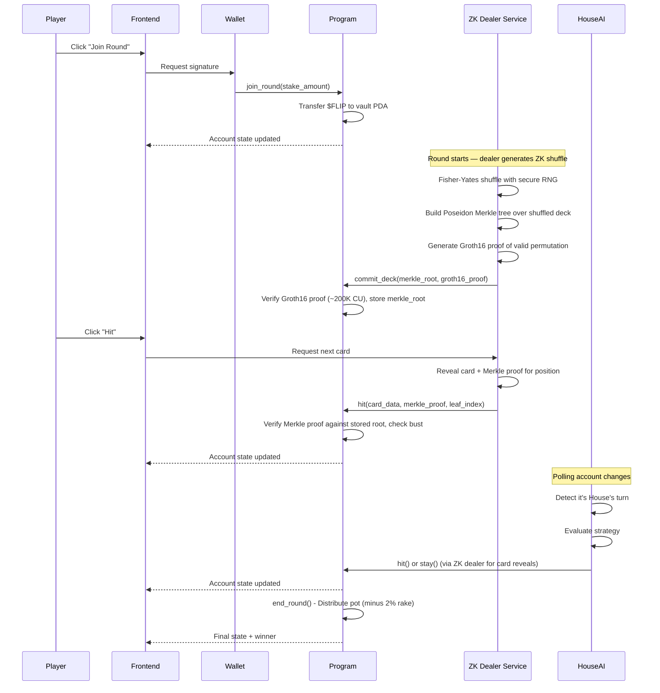

# PushFlip: Comprehensive Execution Plan

## Project Overview

- **Project Name**: PushFlip
- **One-Line Description**: A crypto-native push-your-luck card game on Solana with AI opponents, token-burning mechanics, ZK-proof deck verification, and on-chain randomness — built with Pinocchio (zero-dependency native Rust) for maximum performance and portfolio differentiation
- **Problem Statement**: Traditional online card games lack transparency in randomness and don't leverage blockchain's unique capabilities for provable fairness and token economics
- **Target Users**: Crypto-native gamers, DeFi enthusiasts, and developers interested in on-chain gaming
- **Primary Goal**: Portfolio piece demonstrating advanced Solana engineering — Pinocchio native programs, ZK-SNARK provably fair shuffling, and full-stack dApp architecture. Hackathon submission is secondary.
- **Success Criteria**:
  - Fully functional on-chain game built with Pinocchio (no Anchor dependency)
  - ZK-proof deck verification using Groth16 + Poseidon Merkle trees for provably fair shuffling
  - Working token economy with stake/burn mechanics
  - AI opponent ("The House") that plays autonomously
  - Clean, interactive frontend with wallet integration (@solana/kit + Kit Plugins)
  - Comprehensive documentation suitable for portfolio presentation
  - Demonstrates deep Solana internals knowledge (zero-copy accounts, CPI, PDA signing, ZK verification)
- **Team**:
  - George Donnelly
  - Alex Ramirez
  - Jorge Gallo

## Scope Definition

### Core Features (Phases 1-4)
1. Core on-chain card game with hit/stay mechanics — **built with Pinocchio** (native Rust, zero-dependency)
2. **ZK-proof deck verification** using Groth16 + Poseidon Merkle trees (provably fair shuffling — NO slot hash, NO VRF)
3. `$FLIP` token (SPL Token) with stake-to-play and burn-for-power mechanics
4. Basic bounty system
5. "The House" AI opponent + ZK dealer service
6. "Flip Advisor" probability assistant (frontend)
7. Vite + React frontend with **@solana/kit + Kit Plugins** (NOT legacy web3.js, Anchor TS client, or Gill)
8. IDL generated via **Shank**, TypeScript client generated via **Codama**

### Post-MVP Features
- AI Commentator/Narrator
- AI Agent Tournaments
- Dynamic Bounty Generator
- Personalized AI Coach
- Decentralized dealer (threshold cryptography — multiple parties contribute randomness)

### Explicit Non-Goals
- Mobile native apps
- Multi-chain deployment
- Complex NFT integrations
- Real money gambling compliance
- Production-grade security audits (this is a portfolio piece)

## Technical Architecture

### System Architecture

```
┌─────────────────────────────────────────────────────────────────────┐
│                       FRONTEND (Vite + React)                       │
├─────────────────────────────────────────────────────────────────────┤
│  ┌──────────────┐  ┌──────────────┐  ┌──────────────────────────┐  │
│  │ Game UI      │  │ Wallet       │  │ Flip Advisor            │  │
│  │ Components   │  │ Connection   │  │ (Probability Calculator) │  │
│  └──────┬───────┘  └──────┬───────┘  └──────────────────────────┘  │
│         │                 │                                         │
│         └────────┬────────┘                                         │
│                  ▼                                                  │
│         ┌───────────────┐                                           │
│         │ @solana/kit   │                                           │
│         │ + Kit Plugins │                                           │
│         │ + Codama      │                                           │
│         └───────┬───────┘                                           │
└─────────────────┼───────────────────────────────────────────────────┘
                  │
                  ▼
┌─────────────────────────────────────────────────────────────────────┐
│                      SOLANA BLOCKCHAIN (Devnet)                     │
├─────────────────────────────────────────────────────────────────────┤
│  ┌────────────────────┐  ┌────────────────────┐                     │
│  │ pushflip           │  │ SPL Token Program  │                     │
│  │ (Pinocchio Native) │  │                    │                     │
│  │                    │  │ - $FLIP Token Mint │                     │
│  │ - GameSession PDA  │  │ - Token Accounts   │                     │
│  │ - PlayerState PDA  │  │                    │                     │
│  │ - initialize()     │  └────────────────────┘                     │
│  │ - commit_deck()    │                                             │
│  │ - join_round()     │  ┌────────────────────┐                     │
│  │ - hit()            │  │ ZK Verification    │                     │
│  │ - stay()           │  │ (Groth16 on-chain) │                     │
│  │ - end_round()      │  │ (Poseidon Merkle)  │                     │
│  └─────────┬──────────┘  └────────────────────┘                     │
│            │                                                        │
│            ▼                                                        │
│  ┌────────────────────┐                                             │
│  │ BountyBoard PDA    │                                             │
│  └────────────────────┘                                             │
└─────────────────────────────────────────────────────────────────────┘
                  ▲
                  │
┌─────────────────┼───────────────────────────────────────────────────┐
│                 │        OFF-CHAIN SERVICES                         │
├─────────────────┼───────────────────────────────────────────────────┤
│         ┌───────┴───────┐  ┌───────────────┐                        │
│         │ The House AI  │  │ ZK Dealer     │                        │
│         │ Agent         │  │ Service       │                        │
│         │ (Node.js)     │  │ (Rust/Node)   │                        │
│         │               │  │               │                        │
│         │ - Account     │  │ - Shuffle     │                        │
│         │   Subscriber  │  │   Engine      │                        │
│         │ - Strategy    │  │ - Circom/     │                        │
│         │   Engine      │  │   snarkjs     │                        │
│         │ - TX Signer   │  │ - Merkle Tree │                        │
│         └───────────────┘  │ - Proof Gen   │                        │
│                            └───────────────┘                        │
└─────────────────────────────────────────────────────────────────────┘
```

### Data Flow



### Fairness Model Analysis

#### What the ZK system guarantees

The current design uses a **commit-then-reveal** scheme with two cryptographic layers:

1. **Groth16 proof at commit time** — The ZK Dealer shuffles the deck, builds a Poseidon Merkle tree over it, and generates a Groth16 proof that the shuffled deck is a **valid permutation** of a standard 52-card deck. The on-chain program verifies this proof (~200K CU) before storing the Merkle root. This guarantees: *the committed deck contains exactly the right cards — no duplicates, no missing cards.*

2. **Merkle proof at reveal time** — Each `hit()` submits the card data + Merkle proof + leaf index. The program verifies the proof against the stored root. This guarantees: *each revealed card was part of the originally committed deck at that exact position.*

Together these prove: **the deck was valid at commit time, and every card revealed matches what was committed.** The dealer cannot swap cards mid-game.

#### The gap: single trusted dealer

The ZK Dealer is an off-chain service that chooses the shuffle order, generates the validity proof, and submits the commitment. The Groth16 proof proves the deck is a **valid** shuffle but does NOT prove the shuffle is **random** or **unpredictable**. The dealer knows the entire deck order from the start and could theoretically stack the deck or collude with the House AI (same operator).

**Current status: provably valid, not provably random.** Players can verify the deck was a real permutation and that revealed cards match the commitment, but they must trust the dealer to have shuffled honestly.

#### Strengthening options (in order of complexity)

1. **Player-contributed entropy (post-MVP)** — Player commits `hash(player_seed)` during `join_round`. Dealer commits `hash(dealer_seed)`. Final shuffle seed = `hash(player_seed || dealer_seed)`. The Circom circuit proves the shuffle was derived from this combined seed. Neither party alone controls the shuffle.

2. **Verifiable delay function (VDF)** — Adds a time-locked computation on top of the combined seed so no one can predict the output fast enough to manipulate it. Higher complexity, stronger guarantees.

3. **Decentralized dealer (threshold cryptography)** — Multiple independent parties each contribute a secret share. The shuffle can only be reconstructed when enough shares are combined. Eliminates single-dealer trust entirely. (Already listed as Post-MVP feature.)

> **Decision (resolved)**: Ship the single-dealer ZK model first. Player-contributed entropy (Option 1) is deferred to post-MVP. The single-dealer model already proves deep ZK competence (Circom circuits, Groth16 on-chain verification, Poseidon Merkle proofs). Adding player entropy changes the game loop UX significantly — it adds a commit-reveal round-trip before the game starts, introducing latency that hurts the demo experience. Document the trust assumption clearly in the README under "Known Limitations / V2 Roadmap."

## Technology Stack

| Category | Technology | Rationale | Alternatives Considered |
|----------|------------|-----------|------------------------|
| **Blockchain** | Solana Devnet | High throughput, low fees, mature ecosystem | N/A (Solana-only project) |
| **On-chain Framework** | **Pinocchio 0.11** | Zero-dependency, zero-copy, maximum CU efficiency, portfolio differentiator — demonstrates deep Solana internals | Anchor (easier DX but commoditized skill), native solana-program (Pinocchio supersedes it) |
| **Language (On-chain)** | Rust 1.70+ | Required for Solana programs | N/A |
| **IDL Generation** | **Shank** | Generates IDL from native Rust programs via derive macros | Anchor IDL (requires Anchor), manual JSON |
| **Client Codegen** | **Codama** | Generates TypeScript + Rust clients from Shank IDL | Manual client code, Anchor TS client |
| **Randomness** | **ZK-SNARK (Groth16)** | Provably fair — cryptographic proof of valid shuffle, no trusted third party | Slot hash (predictable by validators), VRF (oracle trust required) |
| **ZK Proving** | **Circom + snarkjs** | Mature circuit language, Groth16 backend, ~200K CU on-chain verification | Halo2 (larger proofs), SP1/RISC Zero (heavier) |
| **ZK Verification (on-chain)** | **groth16-solana** | Audited Groth16 verifier by Light Protocol, uses native alt_bn128 syscalls | Custom verifier (risky), arkworks (no Solana syscalls) |
| **ZK Hashing** | **light-poseidon** + Poseidon syscall | ZK-friendly hash, native Solana syscall support, Circom-compatible BN254 params | SHA-256 (10x more constraints in-circuit), Keccak |
| **Token Standard** | SPL Token | Native Solana token standard | Token-2022 (overkill for MVP) |
| **Frontend Framework** | Vite 5 + React 18 | Fast dev server, perfect for SPAs, lightweight, excellent DX | Next.js (unnecessary SSR/routing overhead for dApp) |
| **Solana Client (JS)** | **@solana/kit + Kit Plugins** | Official next-gen SDK (tree-shakable, 83% smaller bundles, 900% faster crypto), Kit Plugins add composable client presets (RPC, payer, tx planning, LiteSVM) | Legacy @solana/web3.js 1.x (deprecated), @coral-xyz/anchor TS (requires Anchor), Gill (unnecessary wrapper) |
| **Styling** | Tailwind CSS + shadcn/ui | Rapid development, consistent design system | Chakra UI (heavier) |
| **Wallet Integration** | @solana/wallet-adapter-react | Official Solana solution, supports Phantom/Solflare/etc, free, no vendor lock-in | dynamic.xyz (overkill — paid, multi-chain focus, adds vendor dependency for crypto-native audience that already has wallets) |
| **State Management** | Zustand + React Query | Lightweight, good for async state | Redux (overkill) |
| **Linting & Formatting** | **Biome + Ultracite** | Single Rust-based tool replaces ESLint + Prettier, fast, zero-config with Ultracite preset. Covers `app/`, `house-ai/`, `scripts/` | ESLint + Prettier (slower, two tools, more config), oxlint (less mature) |
| **AI Agent Runtime** | Node.js 20 + TypeScript | Same language as frontend, good Solana SDK | Python (different ecosystem) |
| **Development** | Docker + Solana CLI + pnpm | Reproducible builds, version control, fast package manager | Anchor CLI (not needed with Pinocchio) |
| **Testing** | **LiteSVM** (integration) + **Mollusk** (unit) | Fast in-process Solana VM, no validator needed, purpose-built for native programs | Anchor test (requires Anchor), solana-test-validator (slower) |
| **Deployment (Frontend)** | Podman/Docker on Ubuntu 25.04 VPS (nginx) | Self-hosted, full control, no vendor lock-in | Vercel (faster setup, vendor lock-in) |
| **Deployment (AI Agent)** | Same VPS (Podman/Docker container) | Co-located with frontend, single server | Railway/Render (separate services) |

## Data Model

### Solana Account Structure (PDAs)

```
┌─────────────────────────────────────────────────────────────────┐
│                      GameSession (PDA)                          │
│              Seeds: ["game", game_id.to_le_bytes()]             │
├─────────────────────────────────────────────────────────────────┤
│ discriminator: u8           // Account type tag (no Anchor disc) │
│ bump: u8                                                        │
│ game_id: u64                                                    │
│ authority: Pubkey           // Admin who initialized            │
│ house_address: Pubkey       // The House AI wallet              │
│ token_mint: Pubkey          // $FLIP token mint                 │
│ vault: Pubkey               // PDA holding staked tokens        │
│ dealer: Pubkey              // ZK dealer service address        │
│ merkle_root: [u8; 32]      // Poseidon Merkle root of shuffled deck│
│ draw_counter: u8            // Next card position to reveal     │
│ deck_committed: bool        // True after commit_deck verified  │
│ player_count: u8                                                │
│ turn_order: [Pubkey; 4]     // House AI at slot 0, up to 3 humans│
│ current_turn_index: u8                                          │
│ pot_amount: u64                                                 │
│ round_active: bool                                              │
│ round_number: u64                                               │
│ rollover_count: u8          // Consecutive all-bust rounds (cap 10)│
│ last_action_slot: u64       // For future timeout support (v2)  │
│ treasury_fee_bps: u16       // Rake in basis points (200 = 2%)  │
│ treasury: Pubkey            // Treasury token account            │
└─────────────────────────────────────────────────────────────────┘

┌─────────────────────────────────────────────────────────────────┐
│                      PlayerState (PDA)                          │
│         Seeds: ["player", game_id.to_le_bytes(), player_pubkey] │
├─────────────────────────────────────────────────────────────────┤
│ bump: u8                                                        │
│ player: Pubkey                                                  │
│ game_id: u64                                                    │
│ hand: Vec<Card>             // Current hand (max 10 cards)      │
│ hand_size: u8                                                   │
│ score: u64                                                      │
│ is_active: bool             // Still in the round               │
│ inactive_reason: u8         // 0=active, 1=bust, 2=stay         │
│ bust_card_value: u8         // Alpha value that caused bust (0=none)│
│ staked_amount: u64                                              │
│ has_used_second_chance: bool                                    │
│ total_wins: u64             // Lifetime stats                   │
│ total_games: u64                                                │
└─────────────────────────────────────────────────────────────────┘

┌─────────────────────────────────────────────────────────────────┐
│                         Card (Struct)                           │
├─────────────────────────────────────────────────────────────────┤
│ value: u8                   // 1-13 for Alpha cards             │
│ card_type: CardType         // Enum: Alpha, Protocol, Multiplier│
│ suit: u8                    // 0-3 for Alpha cards              │
└─────────────────────────────────────────────────────────────────┘

┌─────────────────────────────────────────────────────────────────┐
│                      CardType (Enum)                            │
├─────────────────────────────────────────────────────────────────┤
│ Alpha = 0        // Standard cards, bust on duplicate value     │
│ Protocol = 1     // Special actions: Rug Pull, Airdrop, etc     │
│ Multiplier = 2   // DeFi multipliers: 2x, 3x score              │
└─────────────────────────────────────────────────────────────────┘

┌─────────────────────────────────────────────────────────────────┐
│                      BountyBoard (PDA)                          │
│                    Seeds: ["bounties", game_id]                 │
├─────────────────────────────────────────────────────────────────┤
│ bump: u8                                                        │
│ game_id: u64                                                    │
│ bounties: Vec<Bounty>       // Active bounties (max 10)         │
└─────────────────────────────────────────────────────────────────┘

┌─────────────────────────────────────────────────────────────────┐
│                        Bounty (Struct)                          │
├─────────────────────────────────────────────────────────────────┤
│ id: u64                                                         │
│ description: String         // Max 64 chars                     │
│ bounty_type: BountyType     // Enum for condition checking      │
│ reward_amount: u64                                              │
│ is_active: bool                                                 │
│ claimed_by: Option<Pubkey>                                      │
└─────────────────────────────────────────────────────────────────┘

┌─────────────────────────────────────────────────────────────────┐
│                      TokenVault (PDA)                           │
│                Seeds: ["vault", game_session_pubkey]            │
├─────────────────────────────────────────────────────────────────┤
│ (SPL Token Account owned by program)                            │
│ Holds all staked $FLIP tokens for active rounds                 │
└─────────────────────────────────────────────────────────────────┘
```

### Account Size Calculations

```rust
// NOTE: Pinocchio uses zero-copy layouts — no Anchor 8-byte discriminator.
// We use a 1-byte discriminator for account type identification.

// GameSession (Pinocchio zero-copy layout):
// With ZK shuffle, the deck is NOT stored on-chain (revealed via Merkle proofs).
// 1 (discriminator) + 1 (bump) + 8 (game_id) + 32 (authority) + 32 (house_address)
// + 32 (token_mint) + 32 (vault) + 32 (dealer) + 32 (merkle_root)
// + 1 (draw_counter) + 1 (deck_committed)
// + 1 (player_count) + (4 * 32) (turn_order) + 1 (current_turn_index)
// + 8 (pot_amount) + 1 (round_active) + 8 (round_number) + 1 (rollover_count)
// + 8 (last_action_slot) + 2 (treasury_fee_bps) + 32 (treasury)
// = 388 bytes (allocate 512 for safety)
// NOTE: ~270 bytes smaller than Anchor version — no on-chain deck storage!

// PlayerState (Pinocchio zero-copy layout):
// 1 (discriminator) + 1 (bump) + 32 (player) + 8 (game_id)
// + 1 (hand_size) + (10 * 3) (hand, fixed-size array) + 8 (score)
// + 1 (is_active) + 1 (inactive_reason) + 1 (bust_card_value)
// + 8 (staked_amount) + 1 (has_used_second_chance)
// + 8 (total_wins) + 8 (total_games)
// = 110 bytes (allocate 256 for safety)

// BountyBoard: 1 + 1 + 8 + (10 * 100)
// = ~1010 bytes (allocate 1500 for safety)
```

## Project Structure

```
pushflip/
├── program/                           # On-chain program (Pinocchio native)
│   ├── Cargo.toml                    # pinocchio, pinocchio-system, pinocchio-token, pinocchio-log
│   └── src/
│       ├── lib.rs                    # program_entrypoint! macro, instruction dispatch
│       ├── entrypoint.rs             # Instruction router (match on single-byte discriminator)
│       ├── instructions/
│       │   ├── mod.rs
│       │   ├── initialize.rs         # Initialize game session
│       │   ├── commit_deck.rs        # ZK: verify Groth16 proof, store Merkle root
│       │   ├── join_round.rs         # Player joins with stake
│       │   ├── start_round.rs        # Begin play (deck already committed via ZK)
│       │   ├── hit.rs                # Draw card (verify Merkle proof for card reveal)
│       │   ├── stay.rs               # End turn, lock score
│       │   ├── end_round.rs          # Distribute winnings
│       │   ├── burn_second_chance.rs
│       │   ├── burn_scry.rs
│       │   ├── claim_bounty.rs
│       │   ├── leave_game.rs         # Player leaves (refund or forfeit)
│       │   └── close_game.rs         # Authority closes game, reclaims rent
│       ├── state/
│       │   ├── mod.rs
│       │   ├── game_session.rs       # Zero-copy account layout via raw byte offsets
│       │   ├── player_state.rs       # Zero-copy account layout
│       │   ├── card.rs
│       │   └── bounty.rs
│       ├── errors.rs                 # Custom error codes (manual ProgramError impl)
│       ├── events.rs                 # Event emission via CPI to noop program (Anchor-compatible)
│       ├── zk/
│       │   ├── mod.rs
│       │   ├── groth16.rs            # On-chain Groth16 proof verification (groth16-solana)
│       │   ├── merkle.rs             # Poseidon Merkle proof verification (light-poseidon)
│       │   └── verifying_key.rs      # Embedded Groth16 verifying key (from trusted setup)
│       └── utils/
│           ├── mod.rs
│           ├── deck.rs               # Deck creation, canonical ordering
│           ├── scoring.rs            # Score calculation
│           └── accounts.rs           # Account validation helpers (TryFrom<&[AccountInfo]>)
│
├── zk-circuits/                      # Off-chain ZK circuit (Circom)
│   ├── circuits/
│   │   ├── shuffle_verify.circom     # Main circuit: proves valid 94-card permutation
│   │   ├── merkle_tree.circom        # Poseidon Merkle tree construction
│   │   └── permutation_check.circom  # Bijection verification (each index 0-93 once)
│   ├── scripts/
│   │   ├── compile.sh                # circom compile
│   │   ├── trusted_setup.sh          # Powers of Tau + circuit-specific setup
│   │   └── generate_proof.ts         # snarkjs proof generation wrapper
│   ├── test/
│   │   └── shuffle_verify.test.ts    # Circuit unit tests
│   ├── build/                        # Compiled artifacts (R1CS, WASM, zkey)
│   └── package.json
│
├── dealer/                            # Off-chain ZK dealer service
│   ├── package.json
│   ├── tsconfig.json
│   └── src/
│       ├── index.ts                  # Entry point
│       ├── dealer.ts                 # Dealer class: shuffle, prove, commit, reveal
│       ├── merkle.ts                 # Poseidon Merkle tree (light-poseidon via WASM)
│       ├── prover.ts                 # snarkjs Groth16 proof generation
│       └── config.ts
│
├── app/                               # Vite + React frontend
│   ├── package.json
│   ├── vite.config.ts
│   ├── tailwind.config.js
│   ├── tsconfig.json
│   ├── index.html
│   ├── src/
│   │   ├── main.tsx
│   │   ├── App.tsx
│   │   ├── providers/
│   │   │   ├── WalletProvider.tsx
│   │   │   └── QueryProvider.tsx
│   │   ├── components/
│   │   │   ├── ui/                   # shadcn components
│   │   │   ├── game/
│   │   │   │   ├── GameBoard.tsx
│   │   │   │   ├── PlayerHand.tsx
│   │   │   │   ├── Card.tsx
│   │   │   │   ├── ActionButtons.tsx
│   │   │   │   ├── PotDisplay.tsx
│   │   │   │   └── TurnIndicator.tsx
│   │   │   ├── wallet/
│   │   │   │   └── WalletButton.tsx
│   │   │   └── advisor/
│   │   │       └── FlipAdvisor.tsx
│   │   ├── hooks/
│   │   │   ├── useGameSession.ts
│   │   │   ├── usePlayerState.ts
│   │   │   ├── useGameActions.ts     # Uses Codama-generated client
│   │   │   └── useFlipAdvisor.ts
│   │   ├── lib/
│   │   │   ├── program.ts            # @solana/kit + Codama-generated client setup
│   │   │   ├── constants.ts
│   │   │   └── utils.ts
│   │   ├── types/
│   │   │   └── index.ts              # From Codama-generated types
│   │   ├── stores/
│   │   │   └── gameStore.ts          # Zustand store
│   │   └── styles/
│   │       └── globals.css
│   └── public/
│       └── cards/
│
├── house-ai/                         # AI opponent service
│   ├── package.json
│   ├── tsconfig.json
│   └── src/
│       ├── index.ts
│       ├── agent.ts                  # Main AI agent class
│       ├── strategy.ts               # Hit/stay decision logic
│       ├── accountSubscriber.ts      # Watch for game state changes (via Kit)
│       └── config.ts
│
├── clients/                          # Codama-generated clients (auto-generated)
│   ├── js/                           # TypeScript client
│   └── rust/                         # Rust client
│
├── tests/
│   ├── integration.rs                # LiteSVM integration tests
│   ├── unit.rs                       # Mollusk unit tests
│   └── helpers.rs                    # Test helpers, PDA derivation
│
├── scripts/
│   ├── create-token.ts               # Create $FLIP mint
│   ├── airdrop-tokens.ts             # Distribute test tokens
│   ├── initialize-game.ts            # Set up initial game state
│   └── generate-idl.sh              # Shank IDL + Codama client generation
│
├── idl/                              # Shank-generated IDL
│   └── pushflip.json
│
├── Cargo.toml                        # Workspace root
├── justfile                          # Build commands (build, test, idl, deploy)
├── package.json                      # Root workspace
├── pnpm-workspace.yaml
├── codama.ts                         # Codama client generation config
└── README.md
```

## Execution Philosophy

> **"If a task feels too big, break it down further."**

Every task below is broken into **micro-tasks of ~15-30 minutes**. Each micro-task is a single concrete action with a clear "done when" signal. The goal is to learn deeply along the way — not just copy-paste code.

**Format:**
- **Do**: The single action to take
- **Learn**: What concept this teaches you
- **Done when**: How you know you can move on

---

## Progress Tracker

### Decisions Log

| Date | Decision | Rationale |
|------|----------|-----------|
| 2026-04-02 | Develop on host, not in a dev container | Claude Code conversation history is lost when containers stop/restart. Host already has all required toolchain. Container approach reserved for CI/reproducible builds later. |
| 2026-04-02 | No `.devcontainer/` in repo | Removed after switching to host-based development. Will add a CI Dockerfile when needed. |
| 2026-04-02 | `package-lock.json` gitignored | Project uses pnpm (`pnpm-lock.yaml`), npm lock file is noise. |
| 2026-04-02 | Pinocchio 0.10 API (breaking changes from plan) | 0.10 renamed: `AccountInfo` → `AccountView`, `Pubkey` → `Address`, `pinocchio::pubkey` → `pinocchio::address`, `pinocchio::program_error` → `pinocchio::error`. Also using `pinocchio-groth16` 0.3 instead of `groth16-solana` 0.2. |
| 2026-04-02 | Solana CLI set to devnet | Was defaulting to mainnet. Switched for development. |
| 2026-04-02 | Security review #1: bounds checks + length validation in state accessors | 3-pass review found critical buffer overflow risks in `card_at()`, `turn_order_slot()`, `push_card()`. Fixed with bounds assertions and `from_bytes()` length validation. 14 tests (5 new boundary tests). |
| 2026-04-02 | Security review #2: instruction handler hardening | 3-pass review found critical player-state-account spoofing in start_round/end_round — attacker could pass fake PlayerState accounts. Fixed with turn_order cross-check. Also: treasury_fee_bps bounds, leaf_index bounds, end_round caller restriction, specific error codes, rollover=10 no longer zeroes pot. |
| 2026-04-02 | Task 1.3b deferred — early de-risk already achieved via Task 1.5 | The ZK verification module (Poseidon Merkle proofs + Groth16 wrapper) was built and tested in Task 1.5, surfacing the key integration risks: light-poseidon needs ark-bn254 (std dependency works on BPF), big-endian encoding for Poseidon inputs, depth-7 tree with 128 leaves and padding strategy. The Circom circuit prototype (1.3b) is still needed but is no longer a blocking risk — the on-chain side is proven. Defer to Phase 2 where it's naturally sequenced. |

### Environment Status

All toolchain verified on host (2026-04-02):

| Tool | Version | Status |
|------|---------|--------|
| Rust (stable) + clippy + rustfmt | 1.92.0 | Installed |
| Solana CLI + cargo-build-sbf | 3.0.13 (Agave) | Installed |
| Node.js | 20.19.4 | Installed |
| pnpm | 10.28.0 | Installed |
| Circom | 2.2.2 | Installed |
| snarkjs | latest | Installed |
| just | 1.48.1 | Installed |

### Task Progress

- [x] **1.1** Environment Setup (completed 2026-04-02)
  - [x] 1.1.1 Create workspace Cargo.toml
  - [x] 1.1.2 Set up program Cargo.toml
  - [x] 1.1.3 Create program entrypoint
  - [x] 1.1.4 Create folder structure
  - [x] 1.1.5 Create justfile
  - [x] 1.1.6 Create pnpm workspace
  - [x] 1.1.7 Verify full toolchain
- [x] **1.2** Define State Structures (completed 2026-04-02)
- [x] **1.3** Implement Deck Utilities (completed 2026-04-02)
- [~] **1.3b** ZK Circuit Prototype — deferred to Phase 2 (de-risked by Task 1.5, see decisions log)
- [x] **1.4** Implement Scoring Logic (completed 2026-04-02)
- [x] **1.5** ZK Verification Module (completed 2026-04-02)
- [x] **1.6** Initialize Instruction (completed 2026-04-02)
- [x] **1.7** Commit Deck Instruction (completed 2026-04-02)
- [x] **1.8** Join Round Instruction (completed 2026-04-02)
- [x] **1.9** Start Round Instruction (completed 2026-04-02)
- [x] **1.10** Hit Instruction (completed 2026-04-02)
- [x] **1.11** Stay Instruction (completed 2026-04-02)
- [x] **1.12** End Round Instruction (completed 2026-04-02)
- [x] **1.13** Game Lifecycle Instructions (completed 2026-04-02)
- [x] **CHECKPOINT: /heavy-duty-review** — completed 2026-04-02 (9 findings, all fixed)
- [x] **CHECKPOINT: /propose-commits** — completed 2026-04-02 (4 commits)
- [x] **1.14** Integration Tests with LiteSVM (completed 2026-04-02)
- [x] **CHECKPOINT: /update-after-change** — completed 2026-04-02 (fmt, clippy, 47 tests green)
- [x] **CHECKPOINT: /propose-commits** — completed 2026-04-02 (4 commits)

### Phase 1 Summary (completed 2026-04-02)
- 38 unit tests + 9 LiteSVM integration tests = **47 tests passing**
- BPF build clean (stack warning from light-poseidon, non-blocking)
- 2 security reviews completed, all findings fixed
- Integration tests in separate `tests/` crate to avoid BPF/edition2024 dep conflicts

### Phase 2 Summary (completed 2026-04-03)
- 41 unit tests + 9 Phase 1 integration tests + 11 Phase 2 integration tests = **61 Rust tests passing**
- 8 dealer JS tests (Merkle tree, canonical hash cross-validation, bigint conversion)
- **69 total tests across Rust + TypeScript**
- Circom circuit: 362K constraints, grand product permutation check, constrained multiplexer lookups
- Trusted setup: ptau size 19, Phase 2 zkey + verification key generated
- End-to-end ZK proof generation + local snarkjs verification: PASSED
- Dealer service: TypeScript (deck, merkle, prover, dealer class) — full shuffle → commit → reveal pipeline
- BPF build: 356K .so (stack warning from light-poseidon, non-blocking)
- 3 security reviews completed (2 from Phase 1 + 1 crypto-focused), all findings fixed
- Groth16 verification controlled by `skip-zk-verify` feature flag (default: ON)

### Phase 2 Task Progress
- [~] **2.1** Create SPL Token ($FLIP) — constants done; scripts deferred to deployment
- [x] **2.2** Update Join Round with Staking (completed 2026-04-02)
- [x] **2.3** Update End Round with Prize Distribution (completed 2026-04-02)
- [x] **CHECKPOINT: /heavy-duty-review** — completed 2026-04-02 (7 findings, all fixed)
- [~] **CHECKPOINT: /propose-commits** — deferred; bundled into end-of-Phase-2 commit
- [x] **2.4** Burn for Second Chance (completed 2026-04-02)
- [x] **2.5** Burn for Scry (completed 2026-04-02)
- [x] **2.6** Protocol Card Effects (completed 2026-04-02)
- [x] **2.7** Basic Bounty System — state only (completed 2026-04-02)
- [x] **2.8** ZK Circuit + Dealer Service (completed 2026-04-03) — circuit compiled (362K constraints after security hardening), trusted setup complete (ptau 19), dealer service implemented, real verifying key + canonical hash on-chain, end-to-end proof generation verified
- [x] **2.9** Phase 2 Integration Tests (completed 2026-04-03) — 11 tests: token flows (3), burn mechanics (6), protocol cards + bounty (2)
- [x] **CHECKPOINT: /heavy-duty-review** — completed 2026-04-03 (3 critical + 1 high + 3 medium; ALL fixed same session)
- [x] **CHECKPOINT: /update-after-change** — completed 2026-04-03 (fmt, clippy, 61 Rust tests + 8 JS tests green)
- [ ] **CHECKPOINT: /propose-commits** — bundle all Phase 2 work

### Phase 2 Decisions Log
| Date | Decision | Rationale |
|------|----------|-----------|
| 2026-04-02 | Vault PDA derived at initialize, bump stored in GameSession | Security review found end_round was using GameSession bump instead of vault bump for invoke_signed. Added vault_bump field at offset 394. |
| 2026-04-02 | Pot/staked_amount only updated when vault has data | Prevents phantom pot — accounting must match actual token transfers. `vault_ready = stored_vault != [0;32] && vault.data_len() > 0`. |
| 2026-04-02 | Airdrop bonus handled off-chain, not via on-chain CPI | On-chain Transfer with unverified authority was broken by design. Dealer service credits player's token account directly when Airdrop card is drawn. |
| 2026-04-02 | find_valid_target excludes current player | Prevents self-targeting (double-borrow panic in VampireAttack, self-harm in RUG_PULL). |
| 2026-04-02 | VampireAttack: steal card into local, drop target borrow, then borrow player | Eliminates double-borrow risk even if find_valid_target somehow returns self. |
| 2026-04-03 | Trusted setup requires ptau size 19 (not 18) | Circuit has 277K constraints > 2^18 (262K). Updated setup.sh. |
| 2026-04-03 | Groth16 verification controlled by feature flag `skip-zk-verify` | Default: verification ON. Integration tests build with `--features skip-zk-verify`. Prevents accidental deployment with verification off. |
| 2026-04-03 | start_round/end_round match PlayerState by stored `player` field, not PDA address | turn_order stores wallet addresses; PlayerState PDA addresses differ. Fixed matching to read `ps.player()` instead of comparing account address. |
| 2026-04-03 | hit rejects leaf_index >= DECK_SIZE (94), not TOTAL_LEAVES (128) | Prevents drawing padding leaves (indices 94-127) which would decode as invalid cards. |
| 2026-04-03 | Circom permutation check upgraded: grand product + LessThan + Multiplexer | Security review found 3 critical issues: sum-only check (not bijection), unconstrained `<--` range check, unconstrained shuffled deck. Fixed with: (1) grand product argument via Fiat-Shamir Poseidon challenge, (2) circomlib `LessThan(7)` for range check, (3) circomlib `Multiplexer(3, 94)` for constrained array lookup. Circuit grew from 277K → 362K constraints. |
| 2026-04-03 | Rollover cap (10 all-bust rounds) sweeps pot to treasury | Security review found tokens permanently locked after 10 rollovers. Now transfers pot to treasury when cap reached; authority can redistribute manually. |

---

## Implementation Phases

### Phase 1: Foundation & Core Game Engine (Days 1-10)

**Goal:** Get a playable on-chain card game working with Pinocchio (no Anchor), including ZK deck commitment infrastructure. No tokens or special abilities yet.

**Prerequisites:** Rust installed, Solana CLI installed, a funded devnet wallet. ~~All verified 2026-04-02.~~

---

#### Task 1.1: Environment Setup

##### 1.1.1: Create the workspace Cargo.toml (~15 min)
**Do**: Create a root `Cargo.toml` with `[workspace]` containing `members = ["program"]`. Create the `program/` directory.
**Learn**: Rust workspaces let you manage multiple crates (packages) in one repo. Solana programs are just Rust crates compiled to BPF bytecode.
**Done when**: `ls program/` exists and root `Cargo.toml` has `[workspace]`.

##### 1.1.2: Set up the program Cargo.toml (~15 min)
**Do**: Create `program/Cargo.toml` with these dependencies:
- `pinocchio = "0.10"` — the zero-dependency Solana framework (replaces `solana-program`). **Note:** 0.10 renames `AccountInfo` → `AccountView`, `Pubkey` → `Address`
- `pinocchio-system = "0.5"` — CPI helpers for the System Program
- `pinocchio-token = "0.5"` — CPI helpers for SPL Token
- `pinocchio-log = "0.5"` — efficient logging
- `pinocchio-pubkey = "0.3"` — pubkey utilities and `declare_id!`
- `shank = "0.4"` — IDL generation via derive macros
- `pinocchio-groth16 = "0.3"` — on-chain Groth16 proof verifier (Pinocchio-native wrapper around groth16-solana)
- `light-poseidon = "0.4"` — Poseidon hash (ZK-friendly)

Set `crate-type = ["cdylib", "lib"]` under `[lib]`.
**Learn**: `cdylib` tells Rust to compile a C-compatible dynamic library — this is what Solana's BPF loader expects. `lib` allows unit tests to import the crate normally.
**Done when**: `cargo check` inside `program/` resolves all dependencies (may take a minute to download).

##### 1.1.3: Create the program entrypoint (~20 min)
**Do**: Create `program/src/lib.rs` with:
1. `declare_id!("YOUR_PROGRAM_ID")` — use a placeholder for now
2. `default_allocator!()` and `default_panic_handler!()` — Pinocchio's built-in memory/panic setup
3. `program_entrypoint!(process_instruction)` — the macro that wires your function as the BPF entrypoint
4. A `process_instruction` function that reads the first byte of `instruction_data` and matches it to instruction discriminators (start with just a `_ => Err(...)` fallback)
**Learn**: Unlike Anchor which hides the entrypoint behind macros, Pinocchio makes you write it explicitly. Every Solana instruction hits `process_instruction(program_id, accounts, instruction_data)`. The first byte is your discriminator — a manual routing table.
**Done when**: `cargo build-sbf` compiles successfully (ignore warnings for now).

##### 1.1.4: Create the folder structure (~10 min)
**Do**: Create these empty files inside `program/src/`:
- `instructions/mod.rs` — will hold all instruction handlers
- `state/mod.rs` — will hold all account data structures
- `zk/mod.rs` — will hold ZK verification logic
- `utils/mod.rs` — shared helpers
- `errors.rs` — custom program errors
- `events.rs` — event emission helpers

Add `mod instructions; mod state; mod zk; mod utils; mod errors; mod events;` to `lib.rs`.
**Learn**: Rust module organization. Each `mod.rs` file is the entry point for its directory. This structure keeps the codebase navigable as it grows.
**Done when**: `cargo build-sbf` still compiles.

##### 1.1.5: Create the justfile (~15 min)
**Do**: Create a `justfile` at the repo root with commands:
- `build`: `cargo build-sbf`
- `test`: `cargo test`
- `deploy`: `solana program deploy target/deploy/pushflip.so`
- `idl`: `shank idl -o idl -p pushflip` (generates IDL from Shank macros)
- `generate-client`: `npx @codama/cli generate -i idl/pushflip.json -o clients/`
**Learn**: `just` is a modern command runner (like `make` but simpler). These commands capture the full build pipeline: compile → test → generate IDL → generate client → deploy.
**Done when**: `just build` runs `cargo build-sbf` successfully.

##### 1.1.6: Create the pnpm workspace (~15 min)
**Do**: Create root `package.json` with `"workspaces": ["app", "house-ai", "dealer", "clients/*"]` and a `pnpm-workspace.yaml`. Create placeholder `package.json` files in `app/`, `house-ai/`, `dealer/`, and `clients/js/`.
**Learn**: pnpm workspaces let multiple JS packages share dependencies. The frontend, AI agent, dealer service, and generated client are all separate packages that can import each other.
**Done when**: `pnpm install` runs without errors from the root.

##### 1.1.7: Verify the full toolchain (~15 min)
**Do**: Run these checks and fix any issues:
1. `cargo build-sbf` — Solana program compiles
2. `solana config get` — shows devnet
3. `solana balance` — has SOL (airdrop if needed: `solana airdrop 2`)
4. `solana-keygen pubkey` — your wallet address
**Learn**: This is your development loop: edit Rust → build-sbf → deploy → test. Get comfortable with these commands.
**Done when**: All four commands succeed. Write down your wallet address.

---

#### Task 1.2: Define State Structures

##### 1.2.1: Understand Solana account model (~20 min, reading)
**Do**: Read and understand these concepts before writing any code:
1. Solana stores ALL data in "accounts" — fixed-size byte arrays owned by programs
2. Your program defines the layout of those bytes (no ORM, no database — raw bytes)
3. PDAs (Program Derived Addresses) are accounts whose address is derived from seeds — the program can sign for them without a private key
4. "Zero-copy" means reading data directly from the byte array without deserialization — faster and cheaper
**Learn**: This is the fundamental difference from Ethereum. There's no "storage" — everything is accounts with byte layouts you define. Pinocchio makes this explicit while Anchor hides it.
**Done when**: You can explain to someone: what is a PDA, why do we use byte offsets, and what does zero-copy mean.

##### 1.2.2: Define the Card struct (~20 min)
**Do**: Create `state/card.rs` with:
1. A `Card` struct packed into 3 bytes: `value: u8` (byte 0), `card_type: u8` (byte 1), `suit: u8` (byte 2)
2. Constants for card types: `ALPHA = 0`, `PROTOCOL = 1`, `MULTIPLIER = 2`
3. Constants for protocol effects: `RUG_PULL = 0`, `AIRDROP = 1`, `VAMPIRE_ATTACK = 2`
4. `from_bytes(&[u8]) -> Card` and `to_bytes(&self) -> [u8; 3]` methods
**Learn**: On-chain, every byte costs rent. Packing a card into 3 bytes (vs. a Borsh-serialized struct that might be 20+) saves lamports and CU. This is why Pinocchio uses raw bytes.
**Done when**: Unit test passes — `Card::from_bytes(&card.to_bytes()) == card`.

##### 1.2.3: Design the GameSession layout on paper (~15 min)
**Do**: Before writing code, sketch the byte layout of `GameSession` on paper or in a comment:
```
Byte 0:       discriminator (u8) = 1
Bytes 1-8:    game_id (u64)
Bytes 9-40:   authority (Pubkey, 32 bytes)
Bytes 41-72:  house (Pubkey)
Bytes 73-104: dealer (Pubkey)
Bytes 105-136: treasury (Pubkey)
Bytes 137-168: token_mint (Pubkey)
Byte 169:     player_count (u8)
Bytes 170-297: turn_order ([Pubkey; 4] = 4 × 32 bytes)
Byte 298:     current_turn_index (u8)
Byte 299:     round_active (bool)
Bytes 300-307: round_number (u64)
Bytes 308-315: pot_amount (u64)
Bytes 316-347: merkle_root ([u8; 32])
Byte 348:     deck_committed (bool)
Byte 349:     draw_counter (u8)
Bytes 350-351: treasury_fee_bps (u16)
Byte 352:     rollover_count (u8)
Bytes 353-360: last_action_slot (u64)
... padding to 512 bytes
```
**Learn**: This is zero-copy layout design. You're literally deciding where each field lives in a byte array. Anchor does this automatically with Borsh, but you lose control over alignment and size. With Pinocchio, you control every byte.
**Done when**: You have a complete byte map with no overlapping offsets and the total fits in 512 bytes.

##### 1.2.4: Implement the GameSession struct (~30 min)
**Do**: Create `state/game_session.rs` with:
1. Constants for every byte offset (e.g., `const GAME_ID_OFFSET: usize = 1;`)
2. A `GameSession` struct that wraps a byte slice reference
3. Accessor methods that read from the byte slice at the correct offset: `game_id(&self) -> u64`, `authority(&self) -> &[u8; 32]`, etc.
4. Mutable setter methods: `set_round_active(&mut self, val: bool)`, etc.
5. PDA seeds: `["game", game_id.to_le_bytes()]`
**Learn**: This is the Pinocchio pattern — your struct IS the byte slice, and accessors read/write directly. No serialization overhead. Compare this to Anchor's `#[account]` macro which generates Borsh serialize/deserialize.
**Done when**: `cargo build-sbf` compiles. Write a unit test that creates a 512-byte array, wraps it in GameSession, writes fields, and reads them back correctly.

##### 1.2.5: Design and implement the PlayerState layout (~25 min)
**Do**: Create `state/player_state.rs` with the same pattern:
```
Byte 0:       discriminator (u8) = 2
Bytes 1-32:   player (Pubkey)
Bytes 33-40:  game_id (u64)
Byte 41:      hand_size (u8)
Bytes 42-71:  hand ([Card; 10] = 10 × 3 bytes = 30 bytes)
Byte 72:      is_active (bool)
Byte 73:      inactive_reason (u8) — 0=active, 1=bust, 2=stay
Bytes 74-81:  score (u64)
Bytes 82-89:  staked_amount (u64)
Byte 90:      has_used_second_chance (bool)
Byte 91:      has_used_scry (bool)
... padding to 256 bytes
```
PDA seeds: `["player", game_id.to_le_bytes(), player.key()]`
**Learn**: Each player gets their own PDA. The hand is stored inline (10 cards × 3 bytes = 30 bytes max). This is more efficient than a dynamic Vec because Solana accounts are fixed-size.
**Done when**: Unit test passes — create PlayerState, add cards to hand, read them back.

##### 1.2.6: Write account validation helpers (~25 min)
**Do**: Create `utils/accounts.rs` with helper functions:
1. `verify_account_owner(account: &AccountInfo, expected: &Pubkey)` — checks `account.owner() == expected`
2. `verify_pda(account: &AccountInfo, seeds: &[&[u8]], program_id: &Pubkey)` — derives PDA and checks it matches `account.key()`
3. `verify_signer(account: &AccountInfo)` — checks `account.is_signer()`
4. `verify_writable(account: &AccountInfo)` — checks `account.is_writable()`
**Learn**: In Anchor, `#[account(mut, signer, has_one = authority)]` does these checks magically. In Pinocchio, YOU validate every account manually. This is the security-critical part — a missing check is a vulnerability.
**Done when**: Each helper returns `Result<(), ProgramError>` and compiles.

##### 1.2.7: Create custom error types (~15 min)
**Do**: In `errors.rs`, define a custom error enum:
```rust
#[derive(Clone, Debug, PartialEq)]
pub enum PushFlipError {
    InvalidInstruction,
    GameAlreadyInitialized,
    GameNotFound,
    RoundAlreadyActive,
    RoundNotActive,
    DeckNotCommitted,
    DeckAlreadyCommitted,
    NotYourTurn,
    PlayerNotActive,
    MaxPlayersReached,
    PlayerAlreadyJoined,
    InvalidMerkleProof,
    InvalidGroth16Proof,
    InsufficientStake,
    // ... add more as needed
}
```
Implement `From<PushFlipError> for ProgramError` mapping each to a custom error code.
**Learn**: Solana programs return numeric error codes. Custom errors map meaningful names to codes (e.g., `InvalidMerkleProof = 0x6`). The client can decode these to show human-readable messages.
**Done when**: `cargo build-sbf` compiles with the error types.

##### 1.2.8: Export everything from state/mod.rs (~10 min)
**Do**: Update `state/mod.rs` to re-export `Card`, `GameSession`, `PlayerState`. Update `utils/mod.rs` to re-export the validation helpers. Ensure `lib.rs` modules are wired up.
**Learn**: Rust's module system requires explicit re-exports. `pub use card::*;` in `mod.rs` makes the types available as `crate::state::Card`.
**Done when**: `cargo build-sbf` compiles and `cargo test` runs (even if no tests yet).

---

#### Task 1.3: Implement Deck Utilities

##### 1.3.1: Define the canonical deck (~20 min)
**Do**: Create `utils/deck.rs` with `create_canonical_deck() -> [Card; 94]`:
- 52 Alpha cards: values 1-13, four suits each (52 total)
- 30 Protocol cards: 10 RugPull, 10 Airdrop, 10 VampireAttack
- 12 Multiplier cards: 4×2x, 4×3x, 4×5x
- Order them deterministically (Alpha by suit then value, Protocol by effect, Multiplier by value)
**Learn**: The canonical deck order is a constant — both the on-chain program and the ZK circuit must agree on it. The shuffle is a permutation of THIS specific ordering.
**Done when**: `create_canonical_deck().len() == 94` and the order is deterministic (call it twice, get identical results).

##### 1.3.2: Implement canonical deck hashing (~20 min)
**Do**: Add `canonical_deck_hash() -> [u8; 32]` that:
1. Takes the canonical deck
2. Hashes each card with Poseidon: `Poseidon(value, type, suit, index)`
3. Returns a final hash over all card hashes
**Learn**: Poseidon is a "ZK-friendly" hash — it's efficient inside a ZK circuit (far fewer constraints than SHA-256). The canonical hash is a public input to the Groth16 proof — it proves "the shuffled deck is a permutation of THIS known deck."
**Done when**: Hash is deterministic. Same input always produces same output.

##### 1.3.3: Write unit tests for deck utilities (~15 min)
**Do**: Add tests in `utils/deck.rs`:
1. `test_deck_size` — exactly 94 cards
2. `test_deck_composition` — count: 52 Alpha, 30 Protocol, 12 Multiplier
3. `test_canonical_order` — calling twice gives identical result
4. `test_canonical_hash` — calling twice gives identical hash
**Learn**: These tests establish invariants. If anyone changes the deck, the tests catch it — and the ZK circuit would break too.
**Done when**: `cargo test` — all 4 tests pass.

---

#### Task 1.3b: ZK Circuit Prototype (Early De-Risk)

> **Rationale**: The Circom circuit is the highest-risk component in the project. The byte layouts and canonical deck it depends on are stable after Task 1.3. Starting a skeleton circuit now — even a trivial 4-card version — surfaces compilation issues, Poseidon parameter mismatches, and toolchain problems on Day 3-5 instead of Day 14-15. This does NOT replace the full circuit work in Phase 2; it's a smoke test.

##### 1.3b.1: Install Circom and snarkjs early (~15 min)
**Do**: Install the ZK toolchain now (same steps as 2.8.1):
1. `npm install -g circom` (or build from source)
2. `npm install -g snarkjs`
3. Verify: `circom --version`, `snarkjs --version`
**Done when**: Both tools installed and version commands work.

##### 1.3b.2: Write a minimal 4-card circuit prototype (~30 min)
**Do**: Create `zk-circuits/circuits/shuffle_verify_mini.circom`:
1. Import Poseidon from `circomlib`
2. Define a 4-card permutation check (each index 0-3 appears exactly once)
3. Build a depth-2 Poseidon Merkle tree over the 4 shuffled cards
4. Constrain: computed merkle_root == public merkle_root
**Why 4 cards**: Minimal circuit that exercises the full proof pipeline (permutation check + Poseidon Merkle tree) without the constraint overhead of 94 cards. If this compiles and proves, the full circuit is a matter of scaling up.
**Done when**: `circom shuffle_verify_mini.circom --r1cs --wasm --sym` compiles without errors. Note the constraint count.

##### 1.3b.3: Generate a test proof and verify it locally (~20 min)
**Do**:
1. Run a quick Powers of Tau ceremony (small size, just for testing)
2. Run circuit-specific Phase 2 setup
3. Generate a witness for a known 4-card permutation
4. Generate a Groth16 proof with `snarkjs`
5. Verify the proof locally with `snarkjs groth16 verify`
**Done when**: Local proof generation and verification succeeds. You now have confidence the full circuit pipeline works.

##### 1.3b.4: Prepare a 52-card fallback circuit skeleton (~15 min)
**Do**: Create `zk-circuits/circuits/shuffle_verify_52.circom` — same structure as the mini circuit but with 52-card Alpha-only permutation and depth-6 Merkle tree (64 leaves, 52 used + 12 padded).
**Why**: If the full 94-card circuit hits constraint issues or Poseidon hashing gets unwieldy in Phase 2, this 52-card version lets you demo real ZK proofs end-to-end with the core Alpha deck. Low cost to prepare, high insurance value.
**Done when**: Compiles with `circom --r1cs`. Does not need to generate proofs yet — just validates the constraint structure.

---

#### Task 1.4: Implement Scoring Logic

##### 1.4.1: Implement hand scoring (~20 min)
**Do**: Create `utils/scoring.rs` with `calculate_hand_score(hand: &[Card], hand_size: u8) -> u64`:
1. Sum the `value` of all Alpha cards in the hand
2. Check for Multiplier cards and apply them (2x, 3x, 5x multiply the sum)
3. Protocol cards contribute 0 to score
**Learn**: Scoring is pure computation — no account access, no CPI. This makes it easy to unit test. The multiplier interaction is the interesting part — a 5x multiplier on a 20-point hand = 100 points.
**Done when**: `calculate_hand_score` with hand `[Alpha(5), Alpha(10), Multiplier(3x)]` returns `45`.

##### 1.4.2: Implement bust detection (~15 min)
**Do**: Add `check_bust(hand: &[Card], hand_size: u8) -> bool`:
- A player busts when they have two Alpha cards with the **same value** (e.g., two 7s)
- Scan the hand for duplicate Alpha values
**Learn**: This is the core tension of the game — push your luck (draw more cards for higher score) vs. risk busting on a duplicate.
**Done when**: `check_bust([Alpha(7), Alpha(7)])` returns `true`. `check_bust([Alpha(7), Alpha(8)])` returns `false`.

##### 1.4.3: Implement PushFlip detection (~10 min)
**Do**: Add `check_pushflip(hand: &[Card], hand_size: u8) -> bool`:
- A PushFlip is exactly 7 cards in hand without busting
- This is the jackpot condition
**Learn**: Named after the game itself — getting 7 cards without a duplicate is statistically rare and deserves a big reward.
**Done when**: `check_pushflip` with 7 non-duplicate cards returns `true`, with 6 cards returns `false`.

##### 1.4.4: Write scoring unit tests (~15 min)
**Do**: Add tests:
1. `test_basic_score` — Alpha cards only
2. `test_multiplier_score` — with 2x, 3x, 5x multipliers
3. `test_protocol_no_score` — Protocol cards add 0
4. `test_bust_duplicate` — duplicate Alpha values bust
5. `test_no_bust` — all unique is fine
6. `test_pushflip` — exactly 7 cards, no bust
**Done when**: `cargo test` — all 6 tests pass.

---

#### Task 1.5: ZK Verification Module

##### 1.5.1: Understand the ZK flow (~20 min, reading)
**Do**: Read and internalize this flow before writing code:
1. **Off-chain dealer** shuffles the deck (a permutation of the 94 canonical cards)
2. Dealer builds a **Poseidon Merkle tree** over the shuffled deck (each leaf = hash of a card)
3. Dealer generates a **Groth16 proof** that the shuffled deck is a valid permutation
4. Dealer submits `commit_deck(merkle_root, groth16_proof)` to the on-chain program
5. On-chain program **verifies the Groth16 proof** (~200K CU) and stores the merkle_root
6. When a player hits, the dealer reveals the card + **Merkle proof** for that position
7. On-chain program **verifies the Merkle proof** against the stored root (~50K CU)
**Learn**: The Groth16 proof guarantees "this is a valid shuffle." The Merkle proofs guarantee "this card was at this position in the committed shuffle." Together: provably fair dealing.
**Done when**: You can draw this flow on paper from memory.

##### 1.5.2: Implement Groth16 verification wrapper (~30 min)
**Do**: Create `zk/groth16.rs` with `verify_shuffle_proof(proof: &[u8; 128], merkle_root: &[u8; 32], canonical_hash: &[u8; 32]) -> Result<()>`:
1. Parse the 128-byte compressed proof into the format `groth16-solana` expects
2. Set up the public inputs: `[merkle_root, canonical_hash]`
3. Call the Groth16 verifier from `groth16-solana` — this uses Solana's native `alt_bn128` syscalls
4. Return Ok if valid, error if not
**Learn**: Groth16 is a "succinct" proof system — the proof is always 128 bytes regardless of circuit complexity. The verifier checks a pairing equation on the BN254 elliptic curve. Solana provides native syscalls for this, making verification feasible (~200K CU).
**Done when**: Compiles. We'll test with real proofs after building the circuit in Phase 2.

##### 1.5.3: Create the verifying key placeholder (~15 min)
**Do**: Create `zk/verifying_key.rs` with the Groth16 verifying key as a constant:
```rust
pub const VERIFYING_KEY: &[u8] = &[/* placeholder bytes */];
```
Add a comment: "Generated during trusted setup (Phase 2, Task 2.8). Replace with real key after circuit compilation."
**Learn**: The verifying key is the "public half" of the Groth16 trusted setup. It's embedded in the program and used to check proofs. It's specific to the circuit — if you change the circuit, you need a new key.
**Done when**: File exists, compiles with placeholder.

##### 1.5.4: Implement Merkle proof verification (~30 min)
**Do**: Create `zk/merkle.rs` with `verify_merkle_proof(leaf_data: &[u8], proof: &[[u8; 32]; 7], leaf_index: u8, root: &[u8; 32]) -> Result<()>`:
1. Compute leaf hash: `Poseidon(card_value, card_type, suit, leaf_index)`
2. Walk up the proof path (7 levels for depth-7 tree, supporting 128 leaves):
   - At each level, determine left/right by checking the bit of `leaf_index` at that position
   - Hash the pair: `Poseidon(left, right)`
3. Compare final hash to the stored `root`

**Leaf padding strategy**: Depth 7 gives 128 leaves but the deck only uses 94 cards (indices 0-93). Leaves 94-127 **must be padded with `Poseidon(0, 0, 0, leaf_index)`** (zero-valued card fields with the real leaf index). This padding must be identical in three places: on-chain Merkle verifier, off-chain dealer tree builder, and the Circom circuit. Define `PADDING_LEAF_HASH` as a constant and add a cross-validation test (see 1.3b).

**Learn**: A Merkle tree lets you prove a specific element exists in a committed set by providing just 7 hashes (the "proof path"). This is how we verify each card without revealing the whole deck.
**Done when**: Unit test with a manually computed 3-level Merkle tree passes. Padding leaves hash to the expected constant.

##### 1.5.5: Write Merkle proof unit tests (~20 min)
**Do**: Create a test that:
1. Builds a small Poseidon Merkle tree (8 leaves) manually
2. Generates a proof for leaf 3
3. Verifies it against the root — should pass
4. Tampers with one proof element — should fail
5. Tests with wrong leaf_index — should fail
**Learn**: Testing the Merkle verifier with known test vectors is critical. This is security-sensitive code — a bug here means players could cheat.
**Done when**: All 3 test cases pass.

##### 1.5.6: Wire up the ZK module (~10 min)
**Do**: Update `zk/mod.rs` to export `verify_shuffle_proof`, `verify_merkle_proof`, and `VERIFYING_KEY`. Ensure `cargo build-sbf` compiles.
**Done when**: Clean build, no warnings from the ZK module.

---

#### Task 1.6: Initialize Instruction

##### 1.6.1: Understand Pinocchio instruction patterns (~15 min, reading)
**Do**: Study how Pinocchio instructions work before writing one:
1. Each instruction is a function: `process_initialize(accounts: &[AccountInfo], data: &[u8]) -> ProgramResult`
2. You manually parse accounts from the slice: `let [game_session, authority, house, ...] = accounts else { return Err(...) }`
3. You validate each account (signer? writable? correct owner? correct PDA?)
4. You perform the action (create accounts, write data)
5. You emit events (optional, via CPI to the noop program)
**Learn**: In Anchor, `#[derive(Accounts)]` generates all the parsing and validation. In Pinocchio, you write it yourself. This gives you total control but requires discipline — every missing check is a potential exploit.
**Done when**: You understand the pattern: parse → validate → execute → emit.

##### 1.6.2: Create the initialize instruction file (~15 min)
**Do**: Create `instructions/initialize.rs` with the function signature:
```rust
pub fn process_initialize(accounts: &[AccountInfo], instruction_data: &[u8]) -> ProgramResult
```
Parse accounts: `game_session`, `authority`, `house`, `dealer`, `treasury`, `system_program`. Return an error if account count is wrong.
**Learn**: The account order is part of your instruction's API. Clients must pass accounts in this exact order. Document it.
**Done when**: Function parses all 6 accounts and compiles.

##### 1.6.3: Add account validation (~20 min)
**Do**: After parsing, add validation:
1. `authority` must be a signer
2. `system_program` must equal `system_program::ID`
3. `game_session` must be writable
4. Parse `game_id` (u64) from `instruction_data[0..8]`
5. Derive the expected PDA: `Pubkey::find_program_address(&["game", &game_id.to_le_bytes()], program_id)`
6. Verify `game_session.key()` matches the derived PDA
**Learn**: PDA verification is the most important check. If you skip it, an attacker could pass any account and your program would write to it. Always derive the PDA yourself and compare.
**Done when**: Validation logic compiles. Invalid inputs would return specific error codes.

##### 1.6.4: Create the GameSession account via CPI (~25 min)
**Do**: After validation, create the account:
1. Calculate space: 512 bytes (our GameSession layout)
2. Calculate lamports for rent exemption: `Rent::get()?.minimum_balance(512)`
3. CPI to System Program's `create_account`:
   - From: `authority` (pays rent)
   - To: `game_session` (the new PDA)
   - Lamports, space, owner = your program ID
   - Seeds for PDA signing: `&["game", &game_id.to_le_bytes(), &[bump]]`
4. Use `pinocchio_system::instructions::CreateAccount` for the CPI
**Learn**: PDAs can't sign transactions (no private key), so you pass the seeds to `invoke_signed`. The runtime verifies the seeds derive to the PDA address — this is how your program "signs" for its accounts.
**Done when**: CPI call compiles. The PDA would be created on-chain.

##### 1.6.5: Write initial GameSession data (~15 min)
**Do**: After creating the account, write the initial state:
1. Get mutable data reference: `game_session.try_borrow_mut_data()?`
2. Write discriminator = 1 at byte 0
3. Write `game_id` at the correct offset
4. Write `authority`, `house`, `dealer`, `treasury` pubkeys
5. Set `player_count = 1` (house is player 0)
6. Write house pubkey into `turn_order[0]`
7. Set `treasury_fee_bps = 200` (2%)
8. Set `deck_committed = false`, `round_active = false`
**Learn**: Writing to account data is just writing bytes at offsets. Use your GameSession setters from Task 1.2.4. The discriminator (byte 0) identifies this account type — critical for validation in other instructions.
**Done when**: All fields written. Add to entrypoint: discriminator `0 => process_initialize`.

##### 1.6.6: Create event emission helper (~15 min)
**Do**: In `events.rs`, create a helper to emit events:
1. Events on Solana are CPI calls to the SPL Noop program — they appear in transaction logs
2. Create `emit_event(event_data: &[u8])` that does a CPI to the noop program
3. Define `GameInitialized { game_id: u64, authority: Pubkey }` as the first event
4. Emit it at the end of `process_initialize`
**Learn**: Solana doesn't have Ethereum-style events. The convention is to write structured data to the noop program's logs. Indexers (like Helius) parse these. Shank macros can annotate them for IDL generation.
**Done when**: Event emission compiles.

##### 1.6.7: Write a unit test for initialize (~20 min)
**Do**: In `tests/` or within the module, write a test that:
1. Creates mock accounts (authority, game_session PDA, etc.)
2. Calls `process_initialize` with valid data
3. Reads the GameSession data back and verifies all fields
**Learn**: Testing instruction handlers in isolation (without LiteSVM) means mocking accounts. This is faster but less realistic. We'll add full integration tests in Task 1.14.
**Done when**: Test passes with `cargo test`.

---

#### Task 1.7: Commit Deck Instruction

##### 1.7.1: Create the commit_deck handler (~15 min)
**Do**: Create `instructions/commit_deck.rs` with:
1. Parse accounts: `game_session`, `dealer`
2. Validate: `dealer` is signer, `game_session` owned by program, `game_session.dealer() == dealer.key()`
**Learn**: Only the designated dealer can commit a deck. This is an authorization check — without it, anyone could commit a fake deck.
**Done when**: Account parsing and validation compiles.

##### 1.7.2: Parse proof data from instruction_data (~15 min)
**Do**: Parse the instruction data:
- Bytes `[0..32]`: merkle_root (32 bytes)
- Bytes `[32..160]`: groth16_proof (128 bytes)
Validate the data length is exactly 160 bytes.
**Learn**: Instruction data is raw bytes — you define the layout. The client must serialize data in this exact format. This is what Codama will generate from the Shank IDL.
**Done when**: Parsing compiles and rejects data shorter than 160 bytes.

##### 1.7.3: Add Groth16 verification call (~20 min)
**Do**: In the handler:
1. Verify `round_active == false` and `deck_committed == false`
2. Call `zk::verify_shuffle_proof(proof, merkle_root, canonical_deck_hash)`
3. If verification fails, return `PushFlipError::InvalidGroth16Proof`
4. If it passes, write `merkle_root` to GameSession and set `deck_committed = true`
5. Reset `draw_counter = 0`
6. Emit `DeckCommitted { game_id, merkle_root }` event
**Learn**: This is where the ZK magic happens. The Groth16 proof (~200K CU to verify) cryptographically guarantees the deck is a valid permutation. After this, the merkle_root is the "committed truth" for the entire round.
**Important**: Groth16 verification uses ~200K CU, which is also Solana's default per-transaction compute limit. The `commit_deck` transaction **must** include a `ComputeBudgetInstruction::set_compute_unit_limit` (e.g., 300K-400K CU) or it will fail with `ComputeBudgetExceeded`. This applies to both the dealer service and any test code that submits this instruction.
**Done when**: Handler compiles. Add to entrypoint: discriminator `1 => process_commit_deck`.

##### 1.7.4: Write a unit test with mock proof (~15 min)
**Do**: Test that:
1. Valid (mock) proof + root → deck_committed = true, merkle_root stored
2. Calling commit_deck when already committed → error
3. Non-dealer signer → error
**Learn**: Mock proofs are fine for testing the instruction flow. Real proof verification will be tested end-to-end after building the circuit in Phase 2.
**Done when**: All 3 test cases pass.

---

#### Task 1.8: Join Round Instruction

##### 1.8.1: Create the join_round handler (~15 min)
**Do**: Create `instructions/join_round.rs`:
1. Parse accounts: `game_session`, `player_state`, `player`, `system_program`
2. Validate: `player` is signer, `game_session` owned by program
3. Check: `round_active == false`, `player_count < 4`, player not already in turn_order
**Done when**: Validation logic compiles.

##### 1.8.2: Create the PlayerState PDA (~20 min)
**Do**: After validation:
1. Derive PDA: `["player", game_id.to_le_bytes(), player.key()]`
2. Verify `player_state.key()` matches derived PDA
3. CPI to System Program to create the account (256 bytes)
4. Write initial data: discriminator = 2, player pubkey, game_id, hand_size = 0, is_active = true
**Learn**: Each player gets their own PDA account. The seeds include both `game_id` and `player` pubkey, so a player can be in multiple games but only once per game.
**Done when**: PDA creation and data writing compiles.

##### 1.8.3: Update GameSession turn order (~15 min)
**Do**: After creating PlayerState:
1. Read current `player_count` from GameSession
2. Write `player.key()` into `turn_order[player_count]`
3. Increment `player_count`
4. Emit `PlayerJoined { game_id, player, player_count }`
5. Add to entrypoint: discriminator `2 => process_join_round`
**Done when**: Compiles. Turn order would now have [house, player1, ...].

##### 1.8.4: Write join round tests (~15 min)
**Do**: Test:
1. Player joins successfully — PlayerState created, turn_order updated
2. Same player joins twice — error
3. 5th player joins (max 4) — error
**Done when**: All 3 tests pass.

---

#### Task 1.9: Start Round Instruction

##### 1.9.1: Create the start_round handler (~20 min)
**Do**: Create `instructions/start_round.rs`:
1. Parse accounts: `game_session`, `authority`, plus remaining accounts (PlayerStates)
2. Validate: `authority` is signer, at least 2 players, `round_active == false`, `deck_committed == true`
3. For each remaining account, verify: owned by program, discriminator == 2, PDA seeds match, player is in turn_order
**Learn**: "Remaining accounts" is how Solana handles variable-length account lists. The first N accounts are fixed, and the rest are passed as a slice. You must validate each one.
**Done when**: Validation compiles.

##### 1.9.2: Initialize round state (~15 min)
**Do**: After validation:
1. Set `round_active = true`
2. Set `current_turn_index = 0`
3. Increment `round_number`
4. Reset all PlayerStates: `hand_size = 0`, `is_active = true`, `inactive_reason = 0`, `score = 0`, `has_used_second_chance = false`, `has_used_scry = false`
5. Emit `RoundStarted { game_id, round_number, player_count }`
6. Add to entrypoint: discriminator `3 => process_start_round`
**Done when**: Compiles. Write a test — round starts, all players active, turn index at 0.

---

#### Task 1.10: Hit Instruction

##### 1.10.1: Create the hit handler skeleton (~15 min)
**Do**: Create `instructions/hit.rs`:
1. Parse accounts: `game_session`, `player_state`, `player`
2. Validate: `player` is signer, `round_active == true`, it's this player's turn (`turn_order[current_turn_index] == player.key()`), `player.is_active == true`
**Learn**: Turn enforcement is critical. Without it, players could act out of order or when it's not their turn.
**Done when**: Validation compiles.

##### 1.10.2: Parse card data and Merkle proof (~15 min)
**Do**: Parse instruction_data:
- Bytes `[0..3]`: card_data (value, type, suit)
- Bytes `[3..227]`: merkle_proof (7 × 32 bytes = 224 bytes)
- Byte `227`: leaf_index
Validate: `leaf_index == game_session.draw_counter()` (cards must be drawn in order)
**Learn**: The sequential draw_counter prevents replay attacks — the dealer can't re-deal the same card, and players can't skip ahead.
**Done when**: Parsing compiles.

##### 1.10.3: Verify the Merkle proof (~20 min)
**Do**: After parsing:
1. Call `zk::verify_merkle_proof(card_data, merkle_proof, leaf_index, game_session.merkle_root())`
2. If invalid → `PushFlipError::InvalidMerkleProof`
3. If valid → increment `draw_counter`
**Learn**: This is the moment of truth for each card draw. The Merkle proof connects this specific card to the committed deck root. The dealer can't swap cards — the proof would fail.
**Done when**: Merkle verification call compiles.

##### 1.10.4: Add card to hand and check bust (~20 min)
**Do**: After Merkle verification:
1. Create `Card` from the verified card_data
2. Write it to `player_state.hand[hand_size]`
3. Increment `hand_size`
4. Call `check_bust(hand, hand_size)`:
   - If busted: set `is_active = false`, `inactive_reason = 1`, emit `PlayerBusted`, call `advance_turn()`
   - If not busted: check `check_pushflip` (7 cards), emit `CardDrawn`, do NOT advance turn (player can hit again)
**Learn**: The "push your luck" core loop: draw a card, check for bust, decide to continue or stay. The player keeps their turn until they hit, stay, or bust.
**Done when**: Bust/no-bust paths compile.

##### 1.10.5: Implement advance_turn helper (~15 min)
**Do**: Create a helper `advance_turn(game_session: &mut GameSession)`:
1. Starting from `current_turn_index + 1`, scan `turn_order` for the next active player
2. Wrap around if needed
3. If no active players remain, flag the round as ready to end
4. Update `current_turn_index`
**Learn**: Turn advancement must skip inactive players (busted or stayed). If everyone is done, the round ends.
**Done when**: Helper compiles. Add to entrypoint: discriminator `4 => process_hit`.

##### 1.10.6: Write hit instruction tests (~20 min)
**Do**: Test:
1. Valid Merkle proof → card added to hand, draw_counter incremented
2. Invalid Merkle proof → rejected
3. Wrong leaf_index (not sequential) → rejected
4. Drawing a duplicate Alpha → bust detected
5. Not your turn → rejected
**Done when**: All 5 tests pass.

---

#### Task 1.11: Stay Instruction

##### 1.11.1: Implement the stay handler (~20 min)
**Do**: Create `instructions/stay.rs`:
1. Parse accounts: `game_session`, `player_state`, `player`
2. Validate: signer, round active, player's turn, player is active
3. Calculate score: `calculate_hand_score(hand, hand_size)`
4. Write score to PlayerState
5. Set `is_active = false`, `inactive_reason = 2` (stayed)
6. Emit `PlayerStayed { player, score }`
7. Call `advance_turn()`
8. Check if all players inactive → emit `RoundReadyToEnd`
9. Add to entrypoint: discriminator `5 => process_stay`
**Done when**: Compiles. Test: stay → score recorded, turn advances.

---

#### Task 1.12: End Round Instruction

##### 1.12.1: Create the end_round handler (~15 min)
**Do**: Create `instructions/end_round.rs`:
1. Parse accounts: `game_session`, `caller`, plus remaining accounts (PlayerStates)
2. Validate: all players inactive (everyone busted or stayed)
3. Validate remaining accounts same as start_round
**Done when**: Validation compiles.

##### 1.12.2: Determine the winner (~20 min)
**Do**: Implement winner logic:
1. Scan all PlayerStates where `inactive_reason == 2` (stayed, not busted)
2. Find the highest score
3. Tie-breaking: first player in turn_order wins
4. If everyone busted: increment `rollover_count`, pot stays for next round
5. At `rollover_count == 10`: return stakes proportionally, reset
6. Set `round_active = false`, `deck_committed = false` (force new deck for next round)
7. Emit `RoundEnded { winner, score }`
**Learn**: Resetting `deck_committed = false` is essential — it forces the dealer to commit a fresh shuffle each round. Otherwise the same deck could be reused.
**Done when**: Winner determination compiles. Add to entrypoint: discriminator `6 => process_end_round`.

##### 1.12.3: Write end round tests (~15 min)
**Do**: Test:
1. Player with highest score wins
2. Tie → first in turn_order wins
3. All busted → rollover_count increments, no winner
4. deck_committed reset to false after round
**Done when**: All 4 tests pass.

---

#### Task 1.13: Game Lifecycle Instructions

##### 1.13.1: Implement close_game (~15 min)
**Do**: Create `instructions/close_game.rs` (discriminator 7):
1. Validate: authority signer, `round_active == false`, `pot_amount == 0`
2. Close all PlayerState PDA accounts (return rent to authority)
3. Close GameSession PDA account (return rent to authority)
**Learn**: "Closing" an account on Solana means transferring all its lamports out and zeroing the data. The runtime garbage-collects it.
**Done when**: Compiles and added to entrypoint.

##### 1.13.2: Implement leave_game (~15 min)
**Do**: Create `instructions/leave_game.rs` (discriminator 8):
1. If round NOT active AND `deck_committed == false`: remove player from turn_order, close PlayerState, refund. This also covers the **dealer-goes-offline** case — if a player joined but the dealer never committed a deck, the player can reclaim their stake.
2. If round NOT active AND `deck_committed == true`: remove player, close PlayerState, refund (between-rounds leave).
3. If round IS active: forfeit (score = 0, is_active = false, inactive_reason = 1)
**Done when**: All 3 paths compile and are added to entrypoint.

##### 1.13.3: Write lifecycle tests (~15 min)
**Do**: Test:
1. Close game when inactive and pot empty → success
2. Close game when round active → error
3. Leave between rounds → refund
4. Leave mid-round → forfeit
5. Leave after joining but before deck committed (dealer offline) → refund
**Done when**: All 5 tests pass.

---

#### Task 1.14: Integration Tests with LiteSVM

##### 1.14.1: Set up LiteSVM test harness (~20 min)
**Do**: Create `tests/integration.rs` with:
1. Add `litesvm` and `mollusk-svm` to `[dev-dependencies]`
2. Create a test helper that: starts a LiteSVM instance, deploys your program, creates test keypairs
3. Create PDA derivation helpers that mirror the on-chain logic
**Learn**: LiteSVM runs a full Solana VM in-process — no need for `solana-test-validator`. It's faster and more deterministic. Mollusk is for unit-testing individual instructions.
**Done when**: LiteSVM starts and your program deploys in a test.

##### 1.14.2: Test initialize + join flow (~20 min)
**Do**: Write integration tests:
1. Initialize a game → verify GameSession PDA exists with correct data
2. Player 1 joins → verify PlayerState created, turn_order updated
3. Player 2 joins → verify player_count == 3 (house + 2 players)
4. Same player joins twice → expect error
**Done when**: All 4 tests pass in LiteSVM.

##### 1.14.3: Test deck commitment flow (~20 min)
**Do**: Write integration tests:
1. Commit deck with mock proof → deck_committed = true, merkle_root stored
2. Commit deck again → error (already committed)
3. Non-dealer commits → error
**Done when**: All 3 tests pass.

##### 1.14.4: Test the full game flow (~30 min)
**Do**: Write the "golden path" integration test:
1. Initialize game
2. Two players join
3. Dealer commits deck (mock proof)
4. Start round
5. Player 1 hits (mock Merkle proof) → card added
6. Player 1 stays → score recorded
7. Player 2 hits → card added
8. Player 2 stays → score recorded
9. End round → winner determined
10. Verify: deck_committed reset, round_active false
**Learn**: This is the full lifecycle. If this test passes, your game engine works.
**Done when**: Full flow test passes.

##### 1.14.5: Test bust and edge cases (~20 min)
**Do**: Write tests:
1. Player draws duplicate Alpha → bust detected, turn advances
2. All players bust → rollover_count incremented
3. Hit with invalid Merkle proof → rejected
4. Hit when not your turn → rejected
5. Start round without deck committed → error
**Done when**: All 5 tests pass.

##### 1.14.6: Run the full test suite and fix issues (~20 min)
**Do**: Run `cargo test` and fix all failures. Ensure zero warnings with `cargo clippy`.
**Done when**: `cargo test` — all green. `cargo clippy` — no warnings.

---

### Phase 2: Token Economy, Special Abilities & ZK Circuit (Days 11-17)

**Goal:** Integrate $FLIP token with stake/burn mechanics, Protocol card effects, AND build the Circom ZK circuit + dealer service.

**Prerequisites:** Phase 1 complete — all integration tests passing.

---

#### Task 2.1: Create SPL Token

##### 2.1.1: Write the token creation script (~20 min)
**Do**: Create `scripts/create-token.ts` using @solana/kit:
1. Import from `@solana/kit` and `@solana-program/token`
2. Create a new SPL token mint: 9 decimals, mint authority = your wallet (will transfer to program PDA later)
3. Print the mint address
**Learn**: SPL tokens are Solana's equivalent of ERC-20. Each token has a "mint" account that defines supply, decimals, and who can mint more.
**Done when**: Script runs and creates a token mint on devnet. Save the mint address.

##### 2.1.2: Write the airdrop script (~15 min)
**Do**: Create `scripts/airdrop-tokens.ts`:
1. Mint initial supply to a treasury token account
2. Create an airdrop function that mints tokens to a given wallet
3. Create Associated Token Accounts (ATAs) as needed
**Learn**: Token accounts are separate from wallet accounts. Each wallet needs an ATA (Associated Token Account) for each token type. Think of it as: wallet = your identity, ATA = your checking account for $FLIP specifically.
**Done when**: Script mints tokens and you can see the balance in your wallet.

##### 2.1.3: Add token constants to the program (~10 min)
**Do**: In `program/src/utils/constants.rs`, define:
```rust
pub const FLIP_DECIMALS: u8 = 9;
pub const MIN_STAKE: u64 = 100_000_000_000; // 100 $FLIP
pub const HOUSE_STAKE_AMOUNT: u64 = 500_000_000_000; // 500 $FLIP
pub const SECOND_CHANCE_COST: u64 = 50_000_000_000; // 50 $FLIP
pub const SCRY_COST: u64 = 25_000_000_000; // 25 $FLIP
pub const AIRDROP_BONUS: u64 = 25_000_000_000; // 25 $FLIP
pub const TREASURY_FEE_BPS: u16 = 200; // 2%
```
**Learn**: With 9 decimals, `1 $FLIP = 1_000_000_000`. This is the same convention as SOL (1 SOL = 1B lamports). All on-chain amounts are in the smallest unit.
**Done when**: Constants compile and are exported.

---

#### Task 2.2: Update Join Round with Staking

##### 2.2.1: Add token accounts to join_round (~15 min)
**Do**: Update `instructions/join_round.rs` to add:
- `token_mint` (verify it matches GameSession.token_mint)
- `player_token_account` (verify owner = player)
- `vault` (PDA: `["vault", game_session.key()]`)
- `token_program` (verify = SPL Token program ID)
**Done when**: New account validation compiles.

##### 2.2.2: Add stake transfer CPI (~20 min)
**Do**: After creating PlayerState:
1. Parse `stake_amount` from instruction_data
2. Verify `stake_amount >= MIN_STAKE`
3. CPI to SPL Token `Transfer`: from `player_token_account` to `vault`, amount = `stake_amount`, authority = `player`
4. Store `staked_amount` in PlayerState
5. Add `stake_amount` to GameSession `pot_amount`
**Learn**: CPI (Cross-Program Invocation) is how your program calls another program. Here, you're calling the SPL Token program to move tokens. The player signs the transaction, authorizing the transfer.
**Done when**: Compiles. Test: player joins with 100 $FLIP → vault balance increases by 100.

##### 2.2.3: Create vault PDA in initialize (~15 min)
**Do**: Update `process_initialize` to:
1. Accept the vault token account in the accounts list
2. Create the vault ATA owned by the vault PDA
3. Store vault info as needed
**Learn**: The vault PDA holds all staked tokens. The program can transfer out of it using `invoke_signed` — no one else can.
**Done when**: Initialize creates the vault. Join transfers tokens into it.

---

#### Task 2.3: Update End Round with Prize Distribution

##### 2.3.1: Add token accounts to end_round (~15 min)
**Do**: Update `instructions/end_round.rs` to accept:
- `vault` (PDA token account)
- `winner_token_account`
- `treasury_token_account`
- `token_program`
**Done when**: Account parsing compiles.

##### 2.3.2: Implement winner payout (~25 min)
**Do**: Three paths in end_round:
1. **Winner exists**: `rake = pot * bps / 10000`. CPI Transfer vault→treasury (rake). CPI Transfer vault→winner (pot - rake). Use `invoke_signed` with vault PDA seeds. Reset pot = 0, rollover = 0.
2. **All busted, rollover < 10**: Increment rollover_count. No transfers.
3. **All busted, rollover == 10**: Return stakes proportionally. Reset.

**Dev-mode invariant check**: After every token CPI in this handler (and in `join_round`, `burn_second_chance`), add a `#[cfg(debug_assertions)]` block that re-reads the vault token account balance and asserts it equals the updated `pot_amount`. This catches silent transfer failures or accounting bugs on devnet before they become ghost balance issues in the demo. Zero cost in release builds.

**Learn**: `invoke_signed` is the PDA equivalent of a regular signature. The vault PDA "signs" the transfer by proving the program derived its address from the known seeds.
**Done when**: All three paths compile. Test: winner gets pot minus 2% rake. Dev-mode assertions fire on balance mismatch.

##### 2.3.3: Write payout tests (~20 min)
**Do**: Test:
1. Winner gets 98% of pot, treasury gets 2%
2. Vault balance is 0 after payout
3. Rollover: no payout, pot carries over
4. Rollover at 10: proportional refund
**Done when**: All 4 tests pass.

---

#### Task 2.4: Burn for Second Chance

##### 2.4.1: Implement burn_second_chance instruction (~25 min)
**Do**: Create `instructions/burn_second_chance.rs` (discriminator 9):
1. Parse: `game_session`, `player_state`, `player`, `player_token_account`, `token_mint`, `token_program`
2. Validate: player is signer, `inactive_reason == 1` (bust, not stay), `has_used_second_chance == false`
3. CPI to SPL Token `Burn`: burn `SECOND_CHANCE_COST` from player's token account
4. Remove the bust card (last card in hand), decrement hand_size
5. Set `is_active = true`, `inactive_reason = 0`, `has_used_second_chance = true`
6. Emit `SecondChanceUsed`
**Learn**: Token burning permanently removes tokens from circulation (reduces total supply). This creates deflationary pressure on $FLIP.
**Done when**: Compiles. Test: bust → burn → back in the game.

##### 2.4.2: Write second chance tests (~15 min)
**Do**: Test:
1. Bust → second chance → player is active again, bust card removed
2. Second chance when not busted → error
3. Second chance used twice → error
4. Token balance decreased by SECOND_CHANCE_COST
**Done when**: All 4 tests pass.

---

#### Task 2.5: Burn for Scry

##### 2.5.1: Implement burn_scry instruction (~20 min)
**Do**: Create `instructions/burn_scry.rs` (discriminator 10):
1. Parse: `game_session`, `player_state`, `player`, `player_token_account`, `token_mint`, `token_program`
2. Validate: player's turn, player is active
3. CPI to SPL Token `Burn`: burn `SCRY_COST`
4. Emit `ScryRequested { game_id, player }` — the off-chain dealer will respond with the next card's data (without committing it as drawn)
**Learn**: Scry is a peek mechanic — see the next card before deciding to hit or stay. The on-chain program just burns tokens and emits an event; the actual card reveal is off-chain.
**Done when**: Compiles. Test: scry → tokens burned, event emitted, draw_counter NOT incremented.

---

#### Task 2.6: Protocol Card Effects

##### 2.6.1: Implement RugPull effect (~20 min)
**Do**: In `instructions/hit.rs`, after verifying and adding a card, check if it's a Protocol card. If `card_type == PROTOCOL && effect == RUG_PULL`:
1. Find the target: highest-score active player (from remaining accounts)
2. Validate target's PlayerState PDA
3. Discard their highest Alpha card (remove from hand, shift remaining)
4. Emit `RugPullExecuted { target, card_removed }`
5. If no valid target → skip effect
**Learn**: Protocol cards add chaos and strategy. RugPull is the most aggressive — it's a direct attack on the leader.
**Done when**: Test: draw RugPull → target loses their best card.

##### 2.6.2: Implement Airdrop effect (~15 min)
**Do**: If `effect == AIRDROP`:
1. CPI Transfer from treasury to player's token account for `AIRDROP_BONUS`
2. If treasury insufficient → skip (no error)
3. Emit `AirdropReceived { player, amount }`
**Done when**: Test: draw Airdrop → player gains 25 $FLIP.

##### 2.6.3: Implement VampireAttack effect (~20 min)
**Do**: If `effect == VAMPIRE_ATTACK`:
1. Find target: use `current_slot % active_players` for pseudo-random target selection
2. "Steal" a random card from target's hand (use slot for randomness)
3. Remove card from target's hand, add to player's hand
4. Emit `VampireAttackExecuted { attacker, target, card_stolen }`
**Learn**: Using slot for pseudo-randomness is acceptable for Protocol effects (low stakes). The shuffle itself uses proper ZK randomness.
**Done when**: Test: draw Vampire → card moves from target to player.

##### 2.6.4: Verify multiplier scoring works (~10 min)
**Do**: Multiplier cards (2x, 3x, 5x) should already work via `calculate_hand_score`. Verify with a test:
- Hand: `[Alpha(5), Alpha(10), Multiplier(3x)]` → score = 45
- Multiple multipliers: `[Alpha(10), Multiplier(2x), Multiplier(3x)]` → score = 60
**Done when**: Scoring tests pass with multipliers.

---

#### Task 2.7: Basic Bounty System

##### 2.7.1: Define bounty state (~15 min)
**Do**: Create `state/bounty.rs`:
1. BountyBoard zero-copy layout (discriminator = 3)
2. Constants: `SEVEN_CARD_WIN = 0`, `HIGH_SCORE = 1`, `SURVIVOR = 2`, `COMEBACK = 3`
3. PDA seeds: `["bounty", game_session.key()]`
4. Max 10 bounties, each with: type, amount, claimed flag
**Done when**: Compiles.

##### 2.7.2: Implement create_bounty instruction (~20 min)
**Do**: Create `instructions/create_bounty.rs` (discriminator 11):
1. Only authority can create bounties
2. Verify treasury covers the total bounty amounts
3. Write bounty data to BountyBoard
**Done when**: Compiles and test passes.

##### 2.7.3: Implement auto-claim in end_round (~20 min)
**Do**: Update `process_end_round` to check bounty conditions after determining winner:
1. `SEVEN_CARD_WIN`: winner has 7 cards (PushFlip)
2. `HIGH_SCORE`: winner score > threshold
3. `SURVIVOR`: winner was the last active player
4. `COMEBACK`: winner used second chance
5. CPI Transfer bounty amount from treasury to winner
6. Mark bounty as claimed
**Done when**: Test: PushFlip win → bounty auto-claimed.

---

#### Task 2.8: ZK Circuit & Dealer Service

##### 2.8.1: Install Circom and snarkjs (~15 min)
**Do**: Install the ZK toolchain:
1. `npm install -g circom` (or build from source)
2. `npm install -g snarkjs`
3. Verify: `circom --version`, `snarkjs --version`
**Learn**: Circom is a domain-specific language for writing ZK circuits. snarkjs is the JavaScript library that generates and verifies Groth16 proofs. Together they form the "ZK proving pipeline."
**Done when**: Both tools installed and version commands work.

##### 2.8.2: Understand the shuffle circuit (~20 min, reading)
**Do**: Before writing the circuit, understand what it must prove:
1. **Public inputs**: `merkle_root` (committed deck), `canonical_deck_hash` (known standard deck)
2. **Private inputs**: `permutation[94]` (the shuffle order), `random_seed` (entropy)
3. **Constraints**: The permutation is a valid bijection (each card appears exactly once), applying the permutation to the canonical deck produces the shuffled deck, the Poseidon Merkle tree of the shuffled deck produces `merkle_root`
**Learn**: The circuit proves "I know a valid shuffle that produces this Merkle root" without revealing the shuffle itself. This is the core of ZK — proving knowledge without revealing it.
**Done when**: You can explain the public inputs, private inputs, and constraints.

##### 2.8.3: Write the Circom circuit (~45 min)
**Do**: Create `zk-circuits/circuits/shuffle_verify.circom`:
1. Import Poseidon from `circomlib`
2. Define the permutation check: verify each index 0-93 appears exactly once
3. Apply permutation to canonical deck
4. Build Poseidon Merkle tree over shuffled deck
5. Constrain: computed merkle_root == public merkle_root
6. Constrain: hash of canonical deck == public canonical_deck_hash
**Learn**: Circom circuits define constraints (equations that must be satisfied). The prover finds values that satisfy all constraints; the verifier checks the proof. ~59K constraints for a 94-card permutation.
**Done when**: `circom shuffle_verify.circom --r1cs --wasm --sym` compiles without errors.

##### 2.8.4: Run the trusted setup (~20 min)
**Do**: Create `zk-circuits/scripts/trusted_setup.sh`:
1. Download Powers of Tau (Hermez BN254 ceremony — pre-existing, trusted)
2. Run circuit-specific Phase 2: `snarkjs groth16 setup shuffle_verify.r1cs pot_final.ptau shuffle_verify.zkey`
3. Export verifying key: `snarkjs zkey export verificationkey shuffle_verify.zkey vk.json`
4. Export Solana-compatible verifying key bytes
**Learn**: Groth16 requires a "trusted setup" — a ceremony that generates the proving/verifying keys. The Powers of Tau ceremony is shared across all circuits; Phase 2 is circuit-specific. As long as at least one ceremony participant was honest, the setup is secure.
**Done when**: `vk.json` and `shuffle_verify.zkey` exist.

##### 2.8.5: Update the on-chain verifying key (~10 min)
**Do**: Replace the placeholder in `zk/verifying_key.rs` with the real verifying key bytes from the trusted setup output.
**Done when**: `cargo build-sbf` compiles with the real verifying key.

##### 2.8.6: Create the dealer service structure (~15 min)
**Do**: Set up `dealer/` as a TypeScript project:
1. `package.json` with dependencies: `@solana/kit`, `snarkjs`, `circomlibjs` (for Poseidon)
2. `tsconfig.json`
3. Source files: `src/dealer.ts`, `src/merkle.ts`, `src/prover.ts`, `src/index.ts`
**Done when**: `pnpm install` succeeds in `dealer/`.

##### 2.8.7: Implement the Poseidon Merkle tree (~25 min)
**Do**: In `dealer/src/merkle.ts`:
1. Import Poseidon from `circomlibjs`
2. Build a Merkle tree (depth 7, 128 leaves, 94 used + 34 empty)
3. Leaf hash: `Poseidon(card_value, card_type, suit, leaf_index)` — must match on-chain computation
4. Function: `buildMerkleTree(shuffledDeck) -> { root, tree }`
5. Function: `getMerkleProof(tree, leafIndex) -> proof[]`
**Learn**: The off-chain Merkle tree must use the exact same hash function and parameters as the on-chain verifier. If they diverge, proofs will fail.
**Done when**: Build tree for a test deck, get root and proof for leaf 0.

##### 2.8.8: Implement the Groth16 prover (~30 min)
**Do**: In `dealer/src/prover.ts`:
1. Load the WASM witness generator and zkey from the trusted setup
2. Function: `generateProof(permutation, seed) -> { proof, publicSignals }`
3. Compress proof to 128 bytes (Solana-compatible format)
4. Verify locally before submitting: `snarkjs.groth16.verify(vk, publicSignals, proof)`
**Gotcha — endianness and byte formatting**: `snarkjs` outputs proof elements as big-endian hex strings, but `groth16-solana` expects little-endian byte arrays. You must reverse the byte order of each 32-byte field (A.x, A.y, B.x1, B.x2, B.y1, B.y2, C.x, C.y) when serializing the proof for on-chain submission. The same applies to public inputs. This mismatch is a notorious time-sink — test with a known proof/verifying key pair before integrating with the full circuit.
**Done when**: Generate a proof for a known permutation, verify it locally, AND confirm the serialized bytes match what the on-chain verifier expects.

##### 2.8.9: Implement the dealer class (~25 min)
**Do**: In `dealer/src/dealer.ts`:
1. `shuffle()`: Fisher-Yates shuffle of canonical deck, return permutation
2. `commitDeck()`: shuffle → build Merkle tree → generate Groth16 proof → submit `commit_deck` transaction (must prepend `ComputeBudgetInstruction::set_compute_unit_limit(400_000)` to avoid `ComputeBudgetExceeded`)
3. `revealCard(index)`: return card data + Merkle proof for the given index
4. Track a `nextLeafIndex` counter internally. `revealCard` must enforce sequential access — reject or error if called with an index that doesn't match `nextLeafIndex`, then increment. This prevents out-of-order reveals that the on-chain program would reject, avoiding confusing UX errors.
**Done when**: Dealer can shuffle, commit, and reveal cards sequentially. Test end-to-end with a local validator. Test that out-of-order reveal requests are rejected.

##### 2.8.10: End-to-end ZK test (~30 min)
**Do**: Write a test that:
1. Dealer shuffles and commits a deck (real Groth16 proof)
2. On-chain program verifies the proof and stores the root
3. Player hits — dealer reveals card with Merkle proof
4. On-chain program verifies the Merkle proof
5. Complete a full round with ZK verification
**Learn**: This is the moment everything comes together. Real cryptographic proofs, verified on-chain. If this test passes, you have a provably fair card game.
**Done when**: End-to-end test passes with real proofs.

---

#### Task 2.9: Phase 2 Integration Tests

##### 2.9.1: Token flow tests (~20 min)
**Do**: Test the full token lifecycle:
1. Create mint, fund wallets
2. Join with stake → tokens in vault
3. Play round → winner gets pot minus rake
4. Verify vault empty after payout
**Done when**: Token flow test passes.

##### 2.9.2: Burn mechanics tests (~15 min)
**Do**: Test:
1. Second chance: bust → burn → recover
2. Scry: burn → event emitted
3. Verify token supply decreased after burns
**Done when**: Burn tests pass.

##### 2.9.3: Protocol card and bounty tests (~15 min)
**Do**: Test:
1. Each Protocol card effect
2. Bounty auto-claim on qualifying win
3. Full game with all mechanics
**Done when**: All Phase 2 tests pass. Run `cargo test` — all green.

---

### Phase 3: Frontend Development (Days 18-22)

**Goal:** Build interactive Vite + React frontend with @solana/kit + Kit Plugins + Codama-generated client.

**Prerequisites:** Phase 2 complete. Program deployed to devnet. Codama client generated.

---

#### Task 3.1: Vite + React Project Setup

##### 3.1.1: Scaffold the Vite project (~10 min)
**Do**: From the repo root:
```bash
pnpm create vite app --template react-ts
cd app && pnpm install
```
Verify: `pnpm dev` shows the Vite starter page.
**Done when**: Dev server runs at localhost:5173.

##### 3.1.2: Configure Tailwind CSS (~15 min)
**Do**: Install and configure Tailwind:
1. `pnpm add -D tailwindcss @tailwindcss/vite`
2. Add the plugin to `vite.config.ts`
3. Add `@import "tailwindcss"` to `src/styles/globals.css`
4. Test with a `<div className="text-red-500">Test</div>`
**Done when**: Red text appears — Tailwind is working.

##### 3.1.3: Set up Biome with Ultracite (~15 min)
**Do**:
1. `pnpm add -D @biomejs/biome ultracite`
2. Create `biome.json` extending Ultracite
3. Add scripts: `"lint": "biome check"`, `"lint:fix": "biome check --fix"`
4. Run `pnpm lint` and fix any issues in the starter code
**Learn**: Biome replaces ESLint + Prettier in a single Rust-based tool. Ultracite is an opinionated config preset. One tool, zero config debate.
**Done when**: `pnpm lint` passes cleanly.

##### 3.1.4: Install Solana dependencies (~10 min)
**Do**:
```bash
pnpm add @solana/kit @solana/kit-client-rpc @solana/kit-plugin-rpc \
  @solana/kit-plugin-payer @solana/kit-plugin-instruction-plan \
  @solana/wallet-adapter-react @solana/wallet-adapter-react-ui \
  @solana/wallet-adapter-wallets
```
Do NOT install `@coral-xyz/anchor`, `@solana/web3.js`, or `gill`.
**Done when**: `pnpm install` succeeds. No legacy packages in package.json.

##### 3.1.5: Install UI dependencies (~10 min)
**Do**:
```bash
pnpm add @tanstack/react-query zustand
npx shadcn@latest init
npx shadcn@latest add button card dialog toast
```
**Done when**: shadcn components available in `src/components/ui/`.

##### 3.1.6: Create WalletProvider (~20 min)
**Do**: Create `src/providers/WalletProvider.tsx`:
1. Import `WalletProvider`, `ConnectionProvider` from wallet-adapter-react
2. Configure for devnet with Kit's `createSolanaRpc()`
3. Add Phantom and Solflare wallet adapters
4. Wrap children
**Learn**: The wallet adapter handles the connection flow between your dApp and browser extension wallets. `createSolanaRpc()` from Kit replaces the old `Connection` class.
**Done when**: No errors in console when the app loads.

##### 3.1.7: Create QueryProvider and wire up App.tsx (~15 min)
**Do**:
1. Create `src/providers/QueryProvider.tsx` with React Query's `QueryClientProvider`
2. Update `src/App.tsx` to wrap with both providers
3. Add basic layout structure: header, main, footer
**Done when**: App renders with providers, no console errors.

##### 3.1.8: Create constants and program setup (~15 min)
**Do**:
1. Create `src/lib/constants.ts`: `PROGRAM_ID`, `TOKEN_MINT`, `RPC_ENDPOINT`, `GAME_ID`
2. Create `src/lib/program.ts`: import Codama-generated client, PDA derivation helpers, Kit RPC setup
3. Configure `vite.config.ts`: path aliases (`@/` → `src/`)
**Done when**: Can import constants and program helpers from any component.

---

#### Task 3.2: Program Integration Layer

##### 3.2.1: Create useGameSession hook (~25 min)
**Do**: Create `src/hooks/useGameSession.ts`:
1. Fetch GameSession account using Codama decoder + React Query
2. Subscribe to account changes via Kit's `accountNotifications`
3. Return typed game state: pot, turn_order, round_active, deck_committed, etc.
**Learn**: Kit subscriptions use `AsyncIterator` with an `AbortController`. React Query handles caching and refetching. Together they give you real-time account state.
**Done when**: Hook returns game session data. Log it to console.

##### 3.2.2: Create usePlayerState hook (~20 min)
**Do**: Create `src/hooks/usePlayerState.ts`:
1. Derive PlayerState PDA from connected wallet + game_id
2. Fetch and subscribe using same pattern as useGameSession
3. Return: hand, score, is_active, staked_amount, isPlayer boolean
**Done when**: Hook returns player state or null (if not joined).

##### 3.2.3: Create useGameActions hook (~30 min)
**Do**: Create `src/hooks/useGameActions.ts`:
1. `joinRound(stakeAmount)`: build instruction via Codama → sign via wallet → send via Kit → toast result
2. `hit()`: request card from dealer API → build instruction with card + Merkle proof → send
3. `stay()`: build and send
4. `burnSecondChance()`: build and send
5. `burnScry()`: build and send
Each action: `useMutation` from React Query, success/error toasts, auto-refetch game state.
**Learn**: The flow is: Codama builds the instruction → Kit builds the transaction → wallet signs → Kit sends and confirms. This is the Kit + Codama pipeline in action.
**Done when**: Each action function exists and compiles. Test joinRound against devnet.

---

#### Task 3.3: Game Board Components

##### 3.3.1: Create the Card component (~20 min)
**Do**: Create `src/components/game/Card.tsx`:
1. Props: `card: Card`, `faceDown: boolean`, `animate: boolean`
2. Different styles per card type: Alpha (blue), Protocol (red), Multiplier (gold)
3. Show value, type icon, suit
4. Face-down state: show card back
**Done when**: Card renders with all three types visually distinct.

##### 3.3.2: Create PlayerHand component (~15 min)
**Do**: Create `src/components/game/PlayerHand.tsx`:
1. Props: hand array, isCurrentPlayer, score
2. Render cards in a row
3. Highlight if it's this player's turn
4. Show score and bust indicator
**Done when**: Hand renders with multiple cards.

##### 3.3.3: Create ActionButtons component (~20 min)
**Do**: Create `src/components/game/ActionButtons.tsx`:
1. Hit button — enabled when it's your turn
2. Stay button — enabled when it's your turn
3. Second Chance button — enabled when busted, shows cost
4. Scry button — enabled when it's your turn, shows cost
5. Loading states on each button during transactions
**Done when**: Buttons render with correct enabled/disabled states.

##### 3.3.4: Create GameBoard container (~25 min)
**Do**: Create `src/components/game/GameBoard.tsx`:
1. Uses useGameSession and usePlayerState hooks
2. Shows pot amount, round number, turn indicator
3. Renders all players' hands
4. Shows ActionButtons for the current player
5. Join button if not yet in the game
**Done when**: Full game board renders with live data from devnet.

##### 3.3.5: Create PotDisplay and TurnIndicator (~15 min)
**Do**: Create small components:
1. `PotDisplay.tsx`: shows pot in $FLIP, animate on increase
2. `TurnIndicator.tsx`: shows whose turn, "Your turn!" highlight
**Done when**: Both components render correctly in GameBoard.

---

#### Task 3.4: Wallet Integration

##### 3.4.1: Create WalletButton component (~15 min)
**Do**: Create `src/components/wallet/WalletButton.tsx`:
1. Customize shadcn/ui button with wallet multi-button behavior
2. Show truncated address when connected
3. Show $FLIP balance next to address
**Done when**: Connect/disconnect flow works with Phantom.

##### 3.4.2: Create useTokenBalance hook (~15 min)
**Do**: Create `src/hooks/useTokenBalance.ts`:
1. Fetch $FLIP ATA balance for connected wallet
2. Subscribe to balance changes
3. Return formatted balance
**Done when**: Balance displays and updates after transactions.

##### 3.4.3: Create JoinGameDialog (~20 min)
**Do**: Create `src/components/game/JoinGameDialog.tsx`:
1. Modal dialog (shadcn Dialog)
2. Stake amount input with min/max validation
3. Show current $FLIP balance
4. Confirm button triggers joinRound action
5. Loading state during transaction
**Done when**: Can join a game via the dialog.

---

#### Task 3.5: Flip Advisor Component

##### 3.5.1: Implement probability calculations (~20 min)
**Do**: Create `src/lib/advisor.ts`:
1. `calculateBustProbability(hand, playedCards)`: count remaining cards that would cause a bust (duplicate Alpha values), divide by remaining deck size
2. `getRecommendation(bustProb, score, potSize)`: heuristic — >30% bust AND score > 15 → stay; otherwise hit
**Learn**: This is pure frontend math — no blockchain involved. It helps players make informed decisions. The advisor knows which cards have been played (all reveals are public).
**Done when**: `calculateBustProbability` returns correct probabilities for known hands.

##### 3.5.2: Create the FlipAdvisor component (~20 min)
**Do**: Create `src/components/advisor/FlipAdvisor.tsx`:
1. Collapsible panel
2. Shows bust probability with color coding (green < 20%, yellow < 40%, red > 40%)
3. Shows recommendation with reasoning
4. "Degen Mode" toggle that always recommends HIT
**Done when**: Advisor shows correct probabilities and recommendations.

---

#### Task 3.6: Event Handling & Real-time Updates

##### 3.6.1: Create useGameEvents hook (~25 min)
**Do**: Create `src/hooks/useGameEvents.ts`:
1. Subscribe to program log events via Kit
2. Parse event types (CardDrawn, PlayerBusted, PlayerStayed, RoundEnded, etc.)
3. Trigger React Query refetches on relevant events
4. Show toast notifications
**Done when**: Events appear as toasts in real-time.

##### 3.6.2: Create EventFeed component (~15 min)
**Do**: Create `src/components/game/EventFeed.tsx`:
1. Scrolling list of game events
2. Player actions with timestamps
3. Auto-scroll to latest
**Done when**: Feed shows live events as the game progresses.

##### 3.6.3: Handle scry result (~15 min)
**Do**: Create `src/hooks/useScryResult.ts`:
1. Listen for ScryResult events filtered for current wallet
2. Show result in a modal (the peeked card)
3. Auto-dismiss after 5 seconds
**Done when**: Scry burns tokens, shows next card in a modal.

##### 3.6.4: Add WebSocket reconnection handling (~15 min)
**Do**: Add connection status handling:
1. Show a status indicator (connected/disconnected)
2. Auto-reconnect on WebSocket drop
3. Fall back to polling if WebSocket fails
**Done when**: App recovers gracefully from connection drops.

---

#### Task 3.7: Polish & Styling

##### 3.7.1: Set up the theme (~20 min)
**Do**: Configure `tailwind.config.js`:
1. Dark background (#0a0a0a)
2. Accent colors: green (hit), red (bust), gold (multiplier/win)
3. Card gradients per type
4. "Degen" aesthetic — bold, high contrast
**Done when**: App has a cohesive dark theme.

##### 3.7.2: Add animations (~25 min)
**Do**: Add CSS/Framer Motion animations:
1. Card flip animation on draw
2. Shake on bust
3. Confetti on win
4. Pulse on "your turn"
5. Smooth transitions between states
**Done when**: Key moments feel satisfying and responsive.

##### 3.7.3: Make it responsive (~20 min)
**Do**: Test and fix for mobile:
1. Stack cards vertically on small screens
2. Touch-friendly button sizes
3. Scrollable event feed
4. Test on phone viewport (375px width)
**Done when**: Playable on a phone-sized viewport.

##### 3.7.4: Add loading and error states (~15 min)
**Do**:
1. Skeleton loaders for game state
2. Spinner during transactions
3. User-friendly error messages (map program error codes to text)
4. Retry buttons on failed fetches
**Done when**: App handles slow connections and errors gracefully.

---

### Phase 4: The House AI Agent (Days 23-25)

**Goal:** Build autonomous AI opponent that plays against humans, integrated with ZK dealer.

**Prerequisites:** Phase 3 complete. Frontend working against devnet.

---

#### Task 4.1: AI Agent Setup

##### 4.1.1: Scaffold the house-ai project (~15 min)
**Do**: In `house-ai/`:
1. `package.json` with: `@solana/kit`, `@solana/kit-client-rpc`, `@solana/kit-plugin-rpc`, `@solana/kit-plugin-payer`, Codama-generated client, `dotenv`
2. `tsconfig.json` with strict mode
3. `.env.example` documenting: `HOUSE_PRIVATE_KEY`, `RPC_ENDPOINT`, `PROGRAM_ID`, `GAME_ID`
**Done when**: `pnpm install` succeeds.

##### 4.1.2: Create config and entry point (~15 min)
**Do**:
1. `src/config.ts`: load and validate env vars
2. `src/index.ts`: initialize Kit client via `createClient()`, load house wallet from private key, start agent, handle graceful shutdown (SIGINT/SIGTERM)
**Done when**: Agent starts, connects to devnet, logs wallet address and SOL balance.

---

#### Task 4.2: Account Monitoring

##### 4.2.1: Create account subscriber (~20 min)
**Do**: Create `src/accountSubscriber.ts`:
1. Subscribe to GameSession account changes via Kit's `accountNotifications`
2. Decode state using Codama decoder
3. Emit typed events: `turnChanged`, `roundStarted`, `roundEnded`
**Done when**: Agent logs state changes as they happen.

##### 4.2.2: Add polling fallback (~15 min)
**Do**: If WebSocket fails:
1. Poll GameSession every 2 seconds via `getAccountInfo`
2. Detect changes by comparing with previous state
3. Emit the same events as the subscription path
**Done when**: Agent detects turns changes even without WebSocket.

##### 4.2.3: Wire up the agent loop (~15 min)
**Do**: In `src/agent.ts`:
1. On `turnChanged`: check if it's House's turn → trigger decision
2. On `roundEnded`: log result, prepare for next round
3. On `roundStarted`: log round number, reset internal state
**Done when**: Agent logs "My turn!" when the turn reaches the house.

---

#### Task 4.3: Strategy Engine

##### 4.3.1: Implement hand evaluation (~15 min)
**Do**: Create `src/strategy.ts`:
1. `evaluateHand(hand, deckRemaining)`: calculate current score, bust probability (same logic as frontend advisor)
2. Return `{ score, bustProbability, handSize }`
**Done when**: Evaluation matches frontend calculations.

##### 4.3.2: Implement hit/stay decision logic (~20 min)
**Do**: Add `shouldHit(evaluation, gameContext)`:
1. Score < 15 → always hit
2. Score >= 15 and bustProb < 25% → hit
3. Score >= 20 or bustProb > 40% → stay
4. Context-aware: losing = more aggressive, winning = more conservative
5. 10% random deviation for human-like play
**Done when**: Unit tests for strategy decisions pass.

##### 4.3.3: Write strategy unit tests (~15 min)
**Do**: Test:
1. Low score → hit
2. High score → stay
3. High bust probability → stay
4. Edge cases (score exactly 15, exactly 20)
**Done when**: All tests pass.

---

#### Task 4.4: Transaction Execution

##### 4.4.1: Implement hit and stay execution (~20 min)
**Do**: Create `src/executor.ts`:
1. `executeHit()`: request card from dealer → build hit instruction via Codama → sign with house keypair → send via Kit → confirm
2. `executeStay()`: build stay instruction → sign → send → confirm
3. Retry with exponential backoff on failure
**Done when**: Agent can submit hit and stay transactions.

##### 4.4.2: Implement round joining (~15 min)
**Do**: Add `joinRound(stakeAmount)`:
1. Check $FLIP balance
2. Build join_round instruction
3. Sign and send
4. Log result
**Done when**: Agent auto-joins rounds.

##### 4.4.3: Add balance management (~10 min)
**Do**:
1. Check SOL and $FLIP balances on startup
2. Log warnings if low
3. Auto-airdrop SOL on devnet if needed
**Done when**: Agent handles low balances gracefully.

---

#### Task 4.5: Integration & Testing

##### 4.5.1: Run end-to-end test (~25 min)
**Do**: Write a test script:
1. Start House AI agent
2. Simulate a human player joining and making moves (via script)
3. Verify House responds correctly
4. Complete a full round
**Done when**: House plays a complete game autonomously.

##### 4.5.2: Add statistics and logging (~15 min)
**Do**:
1. Track: games played, wins, losses, total $FLIP won/lost, average score
2. Structured logging (pino)
3. Save stats to a JSON file
**Done when**: Stats file updates after each round.

##### 4.5.3: Stability test (~15 min)
**Do**: Let the agent run for 10+ minutes:
1. Verify no memory leaks
2. Verify reconnection after connection drops
3. Verify graceful shutdown
**Done when**: Agent runs stably without errors.

---

### Phase 5: Documentation & Deployment (Days 26-29)

**Goal:** Production-ready deployment and comprehensive documentation.

**Prerequisites:** All phases complete. Full game playable on devnet.

---

#### Task 5.1: Program Deployment

##### 5.1.1: Write the deploy script (~15 min)
**Do**: Create `scripts/deploy.sh`:
1. `cargo build-sbf`
2. `solana program deploy target/deploy/pushflip.so`
3. Save the program ID
4. Verify with `solana program show <PROGRAM_ID>`
**Done when**: Program deployed to devnet.

##### 5.1.2: Write the initialization script (~20 min)
**Do**: Create `scripts/initialize-game.ts`:
1. Create token mint (or use existing)
2. Initialize GameSession
3. Set house address and dealer address
4. Create bounties
5. Fund treasury with $FLIP
6. Print all addresses
**Done when**: Script runs end-to-end and outputs all addresses.

##### 5.1.3: Update all configs with deployed addresses (~10 min)
**Do**: Update `PROGRAM_ID`, `TOKEN_MINT`, `GAME_ID` in:
1. Frontend `constants.ts`
2. House AI `.env`
3. Dealer `.env`
**Done when**: All services point to the deployed program.

---

#### Task 5.2: Frontend Deployment

##### 5.2.1: Create the Dockerfile (~15 min)
**Do**: Multi-stage Dockerfile in `app/`:
1. Stage 1: Node build (`pnpm build`)
2. Stage 2: nginx serving static files
3. Add SPA routing config (all routes → index.html)
**Done when**: `docker build` succeeds.

##### 5.2.2: Set up nginx + SSL on VPS (~25 min)
**Do**:
1. `docker-compose.yml` with frontend service
2. nginx reverse proxy config
3. Let's Encrypt SSL via certbot
4. Custom domain if available
**Done when**: Site accessible via HTTPS.

##### 5.2.3: Verify production deployment (~15 min)
**Do**: Test in production:
1. Wallet connects
2. Full game flow works
3. No console errors
4. Mobile works
**Done when**: Everything works in production.

---

#### Task 5.3: AI Agent Deployment

##### 5.3.1: Create House AI Dockerfile (~10 min)
**Do**: Dockerfile for `house-ai/`:
1. Node.js base image
2. Build TypeScript
3. Health check endpoint
**Done when**: `docker build` succeeds.

##### 5.3.2: Add to docker-compose and deploy (~15 min)
**Do**:
1. Add house-ai service to `docker-compose.yml`
2. Pass secrets via environment variables
3. Set restart policy: `unless-stopped`
4. Deploy to VPS
**Done when**: Agent running as a container, playing games.

##### 5.3.3: Set up monitoring (~10 min)
**Do**:
1. `docker logs -f house-ai` accessible
2. Health check endpoint responding
3. Resource monitoring (CPU/memory)
**Done when**: Can monitor agent health remotely.

---

#### Task 5.4: Comprehensive README

##### 5.4.1: Write the overview and features (~20 min)
**Do**: Write the top of `README.md`:
1. Project name, one-line description
2. 2-3 paragraph overview
3. Features list highlighting: Pinocchio, ZK-SNARKs, $FLIP economy, House AI, Flip Advisor
**Done when**: Someone reading the first section understands what PushFlip is and why it's impressive.

##### 5.4.2: Write technical architecture sections (~25 min)
**Do**: Document:
1. Smart Contract (Pinocchio patterns, zero-copy, manual validation)
2. Provably Fair Randomness (Groth16 + Poseidon Merkle — the ZK flow)
3. Token Economics ($FLIP staking, burning, distribution)
4. AI Agent (strategy, monitoring, execution)
**Done when**: Each section explains the tech clearly enough for a portfolio reviewer.

##### 5.4.3: Write getting started and project structure (~15 min)
**Do**: Document:
1. Prerequisites (Rust, Solana CLI, Node 20+, pnpm, circom, snarkjs)
2. Local development commands
3. Directory tree with annotations
**Done when**: A developer could clone and run the project from your instructions.

##### 5.4.4: Write future work section (~10 min)
**Do**: List planned improvements:
1. Decentralized dealer (threshold cryptography)
2. Player-contributed entropy for provable randomness
3. AI tournaments
4. Dynamic bounty generator
5. Cross-chain potential
**Done when**: Shows you've thought beyond the MVP.

---

#### Task 5.5: Code Cleanup & Final Testing

##### 5.5.1: Run linters and fix issues (~15 min)
**Do**:
1. `cargo clippy` on Rust — fix all warnings
2. `pnpm lint` (Biome) on TypeScript — fix all issues
3. `rustfmt` on all Rust files
**Done when**: Zero linting errors.

##### 5.5.2: Security review (~20 min)
**Do**: Check:
1. No secrets in code or git history
2. All accounts validated in every instruction
3. Integer overflow checks on arithmetic
4. PDA verification on every account access
**Done when**: No security issues found.

##### 5.5.3: Full test suite (~15 min)
**Do**: Run everything:
1. `cargo test` — all Rust tests
2. Frontend manual test — full game flow
3. Agent test — plays complete game
**Done when**: All green. Project is portfolio-ready.

##### 5.5.4: Create demo walkthrough (optional) (~30 min)
**Do**: Record a 2-3 minute video:
1. Show the game UI
2. Play a round
3. Highlight the ZK proof verification in transaction logs
4. Show the House AI playing
**Done when**: Video uploaded and linked in README.
## Risk & Dependency Management

### Technical Risks

| Risk | Likelihood | Impact | Mitigation |
|------|------------|--------|------------|
| ZK circuit complexity | Medium | High | Circom circuit for 94-card permutation (~59K constraints); mitigated by front-loaded 4-card prototype (Day 3-4) + 52-card fallback skeleton; full circuit has early smoke test before Phase 2 |
| snarkjs ↔ groth16-solana byte format | High | High | Endianness mismatch between JS (big-endian hex) and Rust (little-endian bytes) for proof elements and public inputs. Mitigate by writing explicit serialization tests with known proof vectors before full integration |
| Groth16 trusted setup | Low | Medium | Requires ceremony; use existing Powers of Tau, circuit-specific phase 2 is straightforward |
| Pinocchio learning curve | Medium | Medium | No Anchor macros means more manual code; mitigate with Pinocchio resource guide and example repos |
| Solana RPC rate limits | Medium | Medium | Use Helius/QuickNode free-tier devnet RPC for the House AI and dealer service — public devnet RPCs aggressively rate-limit polling and will ban IPs that poll every 2 seconds |
| Account size limits | Low | High | Careful space calculations, test with max data |
| Transaction failures | Medium | Low | Retry logic, proper error handling |
| WebSocket disconnections | High | Low | Polling fallback, reconnection logic |
| Token account creation | Medium | Medium | Handle ATA creation in instructions |

### External Dependencies

| Dependency | Risk | Fallback |
|------------|------|----------|
| Solana Devnet | Devnet can be unstable | Use localnet for development |
| Phantom Wallet | Low risk, widely used | Support multiple wallets |
| Ubuntu 25.04 VPS | Low risk | Any VPS provider |
| Podman/Docker | Low risk | Direct install on host |

### Design Decisions (All Resolved)

1. **Randomness approach**: ZK-SNARK Groth16 proof of valid shuffle + Poseidon Merkle tree for card reveals. Provably fair from day one — no slot hash, no VRF, no oracle trust.

2. **Max players per game**: 4 max, hardcoded. House AI auto-placed at slot 0 during `initialize`, leaving 3 human slots (1-3). `current_turn_index` increments normally through all 4.

3. **Token distribution**: Variable with minimum (100 $FLIP min, constant `MIN_STAKE`). **Winner-take-all** (minus 2% rake) — a player who stakes 100 $FLIP can win the entire pot.

4. **Round timing**: No time limits for MVP. `last_action_slot` field in GameSession reserved for v2 timeout support.

5. **Tie-breaking in end_round**: First in turn order wins. Deterministic, no fractional token math.

6. **Treasury rake timing**: Hardcoded 2% rake (200 bps) deducted **only on winner payout** (Path A). No rake during rollover rounds (Path B/C). This prevents compound rake on accumulated pots.

7. **Everyone busted (no winner)**: Pot rolls over to next round (rollover_count incremented). **At rollover_count == 10**, stakes are returned proportionally to all players in the current round and pot resets to 0.

8. **Scry visibility**: Public on-chain events for MVP. All observers can see `ScryResult` events. Do not imply privacy in the UI. Document the limitation in README.

9. **Deployment target**: Podman/Docker containers on Ubuntu 25.04 VPS. Frontend served via nginx reverse proxy, AI agent as co-located container.

10. **House AI timeout (v2)**: If House AI doesn't act within N slots, it forfeits the round (treated as busted). Any player can call a permissionless `timeout_turn` instruction to advance the game.

11. **House AI initialization**: House is auto-placed in `turn_order[0]` during `initialize` (player_count starts at 1). House stakes via `join_round` with a fixed `HOUSE_STAKE_AMOUNT` (500 $FLIP) from its dedicated wallet, NOT from treasury.

12. **Airdrop token source**: Airdrop Protocol card transfers tokens **from treasury**, NOT minted. If treasury balance is insufficient, effect is skipped (no error). This prevents unbounded token inflation.

13. **remaining_accounts validation pattern**: All instructions using remaining_accounts (end_round, start_round, hit with Protocol cards) MUST validate each account: (a) owner == program ID, (b) deserializes as expected type, (c) PDA seeds match game_id + player pubkey, (d) player is in turn_order. This is the primary defense against fake account injection.

14. **Pot/vault reconciliation**: `pot_amount` (GameSession field) must always equal `vault.amount` (SPL token balance). Assert this invariant at round start and after any token transfer. Any divergence is a critical error.

15. **Rent responsibility**: Player pays rent for their PlayerState PDA (on join_round). Authority pays for GameSession PDA (on initialize). Rent reclaimed when accounts closed via `close_game` or `leave_game`.

16. **Game lifecycle**: `close_game` (authority-only, round must be inactive, pot must be 0) closes all PDAs. `leave_game` refunds stake if round inactive, forfeits stake if round active.

## Development Workflow

### Recommended Order of Operations

1. **Day 1-2**: Environment setup (Pinocchio, Shank, Codama, LiteSVM), state structures
2. **Day 3-4**: ZK verification module (Groth16 + Poseidon Merkle), deck utilities, **ZK circuit prototype** (4-card mini circuit + 52-card fallback skeleton — early de-risk)
3. **Day 5-6**: Core instructions (initialize, commit_deck, join_round, start_round)
4. **Day 7**: Hit instruction (with Merkle proof verification) and stay
5. **Day 8-9**: End round, game lifecycle, Phase 1 LiteSVM tests
6. **Day 10-11**: Token integration (stake, distribute via pinocchio-token CPI, dev-mode vault assertions)
7. **Day 12-13**: Burn mechanics, Protocol effects, bounties
8. **Day 14-15**: Full 94-card Circom ZK circuit + trusted setup + dealer service MVP (extra day budgeted for snarkjs ↔ groth16-solana byte-format debugging; if 94-card circuit stalls, fall back to 52-card skeleton from Day 3)
9. **Day 16-17**: Frontend setup (Kit/Kit Plugins/Codama), wallet integration
10. **Day 18-19**: Game UI components
11. **Day 20-21**: Flip Advisor, real-time updates, ZK "provably fair" badge, polish
12. **Day 22-23**: House AI agent + dealer service integration
13. **Day 24**: AI strategy and testing
14. **Day 25-26**: Deployment (program, frontend, dealer, AI)
15. **Day 27-29**: Documentation, cleanup, final testing

### Testing Strategy

**Unit Tests (Rust)**:
- Test all utility functions
- Test state transitions
- Run with `cargo test`

**Integration Tests (LiteSVM)**:
- Test full instruction flows with in-process Solana VM
- Test ZK verification (Groth16 + Merkle proofs)
- Run with `cargo test`

**Frontend Tests**:
- Component tests with React Testing Library
- Hook tests
- Run with `pnpm test`

**Manual Testing Checkpoints**:
- After Phase 1: Play a game via CLI
- After Phase 2: Play with tokens via CLI
- After Phase 3: Play via frontend
- After Phase 4: Play against House AI
- After Phase 5: Full production test
- After Phase 2: Play a ZK-verified game, confirm Merkle proofs on-chain

### Documentation Requirements

| Document | When to Create | Location |
|----------|----------------|----------|
| Code comments | During development | Inline |
| README.md | Phase 5, update throughout | Root |
| DEPLOYMENT.md | Phase 5 | Root |
| API documentation | After Phase 2 | /docs |
| Architecture diagram | Phase 1, update as needed | README |

## Claude Code Implementation Prompts

Below are ready-to-use prompts for each major component. Copy these directly into Claude Code.

### Prompt: Initialize Pinocchio Project
```
Create a new Pinocchio-based Solana project called "pushflip". Set up:
1. Workspace Cargo.toml with member: ["program"]
2. program/Cargo.toml with pinocchio 0.11, pinocchio-system, pinocchio-token,
   pinocchio-log, pinocchio-pubkey, shank, groth16-solana, light-poseidon
3. program/src/lib.rs with program_entrypoint!, declare_id!, instruction dispatch
4. Folder structure: instructions/, state/, zk/, utils/, errors.rs, events.rs
5. justfile with build/test/idl/deploy commands
6. codama.ts for client generation from Shank IDL

NO Anchor. Use Pinocchio's program_entrypoint! and manual instruction dispatch.
```

### Prompt: Create Card and Game State (Pinocchio Zero-Copy)
```
In my pushflip Pinocchio program, create the state module with zero-copy layouts:

1. state/card.rs: Card as 3 packed bytes (value, card_type, suit)
2. state/game_session.rs: GameSession with explicit byte offsets, ZK fields
   (merkle_root, draw_counter, deck_committed, dealer pubkey)
3. state/player_state.rs: PlayerState with byte offsets

All deserialization is manual byte slicing — no Borsh, no Anchor macros.
Implement TryFrom<&AccountInfo> for each. Add Shank #[derive(ShankAccount)].
```

### Prompt: Create Hit Instruction (with Merkle Proof Verification)
```
Create the hit instruction for my pushflip Pinocchio program:

This verifies a Poseidon Merkle proof for the revealed card — NOT popping from an on-chain deck.

1. Parse from instruction_data: card_data (3 bytes), merkle_proof (7 × 32 bytes), leaf_index (u8)
2. Verify leaf_index == draw_counter (sequential draws)
3. Compute leaf hash: Poseidon(card_value, card_type, suit, leaf_index)
4. Verify Merkle proof against stored merkle_root
5. Increment draw_counter, add card to hand, check bust

CU budget: ~50K per Merkle verify (Poseidon syscall)
```

### Prompt: Create Vite + React Frontend Setup (Kit + Kit Plugins)
```
Set up a Vite + React frontend in the app/ directory:

1. pnpm create vite app --template react-ts
2. Install: @solana/kit, @solana/kit-client-rpc, @solana/kit-plugin-rpc,
   @solana/kit-plugin-payer, @solana/kit-plugin-instruction-plan,
   @solana/wallet-adapter-react, @tanstack/react-query, zustand, shadcn/ui
3. Do NOT install @coral-xyz/anchor, @solana/web3.js, or gill
4. Import Codama-generated client from clients/js/
5. Use Kit's createSolanaRpc() and createClient() from @solana/kit-client-rpc
6. Compose client capabilities using Kit Plugins (.use() chaining)
7. No Buffer polyfills needed (Kit is tree-shakable)
```

### Prompt: Create House AI Agent + Dealer Integration
```
Create a Node.js/TypeScript AI agent in house-ai/ using @solana/kit + Kit Plugins + Codama client:

The agent integrates with the ZK dealer service:
1. On round start: dealer generates shuffle + Groth16 proof + submits commit_deck
2. Monitor GameSession for turn changes via Kit subscriptions
3. When House's turn: evaluate strategy, request card from dealer, submit hit with Merkle proof
4. Strategy: score < 15 always hit, >= 20 or bust prob > 40% stay
5. 10% randomness for human-like play

Uses Codama-generated instruction builders and Kit's sendAndConfirmTransaction.
```

## Summary

This execution plan provides a complete roadmap for building PushFlip with Claude Code. The project is broken into 5 phases over approximately 29 days, with every task decomposed into **~15-30 minute micro-tasks** for fluid, stress-free execution while learning deeply along the way.

1. **Phase 1 (Days 1-10)**: Core game engine with Pinocchio + ZK verification module — 14 tasks, 64 micro-tasks
2. **Phase 2 (Days 11-17)**: Token economy + ZK circuit (Circom) + dealer service — 9 tasks, 32 micro-tasks
3. **Phase 3 (Days 18-22)**: Frontend with Kit/Kit Plugins/Codama — 7 tasks, 29 micro-tasks
4. **Phase 4 (Days 23-25)**: House AI + dealer integration — 5 tasks, 14 micro-tasks
5. **Phase 5 (Days 26-29)**: Deployment and documentation — 5 tasks, 17 micro-tasks

**156 micro-tasks total** — each one a concrete, immediately actionable step.

**Key differentiators for portfolio:**
- **Pinocchio** (not Anchor) — demonstrates deep Solana internals: zero-copy accounts, manual account validation, raw byte manipulation, PDA signing via invoke_signed
- **ZK-SNARK provably fair shuffling** — Groth16 proof verification on-chain (~200K CU), Poseidon Merkle proofs for card reveals (~50K CU), Circom circuit design
- **Modern client stack** — @solana/kit + Kit Plugins (not deprecated web3.js or Gill), Codama-generated clients from Shank IDL
- **Full-stack architecture** — on-chain program + ZK circuit + off-chain dealer + AI agent + frontend

**How to use this plan:** Start with micro-task 1.1.1 and work through sequentially. Each micro-task has a "Done when" criterion — move on only when you hit it. If anything feels too big, break it down further. Task-snack through the day.