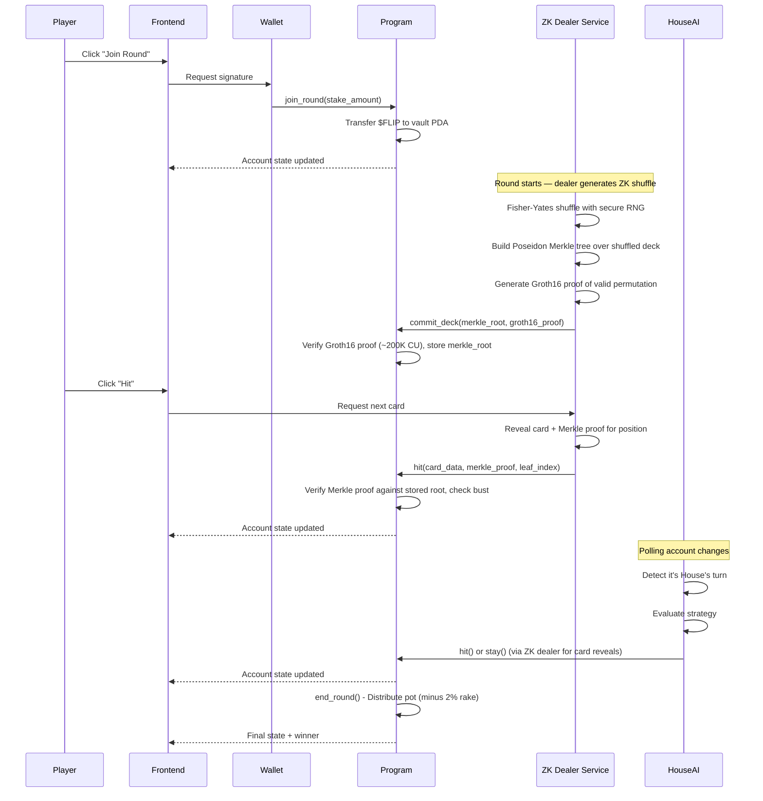

# PushFlip: Comprehensive Execution Plan

## Project Overview

- **Project Name**: PushFlip
- **One-Line Description**: A crypto-native push-your-luck card game on Solana with AI opponents, token-burning mechanics, ZK-proof deck verification, and on-chain randomness — built with Pinocchio (zero-dependency native Rust) for maximum performance and portfolio differentiation
- **Problem Statement**: Traditional online card games lack transparency in randomness and don't leverage blockchain's unique capabilities for provable fairness and token economics
- **Target Users**: Crypto-native gamers, DeFi enthusiasts, and developers interested in on-chain gaming
- **Primary Goal**: Portfolio piece demonstrating advanced Solana engineering — Pinocchio native programs, ZK-SNARK provably fair shuffling, and full-stack dApp architecture. Hackathon submission is secondary.
- **Success Criteria**:
  - Fully functional on-chain game built with Pinocchio (no Anchor dependency)
  - ZK-proof deck verification using Groth16 + Poseidon Merkle trees for provably fair shuffling
  - Working token economy with stake/burn mechanics
  - AI opponent ("The House") that plays autonomously
  - Clean, interactive frontend with wallet integration (@solana/kit + Kit Plugins)
  - Comprehensive documentation suitable for portfolio presentation
  - Demonstrates deep Solana internals knowledge (zero-copy accounts, CPI, PDA signing, ZK verification)

## Scope Definition

### Core Features (Phases 1-4)
1. Core on-chain card game with hit/stay mechanics — **built with Pinocchio** (native Rust, zero-dependency)
2. **ZK-proof deck verification** using Groth16 + Poseidon Merkle trees (provably fair shuffling — NO slot hash, NO VRF)
3. `$FLIP` token (SPL Token) with stake-to-play and burn-for-power mechanics
4. Basic bounty system
5. "The House" AI opponent + ZK dealer service
6. "Flip Advisor" probability assistant (frontend)
7. Vite + React frontend with **@solana/kit + Kit Plugins** (NOT legacy web3.js, Anchor TS client, or Gill)
8. IDL generated via **Shank**, TypeScript client generated via **Codama**

### Post-MVP Features
- AI Commentator/Narrator
- AI Agent Tournaments
- Dynamic Bounty Generator
- Personalized AI Coach
- Decentralized dealer (threshold cryptography — multiple parties contribute randomness)

### Explicit Non-Goals
- Mobile native apps
- Multi-chain deployment
- Complex NFT integrations
- Real money gambling compliance
- Production-grade security audits (this is a portfolio piece)

## Technical Architecture

### System Architecture

```
┌─────────────────────────────────────────────────────────────────────┐
│                       FRONTEND (Vite + React)                       │
├─────────────────────────────────────────────────────────────────────┤
│  ┌──────────────┐  ┌──────────────┐  ┌──────────────────────────┐  │
│  │ Game UI      │  │ Wallet       │  │ Flip Advisor            │  │
│  │ Components   │  │ Connection   │  │ (Probability Calculator) │  │
│  └──────┬───────┘  └──────┬───────┘  └──────────────────────────┘  │
│         │                 │                                         │
│         └────────┬────────┘                                         │
│                  ▼                                                  │
│         ┌───────────────┐                                           │
│         │ @solana/kit   │                                           │
│         │ + Kit Plugins │                                           │
│         │ + Codama      │                                           │
│         └───────┬───────┘                                           │
└─────────────────┼───────────────────────────────────────────────────┘
                  │
                  ▼
┌─────────────────────────────────────────────────────────────────────┐
│                      SOLANA BLOCKCHAIN (Devnet)                     │
├─────────────────────────────────────────────────────────────────────┤
│  ┌────────────────────┐  ┌────────────────────┐                     │
│  │ pushflip           │  │ SPL Token Program  │                     │
│  │ (Pinocchio Native) │  │                    │                     │
│  │                    │  │ - $FLIP Token Mint │                     │
│  │ - GameSession PDA  │  │ - Token Accounts   │                     │
│  │ - PlayerState PDA  │  │                    │                     │
│  │ - initialize()     │  └────────────────────┘                     │
│  │ - commit_deck()    │                                             │
│  │ - join_round()     │  ┌────────────────────┐                     │
│  │ - hit()            │  │ ZK Verification    │                     │
│  │ - stay()           │  │ (Groth16 on-chain) │                     │
│  │ - end_round()      │  │ (Poseidon Merkle)  │                     │
│  └─────────┬──────────┘  └────────────────────┘                     │
│            │                                                        │
│            ▼                                                        │
│  ┌────────────────────┐                                             │
│  │ BountyBoard PDA    │                                             │
│  └────────────────────┘                                             │
└─────────────────────────────────────────────────────────────────────┘
                  ▲
                  │
┌─────────────────┼───────────────────────────────────────────────────┐
│                 │        OFF-CHAIN SERVICES                         │
├─────────────────┼───────────────────────────────────────────────────┤
│         ┌───────┴───────┐  ┌───────────────┐                        │
│         │ The House AI  │  │ ZK Dealer     │                        │
│         │ Agent         │  │ Service       │                        │
│         │ (Node.js)     │  │ (Rust/Node)   │                        │
│         │               │  │               │                        │
│         │ - Account     │  │ - Shuffle     │                        │
│         │   Subscriber  │  │   Engine      │                        │
│         │ - Strategy    │  │ - Circom/     │                        │
│         │   Engine      │  │   snarkjs     │                        │
│         │ - TX Signer   │  │ - Merkle Tree │                        │
│         └───────────────┘  │ - Proof Gen   │                        │
│                            └───────────────┘                        │
└─────────────────────────────────────────────────────────────────────┘
```

### Data Flow



## Technology Stack

| Category | Technology | Rationale | Alternatives Considered |
|----------|------------|-----------|------------------------|
| **Blockchain** | Solana Devnet | High throughput, low fees, mature ecosystem | N/A (Solana-only project) |
| **On-chain Framework** | **Pinocchio 0.11** | Zero-dependency, zero-copy, maximum CU efficiency, portfolio differentiator — demonstrates deep Solana internals | Anchor (easier DX but commoditized skill), native solana-program (Pinocchio supersedes it) |
| **Language (On-chain)** | Rust 1.70+ | Required for Solana programs | N/A |
| **IDL Generation** | **Shank** | Generates IDL from native Rust programs via derive macros | Anchor IDL (requires Anchor), manual JSON |
| **Client Codegen** | **Codama** | Generates TypeScript + Rust clients from Shank IDL | Manual client code, Anchor TS client |
| **Randomness** | **ZK-SNARK (Groth16)** | Provably fair — cryptographic proof of valid shuffle, no trusted third party | Slot hash (predictable by validators), VRF (oracle trust required) |
| **ZK Proving** | **Circom + snarkjs** | Mature circuit language, Groth16 backend, ~200K CU on-chain verification | Halo2 (larger proofs), SP1/RISC Zero (heavier) |
| **ZK Verification (on-chain)** | **groth16-solana** | Audited Groth16 verifier by Light Protocol, uses native alt_bn128 syscalls | Custom verifier (risky), arkworks (no Solana syscalls) |
| **ZK Hashing** | **light-poseidon** + Poseidon syscall | ZK-friendly hash, native Solana syscall support, Circom-compatible BN254 params | SHA-256 (10x more constraints in-circuit), Keccak |
| **Token Standard** | SPL Token | Native Solana token standard | Token-2022 (overkill for MVP) |
| **Frontend Framework** | Vite 5 + React 18 | Fast dev server, perfect for SPAs, lightweight, excellent DX | Next.js (unnecessary SSR/routing overhead for dApp) |
| **Solana Client (JS)** | **@solana/kit + Kit Plugins** | Official next-gen SDK (tree-shakable, 83% smaller bundles, 900% faster crypto), Kit Plugins add composable client presets (RPC, payer, tx planning, LiteSVM) | Legacy @solana/web3.js 1.x (deprecated), @coral-xyz/anchor TS (requires Anchor), Gill (unnecessary wrapper) |
| **Styling** | Tailwind CSS + shadcn/ui | Rapid development, consistent design system | Chakra UI (heavier) |
| **Wallet Integration** | @solana/wallet-adapter-react | Official solution, supports Phantom/Solflare/etc | Custom (more work) |
| **State Management** | Zustand + React Query | Lightweight, good for async state | Redux (overkill) |
| **AI Agent Runtime** | Node.js 20 + TypeScript | Same language as frontend, good Solana SDK | Python (different ecosystem) |
| **Development** | Docker + Solana CLI + pnpm | Reproducible builds, version control, fast package manager | Anchor CLI (not needed with Pinocchio) |
| **Testing** | **LiteSVM** (integration) + **Mollusk** (unit) | Fast in-process Solana VM, no validator needed, purpose-built for native programs | Anchor test (requires Anchor), solana-test-validator (slower) |
| **Deployment (Frontend)** | Podman/Docker on Ubuntu 25.04 VPS (nginx) | Self-hosted, full control, no vendor lock-in | Vercel (faster setup, vendor lock-in) |
| **Deployment (AI Agent)** | Same VPS (Podman/Docker container) | Co-located with frontend, single server | Railway/Render (separate services) |

## Data Model

### Solana Account Structure (PDAs)

```
┌─────────────────────────────────────────────────────────────────┐
│                      GameSession (PDA)                          │
│              Seeds: ["game", game_id.to_le_bytes()]             │
├─────────────────────────────────────────────────────────────────┤
│ discriminator: u8           // Account type tag (no Anchor disc) │
│ bump: u8                                                        │
│ game_id: u64                                                    │
│ authority: Pubkey           // Admin who initialized            │
│ house_address: Pubkey       // The House AI wallet              │
│ token_mint: Pubkey          // $FLIP token mint                 │
│ vault: Pubkey               // PDA holding staked tokens        │
│ dealer: Pubkey              // ZK dealer service address        │
│ merkle_root: [u8; 32]      // Poseidon Merkle root of shuffled deck│
│ draw_counter: u8            // Next card position to reveal     │
│ deck_committed: bool        // True after commit_deck verified  │
│ player_count: u8                                                │
│ turn_order: [Pubkey; 4]     // House AI at slot 0, up to 3 humans│
│ current_turn_index: u8                                          │
│ pot_amount: u64                                                 │
│ round_active: bool                                              │
│ round_number: u64                                               │
│ rollover_count: u8          // Consecutive all-bust rounds (cap 10)│
│ last_action_slot: u64       // For future timeout support (v2)  │
│ treasury_fee_bps: u16       // Rake in basis points (200 = 2%)  │
│ treasury: Pubkey            // Treasury token account            │
└─────────────────────────────────────────────────────────────────┘

┌─────────────────────────────────────────────────────────────────┐
│                      PlayerState (PDA)                          │
│         Seeds: ["player", game_id.to_le_bytes(), player_pubkey] │
├─────────────────────────────────────────────────────────────────┤
│ bump: u8                                                        │
│ player: Pubkey                                                  │
│ game_id: u64                                                    │
│ hand: Vec<Card>             // Current hand (max 10 cards)      │
│ hand_size: u8                                                   │
│ score: u64                                                      │
│ is_active: bool             // Still in the round               │
│ inactive_reason: u8         // 0=active, 1=bust, 2=stay         │
│ bust_card_value: u8         // Alpha value that caused bust (0=none)│
│ staked_amount: u64                                              │
│ has_used_second_chance: bool                                    │
│ total_wins: u64             // Lifetime stats                   │
│ total_games: u64                                                │
└─────────────────────────────────────────────────────────────────┘

┌─────────────────────────────────────────────────────────────────┐
│                         Card (Struct)                           │
├─────────────────────────────────────────────────────────────────┤
│ value: u8                   // 1-13 for Alpha cards             │
│ card_type: CardType         // Enum: Alpha, Protocol, Multiplier│
│ suit: u8                    // 0-3 for Alpha cards              │
└─────────────────────────────────────────────────────────────────┘

┌─────────────────────────────────────────────────────────────────┐
│                      CardType (Enum)                            │
├─────────────────────────────────────────────────────────────────┤
│ Alpha = 0        // Standard cards, bust on duplicate value     │
│ Protocol = 1     // Special actions: Rug Pull, Airdrop, etc     │
│ Multiplier = 2   // DeFi multipliers: 2x, 3x score              │
└─────────────────────────────────────────────────────────────────┘

┌─────────────────────────────────────────────────────────────────┐
│                      BountyBoard (PDA)                          │
│                    Seeds: ["bounties", game_id]                 │
├─────────────────────────────────────────────────────────────────┤
│ bump: u8                                                        │
│ game_id: u64                                                    │
│ bounties: Vec<Bounty>       // Active bounties (max 10)         │
└─────────────────────────────────────────────────────────────────┘

┌─────────────────────────────────────────────────────────────────┐
│                        Bounty (Struct)                          │
├─────────────────────────────────────────────────────────────────┤
│ id: u64                                                         │
│ description: String         // Max 64 chars                     │
│ bounty_type: BountyType     // Enum for condition checking      │
│ reward_amount: u64                                              │
│ is_active: bool                                                 │
│ claimed_by: Option<Pubkey>                                      │
└─────────────────────────────────────────────────────────────────┘

┌─────────────────────────────────────────────────────────────────┐
│                      TokenVault (PDA)                           │
│                Seeds: ["vault", game_session_pubkey]            │
├─────────────────────────────────────────────────────────────────┤
│ (SPL Token Account owned by program)                            │
│ Holds all staked $FLIP tokens for active rounds                 │
└─────────────────────────────────────────────────────────────────┘
```

### Account Size Calculations

```rust
// NOTE: Pinocchio uses zero-copy layouts — no Anchor 8-byte discriminator.
// We use a 1-byte discriminator for account type identification.

// GameSession (Pinocchio zero-copy layout):
// With ZK shuffle, the deck is NOT stored on-chain (revealed via Merkle proofs).
// 1 (discriminator) + 1 (bump) + 8 (game_id) + 32 (authority) + 32 (house_address)
// + 32 (token_mint) + 32 (vault) + 32 (dealer) + 32 (merkle_root)
// + 1 (draw_counter) + 1 (deck_committed)
// + 1 (player_count) + (4 * 32) (turn_order) + 1 (current_turn_index)
// + 8 (pot_amount) + 1 (round_active) + 8 (round_number) + 1 (rollover_count)
// + 8 (last_action_slot) + 2 (treasury_fee_bps) + 32 (treasury)
// = 388 bytes (allocate 512 for safety)
// NOTE: ~270 bytes smaller than Anchor version — no on-chain deck storage!

// PlayerState (Pinocchio zero-copy layout):
// 1 (discriminator) + 1 (bump) + 32 (player) + 8 (game_id)
// + 1 (hand_size) + (10 * 3) (hand, fixed-size array) + 8 (score)
// + 1 (is_active) + 1 (inactive_reason) + 1 (bust_card_value)
// + 8 (staked_amount) + 1 (has_used_second_chance)
// + 8 (total_wins) + 8 (total_games)
// = 110 bytes (allocate 256 for safety)

// BountyBoard: 1 + 1 + 8 + (10 * 100)
// = ~1010 bytes (allocate 1500 for safety)
```

## Project Structure

```
pushflip/
├── program/                           # On-chain program (Pinocchio native)
│   ├── Cargo.toml                    # pinocchio, pinocchio-system, pinocchio-token, pinocchio-log
│   └── src/
│       ├── lib.rs                    # program_entrypoint! macro, instruction dispatch
│       ├── entrypoint.rs             # Instruction router (match on single-byte discriminator)
│       ├── instructions/
│       │   ├── mod.rs
│       │   ├── initialize.rs         # Initialize game session
│       │   ├── commit_deck.rs        # ZK: verify Groth16 proof, store Merkle root
│       │   ├── join_round.rs         # Player joins with stake
│       │   ├── start_round.rs        # Begin play (deck already committed via ZK)
│       │   ├── hit.rs                # Draw card (verify Merkle proof for card reveal)
│       │   ├── stay.rs               # End turn, lock score
│       │   ├── end_round.rs          # Distribute winnings
│       │   ├── burn_second_chance.rs
│       │   ├── burn_scry.rs
│       │   ├── claim_bounty.rs
│       │   ├── leave_game.rs         # Player leaves (refund or forfeit)
│       │   └── close_game.rs         # Authority closes game, reclaims rent
│       ├── state/
│       │   ├── mod.rs
│       │   ├── game_session.rs       # Zero-copy account layout via raw byte offsets
│       │   ├── player_state.rs       # Zero-copy account layout
│       │   ├── card.rs
│       │   └── bounty.rs
│       ├── errors.rs                 # Custom error codes (manual ProgramError impl)
│       ├── events.rs                 # Event emission via CPI to noop program (Anchor-compatible)
│       ├── zk/
│       │   ├── mod.rs
│       │   ├── groth16.rs            # On-chain Groth16 proof verification (groth16-solana)
│       │   ├── merkle.rs             # Poseidon Merkle proof verification (light-poseidon)
│       │   └── verifying_key.rs      # Embedded Groth16 verifying key (from trusted setup)
│       └── utils/
│           ├── mod.rs
│           ├── deck.rs               # Deck creation, canonical ordering
│           ├── scoring.rs            # Score calculation
│           └── accounts.rs           # Account validation helpers (TryFrom<&[AccountInfo]>)
│
├── zk-circuits/                      # Off-chain ZK circuit (Circom)
│   ├── circuits/
│   │   ├── shuffle_verify.circom     # Main circuit: proves valid 94-card permutation
│   │   ├── merkle_tree.circom        # Poseidon Merkle tree construction
│   │   └── permutation_check.circom  # Bijection verification (each index 0-93 once)
│   ├── scripts/
│   │   ├── compile.sh                # circom compile
│   │   ├── trusted_setup.sh          # Powers of Tau + circuit-specific setup
│   │   └── generate_proof.ts         # snarkjs proof generation wrapper
│   ├── test/
│   │   └── shuffle_verify.test.ts    # Circuit unit tests
│   ├── build/                        # Compiled artifacts (R1CS, WASM, zkey)
│   └── package.json
│
├── dealer/                            # Off-chain ZK dealer service
│   ├── package.json
│   ├── tsconfig.json
│   └── src/
│       ├── index.ts                  # Entry point
│       ├── dealer.ts                 # Dealer class: shuffle, prove, commit, reveal
│       ├── merkle.ts                 # Poseidon Merkle tree (light-poseidon via WASM)
│       ├── prover.ts                 # snarkjs Groth16 proof generation
│       └── config.ts
│
├── app/                               # Vite + React frontend
│   ├── package.json
│   ├── vite.config.ts
│   ├── tailwind.config.js
│   ├── tsconfig.json
│   ├── index.html
│   ├── src/
│   │   ├── main.tsx
│   │   ├── App.tsx
│   │   ├── providers/
│   │   │   ├── WalletProvider.tsx
│   │   │   └── QueryProvider.tsx
│   │   ├── components/
│   │   │   ├── ui/                   # shadcn components
│   │   │   ├── game/
│   │   │   │   ├── GameBoard.tsx
│   │   │   │   ├── PlayerHand.tsx
│   │   │   │   ├── Card.tsx
│   │   │   │   ├── ActionButtons.tsx
│   │   │   │   ├── PotDisplay.tsx
│   │   │   │   └── TurnIndicator.tsx
│   │   │   ├── wallet/
│   │   │   │   └── WalletButton.tsx
│   │   │   └── advisor/
│   │   │       └── FlipAdvisor.tsx
│   │   ├── hooks/
│   │   │   ├── useGameSession.ts
│   │   │   ├── usePlayerState.ts
│   │   │   ├── useGameActions.ts     # Uses Codama-generated client
│   │   │   └── useFlipAdvisor.ts
│   │   ├── lib/
│   │   │   ├── program.ts            # @solana/kit + Codama-generated client setup
│   │   │   ├── constants.ts
│   │   │   └── utils.ts
│   │   ├── types/
│   │   │   └── index.ts              # From Codama-generated types
│   │   ├── stores/
│   │   │   └── gameStore.ts          # Zustand store
│   │   └── styles/
│   │       └── globals.css
│   └── public/
│       └── cards/
│
├── house-ai/                         # AI opponent service
│   ├── package.json
│   ├── tsconfig.json
│   └── src/
│       ├── index.ts
│       ├── agent.ts                  # Main AI agent class
│       ├── strategy.ts               # Hit/stay decision logic
│       ├── accountSubscriber.ts      # Watch for game state changes (via Kit)
│       └── config.ts
│
├── clients/                          # Codama-generated clients (auto-generated)
│   ├── js/                           # TypeScript client
│   └── rust/                         # Rust client
│
├── tests/
│   ├── integration.rs                # LiteSVM integration tests
│   ├── unit.rs                       # Mollusk unit tests
│   └── helpers.rs                    # Test helpers, PDA derivation
│
├── scripts/
│   ├── create-token.ts               # Create $FLIP mint
│   ├── airdrop-tokens.ts             # Distribute test tokens
│   ├── initialize-game.ts            # Set up initial game state
│   └── generate-idl.sh              # Shank IDL + Codama client generation
│
├── idl/                              # Shank-generated IDL
│   └── pushflip.json
│
├── Cargo.toml                        # Workspace root
├── justfile                          # Build commands (build, test, idl, deploy)
├── package.json                      # Root workspace
├── pnpm-workspace.yaml
├── codama.ts                         # Codama client generation config
└── README.md
```

## Implementation Phases

### Phase 1: Foundation & Core Game Engine (Days 1-7)

**Goal:** Get a playable on-chain card game working with Pinocchio (no Anchor), including ZK deck commitment infrastructure. No tokens or special abilities yet.

**Prerequisites:** Development environment set up

#### Task 1.1: Environment Setup (3-4 hours)

**Deliverable:** Working Pinocchio development environment (NO Anchor)

```bash
# Commands to run
rustup default stable
rustup update
sh -c "$(curl -sSfL https://release.solana.com/v1.18.0/install)"
cargo install cargo-build-sbf        # Solana BPF compiler (replaces anchor build)
cargo install shank-cli               # IDL generation for native programs
npm install -g @codama/cli            # Client code generation from IDL
solana-keygen new
solana config set --url devnet
solana airdrop 5
```

**Claude Code Prompt:**
```
Create a new Pinocchio-based Solana project called "pushflip" with the following:

1. Workspace Cargo.toml at root with members: ["program"]
2. program/Cargo.toml with dependencies:
   - pinocchio = "0.11" (with features: ["cpi"])
   - pinocchio-system = "0.4"
   - pinocchio-token = "0.4"
   - pinocchio-log = "0.3"
   - pinocchio-pubkey = "0.3"
   - shank = "0.4" (for IDL generation via derive macros)
   - groth16-solana = "0.2" (for ZK proof verification)
   - light-poseidon = "0.2" (for Poseidon Merkle verification)
3. program/src/lib.rs with:
   - pinocchio_pubkey::declare_id!("...") with placeholder
   - pinocchio::default_allocator!()
   - pinocchio::default_panic_handler!()
   - pinocchio::program_entrypoint!(process_instruction)
   - process_instruction function that dispatches on first byte of instruction_data
4. Folder structure: instructions/, state/, zk/, utils/, errors.rs, events.rs
5. A justfile with commands: build, test, idl, deploy, generate-client
6. Root package.json with pnpm workspace for app/, house-ai/, dealer/, clients/
7. codama.ts config file for client generation from Shank IDL

This is a NATIVE Pinocchio program — do NOT use Anchor, anchor-lang, or #[program] macros.
Use Pinocchio's program_entrypoint! macro and manual instruction dispatch.
```

**Validation:**
- [ ] `cargo build-sbf` completes without errors (in program/ directory)
- [ ] `solana config get` shows devnet
- [ ] Wallet has SOL balance
- [ ] `shank idl` generates a basic IDL

#### Task 1.2: Define State Structures (4-5 hours)

**Deliverable:** All account structures with zero-copy layouts for Pinocchio

**Claude Code Prompt:**
```
In the pushflip Pinocchio program, create the state module with ZERO-COPY layouts:

NOTE: Pinocchio does NOT use Anchor's #[account] macro. Instead, define fixed-size
structs with known byte offsets and implement TryFrom<&AccountInfo> for deserialization.
Use raw byte slicing on account data — no Borsh, no serde.

1. `state/card.rs`:
   - Card struct: value (u8), card_type (u8), suit (u8) — 3 bytes, packed
   - CardType constants: ALPHA = 0, PROTOCOL = 1, MULTIPLIER = 2
   - ProtocolEffect constants: RUG_PULL = 0, AIRDROP = 1, VAMPIRE_ATTACK = 2
   - Implement from_bytes(&[u8; 3]) -> Self and to_bytes(&self) -> [u8; 3]

2. `state/game_session.rs`:
   - GameSession: zero-copy layout with explicit byte offsets
   - Fields at known offsets:
     - [0]: discriminator (u8, = 1 for GameSession)
     - [1]: bump (u8)
     - [2..10]: game_id (u64 LE)
     - [10..42]: authority (Pubkey)
     - [42..74]: house_address (Pubkey)
     - [74..106]: token_mint (Pubkey)
     - [106..138]: vault (Pubkey)
     - [138..170]: dealer (Pubkey) — ZK dealer address
     - [170..202]: merkle_root ([u8; 32]) — Poseidon Merkle root
     - [202]: draw_counter (u8)
     - [203]: deck_committed (bool/u8)
     - [204]: player_count (u8)
     - [205..333]: turn_order ([Pubkey; 4], 128 bytes)
     - [333]: current_turn_index (u8)
     - [334..342]: pot_amount (u64 LE)
     - [342]: round_active (bool/u8)
     - [343..351]: round_number (u64 LE)
     - [351]: rollover_count (u8)
     - [352..360]: last_action_slot (u64 LE)
     - [360..362]: treasury_fee_bps (u16 LE)
     - [362..394]: treasury (Pubkey)
   - Total: 394 bytes (allocate 512)
   - Seeds: ["game", game_id.to_le_bytes()]
   - Implement accessor methods: game_id(), authority(), is_player_turn(), etc.
   - Implement mutable setters: set_round_active(), set_current_turn_index(), etc.

3. `state/player_state.rs`:
   - PlayerState: zero-copy layout
   - Fields at known offsets:
     - [0]: discriminator (u8, = 2 for PlayerState)
     - [1]: bump (u8)
     - [2..34]: player (Pubkey)
     - [34..42]: game_id (u64 LE)
     - [42]: hand_size (u8)
     - [43..73]: hand ([Card; 10], 30 bytes fixed)
     - [73..81]: score (u64 LE)
     - [81]: is_active (bool/u8)
     - [82]: inactive_reason (u8: 0=active, 1=bust, 2=stay)
     - [83]: bust_card_value (u8)
     - [84..92]: staked_amount (u64 LE)
     - [92]: has_used_second_chance (bool/u8)
     - [93..101]: total_wins (u64 LE)
     - [101..109]: total_games (u64 LE)
   - Total: 109 bytes (allocate 256)
   - Seeds: ["player", game_id.to_le_bytes(), player.key()]

4. `utils/accounts.rs`:
   - Helper to validate PDA ownership: verify account.owner() == program_id
   - Helper to verify PDA address: find_program_address with expected seeds
   - Implement TryFrom<&AccountInfo> for each account type

5. `state/mod.rs` to export all state types

Use NO Borsh, NO Anchor macros. All serialization is manual byte slicing.
Add Shank #[derive(ShankAccount)] annotations for IDL generation.
```

**Validation:**
- [ ] `cargo build-sbf` succeeds
- [ ] All structs have correct byte offset calculations
- [ ] PDA seeds are properly defined
- [ ] `shank idl` generates correct IDL

#### Task 1.3: Implement Deck Utilities (2-3 hours)

**Deliverable:** Deck creation and canonical ordering (shuffle is now off-chain via ZK dealer)

**Claude Code Prompt:**
```
Create `utils/deck.rs` for the pushflip program with:

1. `create_canonical_deck() -> [Card; 94]` function (fixed-size array, no Vec):
   - 52 Alpha cards (4 suits × 13 values, standard deck)
   - 30 Protocol cards (10 each of RugPull, Airdrop, VampireAttack)
   - 12 Multiplier cards (6 × 2x multiplier, 6 × 3x multiplier)
   - Cards are in a deterministic "canonical order" — this is the public input
     to the ZK circuit (everyone knows the unshuffled deck)

2. `canonical_deck_hash() -> [u8; 32]`:
   - Returns the Poseidon hash of the canonical deck in standard order
   - This is a constant used by the ZK circuit as a public input

3. NOTE: shuffle_deck() is NOT needed on-chain. The ZK dealer shuffles off-chain
   and commits a Merkle root. On-chain, we only verify Merkle proofs for card reveals.

Include unit tests using #[cfg(test)] module to verify:
- Deck has exactly 94 cards
- Canonical order is deterministic
- Canonical deck hash is consistent
```

**Validation:**
- [ ] Unit tests pass with `cargo test`
- [ ] Deck contains correct card distribution
- [ ] Canonical hash is deterministic

#### Task 1.4: Implement Scoring Logic (2 hours)

**Deliverable:** Score calculation utilities

**Claude Code Prompt:**
```
Create `utils/scoring.rs` for the pushflip program with:

1. `calculate_hand_score(hand: &[Card], hand_size: u8) -> u64`:
   - Sum all Alpha card values
   - Apply multiplier cards (2x or 3x to total)
   - Protocol cards don't add to score directly
   - Return final score

2. `check_bust(hand: &[Card], hand_size: u8) -> bool`:
   - Return true if hand contains two Alpha cards with the same value
   - Ignore suit, only check value
   - Protocol and Multiplier cards cannot cause bust

3. `check_pushflip(hand: &[Card], hand_size: u8) -> bool`:
   - Return true if player has exactly 7 cards without busting

4. NOTE: get_bust_probability() is a frontend-only calculation (no floats on-chain)

Include comprehensive unit tests for edge cases.
All functions work with fixed-size arrays and hand_size counter (no Vec).
```

**Validation:**
- [ ] Score calculation matches game rules
- [ ] Bust detection works correctly

#### Task 1.5: ZK Verification Module (5-6 hours)

**Deliverable:** On-chain Groth16 and Poseidon Merkle proof verification

**Claude Code Prompt:**
```
Create the `zk/` module for on-chain ZK verification:

1. `zk/groth16.rs`:
   - Wrapper around groth16-solana crate for Groth16 proof verification
   - `verify_shuffle_proof(proof: &[u8], merkle_root: &[u8; 32]) -> bool`
   - Uses Solana's native alt_bn128 syscalls for efficient pairing checks (~200K CU)
   - Proof format: 128 bytes compressed (2 G1 points + 1 G2 point)
   - Public inputs: merkle_root, canonical_deck_hash (constant)

2. `zk/verifying_key.rs`:
   - Embed the Groth16 verifying key as a constant (generated during trusted setup)
   - For now, use a placeholder — actual key comes from the Circom circuit trusted setup
   - Format: alpha, beta, gamma, delta, IC points (BN254 curve)

3. `zk/merkle.rs`:
   - `verify_merkle_proof(root: &[u8; 32], leaf: &[u8; 32], proof: &[[u8; 32]; 7], index: u8) -> bool`
   - Poseidon hash using light-poseidon crate (or Solana Poseidon syscall)
   - Tree depth = 7 (supports up to 128 leaves, we use 94)
   - Leaf = Poseidon(card_value, card_type, suit, leaf_index)
   - Each proof step: if bit is 0, hash(current, sibling); if bit is 1, hash(sibling, current)

4. `zk/mod.rs`:
   - Export all ZK verification functions

These are VERIFICATION-ONLY functions (on-chain). Proof GENERATION happens off-chain.
Target: Groth16 verify ~200K CU, Merkle verify ~50K CU per card reveal.
```

**Validation:**
- [ ] Groth16 verification compiles with groth16-solana
- [ ] Merkle proof verification works with test vectors
- [ ] CU usage is within budget

#### Task 1.6: Initialize Instruction (4-5 hours)

**Deliverable:** Game initialization instruction using Pinocchio patterns

**Claude Code Prompt:**
```
Create `instructions/initialize.rs` for the pushflip Pinocchio program:

NOTE: This is a NATIVE Pinocchio instruction — no Anchor macros.
Pattern: define an accounts struct, implement TryFrom<&[AccountInfo]>,
validate all accounts manually, then execute logic.

1. Define `InitializeAccounts` struct:
   - game_session: &AccountInfo (to be created as PDA)
   - authority: &AccountInfo (signer, pays rent)
   - house: &AccountInfo (not signer, stored as house_address)
   - dealer: &AccountInfo (ZK dealer address)
   - treasury: &AccountInfo (treasury token account)
   - system_program: &AccountInfo

2. Implement TryFrom<&[AccountInfo]> for InitializeAccounts:
   - Verify account count
   - Verify authority is signer
   - Verify system_program is correct address

3. Process function:
   - Parse game_id from instruction_data (u64 LE after discriminator byte)
   - Derive PDA: find_program_address(["game", game_id.to_le_bytes()], program_id)
   - CPI to system_program::CreateAccount with PDA seeds for signing
   - Write GameSession data at correct byte offsets:
     - Set discriminator = 1
     - Set authority, house_address, dealer
     - Place House AI in turn_order[0], set player_count = 1
     - Set round_active = false, rollover_count = 0
     - Set treasury_fee_bps = 200 (2%)
     - Set merkle_root = [0; 32], deck_committed = false, draw_counter = 0
   - Emit GameInitialized event (CPI to noop program, Anchor-compatible format)

4. Validation:
   - game_id must be > 0
   - PDA must not already exist (check data length == 0)

5. In `events.rs`, define event emission helper using CPI to noop program

6. In `entrypoint.rs`, add discriminator 0 => initialize

Use pinocchio_system::instructions::CreateAccount for account creation CPI.
Use invoke_signed() with PDA seeds for signing.
```

**Validation:**
- [ ] Can initialize a new game session
- [ ] PDA is created at correct address
- [ ] Cannot initialize twice with same game_id

#### Task 1.7: Commit Deck Instruction (5-6 hours)

**Deliverable:** ZK-verified deck commitment — the core provably fair mechanism

**Claude Code Prompt:**
```
Create `instructions/commit_deck.rs` for the pushflip Pinocchio program:

This is the KEY differentiator — on-chain ZK proof verification for provably fair shuffling.

1. Define `CommitDeckAccounts` struct:
   - game_session: &AccountInfo (mutable PDA)
   - dealer: &AccountInfo (signer — must match game_session.dealer)

2. Implement TryFrom<&[AccountInfo]> with validation:
   - Verify dealer is signer
   - Verify game_session is owned by program
   - Verify game_session.dealer == dealer.key()

3. Parse instruction_data:
   - [0]: discriminator (already consumed by router)
   - [1..33]: merkle_root ([u8; 32])
   - [33..161]: groth16_proof (128 bytes compressed)

4. Process function:
   - Verify round is NOT active (commit before start)
   - Verify deck is NOT already committed for this round
   - Call zk::groth16::verify_shuffle_proof(proof, merkle_root)
   - If verification fails, return error
   - Write merkle_root to GameSession
   - Set deck_committed = true
   - Set draw_counter = 0
   - Emit DeckCommitted event with round_number and merkle_root

5. CU budget: ~200K CU for Groth16 verification via alt_bn128 syscalls

6. In entrypoint.rs, add discriminator 1 => commit_deck
```

**Validation:**
- [ ] Valid Groth16 proofs are accepted
- [ ] Invalid proofs are rejected
- [ ] Cannot commit deck twice per round
- [ ] Only the designated dealer can commit

#### Task 1.8: Join Round Instruction (3-4 hours)

**Deliverable:** Player joining functionality (without tokens for now)

**Claude Code Prompt:**
```
Create `instructions/join_round.rs` for the pushflip Pinocchio program:

1. Define `JoinRoundAccounts` struct:
   - game_session: &AccountInfo (mutable PDA)
   - player_state: &AccountInfo (to be created as PDA)
   - player: &AccountInfo (signer, pays rent)
   - system_program: &AccountInfo

2. Implement TryFrom<&[AccountInfo]> with validation:
   - Verify player is signer
   - Verify game_session is owned by program

3. Process function:
   - Verify round is not currently active (joining phase)
   - Verify player_count < 4 (House at slot 0, up to 3 humans at slots 1-3)
   - Verify player pubkey not already in turn_order (prevent double-join)
   - Derive PlayerState PDA: ["player", game_id.to_le_bytes(), player.key()]
   - CPI to system_program::CreateAccount with PDA signing
   - Write PlayerState at byte offsets:
     - discriminator = 2, bump, player, game_id
     - hand_size = 0, score = 0, is_active = false (will be set true on start_round)
     - inactive_reason = 0, bust_card_value = 0
   - Update GameSession: add to turn_order[player_count], increment player_count
   - Emit PlayerJoined event

4. In entrypoint.rs, add discriminator 2 => join_round

For now, skip token staking — added in Phase 2.
```

**Validation:**
- [ ] Player can join a game
- [ ] PlayerState PDA is created
- [ ] Cannot join twice or exceed max players

#### Task 1.9: Start Round Instruction (3-4 hours)

**Deliverable:** Round initialization (deck already committed via ZK)

**Claude Code Prompt:**
```
Create `instructions/start_round.rs` for the pushflip Pinocchio program:

NOTE: Unlike the Anchor version, the deck is NOT shuffled on-chain.
The ZK dealer has already committed a Merkle root via commit_deck.
start_round just begins play.

1. Define `StartRoundAccounts` struct:
   - game_session: &AccountInfo (mutable PDA)
   - authority: &AccountInfo (signer, must be game authority)
   - Plus all PlayerState accounts via remaining accounts

2. Process function:
   - Verify at least 2 players (House + 1 human minimum)
   - Verify round is not already active
   - Verify deck_committed == true (ZK dealer must have committed)
   - Set round_active = true
   - Set current_turn_index = 0
   - Increment round_number
   - Reset all PlayerState accounts:
     - is_active = true, inactive_reason = 0, bust_card_value = 0
     - Clear hand, hand_size = 0, score = 0
     - has_used_second_chance = false
   - Emit RoundStarted event

3. Validate remaining accounts (PlayerState PDAs):
   - Verify owner == program_id
   - Verify PDA seeds match game_id + player pubkey
   - Verify player is in turn_order
   - Verify count == player_count

4. In entrypoint.rs, add discriminator 3 => start_round
```

**Validation:**
- [ ] Round starts only after deck committed
- [ ] All players are set to active
- [ ] Turn order is established

#### Task 1.10: Hit Instruction (6-7 hours)

**Deliverable:** Core card drawing with Merkle proof verification

**Claude Code Prompt:**
```
Create `instructions/hit.rs` for the pushflip Pinocchio program:

This instruction now VERIFIES a Merkle proof for the revealed card,
rather than popping from an on-chain deck.

1. Define `HitAccounts` struct:
   - game_session: &AccountInfo (mutable PDA)
   - player_state: &AccountInfo (mutable PDA)
   - player: &AccountInfo (signer)

2. Parse instruction_data (after discriminator):
   - card_data: [u8; 3] (Card bytes: value, type, suit)
   - merkle_proof: [[u8; 32]; 7] (7 sibling hashes, tree depth 7)
   - leaf_index: u8 (position in shuffled deck)

3. Process function:
   - Verify round is active
   - Verify it's this player's turn (current_turn_index matches)
   - Verify player is_active
   - **Verify leaf_index == game_session.draw_counter** (sequential draws)
   - **Compute leaf hash: Poseidon(card_value, card_type, suit, leaf_index)**
   - **Verify Merkle proof: zk::merkle::verify_merkle_proof(merkle_root, leaf_hash, proof, leaf_index)**
   - If Merkle proof invalid, return error
   - Increment draw_counter
   - Deserialize card_data into Card
   - Add card to player's hand at hand[hand_size], increment hand_size
   - Check for bust condition (duplicate Alpha value)
   - If busted:
     - Set is_active = false, inactive_reason = 1
     - Set bust_card_value = duplicate Alpha value
     - Emit PlayerBusted event
     - advance_turn()
   - If not busted:
     - Check for PushFlip (7 cards)
     - Emit CardDrawn event
     - Do NOT advance turn (player can hit again or stay)

4. advance_turn() helper:
   - Find next active player in turn_order
   - Update current_turn_index
   - If no active players remain, set flag for round end

5. CU budget: ~50K CU per Merkle verification (Poseidon syscall)

6. In entrypoint.rs, add discriminator 4 => hit
```

**Validation:**
- [ ] Valid Merkle proofs accepted, cards added to hand
- [ ] Invalid Merkle proofs rejected
- [ ] Sequential draw_counter enforced
- [ ] Bust detection works
- [ ] Cannot act when not your turn

#### Task 1.11: Stay Instruction (3-4 hours)

**Deliverable:** Player ending their turn

**Claude Code Prompt:**
```
Create `instructions/stay.rs` for the pushflip Pinocchio program:

1. Define `StayAccounts` struct:
   - game_session: &AccountInfo (mutable PDA)
   - player_state: &AccountInfo (mutable PDA)
   - player: &AccountInfo (signer)

2. Process function:
   - Verify round is active
   - Verify it's this player's turn
   - Verify player is_active
   - Calculate and store final score using calculate_hand_score()
   - Set is_active = false, inactive_reason = 2 (stay)
   - Emit PlayerStayed event with final score
   - advance_turn()
   - Check if all players are now inactive → emit RoundReadyToEnd

3. In entrypoint.rs, add discriminator 5 => stay
```

**Validation:**
- [ ] Score is calculated correctly
- [ ] Turn advances to next player
- [ ] Round end is triggered when all players done

#### Task 1.12: End Round Instruction (4-5 hours)

**Deliverable:** Winner determination and round cleanup

**Claude Code Prompt:**
```
Create `instructions/end_round.rs` for the pushflip Pinocchio program:

1. Define `EndRoundAccounts` struct:
   - game_session: &AccountInfo (mutable PDA)
   - caller: &AccountInfo (signer — anyone can call when round ready)
   - Plus all PlayerState accounts via remaining accounts

2. Remaining accounts validation (CRITICAL):
   - For each account:
     a. Verify owner == program_id
     b. Read discriminator byte == 2 (PlayerState)
     c. Read player pubkey and game_id from byte offsets
     d. Verify PDA: find_program_address(["player", game_id, player], program_id)
     e. Verify player is in turn_order
   - Verify count == player_count

3. Process function:
   - Set round_active = false FIRST (idempotency guard)
   - Reset deck_committed = false (require new ZK commitment for next round)
   - Verify all players are inactive
   - Find highest score (inactive_reason == 2/stay only)
   - Ties: first in turn order wins
   - For now, just emit winner (token distribution in Phase 2)
   - Update last_action_slot

4. Edge case — everyone busted:
   - Increment rollover_count
   - Pot stays, rolls over
   - No rake on rollover
   - At rollover_count == 10: return stakes proportionally, reset

5. In entrypoint.rs, add discriminator 6 => end_round
```

**Validation:**
- [ ] Winner correctly determined
- [ ] Ties handled
- [ ] deck_committed reset for next round
- [ ] Rollover logic works

#### Task 1.13: Game Lifecycle Instructions (2-3 hours)

**Deliverable:** Instructions for leaving and closing games

**Claude Code Prompt:**
```
Create game lifecycle instructions for Pinocchio:

1. `instructions/close_game.rs` (discriminator 7):
   - Verify authority is signer
   - Verify round_active == false, pot_amount == 0
   - Close all PlayerState PDAs (transfer lamports back to players)
   - Close GameSession PDA (transfer lamports to authority)
   - To close: set data to zero, transfer all lamports, set owner to system program

2. `instructions/leave_game.rs` (discriminator 8):
   - If round NOT active: refund stake, remove from turn_order, close PlayerState
   - If round IS active: forfeit (is_active = false, inactive_reason = 2, score = 0)
   - PlayerState stays open until round ends if active

Pinocchio account closing pattern:
- Transfer all lamports from account to recipient
- Set account data length to 0
- Assign owner to system program (system_program ID)
```

**Validation:**
- [ ] Can close game when inactive and pot empty
- [ ] Leave refunds between rounds, forfeits mid-round

#### Task 1.14: Integration Tests with LiteSVM (5-6 hours)

**Deliverable:** Comprehensive test suite using LiteSVM (NOT Anchor test)

**Claude Code Prompt:**
```
Create integration tests in `tests/` using LiteSVM:

Add to Cargo.toml [dev-dependencies]:
- litesvm = "0.4"
- solana-sdk (for transaction building in tests)

1. tests/helpers.rs:
   - PDA derivation helpers
   - Transaction building helpers
   - Account data reading/parsing helpers
   - Create test keypairs

2. tests/integration.rs:
   - Test: "Initializes game session"
     - Build and send initialize instruction
     - Read GameSession account, verify byte offsets
   - Test: "Players can join round"
     - 3 players join, verify PlayerState PDAs
   - Test: "Cannot join twice"
   - Test: "Deck commitment with valid ZK proof"
     - Use test proof vectors (mock for now until circuit is built)
   - Test: "Deck commitment rejected with invalid proof"
   - Test: "Round starts after deck committed"
   - Test: "Hit with valid Merkle proof"
     - Construct a test Merkle tree, generate proof, submit hit
   - Test: "Hit rejected with invalid Merkle proof"
   - Test: "Sequential draw_counter enforced"
   - Test: "Player can stay"
   - Test: "Full game flow"
     - Complete round with ZK commitment, hits, stays, end_round
   - Test: "Bust condition works"

LiteSVM runs an in-process Solana VM — much faster than solana-test-validator.
No TypeScript, no Anchor — pure Rust tests.
```

**Validation:**
- [ ] All tests pass with `cargo test`
- [ ] ZK verification tested (with mock proofs)
- [ ] Full game flow works end-to-end

3. Test: "Players can join round"
   - Have 3 players join the game
   - Verify each PlayerState PDA is created
   - Verify player_count = 3

4. Test: "Cannot join twice"
   - Try to join with same player
   - Expect error

5. Test: "Round starts correctly"
   - Call start_round
   - Verify deck has 94 cards
   - Verify round_active = true
   - Verify all players are active

6. Test: "Player can hit and draw card"
   - First player calls hit
   - Verify card is added to hand
   - Verify deck size decreased

7. Test: "Cannot hit when not your turn"
   - Second player tries to hit
   - Expect error

8. Test: "Player can stay"
   - First player calls stay
   - Verify score is calculated
   - Verify turn advances to player 2

9. Test: "Full game flow"
   - Play through a complete round
   - All players hit a few times then stay
   - Call end_round
   - Verify winner is determined

10. Test: "Bust condition works"
    - Set up scenario where player will bust
    - Verify player is marked inactive
    - Verify turn advances

Include helper functions for common operations.
```

**Validation:**
- [ ] All tests pass with `cargo test`
- [ ] Edge cases are covered
- [ ] Game flow works end-to-end

### Phase 2: Token Economy, Special Abilities & ZK Circuit (Days 8-14)

**Goal:** Integrate $FLIP token with stake/burn mechanics, Protocol card effects, AND build the Circom ZK circuit + dealer service.

#### Task 2.1: Create SPL Token (2-3 hours)

**Deliverable:** $FLIP token mint and distribution script

**Claude Code Prompt:**
```
Create `scripts/create-token.ts` using @solana/kit (NOT legacy web3.js):

1. Create a new SPL token mint for $FLIP:
   - 9 decimals (standard)
   - Mint authority = game program PDA (for minting rewards)
   - Freeze authority = null (no freezing)

2. Create `scripts/airdrop-tokens.ts`:
   - Mint initial supply to a treasury wallet
   - Function to airdrop tokens to test wallets
   - Create associated token accounts as needed

3. The program already stores token_mint in GameSession (set during initialize)

4. Create constants in program/src/lib.rs:
   - FLIP_DECIMALS: u8 = 9
   - INITIAL_SUPPLY: u64 = 1_000_000_000
   - MIN_STAKE: u64 = 100
   - HOUSE_STAKE_AMOUNT: u64 = 500
   - SECOND_CHANCE_COST: u64 = 50
   - SCRY_COST: u64 = 25
   - AIRDROP_BONUS: u64 = 25
   - TREASURY_FEE_BPS: u16 = 200

Document the token address after creation for frontend use.
```

**Validation:**
- [ ] Token mint is created on devnet
- [ ] Can mint and transfer tokens
- [ ] Token accounts work correctly

#### Task 2.2: Update Join Round with Staking (3-4 hours)

**Deliverable:** Token staking on round join

**Claude Code Prompt:**
```
Update `instructions/join_round.rs` to include token staking via Pinocchio:

1. Add to JoinRoundAccounts:
   - token_mint: &AccountInfo
   - player_token_account: &AccountInfo (player's ATA)
   - vault: &AccountInfo (PDA token account)
   - token_program: &AccountInfo (SPL Token program)

2. Parse stake_amount from instruction_data (u64 LE after discriminator)

3. Update process function:
   - Verify stake_amount >= MIN_STAKE (100 $FLIP)
   - CPI to SPL Token transfer: player_token_account → vault
   - Use pinocchio_token::instructions::Transfer for the CPI
   - Store staked_amount in PlayerState at byte offset
   - Add to pot_amount in GameSession
   - **Invariant check**: verify vault balance matches pot_amount

   Note: House AI calls join_round with HOUSE_STAKE_AMOUNT (500 $FLIP)
   from its dedicated wallet. House stake is NOT from treasury.

4. Vault PDA seeds: ["vault", game_session.key()]
   Create vault in initialize instruction if it doesn't exist.

Update LiteSVM tests to include token operations.
```

**Validation:**
- [ ] Tokens are transferred to vault on join
- [ ] Pot amount is tracked correctly
- [ ] Cannot join without sufficient balance

#### Task 2.3: Update End Round with Prize Distribution (3-4 hours)

**Deliverable:** Winner receives pot

**Claude Code Prompt:**
```
Update `instructions/end_round.rs` for token distribution via Pinocchio:

1. Add to EndRoundAccounts:
   - vault: &AccountInfo (Vault PDA token account)
   - winner_token_account: &AccountInfo
   - treasury_token_account: &AccountInfo
   - token_program: &AccountInfo
   - Plus all PlayerState + player_token_accounts via remaining accounts

2. Update process function — three paths:

   **Path A: Winner exists**
   - Determine winner (highest score, ties: first in turn_order)
   - Calculate rake: rake_amount = pot_amount * treasury_fee_bps / 10_000
   - CPI: pinocchio_token::instructions::Transfer vault → treasury (rake)
   - CPI: pinocchio_token::instructions::Transfer vault → winner (remainder)
   - Use invoke_signed() with vault PDA seeds for signing
   - Reset pot_amount = 0, rollover_count = 0
   - **Invariant check**: assert vault.amount == 0

   **Path B: Everyone busted, rollover_count < 10**
   - Increment rollover_count, no transfers

   **Path C: Everyone busted, rollover_count == 10 (cap)**
   - Return stakes proportionally via CPI transfers
   - Reset pot_amount = 0, rollover_count = 0

3. Use pinocchio_token CPI helpers for all token transfers.

Update LiteSVM tests for all three paths.
```

**Validation:**
- [ ] Winner receives pot minus 2% treasury rake
- [ ] Vault is emptied after round
- [ ] Edge cases handled (no winner)

#### Task 2.4: Burn for Second Chance (3-4 hours)

**Deliverable:** Burn tokens to recover from bust

**Claude Code Prompt:**
```
Create `instructions/burn_second_chance.rs` (discriminator 9):

1. Define BurnSecondChanceAccounts:
   - game_session: &AccountInfo (PDA)
   - player_state: &AccountInfo (mutable PDA)
   - player: &AccountInfo (signer)
   - player_token_account: &AccountInfo (player's $FLIP ATA)
   - token_mint: &AccountInfo
   - token_program: &AccountInfo

2. Process function:
   - Verify inactive_reason == 1 (bust), NOT 2 (stay)
   - Verify has_used_second_chance == false
   - CPI: pinocchio_token::instructions::Burn for SECOND_CHANCE_COST tokens
   - Remove card matching bust_card_value from hand (shift remaining cards)
   - Set is_active = true, inactive_reason = 0, bust_card_value = 0
   - Set has_used_second_chance = true
   - Emit SecondChanceUsed event
```

**Validation:**
- [ ] Can recover from bust by burning tokens
- [ ] Cannot use twice in same round
- [ ] Tokens are actually burned (supply decreases)

#### Task 2.5: Burn for Scry (3-4 hours)

**Deliverable:** Peek at next card ability

**Claude Code Prompt:**
```
Create `instructions/burn_scry.rs` (discriminator 10):

1. Define BurnScryAccounts:
   - game_session: &AccountInfo (PDA)
   - player_state: &AccountInfo (PDA)
   - player: &AccountInfo (signer)
   - player_token_account: &AccountInfo
   - token_mint: &AccountInfo
   - token_program: &AccountInfo

2. Process function:
   - Verify it's player's turn and player is active
   - CPI: pinocchio_token::instructions::Burn for SCRY_COST tokens
   - Request next card from ZK dealer service (off-chain)
   - Emit ScryRequested event (triggers off-chain dealer to reveal next card)
   - The dealer responds with the card via a separate reveal_card transaction

3. NOTE: With ZK shuffle, the deck is off-chain. Scry works differently:
   - On-chain: burn tokens, emit ScryRequested event with draw_counter
   - Off-chain: dealer service sees event, returns card at draw_counter position
   - Frontend displays the peeked card (from dealer API, not on-chain event)
   - This is PRIVATE between player and dealer (unlike the old public ScryResult event)

4. Alternative simpler approach: dealer reveals card + Merkle proof in a
   "reveal_scry" instruction that stores the revealed card in PlayerState
   without incrementing draw_counter. This makes scry visible on-chain but
   doesn't consume the draw.
```

**Validation:**
- [ ] Can peek at top card
- [ ] Tokens are burned
- [ ] Card remains on deck until hit

#### Task 2.6: Protocol Card Effects (5-6 hours)

**Deliverable:** Special card abilities

**Claude Code Prompt:**
```
Update `instructions/hit.rs` to handle Protocol card effects (Pinocchio):

1. After Merkle-verifying and adding the drawn card, check if it's a Protocol card

2. **Validate remaining_accounts for Protocol card targets**:
   - Verify each target account owner == program_id
   - Read discriminator byte == 2 (PlayerState)
   - Verify PDA seeds match game_id + player pubkey
   - Verify target is in turn_order and is_active
   - Verify target is not the acting player

3. RugPull effect:
   - Target highest-score active player, discard their highest Alpha card
   - Pass target_player_state in remaining_accounts
   - If no valid target: skip, no error

4. Airdrop effect:
   - CPI: pinocchio_token::instructions::Transfer treasury → player for AIRDROP_BONUS
   - If treasury balance < AIRDROP_BONUS: skip, emit AirdropSkipped
   - Requires treasury_token_account and player_token_account in remaining_accounts

5. VampireAttack effect:
   - Steal random card from another player's hand
   - Use current slot for pseudo-randomness (documented limitation)
   - Modify both PlayerState accounts at byte offsets

6. Multiplier cards: no immediate effect, applied in calculate_hand_score()

7. All edge cases skip gracefully — never error on missing targets
```

**Validation:**
- [ ] Each Protocol effect works correctly
- [ ] Multipliers affect final score
- [ ] Edge cases don't crash

#### Task 2.7: Basic Bounty System (4-5 hours)

**Deliverable:** Achievement-based rewards

**Claude Code Prompt:**
```
Create bounty system using Pinocchio:

1. `state/bounty.rs`:
   - Bounty: zero-copy layout (id: u64, bounty_type: u8, reward: u64, is_active: u8, claimed_by: [u8; 32])
   - BountyType constants: SEVEN_CARD_WIN = 0, HIGH_SCORE = 1, SURVIVOR = 2, COMEBACK = 3
   - BountyBoard PDA: discriminator (u8=3), bump, game_id, bounties (fixed array, max 10)

2. `instructions/create_bounty.rs` (discriminator 11):
   - Only authority can create bounties
   - Verify treasury balance covers all active bounties + new one
   - Write bounty to BountyBoard at next available slot

3. `instructions/claim_bounty.rs` (discriminator 12):
   - Verify player meets condition
   - CPI: pinocchio_token::instructions::Transfer treasury → player
   - Mark bounty as claimed (write claimed_by pubkey)

4. Update `end_round.rs`: auto-claim qualifying bounties after winner determined

5. Bounty conditions: SevenCardWin, HighScore, Survivor, Comeback
```

**Validation:**
- [ ] Bounties can be created
- [ ] Auto-claimed on qualifying win
- [ ] Rewards distributed correctly

#### Task 2.8: ZK Circuit & Dealer Service (6-8 hours)

**Deliverable:** Working Circom circuit for shuffle verification + off-chain dealer service

**Claude Code Prompt:**
```
Create the ZK circuit and dealer service:

1. `zk-circuits/circuits/shuffle_verify.circom`:
   - Circom 2 circuit proving valid 94-card permutation
   - Public inputs: merkle_root, canonical_deck_hash
   - Private inputs (witness): permutation[94] (u8 indices), random_seed
   - Constraints:
     a. Permutation is valid bijection (each index 0-93 appears exactly once)
     b. Applying permutation to canonical deck produces shuffled deck
     c. Poseidon Merkle tree of shuffled deck produces claimed merkle_root
   - Use circomlib Poseidon template for hashing
   - Estimated ~59K constraints (feasible for Groth16)

2. `zk-circuits/scripts/trusted_setup.sh`:
   - Powers of Tau ceremony (use Hermez phase 1 for BN254)
   - Circuit-specific phase 2 setup
   - Export verifying key (for embedding in on-chain program)
   - Export proving key (for off-chain dealer)

3. `dealer/src/dealer.ts`:
   - Dealer class: generates shuffle, builds Merkle tree, generates Groth16 proof
   - Uses snarkjs for proof generation
   - Uses light-poseidon (WASM build) for Merkle tree construction
   - On round start: shuffle → prove → commit_deck transaction
   - On card reveal request: return card + Merkle proof for position

4. `dealer/src/merkle.ts`:
   - Poseidon Merkle tree (depth 7, 94 leaves)
   - Leaf = Poseidon(card_value, card_type, suit, leaf_index)
   - Generate proof for any leaf position
   - Must match the on-chain verification exactly (same Poseidon params)

5. `dealer/src/prover.ts`:
   - Wrapper around snarkjs Groth16 prover
   - Load circuit WASM + zkey
   - Generate proof from witness (permutation + seed)
   - Compress proof to 128 bytes for on-chain submission

Target: proof generation < 8 seconds, verification < 200K CU on-chain.
```

**Validation:**
- [ ] Circuit compiles with circom
- [ ] Valid proofs generated and verified by snarkjs
- [ ] Invalid permutations rejected
- [ ] Dealer generates and submits commit_deck transactions
- [ ] Card reveals include valid Merkle proofs

#### Task 2.9: Phase 2 Integration Tests (4-5 hours)

**Deliverable:** Tests for all token, ability, and ZK features

**Claude Code Prompt:**
```
Extend LiteSVM tests with Phase 2 tests:

1. Setup: Create token mint, fund test wallets with $FLIP

2. Test: "Join round with stake"
   - Player stakes 100 $FLIP
   - Verify tokens in vault
   - Verify pot amount

3. Test: "Winner receives pot"
   - Complete round with 3 players
   - Winner gets all staked tokens

4. Test: "Burn for second chance"
   - Player busts
   - Burns tokens to recover
   - Can continue playing

5. Test: "Cannot use second chance twice"
   - Use second chance
   - Bust again
   - Cannot use again

6. Test: "Scry request emits event"
   - Burn for scry
   - Verify ScryRequested event emitted

7. Test: "Protocol cards execute effects"
   - Test each Protocol card type
   - Verify effects apply correctly

8. Test: "Multipliers affect score"
   - Hand with 2x multiplier
   - Verify score is doubled

9. Test: "Bounty auto-claim"
   - Create SevenCardWin bounty
   - Win with 7 cards
   - Verify bounty claimed and reward received
```

10. Test: "Full ZK flow: commit_deck with real Circom proof"
    - Generate proof via snarkjs in test setup
    - Submit commit_deck, verify acceptance
    - Play round with Merkle-verified hits

**Validation:**
- [ ] All Phase 2 tests pass
- [ ] Token flows are correct
- [ ] Special abilities work
- [ ] ZK circuit generates valid proofs
- [ ] End-to-end ZK shuffle flow works

### Phase 3: Frontend Development (Days 15-20)

**Goal:** Build interactive Vite + React frontend with @solana/kit + Kit Plugins + Codama-generated client.

#### Task 3.1: Vite + React Project Setup (2-3 hours)

**Deliverable:** Configured Vite + React app with Kit + Kit Plugins dependencies

**Claude Code Prompt:**
```
Set up the Vite + React frontend in the `app/` directory:

1. Initialize Vite project with React + TypeScript:
   - Use: pnpm create vite app --template react-ts
   - Configure Tailwind CSS
   - Set up ESLint

2. Install dependencies:
   - @solana/kit (official next-gen SDK, NOT legacy @solana/web3.js)
   - @solana/kit-client-rpc (pre-configured RPC client preset)
   - @solana/kit-plugin-rpc (RPC plugins: airdrop, tx planner, etc.)
   - @solana/kit-plugin-payer (fee payer management)
   - @solana/kit-plugin-instruction-plan (tx planning & execution)
   - @solana/wallet-adapter-react
   - @solana/wallet-adapter-react-ui
   - @solana/wallet-adapter-wallets (phantom, solflare)
   - @tanstack/react-query
   - zustand
   - Install shadcn/ui and add: button, card, dialog, toast
   - Do NOT install @coral-xyz/anchor, @solana/web3.js, or gill

3. Create `src/providers/WalletProvider.tsx`:
   - WalletProvider with Phantom and Solflare
   - Connection to devnet via Kit's createSolanaRpc()
   - Create Kit client using createClient() from @solana/kit-client-rpc

4. Create `src/providers/QueryProvider.tsx`:
   - QueryClientProvider wrapper

5. Update `src/App.tsx`:
   - Wrap with providers
   - Basic layout structure

6. Create `src/lib/constants.ts`:
   - PROGRAM_ID
   - TOKEN_MINT
   - RPC_ENDPOINT (devnet)
   - GAME_ID

7. Create `src/lib/program.ts`:
   - Import Codama-generated client from clients/js/
   - PDA derivation helpers (from Codama-generated code)
   - Kit RPC setup: createSolanaRpc(RPC_ENDPOINT)

8. Configure vite.config.ts:
   - Path aliases (@/ for src/)
   - Kit is tree-shakable and doesn't need Buffer polyfills
```

**Validation:**
- [ ] `pnpm dev` runs without errors
- [ ] Wallet connect button appears
- [ ] Can connect Phantom wallet

#### Task 3.2: Program Integration Layer (3-4 hours)

**Deliverable:** Hooks for interacting with the program

**Claude Code Prompt:**
```
Create React hooks for program interaction using Kit + Codama client:

1. `src/hooks/useGameSession.ts`:
   - Fetch GameSession account using Codama-generated decoder
   - Subscribe to account changes via Kit's subscribeAccount()
   - Return: gameSession, isLoading, error, refetch
   - Use React Query for caching

2. `src/hooks/usePlayerState.ts`:
   - Fetch PlayerState using Codama-generated decoder
   - Subscribe to changes
   - Return: playerState, isLoading, isPlayer (boolean)

3. `src/hooks/useGameActions.ts`:
   - joinRound(stakeAmount): Build instruction via Codama-generated builder
   - hit(cardData, merkleProof, leafIndex): Build hit with ZK proof data
   - stay(): Build stay instruction
   - burnSecondChance(): Build burn instruction
   - burnScry(): Build scry request
   - All use Kit's sendAndConfirmTransaction()
   - Use useMutation from React Query, show toast on success/error

4. `src/lib/program.ts`:
   - Import from Codama-generated client (clients/js/)
   - PDA derivation: use Codama-generated findGameSessionPda(), findPlayerStatePda()
   - Kit RPC connection setup

5. `src/types/index.ts`:
   - Re-export Codama-generated types
   - Card, CardType, GameSession, PlayerState types (auto-generated from Shank IDL)

NOTE: With Codama, most types and instruction builders are auto-generated.
No manual IDL parsing or type definitions needed.
```

**Validation:**
- [ ] Can fetch game session data
- [ ] Can fetch player state
- [ ] Transactions build correctly

#### Task 3.3: Game Board Components (5-6 hours)

**Deliverable:** Main game UI components

**Claude Code Prompt:**
```
Create game UI components:

1. `src/components/game/GameBoard.tsx`:
   - Main game container
   - Shows game state (waiting, active, ended)
   - Displays pot amount
   - Shows current turn indicator
   - Lists all players and their status

2. `src/components/game/Card.tsx`:
   - Visual card component
   - Props: card (Card type), faceDown (boolean)
   - Different styles for Alpha, Protocol, Multiplier
   - Show card value and suit for Alpha
   - Show effect name for Protocol
   - Animate on draw

3. `src/components/game/PlayerHand.tsx`:
   - Display array of cards
   - Props: cards, isCurrentPlayer, score
   - Highlight if it's this player's turn
   - Show calculated score
   - Show bust indicator if busted

4. `src/components/game/ActionButtons.tsx`:
   - Hit button (disabled if not turn)
   - Stay button (disabled if not turn)
   - Second Chance button (show cost, disabled if not busted)
   - Scry button (show cost)
   - Loading states during transactions

5. `src/components/game/PotDisplay.tsx`:
   - Show current pot in $FLIP
   - Animate when pot increases

6. `src/components/game/TurnIndicator.tsx`:
   - Show whose turn it is
   - Countdown timer (optional)
   - "Your turn!" highlight

Use Tailwind for styling with a dark, "degen" aesthetic.
```

**Validation:**
- [ ] Components render correctly
- [ ] Cards display proper information
- [ ] Buttons enable/disable appropriately

#### Task 3.4: Wallet Integration (2-3 hours)

**Deliverable:** Wallet connection UI

**Claude Code Prompt:**
```
Create wallet components:

1. `src/components/wallet/WalletButton.tsx`:
   - Use wallet adapter's WalletMultiButton
   - Custom styling to match theme
   - Show truncated address when connected
   - Show $FLIP balance when connected

2. `src/hooks/useTokenBalance.ts`:
   - Fetch player's $FLIP token balance
   - Subscribe to changes
   - Return: balance, isLoading

3. Update `src/app/page.tsx`:
   - Show connect wallet prompt if not connected
   - Show game board if connected
   - Handle wallet disconnection gracefully

4. `src/components/game/JoinGameDialog.tsx`:
   - Modal to join a round
   - Input for stake amount (with min/max)
   - Show current balance
   - Confirm button
   - Loading state during transaction
```

**Validation:**
- [ ] Can connect/disconnect wallet
- [ ] Balance displays correctly
- [ ] Join dialog works

#### Task 3.5: Flip Advisor Component (3-4 hours)

**Deliverable:** AI probability assistant

**Claude Code Prompt:**
```
Create the Flip Advisor feature:

1. `src/hooks/useFlipAdvisor.ts`:
   - Input: player's hand, known played cards
   - Calculate bust probability based on remaining deck
   - Calculate expected value of hitting vs staying
   - Return: bustProbability, recommendation, confidence

2. `src/lib/advisor.ts`:
   - Pure functions for probability calculations
   - `calculateBustProbability(hand, playedCards)`:
     - Determine which Alpha values are in hand
     - Count remaining cards of those values in deck
     - Calculate probability of drawing a duplicate
   - `getRecommendation(bustProb, currentScore, potSize)`:
     - Simple heuristic: if bust prob > 30% and score > 15, stay
     - Return "HIT" or "STAY" with reasoning

3. `src/components/advisor/FlipAdvisor.tsx`:
   - Collapsible panel
   - Show bust probability as percentage with color coding
   - Show recommendation with reasoning
   - "🎰 Degen Mode" toggle that always says HIT
   - Styled as a "whisper" or "advisor" aesthetic

4. Track played cards:
   - Store all cards that have been revealed this round
   - Update when any player draws or discards
   - Reset on new round
```

**Validation:**
- [ ] Probability calculations are accurate
- [ ] Recommendations make sense
- [ ] UI updates in real-time

#### Task 3.6: Event Handling & Real-time Updates (3-4 hours)

**Deliverable:** Live game state updates

**Claude Code Prompt:**
```
Implement real-time game updates:

1. `src/hooks/useGameEvents.ts`:
   - Subscribe to program logs/events
   - Parse events: CardDrawn, PlayerBusted, RoundEnded, etc.
   - Trigger React Query refetches on relevant events
   - Show toast notifications for game events

2. `src/components/game/EventFeed.tsx`:
   - Scrolling feed of recent game events
   - "Player X drew a card"
   - "Player Y busted!"
   - "Player Z used Rug Pull on Player W"
   - Timestamp each event
   - Auto-scroll to latest

3. `src/hooks/useScryResult.ts`:
   - Listen specifically for ScryResult events
   - Filter for events targeting current wallet
   - Show modal with revealed card
   - Auto-dismiss after 5 seconds

4. Update GameBoard to:
   - Show animations when cards are drawn
   - Highlight player who just acted
   - Show "Waiting for X..." indicator
   - Celebrate when you win

5. Handle WebSocket disconnection:
   - Show connection status indicator
   - Auto-reconnect logic
   - Fallback to polling if needed
```

**Validation:**
- [ ] Events appear in real-time
- [ ] Toasts show for important events
- [ ] Scry result displays correctly

#### Task 3.7: Polish & Styling (4-5 hours)

**Deliverable:** Polished, themed UI

**Claude Code Prompt:**
```
Polish the frontend:

1. Create consistent theme in `tailwind.config.js`:
   - Dark background (#0a0a0a)
   - Accent colors: green for wins, red for busts, gold for $FLIP
   - "Degen" aesthetic: slightly chaotic, neon accents
   - Card designs with gradients

2. Add animations:
   - Card flip animation when drawn
   - Shake animation on bust
   - Confetti on win (use canvas-confetti)
   - Pulse on "your turn"
   - Smooth transitions for all state changes

3. Responsive design:
   - Mobile-friendly layout
   - Stack cards vertically on small screens
   - Touch-friendly buttons

4. Loading states:
   - Skeleton loaders for game data
   - Spinner on transaction pending
   - Optimistic updates where safe

5. Error handling:
   - User-friendly error messages
   - Retry buttons
   - "Transaction failed" with details

6. Sound effects (optional):
   - Card draw sound
   - Bust sound
   - Win fanfare
   - Toggle to mute

7. Create favicon and OG image for sharing
```

**Validation:**
- [ ] UI looks polished and cohesive
- [ ] Animations are smooth
- [ ] Works on mobile

### Phase 4: The House AI Agent (Days 21-23)

**Goal:** Build autonomous AI opponent that plays against humans, integrated with ZK dealer.

#### Task 4.1: AI Agent Setup (2-3 hours)

**Deliverable:** Node.js project structure for AI agent

**Claude Code Prompt:**
```
Set up the House AI agent in `house-ai/` directory:

1. Initialize Node.js project:
   - TypeScript configuration
   - Dependencies: @solana/kit, @solana/kit-client-rpc, @solana/kit-plugin-rpc, @solana/kit-plugin-payer, Codama-generated client, dotenv

2. `src/config.ts`:
   - Load environment variables
   - HOUSE_PRIVATE_KEY (from .env)
   - RPC_ENDPOINT
   - PROGRAM_ID
   - GAME_ID
   - Polling interval

3. `src/index.ts`:
   - Entry point
   - Initialize connection and wallet
   - Start the agent loop
   - Graceful shutdown handling

4. Create `.env.example`:
   - Document required environment variables
   - NEVER commit actual .env file

5. `src/agent.ts`:
   - HouseAgent class
   - Constructor: connection, wallet, program
   - start(): Begin monitoring
   - stop(): Clean shutdown
   - Methods for game actions

6. Add scripts to package.json:
   - "start": Run the agent
   - "dev": Run with nodemon for development
```

**Validation:**
- [ ] Agent starts without errors
- [ ] Can connect to devnet
- [ ] Wallet loads correctly

#### Task 4.2: Account Monitoring (3-4 hours)

**Deliverable:** Real-time game state monitoring

**Claude Code Prompt:**
```
Implement game state monitoring in `house-ai/`:

1. `src/accountSubscriber.ts`:
   - Subscribe to GameSession account changes
   - Parse account data using Codama-generated decoder
   - Emit events when state changes
   - Track: whose turn, round status, deck size

2. `src/agent.ts` updates:
   - On game state change:
     - Check if it's House's turn
     - If yes, trigger decision logic
     - Execute action (hit or stay)
   - Handle round transitions:
     - Auto-join new rounds
     - Track win/loss statistics

3. Implement polling fallback:
   - If WebSocket fails, poll every 2 seconds
   - Detect changes by comparing state

4. Add logging:
   - Log all state changes
   - Log decisions made
   - Log transaction results
   - Use structured logging (pino or winston)

5. Error recovery:
   - Reconnect on connection loss
   - Retry failed transactions
   - Alert on repeated failures (optional: Discord webhook)
```

**Validation:**
- [ ] Agent detects turn changes
- [ ] Logs show game progression
- [ ] Handles disconnections

#### Task 4.3: Strategy Engine (4-5 hours)

**Deliverable:** Decision-making logic for hit/stay

**Claude Code Prompt:**
```
Implement AI strategy in `house-ai/src/strategy.ts`:

1. `evaluateHand(hand: Card[], deckRemaining: number)`:
   - Calculate current score
   - Calculate bust probability
   - Return evaluation object

2. `shouldHit(evaluation, gameContext)`:
   - Basic strategy (start here):
     - If score < 15, always hit
     - If score >= 15 and bust prob < 25%, hit
     - If score >= 20 or bust prob > 40%, stay
   - Consider game context:
     - If losing to visible opponent scores, be more aggressive
     - If winning, be more conservative
     - Adjust based on pot size

3. `makeDecision(gameState, houseState)`:
   - Get evaluation
   - Apply strategy rules
   - Return { action: 'hit' | 'stay', reasoning: string }
   - Log the reasoning for debugging

4. Advanced strategy (optional):
   - Track opponent patterns
   - Adjust aggression based on round number
   - Consider Protocol card probabilities

5. Add randomness factor:
   - 10% chance to deviate from optimal
   - Makes House less predictable
   - More "human-like" play

6. Unit tests for strategy:
   - Test various hand scenarios
   - Verify decisions match expectations
```

**Validation:**
- [ ] Strategy makes reasonable decisions
- [ ] Logging shows reasoning
- [ ] Unit tests pass

#### Task 4.4: Transaction Execution (3-4 hours)

**Deliverable:** Reliable transaction submission

**Claude Code Prompt:**
```
Implement transaction execution in `house-ai/src/agent.ts`:

1. `executeHit()`:
   - Build hit instruction
   - Sign with House wallet
   - Submit transaction
   - Wait for confirmation
   - Handle errors

2. `executeStay()`:
   - Build stay instruction
   - Sign and submit
   - Wait for confirmation

3. `joinRound(stakeAmount)`:
   - Check $FLIP balance
   - Build join instruction
   - Execute transaction

4. Transaction utilities:
   - Retry logic with exponential backoff
   - Priority fee handling for congestion
   - Transaction confirmation with timeout
   - Nonce management if needed

5. Balance management:
   - Check SOL balance for fees
   - Check $FLIP balance for staking
   - Alert if balances low
   - Auto-request airdrop on devnet (for testing)

6. Rate limiting:
   - Don't spam transactions
   - Wait for previous tx to confirm
   - Minimum delay between actions

7. Comprehensive error handling:
   - Parse program error codes
   - Log detailed error info
   - Decide whether to retry
```

**Validation:**
- [ ] Transactions submit successfully
- [ ] Retries work on failure
- [ ] Balances are managed

#### Task 4.5: Integration & Testing (3-4 hours)

**Deliverable:** Fully functional AI opponent

**Claude Code Prompt:**
```
Complete House AI integration:

1. End-to-end test script:
   - Start a game with House + 1 human player
   - Human makes moves via script
   - Verify House responds appropriately
   - Complete full round

2. `src/index.ts` complete implementation:
   - Startup sequence:
     1. Connect to RPC
     2. Load wallet
     3. Verify balances
     4. Find or wait for active game
     5. Join if not already joined
     6. Start monitoring loop
   - Shutdown sequence:
     1. Stop monitoring
     2. Log final statistics
     3. Clean exit

3. Statistics tracking:
   - Games played
   - Wins/losses
   - Total $FLIP won/lost
   - Average score
   - Save to file periodically

4. Health check endpoint (optional):
   - Simple HTTP server on port 3001
   - GET /health returns status
   - Useful for deployment monitoring

5. Documentation:
   - README for house-ai/
   - Setup instructions
   - Configuration options
   - Deployment guide
```

**Validation:**
- [ ] House plays complete games
- [ ] Makes reasonable decisions
- [ ] Runs stably for extended periods

### Phase 5: Documentation & Deployment (Days 24-27)

**Goal:** Production-ready deployment and comprehensive documentation.

#### Task 5.1: Program Deployment (2-3 hours)

**Deliverable:** Deployed program on devnet

**Claude Code Prompt:**
```
Create deployment scripts and documentation:

1. `scripts/deploy.sh`:
   - Build program: cargo build-sbf (in program/ directory)
   - Deploy to devnet: solana program deploy target/deploy/pushflip.so
   - Save program ID
   - Verify deployment

2. `scripts/initialize-game.ts`:
   - Create $FLIP token mint
   - Initialize GameSession
   - Set House address
   - Create initial bounties
   - Fund treasury
   - Output all addresses

3. `scripts/setup-devnet.ts`:
   - Complete setup script
   - Airdrop SOL to test wallets
   - Mint $FLIP to test wallets
   - Initialize game
   - Print summary of all addresses

4. Update all config files with deployed addresses:
   - Frontend constants
   - House AI config
   - Test configuration

5. Create `DEPLOYMENT.md`:
   - Step-by-step deployment guide
   - Environment requirements
   - Troubleshooting common issues
```

**Validation:**
- [ ] Program deployed to devnet
- [ ] All addresses documented
- [ ] Setup script works end-to-end

#### Task 5.2: Frontend Deployment (2-3 hours)

**Deliverable:** Live frontend on self-hosted Ubuntu 25.04 VPS via Podman/Docker + nginx

**Claude Code Prompt:**
```
Deploy frontend to VPS using Podman/Docker:

1. Prepare for production:
   - Environment variables in .env.production
   - Update RPC endpoint (consider using Helius or Quicknode)
   - Verify all constants are correct

2. Create Dockerfile for frontend:
   - Multi-stage build: node for building, nginx for serving
   - Copy built Vite output to nginx html directory
   - Configure nginx for SPA routing (fallback to index.html)

3. Container setup on VPS:
   - Build container image with Podman/Docker
   - Create docker-compose.yml (or podman-compose) for frontend service
   - Configure nginx reverse proxy with SSL (Let's Encrypt / certbot)
   - Map port 443 to container

4. Deploy:
   - Push image or build on VPS
   - Start container via compose
   - Verify live site works

5. Post-deployment:
   - Test wallet connection on live site
   - Test full game flow
   - Check for console errors
   - Verify mobile responsiveness

6. Set up custom domain (optional):
   - pushflip.xyz or similar
   - Configure DNS A record to VPS IP
   - SSL certificate via certbot
```

**Validation:**
- [ ] Site is live and accessible
- [ ] All features work in production
- [ ] No console errors

#### Task 5.3: AI Agent Deployment (2-3 hours)

**Deliverable:** House AI running as Podman/Docker container on same VPS

**Claude Code Prompt:**
```
Deploy House AI agent as container on VPS:

1. Prepare for deployment:
   - Ensure all secrets are in environment variables
   - Create Dockerfile for house-ai service
   - Health check endpoint working

2. Container setup on VPS:
   - Add house-ai service to docker-compose.yml (or podman-compose)
   - Configure environment variables via .env file (not committed)
   - Set restart policy (always/on-failure)
   - Co-locate with frontend container on same VPS

3. Monitoring:
   - View logs via podman/docker logs
   - Set up systemd service for auto-restart
   - Monitor resource usage

4. Security:
   - House wallet private key in secure env var
   - Never log sensitive data
   - Rate limiting on RPC calls

5. Verify:
   - Agent connects and monitors
   - Plays games correctly
   - Recovers from errors
```

**Validation:**
- [ ] Agent running 24/7
- [ ] Logs accessible
- [ ] Playing games autonomously

#### Task 5.4: Comprehensive README (4-5 hours)

**Deliverable:** Portfolio-quality documentation

**Claude Code Prompt:**
```
Create comprehensive README.md at project root:

# PushFlip 🎰

## Overview
[2-3 paragraphs explaining what PushFlip is, the problem it solves, 
and why it's interesting]

## Features
- ✅ On-chain card game built with **Pinocchio** (zero-dependency native Rust, zero-copy)
- ✅ **ZK-proof provably fair shuffling** (Groth16 + Poseidon Merkle trees — no trusted oracle)
- ✅ $FLIP token economy with stake/burn mechanics
- ✅ AI opponent ("The House") + ZK dealer service
- ✅ Real-time multiplayer
- ✅ Flip Advisor probability assistant
- ✅ Achievement bounty system

## Game Rules
[Detailed explanation of how to play, card types, scoring, etc.]

## Technical Architecture

### Smart Contract (Solana/Pinocchio)
[Explain the Pinocchio program structure, zero-copy layouts, PDAs, key instructions]
[Highlight: no Anchor dependency, manual account validation, single-byte discriminators]

### Provably Fair Randomness (ZK-SNARK)
[Explain the Groth16 + Poseidon Merkle approach]
"PushFlip uses ZK-SNARK proofs for provably fair deck shuffling. The dealer
generates a shuffle off-chain, commits a Poseidon Merkle root on-chain with a
Groth16 proof of valid permutation (~200K CU). Card reveals are verified via
Merkle proofs (~50K CU each). No trusted oracle — cryptographic proof IS the guarantee."

### Token Economics
[Explain $FLIP utility: staking, burning, rewards]

### AI Agent
[Explain House AI architecture and strategy]

## Project Structure
[Directory tree with explanations]

## Getting Started

### Prerequisites
- Rust 1.70+
- Solana CLI 1.18+
- cargo-build-sbf
- shank-cli + @codama/cli
- circom 2 + snarkjs (for ZK circuits)
- Node.js 18+
- pnpm

### Local Development
```bash
# Clone and install
git clone https://github.com/yourusername/pushflip
cd pushflip
pnpm install

# Build program (Pinocchio native — no Anchor)
cd program && cargo build-sbf

# Generate IDL and client code
shank idl -o idl/pushflip.json -p program/src/lib.rs
npx codama generate

# Run tests (LiteSVM — no validator needed)
cargo test

# Compile ZK circuit + trusted setup (first time only)
cd zk-circuits && ./scripts/compile.sh && ./scripts/trusted_setup.sh

# Start frontend
cd app && pnpm dev

# Start dealer service (separate terminal)
cd dealer && pnpm dev

# Start House AI (separate terminal)
cd house-ai && pnpm dev
```

### Deployment
[Link to DEPLOYMENT.md]

## Future Work
[This is crucial for portfolio - show you think ahead]

### Decentralized Dealer (Threshold Cryptography)
The current architecture uses a single trusted dealer for ZK shuffle generation.
A future version could decentralize this using threshold cryptography — multiple
parties contribute randomness shards, and the shuffle proof is generated collaboratively.
No single party can predict or control the deck order.

### Additional Features
- AI Agent Tournaments (developers deploy competing AI agents in dedicated arena mode)
- Dynamic Bounty Generator (AI agent monitors game stats and autonomously creates engagement bounties)
- Personalized AI Coach (analyzes player history via LLM, provides strategy feedback)
- AI Commentator/Narrator (live play-by-play commentary via WebSocket, degen-themed)
- Cross-chain deployment
- Mobile app

## Tech Stack
[Table of all technologies used]

## License
MIT

## Author
[Your name and links]
```

**Validation:**
- [ ] README is comprehensive
- [ ] All sections complete
- [ ] Links work
- [ ] Code examples accurate

#### Task 5.5: Code Cleanup & Final Testing (3-4 hours)

**Deliverable:** Production-ready codebase

**Claude Code Prompt:**
```
Final cleanup and testing:

1. Code quality:
   - Run clippy on Rust code, fix warnings
   - Run eslint on TypeScript, fix issues
   - Remove console.logs (except intentional)
   - Remove commented-out code
   - Ensure consistent formatting (prettier/rustfmt)

2. Security review:
   - Check for exposed secrets
   - Verify all user inputs are validated
   - Check for integer overflow in Rust
   - Verify PDA derivations are correct

3. Testing:
   - Run full test suite
   - Manual testing of all features
   - Test error cases
   - Test on mobile

4. Documentation:
   - Inline comments on complex logic
   - JSDoc/RustDoc on public functions
   - Update any outdated comments

5. Git cleanup:
   - Squash messy commits (optional)
   - Ensure .gitignore is complete
   - No secrets in git history
   - Clean commit messages

6. Create demo video (optional but recommended):
   - 2-3 minute walkthrough
   - Show game being played
   - Highlight technical features
   - Upload to YouTube/Loom
```

**Validation:**
- [ ] No linting errors
- [ ] All tests pass
- [ ] Manual QA complete
- [ ] Ready for portfolio presentation

### ~~Phase 6: ZK-Proof Deck Verification~~ (NOW INTEGRATED INTO PHASES 1-2)

> **NOTE:** ZK-proof deck verification has been elevated from post-MVP to a CORE FEATURE.
> The ZK verification module (Groth16 + Poseidon Merkle) is built in Phase 1 Task 1.5.
> The Circom circuit and dealer service are built in Phase 2 Task 2.8.
> The architecture details below remain as a reference but are now part of the main build.

**Why this matters:** ZK-proofs make the game *trustlessly* fair: the cryptographic proof itself is the guarantee, not any third party. This is the primary portfolio differentiator — demonstrating Groth16 verification on Solana via native alt_bn128 syscalls.

#### Architecture Overview

The ZK shuffle system introduces a **dealer role** (initially the House AI, later decentralizable) that operates off-chain to generate shuffles and proofs, while all verification happens on-chain.

```
┌──────────────────────────────────────────────────────────┐
│                    Off-Chain Dealer                       │
│                                                          │
│  1. Generate random seed (from secure RNG)               │
│  2. Derive permutation: Fisher-Yates shuffle of 94 cards │
│  3. Build Merkle tree over shuffled deck                  │
│  4. Generate ZK-SNARK proof of valid permutation          │
│  5. Publish (merkle_root, proof) on-chain                 │
└────────────────────────┬─────────────────────────────────┘
                         │
                         ▼
┌──────────────────────────────────────────────────────────┐
│                   On-Chain Contract                       │
│                                                          │
│  commit_deck(merkle_root, zk_proof):                     │
│    - Verify ZK-SNARK proof against merkle_root            │
│    - Store merkle_root in GameSession                     │
│    - Set deck_committed = true                            │
│                                                          │
│  hit(card_data, merkle_proof, leaf_index):                │
│    - Verify merkle_proof against stored merkle_root       │
│    - Verify leaf_index == draw_counter (sequential draw)  │
│    - Deserialize card_data, add to player hand            │
│    - Increment draw_counter                               │
│    - Normal bust/score logic continues                    │
└──────────────────────────────────────────────────────────┘
```

#### Task 6.1: ZK Circuit Design (Research & Implementation)

**Deliverable:** A ZK-SNARK circuit that proves a valid 94-card permutation produces a given Merkle root.

**Circuit specification:**
- **Public inputs**: Merkle root (32 bytes), canonical deck hash (constant — the hash of cards 1-94 in standard order)
- **Private inputs (witness)**: The secret permutation (94 × u8 indices), the random seed
- **Constraints the circuit enforces**:
  1. The permutation is a valid bijection (each index 0-93 appears exactly once)
  2. Applying the permutation to the canonical deck produces a shuffled deck
  3. The Merkle tree built from the shuffled deck produces the claimed Merkle root
- **Estimated constraint count**: ~50K-100K constraints (feasible for Groth16 on BN254)

**Framework options (evaluate in order of preference):**
1. **Groth16 via `ark-groth16`** — smallest proof size (~128 bytes), cheapest on-chain verification, but requires a trusted setup ceremony per circuit change
2. **PLONK via `halo2`** — no trusted setup, but larger proofs and more expensive verification on Solana
3. **Light Protocol** — Solana-native ZK framework with built-in Groth16 verifier, may simplify on-chain integration

**Validation:**
- [ ] Circuit compiles and generates valid proofs for known test permutations
- [ ] Circuit rejects invalid permutations (duplicate indices, wrong length, etc.)
- [ ] Proof generation completes in < 10 seconds on target hardware
- [ ] Proof size fits within Solana transaction limits

#### Task 6.2: Merkle Tree Implementation

**Deliverable:** Shared Merkle tree library used by both the off-chain dealer and on-chain verifier.

**Specification:**
- Binary Merkle tree with Poseidon hash (ZK-friendly, ~10x cheaper in-circuit than SHA-256)
- 94 leaves, each leaf = `Poseidon(card_value, card_type, suit, leaf_index)`
- Tree depth = 7 (ceil(log2(94)) = 7, supports up to 128 leaves)
- Merkle proof = 7 sibling hashes (7 × 32 = 224 bytes per card reveal)

**Components:**
1. **`zk-utils/merkle.rs`** — Rust library for tree construction and proof generation (used off-chain by dealer)
2. **On-chain Poseidon** — Use Light Protocol's `light-poseidon` crate for on-chain Merkle proof verification
3. **Proof verification function** — `verify_merkle_proof(root, leaf, proof, index) -> bool`

**Validation:**
- [ ] Merkle root is deterministic for a given deck order
- [ ] Merkle proofs verify correctly for all 94 positions
- [ ] Invalid proofs (wrong position, tampered card) are rejected
- [ ] On-chain verification fits within Solana compute budget (~50K CU per verify)

#### Task 6.3: Dealer Service

**Deliverable:** Off-chain service that generates shuffles, proofs, and responds to card draw requests.

**Components:**
1. **Shuffle engine**: Takes a secure random seed, performs Fisher-Yates shuffle on the canonical 94-card deck
2. **Proof generator**: Runs the ZK circuit to produce a Groth16 proof of valid permutation
3. **Commitment publisher**: Submits `commit_deck` transaction with Merkle root + ZK proof
4. **Card reveal API**: When the contract requests a card draw, the dealer responds with `(card_data, merkle_proof, leaf_index)`

**Integration with House AI:**
- The dealer service runs alongside (or integrated into) the House AI agent
- On `start_round`, the dealer generates a new shuffle, proof, and commits on-chain
- The dealer stores the full shuffled deck in memory for the duration of the round
- Card reveals are triggered by the `hit` instruction via a CPI callback or off-chain relay

**Security considerations:**
- The dealer MUST delete the shuffled deck and seed after the round ends
- The dealer cannot change the deck after commitment (Merkle root is binding)
- If the dealer goes offline mid-round, a timeout mechanism forces round resolution (forfeit or rollover)
- Future: decentralize the dealer role using threshold cryptography (multiple parties contribute randomness)

**Validation:**
- [ ] Dealer generates and commits a valid shuffle within one Solana block (~400ms)
- [ ] Card reveals include valid Merkle proofs
- [ ] Dealer cannot reveal a card at a position that doesn't match the committed deck
- [ ] Timeout handling works when dealer is unresponsive

#### Task 6.4: On-Chain Contract Modifications

**Deliverable:** (Now built directly in Phase 1 as a Pinocchio program with ZK from day one.)

**New/modified instructions:**
1. **`commit_deck`** (new) — Called by dealer at round start
   - Accounts: `game_session` (mut), `dealer` (signer), `zk_verifier` (program)
   - Args: `merkle_root: [u8; 32]`, `proof: Vec<u8>`
   - Logic: Verify ZK proof, store `merkle_root` in GameSession, set `deck_committed = true`

2. **`hit`** (modified) — Now accepts Merkle proof instead of popping from on-chain deck
   - Additional args: `card_data: Card`, `merkle_proof: Vec<[u8; 32]>`, `leaf_index: u8`
   - Logic: Verify `leaf_index == draw_counter`, verify Merkle proof, then existing card/bust logic
   - The on-chain `deck` vector is removed — cards are revealed one at a time from the committed tree

3. **`reveal_remaining`** (new, optional) — After round ends, dealer publishes remaining deck for full auditability
   - Allows anyone to rebuild the full Merkle tree and verify the root matches

**GameSession state changes:**
- Remove: `deck: Vec<Card>` (no longer stored on-chain)
- Add: `merkle_root: [u8; 32]`, `draw_counter: u8`, `deck_committed: bool`, `dealer: Pubkey`
- This significantly reduces account size (~94 cards × ~4 bytes = ~376 bytes saved)

**Validation:**
- [ ] `commit_deck` rejects invalid ZK proofs
- [ ] `hit` rejects invalid Merkle proofs
- [ ] `hit` rejects out-of-order card reveals (wrong `leaf_index`)
- [ ] Game plays correctly end-to-end with ZK shuffle
- [ ] Account size is reduced compared to on-chain deck storage

#### Task 6.5: Migration Path & Feature Flag

**Deliverable:** Clean upgrade path from slot-hash to ZK shuffle without breaking existing functionality.

**Approach:**
- Add a `randomness_mode` field to GameSession: `SlotHash = 0`, `ZkShuffle = 1`
- The `initialize` instruction accepts the mode as a parameter
- `hit` instruction branches on the mode:
  - `SlotHash`: existing logic (pop from on-chain deck)
  - `ZkShuffle`: Merkle proof verification path
- This allows both modes to coexist during transition and testing

**Validation:**
- [ ] Existing slot-hash games continue to work
- [ ] New games can opt into ZK mode
- [ ] Frontend detects the mode and adjusts UX (shows "provably fair" badge for ZK games)
- [ ] Integration tests cover both paths

## Risk & Dependency Management

### Technical Risks

| Risk | Likelihood | Impact | Mitigation |
|------|------------|--------|------------|
| ZK circuit complexity | Medium | High | Circom circuit for 94-card permutation (~59K constraints); mitigate with thorough test vectors and reference implementations |
| Groth16 trusted setup | Low | Medium | Requires ceremony; use existing Powers of Tau, circuit-specific phase 2 is straightforward |
| Pinocchio learning curve | Medium | Medium | No Anchor macros means more manual code; mitigate with Pinocchio resource guide and example repos |
| Solana RPC rate limits | Medium | Medium | Use paid RPC provider (Helius free tier) |
| Account size limits | Low | High | Careful space calculations, test with max data |
| Transaction failures | Medium | Low | Retry logic, proper error handling |
| WebSocket disconnections | High | Low | Polling fallback, reconnection logic |
| Token account creation | Medium | Medium | Handle ATA creation in instructions |

### External Dependencies

| Dependency | Risk | Fallback |
|------------|------|----------|
| Solana Devnet | Devnet can be unstable | Use localnet for development |
| Phantom Wallet | Low risk, widely used | Support multiple wallets |
| Ubuntu 25.04 VPS | Low risk | Any VPS provider |
| Podman/Docker | Low risk | Direct install on host |

### Design Decisions (All Resolved)

1. **Randomness approach**: ZK-SNARK Groth16 proof of valid shuffle + Poseidon Merkle tree for card reveals. Provably fair from day one — no slot hash, no VRF, no oracle trust.

2. **Max players per game**: 4 max, hardcoded. House AI auto-placed at slot 0 during `initialize`, leaving 3 human slots (1-3). `current_turn_index` increments normally through all 4.

3. **Token distribution**: Variable with minimum (100 $FLIP min, constant `MIN_STAKE`). **Winner-take-all** (minus 2% rake) — a player who stakes 100 $FLIP can win the entire pot.

4. **Round timing**: No time limits for MVP. `last_action_slot` field in GameSession reserved for v2 timeout support.

5. **Tie-breaking in end_round**: First in turn order wins. Deterministic, no fractional token math.

6. **Treasury rake timing**: Hardcoded 2% rake (200 bps) deducted **only on winner payout** (Path A). No rake during rollover rounds (Path B/C). This prevents compound rake on accumulated pots.

7. **Everyone busted (no winner)**: Pot rolls over to next round (rollover_count incremented). **At rollover_count == 10**, stakes are returned proportionally to all players in the current round and pot resets to 0.

8. **Scry visibility**: Public on-chain events for MVP. All observers can see `ScryResult` events. Do not imply privacy in the UI. Document the limitation in README.

9. **Deployment target**: Podman/Docker containers on Ubuntu 25.04 VPS. Frontend served via nginx reverse proxy, AI agent as co-located container.

10. **House AI timeout (v2)**: If House AI doesn't act within N slots, it forfeits the round (treated as busted). Any player can call a permissionless `timeout_turn` instruction to advance the game.

11. **House AI initialization**: House is auto-placed in `turn_order[0]` during `initialize` (player_count starts at 1). House stakes via `join_round` with a fixed `HOUSE_STAKE_AMOUNT` (500 $FLIP) from its dedicated wallet, NOT from treasury.

12. **Airdrop token source**: Airdrop Protocol card transfers tokens **from treasury**, NOT minted. If treasury balance is insufficient, effect is skipped (no error). This prevents unbounded token inflation.

13. **remaining_accounts validation pattern**: All instructions using remaining_accounts (end_round, start_round, hit with Protocol cards) MUST validate each account: (a) owner == program ID, (b) deserializes as expected type, (c) PDA seeds match game_id + player pubkey, (d) player is in turn_order. This is the primary defense against fake account injection.

14. **Pot/vault reconciliation**: `pot_amount` (GameSession field) must always equal `vault.amount` (SPL token balance). Assert this invariant at round start and after any token transfer. Any divergence is a critical error.

15. **Rent responsibility**: Player pays rent for their PlayerState PDA (on join_round). Authority pays for GameSession PDA (on initialize). Rent reclaimed when accounts closed via `close_game` or `leave_game`.

16. **Game lifecycle**: `close_game` (authority-only, round must be inactive, pot must be 0) closes all PDAs. `leave_game` refunds stake if round inactive, forfeits stake if round active.

## Development Workflow

### Recommended Order of Operations

1. **Day 1-2**: Environment setup (Pinocchio, Shank, Codama, LiteSVM), state structures
2. **Day 3-4**: ZK verification module (Groth16 + Poseidon Merkle), deck utilities
3. **Day 5-6**: Core instructions (initialize, commit_deck, join_round, start_round)
4. **Day 7**: Hit instruction (with Merkle proof verification) and stay
5. **Day 8-9**: End round, game lifecycle, Phase 1 LiteSVM tests
6. **Day 10-11**: Token integration (stake, distribute via pinocchio-token CPI)
7. **Day 12-13**: Burn mechanics, Protocol effects, bounties
8. **Day 14**: Circom ZK circuit + trusted setup + dealer service MVP
9. **Day 15-16**: Frontend setup (Kit/Kit Plugins/Codama), wallet integration
10. **Day 17-18**: Game UI components
11. **Day 19-20**: Flip Advisor, real-time updates, ZK "provably fair" badge, polish
12. **Day 21-22**: House AI agent + dealer service integration
13. **Day 23**: AI strategy and testing
14. **Day 24-25**: Deployment (program, frontend, dealer, AI)
15. **Day 26-27**: Documentation, cleanup, final testing

### Testing Strategy

**Unit Tests (Rust)**:
- Test all utility functions
- Test state transitions
- Run with `cargo test`

**Integration Tests (LiteSVM)**:
- Test full instruction flows with in-process Solana VM
- Test ZK verification (Groth16 + Merkle proofs)
- Run with `cargo test`

**Frontend Tests**:
- Component tests with React Testing Library
- Hook tests
- Run with `pnpm test`

**Manual Testing Checkpoints**:
- After Phase 1: Play a game via CLI
- After Phase 2: Play with tokens via CLI
- After Phase 3: Play via frontend
- After Phase 4: Play against House AI
- After Phase 5: Full production test
- After Phase 2: Play a ZK-verified game, confirm Merkle proofs on-chain

### Documentation Requirements

| Document | When to Create | Location |
|----------|----------------|----------|
| Code comments | During development | Inline |
| README.md | Phase 5, update throughout | Root |
| DEPLOYMENT.md | Phase 5 | Root |
| API documentation | After Phase 2 | /docs |
| Architecture diagram | Phase 1, update as needed | README |

## Claude Code Implementation Prompts

Below are ready-to-use prompts for each major component. Copy these directly into Claude Code.

### Prompt: Initialize Pinocchio Project
```
Create a new Pinocchio-based Solana project called "pushflip". Set up:
1. Workspace Cargo.toml with member: ["program"]
2. program/Cargo.toml with pinocchio 0.11, pinocchio-system, pinocchio-token,
   pinocchio-log, pinocchio-pubkey, shank, groth16-solana, light-poseidon
3. program/src/lib.rs with program_entrypoint!, declare_id!, instruction dispatch
4. Folder structure: instructions/, state/, zk/, utils/, errors.rs, events.rs
5. justfile with build/test/idl/deploy commands
6. codama.ts for client generation from Shank IDL

NO Anchor. Use Pinocchio's program_entrypoint! and manual instruction dispatch.
```

### Prompt: Create Card and Game State (Pinocchio Zero-Copy)
```
In my pushflip Pinocchio program, create the state module with zero-copy layouts:

1. state/card.rs: Card as 3 packed bytes (value, card_type, suit)
2. state/game_session.rs: GameSession with explicit byte offsets, ZK fields
   (merkle_root, draw_counter, deck_committed, dealer pubkey)
3. state/player_state.rs: PlayerState with byte offsets

All deserialization is manual byte slicing — no Borsh, no Anchor macros.
Implement TryFrom<&AccountInfo> for each. Add Shank #[derive(ShankAccount)].
```

### Prompt: Create Hit Instruction (with Merkle Proof Verification)
```
Create the hit instruction for my pushflip Pinocchio program:

This verifies a Poseidon Merkle proof for the revealed card — NOT popping from an on-chain deck.

1. Parse from instruction_data: card_data (3 bytes), merkle_proof (7 × 32 bytes), leaf_index (u8)
2. Verify leaf_index == draw_counter (sequential draws)
3. Compute leaf hash: Poseidon(card_value, card_type, suit, leaf_index)
4. Verify Merkle proof against stored merkle_root
5. Increment draw_counter, add card to hand, check bust

CU budget: ~50K per Merkle verify (Poseidon syscall)
```

### Prompt: Create Vite + React Frontend Setup (Kit + Kit Plugins)
```
Set up a Vite + React frontend in the app/ directory:

1. pnpm create vite app --template react-ts
2. Install: @solana/kit, @solana/kit-client-rpc, @solana/kit-plugin-rpc,
   @solana/kit-plugin-payer, @solana/kit-plugin-instruction-plan,
   @solana/wallet-adapter-react, @tanstack/react-query, zustand, shadcn/ui
3. Do NOT install @coral-xyz/anchor, @solana/web3.js, or gill
4. Import Codama-generated client from clients/js/
5. Use Kit's createSolanaRpc() and createClient() from @solana/kit-client-rpc
6. Compose client capabilities using Kit Plugins (.use() chaining)
7. No Buffer polyfills needed (Kit is tree-shakable)
```

### Prompt: Create House AI Agent + Dealer Integration
```
Create a Node.js/TypeScript AI agent in house-ai/ using @solana/kit + Kit Plugins + Codama client:

The agent integrates with the ZK dealer service:
1. On round start: dealer generates shuffle + Groth16 proof + submits commit_deck
2. Monitor GameSession for turn changes via Kit subscriptions
3. When House's turn: evaluate strategy, request card from dealer, submit hit with Merkle proof
4. Strategy: score < 15 always hit, >= 20 or bust prob > 40% stay
5. 10% randomness for human-like play

Uses Codama-generated instruction builders and Kit's sendAndConfirmTransaction.
```

## Summary

This execution plan provides a complete roadmap for building PushFlip with Claude Code. The project is broken into 5 phases over approximately 27 days, prioritizing **portfolio value** over hackathon speed:

1. **Phase 1 (Days 1-7)**: Core game engine with Pinocchio + ZK verification module
2. **Phase 2 (Days 8-14)**: Token economy + ZK circuit (Circom) + dealer service
3. **Phase 3 (Days 15-20)**: Frontend with Kit/Kit Plugins/Codama
4. **Phase 4 (Days 21-23)**: House AI + dealer integration
5. **Phase 5 (Days 24-27)**: Deployment and documentation

**Key differentiators for portfolio:**
- **Pinocchio** (not Anchor) — demonstrates deep Solana internals: zero-copy accounts, manual account validation, raw byte manipulation, PDA signing via invoke_signed
- **ZK-SNARK provably fair shuffling** — Groth16 proof verification on-chain (~200K CU), Poseidon Merkle proofs for card reveals (~50K CU), Circom circuit design
- **Modern client stack** — @solana/kit + Kit Plugins (not deprecated web3.js or Gill), Codama-generated clients from Shank IDL
- **Full-stack architecture** — on-chain program + ZK circuit + off-chain dealer + AI agent + frontend

Start with Task 1.1 (Pinocchio Environment Setup) and work through sequentially.