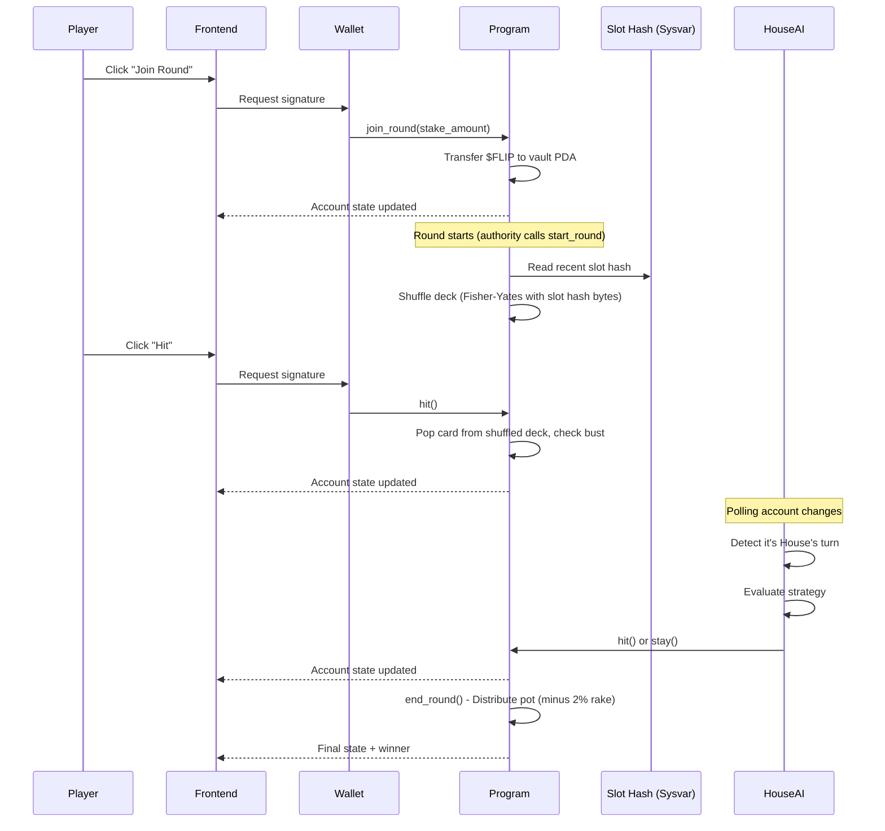

# PushFlip: Comprehensive Execution Plan

## Project Overview

- **Project Name**: PushFlip
- **One-Line Description**: A crypto-native push-your-luck card game on Solana with AI opponents, token-burning mechanics, and on-chain randomness (slot hash MVP, VRF upgrade path)
- **Problem Statement**: Traditional online card games lack transparency in randomness and don't leverage blockchain's unique capabilities for provable fairness and token economics
- **Target Users**: Crypto-native gamers, DeFi enthusiasts, and developers interested in on-chain gaming
- **Success Criteria**: 
  - Fully functional on-chain game with deterministic randomness (slot hash)
  - Working token economy with stake/burn mechanics
  - AI opponent ("The House") that plays autonomously
  - Clean, interactive frontend with wallet integration
  - Comprehensive documentation suitable for portfolio presentation

---

## Scope Definition

### MVP Features (Phase 1-2)
1. Core on-chain card game with hit/stay mechanics
2. On-chain deck shuffling using slot hash (MVP) with documented VRF upgrade path (Switchboard or Orao)
3. `$FLIP` token (SPL Token) with stake-to-play and burn-for-power mechanics
4. Basic bounty system
5. "The House" AI opponent
6. "Flip Advisor" probability assistant (frontend)
7. Vite + React frontend with Solana wallet adapter integration

### Phase 2+ Features (Post-MVP)
- AI Commentator/Narrator
- AI Agent Tournaments
- Dynamic Bounty Generator
- Personalized AI Coach
- ZK-proof deck verification

### Explicit Non-Goals
- Mobile native apps
- Multi-chain deployment
- Complex NFT integrations
- Real money gambling compliance
- Production-grade security audits (this is a portfolio piece)

---

## Technical Architecture

### System Architecture

```
┌─────────────────────────────────────────────────────────────────────┐
│                       FRONTEND (Vite + React)                       │
├─────────────────────────────────────────────────────────────────────┤
│  ┌──────────────┐  ┌──────────────┐  ┌──────────────────────────┐  │
│  │ Game UI      │  │ Wallet       │  │ Flip Advisor            │  │
│  │ Components   │  │ Connection   │  │ (Probability Calculator) │  │
│  └──────┬───────┘  └──────┬───────┘  └──────────────────────────┘  │
│         │                 │                                         │
│         └────────┬────────┘                                         │
│                  ▼                                                  │
│         ┌───────────────┐                                           │
│         │ @solana/web3  │                                           │
│         │ + Anchor TS   │                                           │
│         └───────┬───────┘                                           │
└─────────────────┼───────────────────────────────────────────────────┘
                  │
                  ▼
┌─────────────────────────────────────────────────────────────────────┐
│                      SOLANA BLOCKCHAIN (Devnet)                     │
├─────────────────────────────────────────────────────────────────────┤
│  ┌────────────────────┐  ┌────────────────────┐                     │
│  │ pushflip         │  │ SPL Token Program  │                     │
│  │ (Anchor Program)   │  │                    │                     │
│  │                    │  │ - $FLIP Token Mint │                     │
│  │ - GameSession PDA  │  │ - Token Accounts   │                     │
│  │ - PlayerState PDA  │  │                    │                     │
│  │ - initialize()     │  └────────────────────┘                     │
│  │ - join_round()     │                                             │
│  │ - hit()            │  ┌────────────────────┐                     │
│  │ - stay()           │  │ Slot Hash Sysvar   │                     │
│  │ - end_round()      │  │ (MVP Randomness)   │                     │
│  └─────────┬──────────┘  └────────────────────┘                     │
│            │                                                        │
│            ▼                                                        │
│  ┌────────────────────┐                                             │
│  │ BountyBoard PDA    │                                             │
│  └────────────────────┘                                             │
└─────────────────────────────────────────────────────────────────────┘
                  ▲
                  │
┌─────────────────┼───────────────────────────────────────────────────┐
│                 │        OFF-CHAIN SERVICES                         │
├─────────────────┼───────────────────────────────────────────────────┤
│         ┌───────┴───────┐                                           │
│         │ The House AI  │                                           │
│         │ Agent         │                                           │
│         │ (Node.js)     │                                           │
│         │               │                                           │
│         │ - Account     │                                           │
│         │   Subscriber  │                                           │
│         │ - Strategy    │                                           │
│         │   Engine      │                                           │
│         │ - TX Signer   │                                           │
│         └───────────────┘                                           │
└─────────────────────────────────────────────────────────────────────┘
```

### Data Flow



---

## Technology Stack

| Category | Technology | Rationale | Alternatives Considered |
|----------|------------|-----------|------------------------|
| **Blockchain** | Solana Devnet | High throughput, low fees, mature ecosystem | N/A (Solana-only project) |
| **Smart Contract Framework** | Anchor 0.29 | De facto standard for Solana, reduces boilerplate, better DX | Native Solana (more complex), Seahorse (Python, less mature) |
| **Language (On-chain)** | Rust 1.70+ | Required for Solana programs | N/A |
| **Randomness (MVP)** | Slot Hash (Sysvar) | Simple, no external dependency, sufficient for devnet portfolio piece | Switchboard VRF, Orao VRF (production upgrade path) |
| **Token Standard** | SPL Token | Native Solana token standard | Token-2022 (overkill for MVP) |
| **Frontend Framework** | Vite 5 + React 18 | Fast dev server, perfect for SPAs, lightweight, excellent DX | Next.js (unnecessary SSR/routing overhead for dApp) |
| **Styling** | Tailwind CSS + shadcn/ui | Rapid development, consistent design system | Chakra UI (heavier) |
| **Wallet Integration** | @solana/wallet-adapter-react | Official solution, supports Phantom/Solflare/etc | Custom (more work) |
| **State Management** | Zustand + React Query | Lightweight, good for async state | Redux (overkill) |
| **AI Agent Runtime** | Node.js 20 + TypeScript | Same language as frontend, good Solana SDK | Python (different ecosystem) |
| **Development** | Docker + Anchor CLI + pnpm | Reproducible builds, version control, fast package manager | Native install (version conflicts) |
| **Testing** | Anchor test + Bankrun | Fast local testing without validator | solana-test-validator (slower) |
| **Deployment (Frontend)** | Podman/Docker on Ubuntu 25.04 VPS (nginx) | Self-hosted, full control, no vendor lock-in | Vercel (faster setup, vendor lock-in) |
| **Deployment (AI Agent)** | Same VPS (Podman/Docker container) | Co-located with frontend, single server | Railway/Render (separate services) |

---

## Data Model

### Solana Account Structure (PDAs)

```
┌─────────────────────────────────────────────────────────────────┐
│                      GameSession (PDA)                          │
│              Seeds: ["game", game_id.to_le_bytes()]             │
├─────────────────────────────────────────────────────────────────┤
│ bump: u8                                                        │
│ game_id: u64                                                    │
│ authority: Pubkey           // Admin who initialized            │
│ house_address: Pubkey       // The House AI wallet              │
│ token_mint: Pubkey          // $FLIP token mint                 │
│ vault: Pubkey               // PDA holding staked tokens        │
│ deck: Vec<Card>             // Remaining cards (max 94)         │
│ deck_size: u8               // Current deck size                │
│ player_count: u8                                                │
│ turn_order: [Pubkey; 4]     // House AI at slot 0, up to 3 humans│
│ current_turn_index: u8                                          │
│ pot_amount: u64                                                 │
│ round_active: bool                                              │
│ round_number: u64                                               │
│ rollover_count: u8          // Consecutive all-bust rounds (cap 10)│
│ last_action_slot: u64       // For future timeout support (v2)  │
│ treasury_fee_bps: u16       // Rake in basis points (200 = 2%)  │
│ treasury: Pubkey            // Treasury token account            │
└─────────────────────────────────────────────────────────────────┘

┌─────────────────────────────────────────────────────────────────┐
│                      PlayerState (PDA)                          │
│         Seeds: ["player", game_id.to_le_bytes(), player_pubkey] │
├─────────────────────────────────────────────────────────────────┤
│ bump: u8                                                        │
│ player: Pubkey                                                  │
│ game_id: u64                                                    │
│ hand: Vec<Card>             // Current hand (max 10 cards)      │
│ hand_size: u8                                                   │
│ score: u64                                                      │
│ is_active: bool             // Still in the round               │
│ inactive_reason: u8         // 0=active, 1=bust, 2=stay         │
│ bust_card_value: u8         // Alpha value that caused bust (0=none)│
│ staked_amount: u64                                              │
│ has_used_second_chance: bool                                    │
│ total_wins: u64             // Lifetime stats                   │
│ total_games: u64                                                │
└─────────────────────────────────────────────────────────────────┘

┌─────────────────────────────────────────────────────────────────┐
│                         Card (Struct)                           │
├─────────────────────────────────────────────────────────────────┤
│ value: u8                   // 1-13 for Alpha cards             │
│ card_type: CardType         // Enum: Alpha, Protocol, Multiplier│
│ suit: u8                    // 0-3 for Alpha cards              │
└─────────────────────────────────────────────────────────────────┘

┌─────────────────────────────────────────────────────────────────┐
│                      CardType (Enum)                            │
├─────────────────────────────────────────────────────────────────┤
│ Alpha = 0        // Standard cards, bust on duplicate value     │
│ Protocol = 1     // Special actions: Rug Pull, Airdrop, etc     │
│ Multiplier = 2   // DeFi multipliers: 2x, 3x score              │
└─────────────────────────────────────────────────────────────────┘

┌─────────────────────────────────────────────────────────────────┐
│                      BountyBoard (PDA)                          │
│                    Seeds: ["bounties", game_id]                 │
├─────────────────────────────────────────────────────────────────┤
│ bump: u8                                                        │
│ game_id: u64                                                    │
│ bounties: Vec<Bounty>       // Active bounties (max 10)         │
└─────────────────────────────────────────────────────────────────┘

┌─────────────────────────────────────────────────────────────────┐
│                        Bounty (Struct)                          │
├─────────────────────────────────────────────────────────────────┤
│ id: u64                                                         │
│ description: String         // Max 64 chars                     │
│ bounty_type: BountyType     // Enum for condition checking      │
│ reward_amount: u64                                              │
│ is_active: bool                                                 │
│ claimed_by: Option<Pubkey>                                      │
└─────────────────────────────────────────────────────────────────┘

┌─────────────────────────────────────────────────────────────────┐
│                      TokenVault (PDA)                           │
│                Seeds: ["vault", game_session_pubkey]            │
├─────────────────────────────────────────────────────────────────┤
│ (SPL Token Account owned by program)                            │
│ Holds all staked $FLIP tokens for active rounds                 │
└─────────────────────────────────────────────────────────────────┘
```

### Account Size Calculations

```rust
// GameSession (all fields including Anchor discriminator):
// 8 (discriminator) + 1 (bump) + 8 (game_id) + 32 (authority) + 32 (house_address)
// + 32 (token_mint) + 32 (vault) + 4 (Vec len) + (94 * 3) (deck) + 1 (deck_size)
// + 1 (player_count) + (4 * 32) (turn_order) + 1 (current_turn_index)
// + 8 (pot_amount) + 1 (round_active) + 8 (round_number) + 1 (rollover_count)
// + 8 (last_action_slot) + 2 (treasury_fee_bps) + 32 (treasury)
// = 657 bytes (allocate 1024 for safety)

// PlayerState (all fields including Anchor discriminator):
// 8 (discriminator) + 1 (bump) + 32 (player) + 8 (game_id)
// + 4 (Vec len) + (10 * 3) (hand) + 1 (hand_size) + 8 (score)
// + 1 (is_active) + 1 (inactive_reason) + 1 (bust_card_value)
// + 8 (staked_amount) + 1 (has_used_second_chance)
// + 8 (total_wins) + 8 (total_games)
// = 123 bytes (allocate 256 for safety)

// BountyBoard: 8 + 1 + 8 + (10 * 100)
// = ~1020 bytes (allocate 1500 for safety)
```

---

## Project Structure

```
pushflip/
├── programs/
│   └── pushflip/
│       ├── Cargo.toml
│       └── src/
│           ├── lib.rs                 # Program entrypoint
│           ├── instructions/
│           │   ├── mod.rs
│           │   ├── initialize.rs      # Initialize game session
│           │   ├── join_round.rs      # Player joins with stake
│           │   ├── start_round.rs     # Shuffle deck, begin play
│           │   ├── hit.rs             # Draw a card
│           │   ├── stay.rs            # End turn, lock score
│           │   ├── end_round.rs       # Distribute winnings
│           │   ├── burn_second_chance.rs
│           │   ├── burn_scry.rs
│           │   ├── claim_bounty.rs
│           │   ├── leave_game.rs       # Player leaves (refund or forfeit)
│           │   └── close_game.rs       # Authority closes game, reclaims rent
│           ├── state/
│           │   ├── mod.rs
│           │   ├── game_session.rs
│           │   ├── player_state.rs
│           │   ├── card.rs
│           │   └── bounty.rs
│           ├── errors.rs              # Custom error codes
│           ├── events.rs              # Event definitions
│           └── utils/
│               ├── mod.rs
│               ├── deck.rs            # Deck creation & shuffle logic
│               └── scoring.rs         # Score calculation
│
├── app/                               # Vite + React frontend
│   ├── package.json
│   ├── vite.config.ts
│   ├── tailwind.config.js
│   ├── tsconfig.json
│   ├── index.html                    # Entry point
│   ├── src/
│   │   ├── main.tsx                  # App entry point
│   │   ├── App.tsx                   # Root component
│   │   ├── providers/
│   │   │   ├── WalletProvider.tsx
│   │   │   └── QueryProvider.tsx
│   │   ├── components/
│   │   │   ├── ui/                   # shadcn components
│   │   │   ├── game/
│   │   │   │   ├── GameBoard.tsx
│   │   │   │   ├── PlayerHand.tsx
│   │   │   │   ├── Card.tsx
│   │   │   │   ├── ActionButtons.tsx
│   │   │   │   ├── PotDisplay.tsx
│   │   │   │   └── TurnIndicator.tsx
│   │   │   ├── wallet/
│   │   │   │   └── WalletButton.tsx
│   │   │   └── advisor/
│   │   │       └── FlipAdvisor.tsx  # AI probability helper
│   │   ├── hooks/
│   │   │   ├── useGameSession.ts
│   │   │   ├── usePlayerState.ts
│   │   │   ├── useGameActions.ts
│   │   │   └── useFlipAdvisor.ts
│   │   ├── lib/
│   │   │   ├── program.ts            # Anchor program setup
│   │   │   ├── constants.ts
│   │   │   └── utils.ts
│   │   ├── types/
│   │   │   └── index.ts              # TypeScript types
│   │   ├── stores/
│   │   │   └── gameStore.ts          # Zustand store
│   │   └── styles/
│   │       └── globals.css
│   └── public/
│       └── cards/                    # Card images
│
├── house-ai/                         # AI opponent service
│   ├── package.json
│   ├── tsconfig.json
│   └── src/
│       ├── index.ts                  # Entry point
│       ├── agent.ts                  # Main AI agent class
│       ├── strategy.ts               # Hit/stay decision logic
│       ├── accountSubscriber.ts      # Watch for game state changes
│       └── config.ts
│
├── tests/
│   ├── pushflip.ts                 # Anchor integration tests
│   └── utils.ts                      # Test helpers
│
├── scripts/
│   ├── create-token.ts               # Create $FLIP mint
│   ├── airdrop-tokens.ts             # Distribute test tokens
│   └── initialize-game.ts            # Set up initial game state
│
├── Anchor.toml
├── Cargo.toml
├── package.json                      # Root workspace
├── pnpm-workspace.yaml
└── README.md
```

---

## Implementation Phases

### Phase 1: Foundation & Core Game Engine (Days 1-5)

**Goal:** Get a playable on-chain card game working without tokens or special abilities.

**Prerequisites:** Development environment set up

#### Task 1.1: Environment Setup (2-3 hours)

**Deliverable:** Working Anchor development environment

```bash
# Commands to run
rustup default stable
rustup update
sh -c "$(curl -sSfL https://release.solana.com/v1.18.0/install)"
cargo install --git https://github.com/coral-xyz/anchor avm --locked
avm install latest
avm use latest
solana-keygen new
solana config set --url devnet
solana airdrop 5
```

**Claude Code Prompt:**
```
Create a new Anchor project called "pushflip" with the following:
1. Initialize the Anchor workspace with `anchor init pushflip`
2. Set up the Cargo.toml with necessary dependencies (anchor-lang, anchor-spl)
3. Configure Anchor.toml for devnet deployment
4. Create the basic folder structure for instructions/, state/, and utils/ modules
5. Add a root package.json with pnpm workspace configuration for the monorepo
```

**Validation:**
- [ ] `anchor build` completes without errors
- [ ] `solana config get` shows devnet
- [ ] Wallet has SOL balance

---

#### Task 1.2: Define State Structures (3-4 hours)

**Deliverable:** All account structures and types defined in Rust

**Claude Code Prompt:**
```
In the pushflip Anchor program, create the state module with the following:

1. `state/card.rs`:
   - Card struct with value (u8), card_type (enum), suit (u8)
   - CardType enum: Alpha, Protocol, Multiplier
   - ProtocolEffect enum: RugPull, Airdrop, VampireAttack
   - Implement Display trait for debugging

2. `state/game_session.rs`:
   - GameSession account struct as a PDA
   - Fields: bump, game_id, authority, house_address, token_mint, vault,
     deck (Vec<Card> max 94), deck_size, player_count,
     turn_order ([Pubkey; 4]) (House AI at slot 0, up to 3 humans),
     current_turn_index, pot_amount, round_active, round_number,
     rollover_count (u8, tracks consecutive all-bust rounds, cap 10),
     last_action_slot (u64, for future timeout support),
     treasury_fee_bps (u16, rake in basis points, 200 = 2%), treasury (Pubkey)
   - Seeds: ["game", game_id.to_le_bytes()]
   - Space calculation constant (657 bytes, allocate 1024)
   - Implement methods: is_player_turn(), get_current_player(), advance_turn()

3. `state/player_state.rs`:
   - PlayerState account struct as a PDA
   - Fields: bump, player, game_id, hand (Vec<Card> max 10), hand_size, score,
     is_active, inactive_reason (u8: 0=active, 1=bust, 2=stay),
     bust_card_value (u8, Alpha value that caused bust, 0=none),
     staked_amount, has_used_second_chance, total_wins, total_games
   - Seeds: ["player", game_id.to_le_bytes(), player.key()]
   - Space calculation constant (123 bytes, allocate 256)
   - Implement methods: add_card(), calculate_score(), check_bust()

4. `state/mod.rs` to export all state types

Use Anchor's account macro with proper space allocation. Include detailed comments explaining each field.
```

**Validation:**
- [ ] `anchor build` succeeds
- [ ] All structs have correct space calculations
- [ ] PDA seeds are properly defined

---

#### Task 1.3: Implement Deck Utilities (2-3 hours)

**Deliverable:** Deck creation and shuffle logic

**Claude Code Prompt:**
```
Create `utils/deck.rs` for the pushflip program with:

1. `create_standard_deck()` function that returns Vec<Card> with 94 cards:
   - 52 Alpha cards (4 suits × 13 values, standard deck)
   - 30 Protocol cards (10 each of RugPull, Airdrop, VampireAttack)
   - 12 Multiplier cards (6 × 2x multiplier, 6 × 3x multiplier)

2. `shuffle_deck(deck: &mut Vec<Card>, randomness: &[u8; 32])` function:
   - Implement Fisher-Yates shuffle using the randomness bytes
   - Each byte pair determines swap positions
   - Must be deterministic given same randomness input

3. `draw_card(deck: &mut Vec<Card>) -> Option<Card>` function:
   - Pop and return the last card from the deck
   - Return None if deck is empty

4. Helper function to convert randomness bytes to indices within deck bounds

Include unit tests using #[cfg(test)] module to verify:
- Deck has exactly 94 cards
- Shuffle produces different orderings with different seeds
- Same seed produces same shuffle (deterministic)
```

**Validation:**
- [ ] Unit tests pass with `cargo test`
- [ ] Deck contains correct card distribution
- [ ] Shuffle is deterministic

---

#### Task 1.4: Implement Scoring Logic (2 hours)

**Deliverable:** Score calculation utilities

**Claude Code Prompt:**
```
Create `utils/scoring.rs` for the pushflip program with:

1. `calculate_hand_score(hand: &[Card]) -> u64` function:
   - Sum all Alpha card values
   - Apply multiplier cards (2x or 3x to total)
   - Protocol cards don't add to score directly
   - Return final score

2. `check_bust(hand: &[Card]) -> bool` function:
   - Return true if hand contains two Alpha cards with the same value
   - Ignore suit, only check value
   - Protocol and Multiplier cards cannot cause bust

3. `check_pushflip(hand: &[Card]) -> bool` function:
   - Return true if player has exactly 7 cards without busting
   - This is the "PushFlip" bonus condition

4. `get_bust_probability(hand: &[Card], remaining_deck: &[Card]) -> f64` function:
   - Calculate probability of busting on next draw
   - Count how many cards in remaining deck would cause bust
   - Return as decimal (0.0 to 1.0)

Include comprehensive unit tests for edge cases.
```

**Validation:**
- [ ] Score calculation matches game rules
- [ ] Bust detection works correctly
- [ ] Probability calculation is accurate

---

#### Task 1.5: Initialize Instruction (3-4 hours)

**Deliverable:** Game initialization instruction

**Claude Code Prompt:**
```
Create `instructions/initialize.rs` for the pushflip program:

1. Define `Initialize` accounts struct with:
   - game_session: Account to be created (PDA)
   - authority: Signer who pays and becomes admin
   - house: The House AI's public key (not signer, just stored)
   - treasury: Treasury token account for rake collection
   - system_program: For account creation

2. Define `InitializeParams` struct:
   - game_id: u64

3. Implement `handler(ctx: Context<Initialize>, params: InitializeParams)`:
   - Initialize GameSession with default values
   - Set authority and house_address
   - **Place House AI in turn_order[0], set player_count = 1**
   - Set round_active to false
   - Set rollover_count to 0
   - Set treasury_fee_bps to 200 (2%)
   - Set treasury address
   - Create empty deck (will be populated on round start)
   - Emit GameInitialized event

4. Add validation:
   - game_id must be > 0
   - Cannot reinitialize existing game

5. In `events.rs`, define GameInitialized event with game_id and authority fields

Note: House AI is automatically placed at slot 0 during initialization.
The House AI agent (off-chain) will call join_round separately to stake tokens.
House uses a fixed stake of HOUSE_STAKE_AMOUNT (defined in constants, e.g., 500 $FLIP).
House stake is funded from a dedicated House wallet, NOT from treasury.

Wire this up in lib.rs with the #[program] macro.
```

**Validation:**
- [ ] Can initialize a new game session
- [ ] PDA is created at correct address
- [ ] Cannot initialize twice with same game_id

---

#### Task 1.6: Join Round Instruction (3-4 hours)

**Deliverable:** Player joining functionality (without tokens for now)

**Claude Code Prompt:**
```
Create `instructions/join_round.rs` for the pushflip program:

1. Define `JoinRound` accounts struct with:
   - game_session: Mutable GameSession PDA
   - player_state: Account to be created (PlayerState PDA)
   - player: Signer joining the game
   - system_program

2. Implement `handler(ctx: Context<JoinRound>)`:
   - Verify round is not currently active (joining phase)
   - Verify player_count < 4 (House at slot 0, up to 3 humans at slots 1-3)
   - Verify player pubkey is not already in turn_order (prevent double-join)
   - Initialize PlayerState with default values (inactive_reason = 0, bust_card_value = 0)
   - Add player to turn_order[player_count]
   - Increment player_count
   - Emit PlayerJoined event

3. Add validation:
   - Player cannot join twice (check turn_order array for duplicate pubkey)
   - Game must exist
   - Round must not be active
   - Player is not the House address (House joins via separate flow at init)

4. Define PlayerJoined event with game_id and player fields

For now, skip token staking - we'll add that in Phase 2.
```

**Validation:**
- [ ] Player can join a game
- [ ] PlayerState PDA is created
- [ ] Cannot join twice or exceed max players

---

#### Task 1.7: Start Round Instruction (4-5 hours)

**Deliverable:** Round initialization with deck shuffle

**Claude Code Prompt:**
```
Create `instructions/start_round.rs` for the pushflip program:

For MVP, we'll use a simplified randomness approach (slot hash) and note that 
production would use Switchboard VRF.

1. Define `StartRound` accounts struct with:
   - game_session: Mutable GameSession PDA
   - authority: Signer (must be game authority)
   - slot_hashes: Sysvar for pseudo-randomness (temporary solution)
   - All player_state accounts via remaining_accounts

2. **Validate remaining_accounts** (same pattern as end_round):
   - Verify each is a valid PlayerState PDA owned by the program
   - Verify PDA seeds match game_id and player pubkey
   - Verify pubkey is in turn_order
   - Verify count == player_count

3. Implement `handler(ctx: Context<StartRound>)`:
   - Verify at least 2 players have joined (House + 1 human minimum)
   - Verify round is not already active
   - **Assert vault.amount == game_session.pot_amount** (pot/vault reconciliation)
   - Create the 94-card deck using create_standard_deck()
   - Get randomness from recent slot hash (document this is not production-safe)
   - Shuffle deck using the randomness
   - Set round_active = true
   - Set current_turn_index = 0
   - Increment round_number
   - Reset all PlayerState via remaining_accounts:
     - is_active = true, inactive_reason = 0, bust_card_value = 0
     - Clear hand, hand_size = 0, score = 0
     - has_used_second_chance = false
   - Emit RoundStarted event

4. Add TODO comment explaining Switchboard/Orao VRF integration for production

4. Define RoundStarted event with game_id, round_number, and player_count
```

**Validation:**
- [ ] Round starts with shuffled deck
- [ ] All players are set to active
- [ ] Turn order is established

---

#### Task 1.8: Hit Instruction (5-6 hours)

**Deliverable:** Core card drawing mechanic

**Claude Code Prompt:**
```
Create `instructions/hit.rs` for the pushflip program:

1. Define `Hit` accounts struct with:
   - game_session: Mutable GameSession PDA
   - player_state: Mutable PlayerState PDA
   - player: Signer taking the action

2. Implement `handler(ctx: Context<Hit>)`:
   - Verify round is active
   - Verify it's this player's turn (current_turn_index matches)
   - Verify player is_active
   - Draw card from deck using draw_card()
   - Add card to player's hand
   - Check for bust condition
   - If busted:
     - Set player.is_active = false, inactive_reason = 1 (bust)
     - Set player.bust_card_value = duplicate Alpha value
     - Emit PlayerBusted event
     - Call advance_turn() helper
   - If not busted:
     - Check for PushFlip (7 cards)
     - Emit CardDrawn event
     - Do NOT advance turn (player can hit again or stay)
   - If deck is empty, trigger end_round logic

3. Helper function `advance_turn(game_session)`:
   - Find next active player in turn_order
   - Update current_turn_index
   - If no active players remain, set flag for round end

4. Define events: CardDrawn, PlayerBusted

5. Add comprehensive error handling with custom errors
```

**Validation:**
- [ ] Can draw cards on your turn
- [ ] Bust detection works
- [ ] Turn doesn't advance until stay (or bust)
- [ ] Cannot act when not your turn

---

#### Task 1.9: Stay Instruction (3-4 hours)

**Deliverable:** Player ending their turn

**Claude Code Prompt:**
```
Create `instructions/stay.rs` for the pushflip program:

1. Define `Stay` accounts struct with:
   - game_session: Mutable GameSession PDA
   - player_state: Mutable PlayerState PDA
   - player: Signer taking the action

2. Implement `handler(ctx: Context<Stay>)`:
   - Verify round is active
   - Verify it's this player's turn
   - Verify player is_active
   - Calculate and store final score using calculate_hand_score()
   - Set player.is_active = false, inactive_reason = 2 (stay)
   - Emit PlayerStayed event with final score
   - Call advance_turn()
   - Check if all players are now inactive
   - If so, emit RoundReadyToEnd event (actual distribution in end_round)

3. Define PlayerStayed event with player, score, and hand_size fields
4. Define RoundReadyToEnd event
```

**Validation:**
- [ ] Score is calculated correctly
- [ ] Turn advances to next player
- [ ] Round end is triggered when all players done

---

#### Task 1.10: End Round Instruction (4-5 hours)

**Deliverable:** Winner determination and round cleanup

**Claude Code Prompt:**
```
Create `instructions/end_round.rs` for the pushflip program:

1. Define `EndRound` accounts struct with:
   - game_session: Mutable GameSession PDA
   - All player_state accounts (use remaining_accounts)
   - caller: Signer (anyone can call when round is ready to end)

2. **Remaining accounts validation** (CRITICAL — apply to every instruction using remaining_accounts):
   - For each account in remaining_accounts:
     a. Verify account owner == program ID
     b. Deserialize as PlayerState
     c. Verify PDA seeds match: ["player", game_session.game_id, player_state.player]
     d. Verify player_state.player is present in game_session.turn_order
   - Verify count of remaining_accounts == game_session.player_count

3. Implement `handler(ctx: Context<EndRound>)`:
   - **Set round_active = false FIRST** (idempotency guard — second call fails immediately)
   - Verify all players are inactive (everyone has stayed or busted)
   - Iterate through validated PlayerState accounts
   - Find the player with highest score (where inactive_reason == 2/stay, not 1/bust)
   - Handle ties: first in turn order wins (deterministic, no fractional math)
   - For now, just emit the winner (token distribution in Phase 2)
   - Update last_action_slot
   - Emit RoundEnded event with winner and scores

4. Define RoundEnded event with:
   - game_id
   - round_number
   - winner: Pubkey
   - winning_score: u64
   - all_scores: Vec<(Pubkey, u64)>

5. Handle edge case: everyone busted (all inactive_reason == 1):
   - Increment rollover_count
   - Pot stays in vault, rolls over to next round
   - Do NOT deduct rake on rollover (rake only on winner payout)
   - Emit AllBustedRollover event

6. At rollover_count == 10 (cap reached):
   - Return stakes proportionally: each player gets (player.staked_amount / total_staked) * pot_amount
   - Handle integer rounding: give remainder to last player processed
   - Reset pot_amount = 0, rollover_count = 0
   - Emit RolloverCapReached event
```

**Validation:**
- [ ] Winner is correctly determined
- [ ] Ties are handled
- [ ] Round state is properly reset
- [ ] Rollover increments correctly on all-bust
- [ ] Rollover cap returns stakes proportionally

---

#### Task 1.10b: Game Lifecycle Instructions (2-3 hours)

**Deliverable:** Instructions for leaving and closing games

**Claude Code Prompt:**
```
Create game lifecycle instructions:

1. `instructions/close_game.rs`:
   - Define CloseGame accounts:
     - game_session: Mutable GameSession PDA
     - authority: Signer (must be game authority)
     - All player_state accounts via remaining_accounts
   - Validate remaining_accounts (same pattern as end_round)
   - Verify round_active == false (cannot close during active round)
   - Verify pot_amount == 0 (all tokens distributed)
   - Close all PlayerState PDAs, return rent to respective players
   - Close GameSession PDA, return rent to authority
   - Emit GameClosed event

2. `instructions/leave_game.rs`:
   - Define LeaveGame accounts:
     - game_session: Mutable GameSession PDA
     - player_state: Mutable PlayerState PDA
     - player: Signer (must be the player leaving)
     - vault: Vault PDA (for stake refund if round not active)
     - player_token_account: Player's ATA
     - token_program
   - If round NOT active:
     - Refund player's staked_amount from vault
     - Decrement pot_amount
     - Remove player from turn_order, decrement player_count
     - Close PlayerState PDA, return rent to player
   - If round IS active:
     - Set player.is_active = false, inactive_reason = 2 (treated as stay with score 0)
     - Player forfeits stake (stays in pot)
     - Advance turn if it was this player's turn
     - PlayerState PDA stays open until round ends
   - Emit PlayerLeft event

3. Rent responsibility (documented invariant):
   - Player pays rent for their own PlayerState PDA (on join_round)
   - Authority pays rent for GameSession PDA (on initialize)
   - Rent is reclaimed when PDAs are closed via close_game or leave_game
```

**Validation:**
- [ ] Can close game when round inactive and pot empty
- [ ] Can leave game between rounds (refund)
- [ ] Can leave mid-round (forfeit)
- [ ] Rent is properly reclaimed

---

#### Task 1.11: Integration Tests (4-6 hours)

**Deliverable:** Comprehensive test suite for Phase 1

**Claude Code Prompt:**
```
Create `tests/pushflip.ts` with Anchor integration tests:

1. Setup:
   - Create test wallets for authority, house, and 3 players
   - Airdrop SOL to all wallets
   - Helper functions to derive PDAs

2. Test: "Initializes game session"
   - Call initialize with game_id = 1
   - Verify GameSession account exists with correct values
   - Verify authority is set correctly

3. Test: "Players can join round"
   - Have 3 players join the game
   - Verify each PlayerState PDA is created
   - Verify player_count = 3

4. Test: "Cannot join twice"
   - Try to join with same player
   - Expect error

5. Test: "Round starts correctly"
   - Call start_round
   - Verify deck has 94 cards
   - Verify round_active = true
   - Verify all players are active

6. Test: "Player can hit and draw card"
   - First player calls hit
   - Verify card is added to hand
   - Verify deck size decreased

7. Test: "Cannot hit when not your turn"
   - Second player tries to hit
   - Expect error

8. Test: "Player can stay"
   - First player calls stay
   - Verify score is calculated
   - Verify turn advances to player 2

9. Test: "Full game flow"
   - Play through a complete round
   - All players hit a few times then stay
   - Call end_round
   - Verify winner is determined

10. Test: "Bust condition works"
    - Set up scenario where player will bust
    - Verify player is marked inactive
    - Verify turn advances

Include helper functions for common operations.
```

**Validation:**
- [ ] All tests pass with `anchor test`
- [ ] Edge cases are covered
- [ ] Game flow works end-to-end

---

### Phase 2: Token Economy & Special Abilities (Days 6-10)

**Goal:** Integrate $FLIP token with stake/burn mechanics and Protocol card effects.

#### Task 2.1: Create SPL Token (2-3 hours)

**Deliverable:** $FLIP token mint and distribution script

**Claude Code Prompt:**
```
Create `scripts/create-token.ts` using @solana/spl-token:

1. Create a new SPL token mint for $FLIP:
   - 9 decimals (standard)
   - Mint authority = game program PDA (for minting rewards)
   - Freeze authority = null (no freezing)

2. Create `scripts/airdrop-tokens.ts`:
   - Mint initial supply to a treasury wallet
   - Function to airdrop tokens to test wallets
   - Create associated token accounts as needed

3. Update the program to store the token_mint pubkey in GameSession

4. Create constants file with:
   - FLIP_DECIMALS = 9
   - INITIAL_SUPPLY = 1_000_000_000 (1 billion)
   - MIN_STAKE = 100 (minimum $FLIP to join)
   - HOUSE_STAKE_AMOUNT = 500 (fixed House AI stake per round)
   - SECOND_CHANCE_COST = 50
   - SCRY_COST = 25
   - AIRDROP_BONUS = 25 (transferred from treasury, not minted)
   - TREASURY_FEE_BPS = 200 (2% rake)

Document the token address after creation for frontend use.
```

**Validation:**
- [ ] Token mint is created on devnet
- [ ] Can mint and transfer tokens
- [ ] Token accounts work correctly

---

#### Task 2.2: Update Join Round with Staking (3-4 hours)

**Deliverable:** Token staking on round join

**Claude Code Prompt:**
```
Update `instructions/join_round.rs` to include token staking:

1. Add to JoinRound accounts:
   - token_mint: The $FLIP mint
   - player_token_account: Player's ATA for $FLIP
   - vault: PDA token account to hold staked tokens
   - token_program: SPL Token program

2. Add JoinRoundParams:
   - stake_amount: u64

3. Update handler:
   - Verify stake_amount >= MIN_STAKE (100 $FLIP, defined as constant)
   - Verify player has sufficient $FLIP balance
   - Transfer stake_amount from player to vault PDA
   - Store staked_amount in PlayerState
   - Add to pot_amount in GameSession
   - **Invariant check**: assert vault.amount == pot_amount after update
   - Emit updated PlayerJoined event with stake_amount

   Note: House AI calls join_round with HOUSE_STAKE_AMOUNT (500 $FLIP)
   from its dedicated wallet. House stake is NOT from treasury.

4. Create vault PDA with seeds: ["vault", game_session.key()]

5. Add instruction to create vault if it doesn't exist (or do in initialize)

Update tests to include token operations.
```

**Validation:**
- [ ] Tokens are transferred to vault on join
- [ ] Pot amount is tracked correctly
- [ ] Cannot join without sufficient balance

---

#### Task 2.3: Update End Round with Prize Distribution (3-4 hours)

**Deliverable:** Winner receives pot

**Claude Code Prompt:**
```
Update `instructions/end_round.rs` for token distribution:

1. Add to EndRound accounts:
   - vault: Vault PDA token account
   - winner_token_account: Winner's ATA
   - treasury_token_account: Treasury ATA for rake
   - token_program
   - All player_token_accounts for rollover cap refunds (remaining_accounts)

2. Update handler — three paths:

   **Path A: Winner exists** (at least one player has inactive_reason == 2/stay)
   - Determine winner (highest score, ties: first in turn_order)
   - Calculate rake: rake_amount = pot_amount * treasury_fee_bps / 10_000
     - If rake_amount == 0 (small pot), winner gets full pot, no rake
   - Transfer rake_amount from vault to treasury
   - Transfer (pot_amount - rake_amount) from vault to winner
   - Use PDA signing for vault transfers
   - Reset pot_amount = 0, rollover_count = 0
   - **Invariant check**: assert vault.amount == 0
   - Emit RoundEnded with prize_amount and treasury_fee

   **Path B: Everyone busted, rollover_count < 10**
   - Do NOT deduct rake (rake only applies when there's a winner)
   - Increment rollover_count
   - pot_amount stays as-is in vault (no transfers)
   - Emit AllBustedRollover event with rollover_count

   **Path C: Everyone busted, rollover_count == 10 (cap)**
   - Return stakes proportionally to all current players:
     each player gets: (player.staked_amount * pot_amount) / total_staked_this_round
   - Handle integer rounding: give remainder to last player
   - Reset pot_amount = 0, rollover_count = 0
   - **Invariant check**: assert vault.amount == 0
   - Emit RolloverCapReached event

3. Add helper for PDA-signed transfers

4. Treasury rake: hardcoded 2% (200 bps) deducted ONLY on winner payout (Path A)

Update tests for all three paths.
```

**Validation:**
- [ ] Winner receives pot minus 2% treasury rake
- [ ] Vault is emptied after round
- [ ] Edge cases handled (no winner)

---

#### Task 2.4: Burn for Second Chance (3-4 hours)

**Deliverable:** Burn tokens to recover from bust

**Claude Code Prompt:**
```
Create `instructions/burn_second_chance.rs`:

1. Define BurnSecondChance accounts:
   - game_session: GameSession PDA
   - player_state: Mutable PlayerState PDA
   - player: Signer
   - player_token_account: Player's $FLIP ATA
   - token_mint: For burn
   - token_program

2. Implement handler:
   - Verify player.inactive_reason == 1 (bust), NOT 2 (stay) — only busted players can recover
   - Verify player hasn't used second chance this round (has_used_second_chance == false)
   - Verify player has enough $FLIP for SECOND_CHANCE_COST
   - Burn the tokens (not transfer - actual burn)
   - Remove the card matching bust_card_value from hand
   - Set is_active = true, inactive_reason = 0, bust_card_value = 0
   - Set has_used_second_chance = true
   - Emit SecondChanceUsed event

3. Define SecondChanceUsed event
```

**Validation:**
- [ ] Can recover from bust by burning tokens
- [ ] Cannot use twice in same round
- [ ] Tokens are actually burned (supply decreases)

---

#### Task 2.5: Burn for Scry (3-4 hours)

**Deliverable:** Peek at next card ability

**Claude Code Prompt:**
```
Create `instructions/burn_scry.rs`:

1. Define BurnScry accounts:
   - game_session: GameSession PDA (read-only for deck peek)
   - player_state: PlayerState PDA
   - player: Signer
   - player_token_account: Player's $FLIP ATA
   - token_mint
   - token_program

2. Implement handler:
   - Verify it's player's turn
   - Verify player is active
   - Burn SCRY_COST tokens
   - Get the top card of the deck (peek, don't remove)
   - Emit ScryResult event with the card info
   - The card stays on top - player still needs to hit to get it

3. Define ScryResult event:
   - player: Pubkey
   - card: Card (the peeked card)
   - This event is public but only the player who scried cares

4. Frontend will listen for this event and display the card to the player
   WARNING: ScryResult events are PUBLIC in Solana transaction logs.
   All observers (including opponents) can see the peeked card.
   This is an accepted MVP limitation — do not imply privacy in the UI.

Note: On-chain events are public — opponents can see ScryResult events.
Accepted for MVP. Document this limitation in README. Production would
use encrypted delivery or off-chain messaging.
```

**Validation:**
- [ ] Can peek at top card
- [ ] Tokens are burned
- [ ] Card remains on deck until hit

---

#### Task 2.6: Protocol Card Effects (5-6 hours)

**Deliverable:** Special card abilities

**Claude Code Prompt:**
```
Update `instructions/hit.rs` to handle Protocol card effects:

1. After drawing a card, check if it's a Protocol card

2. **Validate remaining_accounts for Protocol card targets** (same pattern as end_round):
   - Verify each target account is a valid PlayerState PDA owned by the program
   - Verify target PDA seeds match game_id and player pubkey
   - Verify target is in turn_order and is_active
   - Verify target is not the acting player themselves

3. Implement RugPull effect:
   - Target the player with the highest current score (among active players)
   - Force them to discard their highest value Alpha card
   - Pass target_player_state in remaining_accounts (validated per step 2)
   - If no valid target (no active players with Alpha cards): effect skipped, no error
   - Emit RugPullExecuted event

4. Implement Airdrop effect:
   - Drawing player receives bonus tokens **transferred from treasury** (NOT minted)
   - Transfer AIRDROP_BONUS (25 $FLIP) from treasury token account to player
   - **If treasury balance < AIRDROP_BONUS: skip effect, emit AirdropSkipped event**
   - This prevents unbounded token inflation — total supply is fixed at initial mint
   - Emit AirdropReceived event

5. Implement VampireAttack effect:
   - Steal a random card from another player's hand
   - Use current slot for pseudo-randomness to pick target and card
     (Note: slot-based randomness is predictable — documented MVP limitation)
   - Pass target_player_state in remaining_accounts (validated per step 2)
   - Add stolen card to attacker's hand
   - Remove from victim's hand
   - If no valid target (no active players with cards): effect skipped, no error
   - Emit VampireAttackExecuted event

6. Implement Multiplier cards:
   - These don't have immediate effects
   - They're applied during score calculation
   - Update calculate_hand_score to apply multipliers

7. Add all necessary events (including AirdropSkipped for treasury exhaustion)

8. Handle edge cases (all skip gracefully, never error):
   - No valid target for RugPull → skip
   - Treasury insufficient for Airdrop → skip, emit AirdropSkipped
   - Target has no cards for Vampire → skip
```

**Validation:**
- [ ] Each Protocol effect works correctly
- [ ] Multipliers affect final score
- [ ] Edge cases don't crash

---

#### Task 2.7: Basic Bounty System (4-5 hours)

**Deliverable:** Achievement-based rewards

**Claude Code Prompt:**
```
Create bounty system:

1. `state/bounty.rs`:
   - Bounty struct with id, description, bounty_type, reward, is_active, claimed_by
   - BountyType enum: SevenCardWin, HighScore(u64), WinStreak(u8), etc.
   - BountyBoard account struct (PDA)

2. `instructions/create_bounty.rs`:
   - Only authority can create bounties
   - **Verify treasury balance >= sum of all active bounty rewards + new bounty reward**
   - Fund bounty from treasury (tokens reserved, not transferred yet)
   - Add to BountyBoard
   - Reject if treasury has insufficient funds to cover all active bounties

3. `instructions/claim_bounty.rs`:
   - Verify player meets bounty condition
   - Transfer reward to player
   - Mark bounty as claimed

4. Update `end_round.rs`:
   - After determining winner, check all active bounties
   - Auto-claim any bounties the winner qualifies for
   - Emit BountyClaimed events

5. Bounty conditions to implement:
   - SevenCardWin: Win with exactly 7 cards (PushFlip)
   - HighScore: Win with score > threshold
   - Survivor: Win when all others busted
   - Comeback: Win after using Second Chance

6. Define events: BountyCreated, BountyClaimed
```

**Validation:**
- [ ] Bounties can be created
- [ ] Auto-claimed on qualifying win
- [ ] Rewards distributed correctly

---

#### Task 2.8: Phase 2 Integration Tests (4-5 hours)

**Deliverable:** Tests for all token and ability features

**Claude Code Prompt:**
```
Extend `tests/pushflip.ts` with Phase 2 tests:

1. Setup: Create token mint, fund test wallets with $FLIP

2. Test: "Join round with stake"
   - Player stakes 100 $FLIP
   - Verify tokens in vault
   - Verify pot amount

3. Test: "Winner receives pot"
   - Complete round with 3 players
   - Winner gets all staked tokens

4. Test: "Burn for second chance"
   - Player busts
   - Burns tokens to recover
   - Can continue playing

5. Test: "Cannot use second chance twice"
   - Use second chance
   - Bust again
   - Cannot use again

6. Test: "Scry reveals top card"
   - Burn for scry
   - Verify event contains correct card
   - Hit and verify same card received

7. Test: "Protocol cards execute effects"
   - Test each Protocol card type
   - Verify effects apply correctly

8. Test: "Multipliers affect score"
   - Hand with 2x multiplier
   - Verify score is doubled

9. Test: "Bounty auto-claim"
   - Create SevenCardWin bounty
   - Win with 7 cards
   - Verify bounty claimed and reward received
```

**Validation:**
- [ ] All Phase 2 tests pass
- [ ] Token flows are correct
- [ ] Special abilities work

---

### Phase 3: Frontend Development (Days 11-16)

**Goal:** Build interactive Vite + React frontend with wallet integration.

#### Task 3.1: Vite + React Project Setup (2-3 hours)

**Deliverable:** Configured Vite + React app with dependencies

**Claude Code Prompt:**
```
Set up the Vite + React frontend in the `app/` directory:

1. Initialize Vite project with React + TypeScript:
   - Use: pnpm create vite app --template react-ts
   - Configure Tailwind CSS
   - Set up ESLint

2. Install dependencies:
   - @solana/web3.js
   - @solana/wallet-adapter-react
   - @solana/wallet-adapter-react-ui
   - @solana/wallet-adapter-wallets (phantom, solflare)
   - @coral-xyz/anchor
   - @tanstack/react-query
   - zustand
   - Install shadcn/ui and add: button, card, dialog, toast

3. Create `src/providers/WalletProvider.tsx`:
   - WalletProvider with Phantom and Solflare
   - Connection to devnet

4. Create `src/providers/QueryProvider.tsx`:
   - QueryClientProvider wrapper

5. Update `src/App.tsx`:
   - Wrap with providers
   - Basic layout structure

6. Create `src/lib/constants.ts`:
   - PROGRAM_ID
   - TOKEN_MINT
   - RPC_ENDPOINT (devnet)
   - GAME_ID

7. Create `src/lib/program.ts`:
   - Function to get Anchor program instance
   - IDL import (copy from target/idl after build)
   - PDA derivation helpers

8. Configure vite.config.ts:
   - Path aliases (@/ for src/)
   - Buffer polyfills for Solana (if needed)
```

**Validation:**
- [ ] `pnpm dev` runs without errors
- [ ] Wallet connect button appears
- [ ] Can connect Phantom wallet

---

#### Task 3.2: Program Integration Layer (3-4 hours)

**Deliverable:** Hooks for interacting with the program

**Claude Code Prompt:**
```
Create React hooks for program interaction:

1. `src/hooks/useGameSession.ts`:
   - Fetch GameSession account data
   - Subscribe to account changes
   - Return: gameSession, isLoading, error, refetch
   - Use React Query for caching

2. `src/hooks/usePlayerState.ts`:
   - Fetch PlayerState for connected wallet
   - Subscribe to changes
   - Return: playerState, isLoading, isPlayer (boolean)

3. `src/hooks/useGameActions.ts`:
   - joinRound(stakeAmount): Build and send join transaction
   - hit(): Build and send hit transaction
   - stay(): Build and send stay transaction
   - burnSecondChance(): Build and send burn transaction
   - burnScry(): Build and send scry transaction
   - All return { mutate, isLoading, error }
   - Use useMutation from React Query
   - Show toast on success/error

4. `src/lib/program.ts`:
   - Helper to derive GameSession PDA
   - Helper to derive PlayerState PDA
   - Helper to derive Vault PDA
   - Function to get all player states for a game

5. `src/types/index.ts`:
   - TypeScript types matching Anchor IDL
   - Card, CardType, GameSession, PlayerState types
```

**Validation:**
- [ ] Can fetch game session data
- [ ] Can fetch player state
- [ ] Transactions build correctly

---

#### Task 3.3: Game Board Components (5-6 hours)

**Deliverable:** Main game UI components

**Claude Code Prompt:**
```
Create game UI components:

1. `src/components/game/GameBoard.tsx`:
   - Main game container
   - Shows game state (waiting, active, ended)
   - Displays pot amount
   - Shows current turn indicator
   - Lists all players and their status

2. `src/components/game/Card.tsx`:
   - Visual card component
   - Props: card (Card type), faceDown (boolean)
   - Different styles for Alpha, Protocol, Multiplier
   - Show card value and suit for Alpha
   - Show effect name for Protocol
   - Animate on draw

3. `src/components/game/PlayerHand.tsx`:
   - Display array of cards
   - Props: cards, isCurrentPlayer, score
   - Highlight if it's this player's turn
   - Show calculated score
   - Show bust indicator if busted

4. `src/components/game/ActionButtons.tsx`:
   - Hit button (disabled if not turn)
   - Stay button (disabled if not turn)
   - Second Chance button (show cost, disabled if not busted)
   - Scry button (show cost)
   - Loading states during transactions

5. `src/components/game/PotDisplay.tsx`:
   - Show current pot in $FLIP
   - Animate when pot increases

6. `src/components/game/TurnIndicator.tsx`:
   - Show whose turn it is
   - Countdown timer (optional)
   - "Your turn!" highlight

Use Tailwind for styling with a dark, "degen" aesthetic.
```

**Validation:**
- [ ] Components render correctly
- [ ] Cards display proper information
- [ ] Buttons enable/disable appropriately

---

#### Task 3.4: Wallet Integration (2-3 hours)

**Deliverable:** Wallet connection UI

**Claude Code Prompt:**
```
Create wallet components:

1. `src/components/wallet/WalletButton.tsx`:
   - Use wallet adapter's WalletMultiButton
   - Custom styling to match theme
   - Show truncated address when connected
   - Show $FLIP balance when connected

2. `src/hooks/useTokenBalance.ts`:
   - Fetch player's $FLIP token balance
   - Subscribe to changes
   - Return: balance, isLoading

3. Update `src/app/page.tsx`:
   - Show connect wallet prompt if not connected
   - Show game board if connected
   - Handle wallet disconnection gracefully

4. `src/components/game/JoinGameDialog.tsx`:
   - Modal to join a round
   - Input for stake amount (with min/max)
   - Show current balance
   - Confirm button
   - Loading state during transaction
```

**Validation:**
- [ ] Can connect/disconnect wallet
- [ ] Balance displays correctly
- [ ] Join dialog works

---

#### Task 3.5: Flip Advisor Component (3-4 hours)

**Deliverable:** AI probability assistant

**Claude Code Prompt:**
```
Create the Flip Advisor feature:

1. `src/hooks/useFlipAdvisor.ts`:
   - Input: player's hand, known played cards
   - Calculate bust probability based on remaining deck
   - Calculate expected value of hitting vs staying
   - Return: bustProbability, recommendation, confidence

2. `src/lib/advisor.ts`:
   - Pure functions for probability calculations
   - `calculateBustProbability(hand, playedCards)`:
     - Determine which Alpha values are in hand
     - Count remaining cards of those values in deck
     - Calculate probability of drawing a duplicate
   - `getRecommendation(bustProb, currentScore, potSize)`:
     - Simple heuristic: if bust prob > 30% and score > 15, stay
     - Return "HIT" or "STAY" with reasoning

3. `src/components/advisor/FlipAdvisor.tsx`:
   - Collapsible panel
   - Show bust probability as percentage with color coding
   - Show recommendation with reasoning
   - "🎰 Degen Mode" toggle that always says HIT
   - Styled as a "whisper" or "advisor" aesthetic

4. Track played cards:
   - Store all cards that have been revealed this round
   - Update when any player draws or discards
   - Reset on new round
```

**Validation:**
- [ ] Probability calculations are accurate
- [ ] Recommendations make sense
- [ ] UI updates in real-time

---

#### Task 3.6: Event Handling & Real-time Updates (3-4 hours)

**Deliverable:** Live game state updates

**Claude Code Prompt:**
```
Implement real-time game updates:

1. `src/hooks/useGameEvents.ts`:
   - Subscribe to program logs/events
   - Parse events: CardDrawn, PlayerBusted, RoundEnded, etc.
   - Trigger React Query refetches on relevant events
   - Show toast notifications for game events

2. `src/components/game/EventFeed.tsx`:
   - Scrolling feed of recent game events
   - "Player X drew a card"
   - "Player Y busted!"
   - "Player Z used Rug Pull on Player W"
   - Timestamp each event
   - Auto-scroll to latest

3. `src/hooks/useScryResult.ts`:
   - Listen specifically for ScryResult events
   - Filter for events targeting current wallet
   - Show modal with revealed card
   - Auto-dismiss after 5 seconds

4. Update GameBoard to:
   - Show animations when cards are drawn
   - Highlight player who just acted
   - Show "Waiting for X..." indicator
   - Celebrate when you win

5. Handle WebSocket disconnection:
   - Show connection status indicator
   - Auto-reconnect logic
   - Fallback to polling if needed
```

**Validation:**
- [ ] Events appear in real-time
- [ ] Toasts show for important events
- [ ] Scry result displays correctly

---

#### Task 3.7: Polish & Styling (4-5 hours)

**Deliverable:** Polished, themed UI

**Claude Code Prompt:**
```
Polish the frontend:

1. Create consistent theme in `tailwind.config.js`:
   - Dark background (#0a0a0a)
   - Accent colors: green for wins, red for busts, gold for $FLIP
   - "Degen" aesthetic: slightly chaotic, neon accents
   - Card designs with gradients

2. Add animations:
   - Card flip animation when drawn
   - Shake animation on bust
   - Confetti on win (use canvas-confetti)
   - Pulse on "your turn"
   - Smooth transitions for all state changes

3. Responsive design:
   - Mobile-friendly layout
   - Stack cards vertically on small screens
   - Touch-friendly buttons

4. Loading states:
   - Skeleton loaders for game data
   - Spinner on transaction pending
   - Optimistic updates where safe

5. Error handling:
   - User-friendly error messages
   - Retry buttons
   - "Transaction failed" with details

6. Sound effects (optional):
   - Card draw sound
   - Bust sound
   - Win fanfare
   - Toggle to mute

7. Create favicon and OG image for sharing
```

**Validation:**
- [ ] UI looks polished and cohesive
- [ ] Animations are smooth
- [ ] Works on mobile

---

### Phase 4: The House AI Agent (Days 17-19)

**Goal:** Build autonomous AI opponent that plays against humans.

#### Task 4.1: AI Agent Setup (2-3 hours)

**Deliverable:** Node.js project structure for AI agent

**Claude Code Prompt:**
```
Set up the House AI agent in `house-ai/` directory:

1. Initialize Node.js project:
   - TypeScript configuration
   - Dependencies: @solana/web3.js, @coral-xyz/anchor, dotenv

2. `src/config.ts`:
   - Load environment variables
   - HOUSE_PRIVATE_KEY (from .env)
   - RPC_ENDPOINT
   - PROGRAM_ID
   - GAME_ID
   - Polling interval

3. `src/index.ts`:
   - Entry point
   - Initialize connection and wallet
   - Start the agent loop
   - Graceful shutdown handling

4. Create `.env.example`:
   - Document required environment variables
   - NEVER commit actual .env file

5. `src/agent.ts`:
   - HouseAgent class
   - Constructor: connection, wallet, program
   - start(): Begin monitoring
   - stop(): Clean shutdown
   - Methods for game actions

6. Add scripts to package.json:
   - "start": Run the agent
   - "dev": Run with nodemon for development
```

**Validation:**
- [ ] Agent starts without errors
- [ ] Can connect to devnet
- [ ] Wallet loads correctly

---

#### Task 4.2: Account Monitoring (3-4 hours)

**Deliverable:** Real-time game state monitoring

**Claude Code Prompt:**
```
Implement game state monitoring in `house-ai/`:

1. `src/accountSubscriber.ts`:
   - Subscribe to GameSession account changes
   - Parse account data using Anchor
   - Emit events when state changes
   - Track: whose turn, round status, deck size

2. `src/agent.ts` updates:
   - On game state change:
     - Check if it's House's turn
     - If yes, trigger decision logic
     - Execute action (hit or stay)
   - Handle round transitions:
     - Auto-join new rounds
     - Track win/loss statistics

3. Implement polling fallback:
   - If WebSocket fails, poll every 2 seconds
   - Detect changes by comparing state

4. Add logging:
   - Log all state changes
   - Log decisions made
   - Log transaction results
   - Use structured logging (pino or winston)

5. Error recovery:
   - Reconnect on connection loss
   - Retry failed transactions
   - Alert on repeated failures (optional: Discord webhook)
```

**Validation:**
- [ ] Agent detects turn changes
- [ ] Logs show game progression
- [ ] Handles disconnections

---

#### Task 4.3: Strategy Engine (4-5 hours)

**Deliverable:** Decision-making logic for hit/stay

**Claude Code Prompt:**
```
Implement AI strategy in `house-ai/src/strategy.ts`:

1. `evaluateHand(hand: Card[], deckRemaining: number)`:
   - Calculate current score
   - Calculate bust probability
   - Return evaluation object

2. `shouldHit(evaluation, gameContext)`:
   - Basic strategy (start here):
     - If score < 15, always hit
     - If score >= 15 and bust prob < 25%, hit
     - If score >= 20 or bust prob > 40%, stay
   - Consider game context:
     - If losing to visible opponent scores, be more aggressive
     - If winning, be more conservative
     - Adjust based on pot size

3. `makeDecision(gameState, houseState)`:
   - Get evaluation
   - Apply strategy rules
   - Return { action: 'hit' | 'stay', reasoning: string }
   - Log the reasoning for debugging

4. Advanced strategy (optional):
   - Track opponent patterns
   - Adjust aggression based on round number
   - Consider Protocol card probabilities

5. Add randomness factor:
   - 10% chance to deviate from optimal
   - Makes House less predictable
   - More "human-like" play

6. Unit tests for strategy:
   - Test various hand scenarios
   - Verify decisions match expectations
```

**Validation:**
- [ ] Strategy makes reasonable decisions
- [ ] Logging shows reasoning
- [ ] Unit tests pass

---

#### Task 4.4: Transaction Execution (3-4 hours)

**Deliverable:** Reliable transaction submission

**Claude Code Prompt:**
```
Implement transaction execution in `house-ai/src/agent.ts`:

1. `executeHit()`:
   - Build hit instruction
   - Sign with House wallet
   - Submit transaction
   - Wait for confirmation
   - Handle errors

2. `executeStay()`:
   - Build stay instruction
   - Sign and submit
   - Wait for confirmation

3. `joinRound(stakeAmount)`:
   - Check $FLIP balance
   - Build join instruction
   - Execute transaction

4. Transaction utilities:
   - Retry logic with exponential backoff
   - Priority fee handling for congestion
   - Transaction confirmation with timeout
   - Nonce management if needed

5. Balance management:
   - Check SOL balance for fees
   - Check $FLIP balance for staking
   - Alert if balances low
   - Auto-request airdrop on devnet (for testing)

6. Rate limiting:
   - Don't spam transactions
   - Wait for previous tx to confirm
   - Minimum delay between actions

7. Comprehensive error handling:
   - Parse Anchor errors
   - Log detailed error info
   - Decide whether to retry
```

**Validation:**
- [ ] Transactions submit successfully
- [ ] Retries work on failure
- [ ] Balances are managed

---

#### Task 4.5: Integration & Testing (3-4 hours)

**Deliverable:** Fully functional AI opponent

**Claude Code Prompt:**
```
Complete House AI integration:

1. End-to-end test script:
   - Start a game with House + 1 human player
   - Human makes moves via script
   - Verify House responds appropriately
   - Complete full round

2. `src/index.ts` complete implementation:
   - Startup sequence:
     1. Connect to RPC
     2. Load wallet
     3. Verify balances
     4. Find or wait for active game
     5. Join if not already joined
     6. Start monitoring loop
   - Shutdown sequence:
     1. Stop monitoring
     2. Log final statistics
     3. Clean exit

3. Statistics tracking:
   - Games played
   - Wins/losses
   - Total $FLIP won/lost
   - Average score
   - Save to file periodically

4. Health check endpoint (optional):
   - Simple HTTP server on port 3001
   - GET /health returns status
   - Useful for deployment monitoring

5. Documentation:
   - README for house-ai/
   - Setup instructions
   - Configuration options
   - Deployment guide
```

**Validation:**
- [ ] House plays complete games
- [ ] Makes reasonable decisions
- [ ] Runs stably for extended periods

---

### Phase 5: Documentation & Deployment (Days 20-22)

**Goal:** Production-ready deployment and comprehensive documentation.

#### Task 5.1: Program Deployment (2-3 hours)

**Deliverable:** Deployed program on devnet

**Claude Code Prompt:**
```
Create deployment scripts and documentation:

1. `scripts/deploy.sh`:
   - Build program: anchor build
   - Deploy to devnet: anchor deploy
   - Save program ID
   - Verify deployment

2. `scripts/initialize-game.ts`:
   - Create $FLIP token mint
   - Initialize GameSession
   - Set House address
   - Create initial bounties
   - Fund treasury
   - Output all addresses

3. `scripts/setup-devnet.ts`:
   - Complete setup script
   - Airdrop SOL to test wallets
   - Mint $FLIP to test wallets
   - Initialize game
   - Print summary of all addresses

4. Update all config files with deployed addresses:
   - Frontend constants
   - House AI config
   - Test configuration

5. Create `DEPLOYMENT.md`:
   - Step-by-step deployment guide
   - Environment requirements
   - Troubleshooting common issues
```

**Validation:**
- [ ] Program deployed to devnet
- [ ] All addresses documented
- [ ] Setup script works end-to-end

---

#### Task 5.2: Frontend Deployment (2-3 hours)

**Deliverable:** Live frontend on self-hosted Ubuntu 25.04 VPS via Podman/Docker + nginx

**Claude Code Prompt:**
```
Deploy frontend to VPS using Podman/Docker:

1. Prepare for production:
   - Environment variables in .env.production
   - Update RPC endpoint (consider using Helius or Quicknode)
   - Verify all constants are correct

2. Create Dockerfile for frontend:
   - Multi-stage build: node for building, nginx for serving
   - Copy built Vite output to nginx html directory
   - Configure nginx for SPA routing (fallback to index.html)

3. Container setup on VPS:
   - Build container image with Podman/Docker
   - Create docker-compose.yml (or podman-compose) for frontend service
   - Configure nginx reverse proxy with SSL (Let's Encrypt / certbot)
   - Map port 443 to container

4. Deploy:
   - Push image or build on VPS
   - Start container via compose
   - Verify live site works

5. Post-deployment:
   - Test wallet connection on live site
   - Test full game flow
   - Check for console errors
   - Verify mobile responsiveness

6. Set up custom domain (optional):
   - pushflip.xyz or similar
   - Configure DNS A record to VPS IP
   - SSL certificate via certbot
```

**Validation:**
- [ ] Site is live and accessible
- [ ] All features work in production
- [ ] No console errors

---

#### Task 5.3: AI Agent Deployment (2-3 hours)

**Deliverable:** House AI running as Podman/Docker container on same VPS

**Claude Code Prompt:**
```
Deploy House AI agent as container on VPS:

1. Prepare for deployment:
   - Ensure all secrets are in environment variables
   - Create Dockerfile for house-ai service
   - Health check endpoint working

2. Container setup on VPS:
   - Add house-ai service to docker-compose.yml (or podman-compose)
   - Configure environment variables via .env file (not committed)
   - Set restart policy (always/on-failure)
   - Co-locate with frontend container on same VPS

3. Monitoring:
   - View logs via podman/docker logs
   - Set up systemd service for auto-restart
   - Monitor resource usage

4. Security:
   - House wallet private key in secure env var
   - Never log sensitive data
   - Rate limiting on RPC calls

5. Verify:
   - Agent connects and monitors
   - Plays games correctly
   - Recovers from errors
```

**Validation:**
- [ ] Agent running 24/7
- [ ] Logs accessible
- [ ] Playing games autonomously

---

#### Task 5.4: Comprehensive README (4-5 hours)

**Deliverable:** Portfolio-quality documentation

**Claude Code Prompt:**
```
Create comprehensive README.md at project root:

# PushFlip 🎰

## Overview
[2-3 paragraphs explaining what PushFlip is, the problem it solves, 
and why it's interesting]

## Features
- ✅ On-chain card game with deterministic randomness (slot hash MVP, VRF upgrade path)
- ✅ $FLIP token economy with stake/burn mechanics
- ✅ AI opponent ("The House")
- ✅ Real-time multiplayer
- ✅ Flip Advisor probability assistant
- ✅ Achievement bounty system

## Game Rules
[Detailed explanation of how to play, card types, scoring, etc.]

## Technical Architecture

### Smart Contract (Solana/Anchor)
[Explain the program structure, PDAs, key instructions]

### Randomness
[Explain current approach and production considerations]
"The MVP uses slot hashes for pseudo-randomness. This is NOT provably fair —
validators can predict outcomes. This is acceptable for a devnet portfolio piece.
Production deployment would integrate Switchboard or Orao VRF for
cryptographically secure randomness. See Future Work for ZK-proof approach."

### Token Economics
[Explain $FLIP utility: staking, burning, rewards]

### AI Agent
[Explain House AI architecture and strategy]

## Project Structure
[Directory tree with explanations]

## Getting Started

### Prerequisites
- Rust 1.70+
- Solana CLI 1.18+
- Anchor 0.29+
- Node.js 18+
- pnpm

### Local Development
```bash
# Clone and install
git clone https://github.com/yourusername/pushflip
cd pushflip
pnpm install

# Build program
anchor build

# Run tests
anchor test

# Start frontend
cd app && pnpm dev

# Start House AI (separate terminal)
cd house-ai && pnpm dev
```

### Deployment
[Link to DEPLOYMENT.md]

## Future Work
[This is crucial for portfolio - show you think ahead]

### ZK-Proof Deck Verification
A future version could replace slot-hash randomness with a ZK-SNARK-based provably fair shuffle:

1. **Commitment**: An off-chain dealer shuffles the 94-card deck using a secret permutation, then publishes a Merkle root of the shuffled order on-chain. The root is a cryptographic fingerprint that reveals nothing about card order.
2. **Proof generation**: The dealer generates a ZK-SNARK proving: "I know a secret permutation of the standard 94-card deck that produces this Merkle root." The proof is published and verified on-chain.
3. **Card draws**: When a player hits, the dealer reveals the next card along with a Merkle proof showing that card exists at its position in the committed deck. The contract verifies the Merkle proof before accepting the card.

This removes reliance on validators or oracles — any user can independently verify the shuffle was legitimate and the dealer cannot change cards after commitment.

### Additional Features
- AI Agent Tournaments (developers deploy competing AI agents in dedicated arena mode)
- Dynamic Bounty Generator (AI agent monitors game stats and autonomously creates engagement bounties)
- Personalized AI Coach (analyzes player history via LLM, provides strategy feedback)
- AI Commentator/Narrator (live play-by-play commentary via WebSocket, degen-themed)
- Cross-chain deployment
- Mobile app

## Tech Stack
[Table of all technologies used]

## License
MIT

## Author
[Your name and links]
```

**Validation:**
- [ ] README is comprehensive
- [ ] All sections complete
- [ ] Links work
- [ ] Code examples accurate

---

#### Task 5.5: Code Cleanup & Final Testing (3-4 hours)

**Deliverable:** Production-ready codebase

**Claude Code Prompt:**
```
Final cleanup and testing:

1. Code quality:
   - Run clippy on Rust code, fix warnings
   - Run eslint on TypeScript, fix issues
   - Remove console.logs (except intentional)
   - Remove commented-out code
   - Ensure consistent formatting (prettier/rustfmt)

2. Security review:
   - Check for exposed secrets
   - Verify all user inputs are validated
   - Check for integer overflow in Rust
   - Verify PDA derivations are correct

3. Testing:
   - Run full test suite
   - Manual testing of all features
   - Test error cases
   - Test on mobile

4. Documentation:
   - Inline comments on complex logic
   - JSDoc/RustDoc on public functions
   - Update any outdated comments

5. Git cleanup:
   - Squash messy commits (optional)
   - Ensure .gitignore is complete
   - No secrets in git history
   - Clean commit messages

6. Create demo video (optional but recommended):
   - 2-3 minute walkthrough
   - Show game being played
   - Highlight technical features
   - Upload to YouTube/Loom
```

**Validation:**
- [ ] No linting errors
- [ ] All tests pass
- [ ] Manual QA complete
- [ ] Ready for portfolio presentation

---

## Risk & Dependency Management

### Technical Risks

| Risk | Likelihood | Impact | Mitigation |
|------|------------|--------|------------|
| Slot hash predictability | Medium | Medium | Validators can predict outcomes; acceptable for devnet MVP, document VRF upgrade path |
| Solana RPC rate limits | Medium | Medium | Use paid RPC provider (Helius free tier) |
| Account size limits | Low | High | Careful space calculations, test with max data |
| Transaction failures | Medium | Low | Retry logic, proper error handling |
| WebSocket disconnections | High | Low | Polling fallback, reconnection logic |
| Token account creation | Medium | Medium | Handle ATA creation in instructions |

### External Dependencies

| Dependency | Risk | Fallback |
|------------|------|----------|
| Solana Devnet | Devnet can be unstable | Use localnet for development |
| Phantom Wallet | Low risk, widely used | Support multiple wallets |
| Ubuntu 25.04 VPS | Low risk | Any VPS provider |
| Podman/Docker | Low risk | Direct install on host |

### Design Decisions (All Resolved)

1. **Randomness approach**: Slot hash for MVP (not provably fair — predictable by validators). Document VRF upgrade path. Mention Orao VRF as simpler alternative in README.

2. **Max players per game**: 4 max, hardcoded. House AI auto-placed at slot 0 during `initialize`, leaving 3 human slots (1-3). `current_turn_index` increments normally through all 4.

3. **Token distribution**: Variable with minimum (100 $FLIP min, constant `MIN_STAKE`). **Winner-take-all** (minus 2% rake) — a player who stakes 100 $FLIP can win the entire pot.

4. **Round timing**: No time limits for MVP. `last_action_slot` field in GameSession reserved for v2 timeout support.

5. **Tie-breaking in end_round**: First in turn order wins. Deterministic, no fractional token math.

6. **Treasury rake timing**: Hardcoded 2% rake (200 bps) deducted **only on winner payout** (Path A). No rake during rollover rounds (Path B/C). This prevents compound rake on accumulated pots.

7. **Everyone busted (no winner)**: Pot rolls over to next round (rollover_count incremented). **At rollover_count == 10**, stakes are returned proportionally to all players in the current round and pot resets to 0.

8. **Scry visibility**: Public on-chain events for MVP. All observers can see `ScryResult` events. Do not imply privacy in the UI. Document the limitation in README.

9. **Deployment target**: Podman/Docker containers on Ubuntu 25.04 VPS. Frontend served via nginx reverse proxy, AI agent as co-located container.

10. **House AI timeout (v2)**: If House AI doesn't act within N slots, it forfeits the round (treated as busted). Any player can call a permissionless `timeout_turn` instruction to advance the game.

11. **House AI initialization**: House is auto-placed in `turn_order[0]` during `initialize` (player_count starts at 1). House stakes via `join_round` with a fixed `HOUSE_STAKE_AMOUNT` (500 $FLIP) from its dedicated wallet, NOT from treasury.

12. **Airdrop token source**: Airdrop Protocol card transfers tokens **from treasury**, NOT minted. If treasury balance is insufficient, effect is skipped (no error). This prevents unbounded token inflation.

13. **remaining_accounts validation pattern**: All instructions using remaining_accounts (end_round, start_round, hit with Protocol cards) MUST validate each account: (a) owner == program ID, (b) deserializes as expected type, (c) PDA seeds match game_id + player pubkey, (d) player is in turn_order. This is the primary defense against fake account injection.

14. **Pot/vault reconciliation**: `pot_amount` (GameSession field) must always equal `vault.amount` (SPL token balance). Assert this invariant at round start and after any token transfer. Any divergence is a critical error.

15. **Rent responsibility**: Player pays rent for their PlayerState PDA (on join_round). Authority pays for GameSession PDA (on initialize). Rent reclaimed when accounts closed via `close_game` or `leave_game`.

16. **Game lifecycle**: `close_game` (authority-only, round must be inactive, pot must be 0) closes all PDAs. `leave_game` refunds stake if round inactive, forfeits stake if round active.

---

## Development Workflow

### Recommended Order of Operations

1. **Day 1-2**: Environment setup, state structures, deck utilities
2. **Day 3-4**: Core instructions (initialize, join, start_round)
3. **Day 5**: Hit and stay instructions
4. **Day 6**: End round, Phase 1 tests
5. **Day 7-8**: Token integration (stake, distribute)
6. **Day 9-10**: Burn mechanics, Protocol effects, bounties
7. **Day 11-12**: Frontend setup, wallet integration
8. **Day 13-14**: Game UI components
9. **Day 15-16**: Flip Advisor, real-time updates, polish
10. **Day 17-18**: House AI agent
11. **Day 19**: AI strategy and testing
12. **Day 20-21**: Deployment (program, frontend, AI)
13. **Day 22**: Documentation, cleanup, final testing

### Testing Strategy

**Unit Tests (Rust)**:
- Test all utility functions
- Test state transitions
- Run with `cargo test`

**Integration Tests (Anchor)**:
- Test full instruction flows
- Test error conditions
- Run with `anchor test`

**Frontend Tests**:
- Component tests with React Testing Library
- Hook tests
- Run with `pnpm test`

**Manual Testing Checkpoints**:
- After Phase 1: Play a game via CLI
- After Phase 2: Play with tokens via CLI
- After Phase 3: Play via frontend
- After Phase 4: Play against House AI
- After Phase 5: Full production test

### Documentation Requirements

| Document | When to Create | Location |
|----------|----------------|----------|
| Code comments | During development | Inline |
| README.md | Phase 5, update throughout | Root |
| DEPLOYMENT.md | Phase 5 | Root |
| API documentation | After Phase 2 | /docs |
| Architecture diagram | Phase 1, update as needed | README |

---

## Claude Code Implementation Prompts

Below are ready-to-use prompts for each major component. Copy these directly into Claude Code.

### Prompt: Initialize Anchor Project
```
Create a new Anchor project for a Solana game called "pushflip". Set up:
1. The basic Anchor workspace structure
2. Cargo.toml with anchor-lang 0.29 and anchor-spl
3. A lib.rs with the program ID placeholder and empty program module
4. Folder structure: instructions/, state/, utils/, errors.rs, events.rs
5. Basic Anchor.toml configured for devnet

The program will be a multiplayer card game with token staking.
```

### Prompt: Create Card and Game State
```
In my pushflip Anchor program, create the state module:

1. state/card.rs:
- Card struct: value (u8), card_type (CardType enum), suit (u8)
- CardType enum: Alpha, Protocol, Multiplier
- ProtocolEffect enum: RugPull, Airdrop, VampireAttack

2. state/game_session.rs:
- GameSession account (PDA, seeds: ["game", game_id.to_le_bytes()])
- Fields: bump, game_id (u64), authority (Pubkey), house_address (Pubkey),
  token_mint (Pubkey), vault (Pubkey), deck (Vec<Card> max 94),
  deck_size (u8), player_count (u8),
  turn_order ([Pubkey; 4]) — House AI at slot 0, up to 3 humans,
  current_turn_index (u8), pot_amount (u64), round_active (bool),
  round_number (u64), rollover_count (u8), last_action_slot (u64),
  treasury_fee_bps (u16), treasury (Pubkey)
- Space: 657 bytes (allocate 1024)
- Methods: is_player_turn(), get_current_player(), advance_turn()

3. state/player_state.rs:
- PlayerState account (PDA, seeds: ["player", game_id.to_le_bytes(), player.key()])
- Fields: bump, player (Pubkey), game_id (u64), hand (Vec<Card> max 10),
  hand_size (u8), score (u64), is_active (bool),
  inactive_reason (u8: 0=active, 1=bust, 2=stay),
  bust_card_value (u8), staked_amount (u64),
  has_used_second_chance (bool), total_wins (u64), total_games (u64)
- Space: 123 bytes (allocate 256)
- Methods: add_card(), calculate_score(), check_bust()

Use proper Anchor account macros and derive traits.
```

### Prompt: Create Hit Instruction
```
Create the hit instruction for my pushflip Solana program:

Accounts needed:
- game_session: Mutable GameSession PDA
- player_state: Mutable PlayerState PDA  
- player: Signer

Logic:
1. Verify round is active
2. Verify it's this player's turn (check current_turn_index)
3. Verify player is_active is true
4. Draw top card from deck (pop from vector)
5. Add card to player's hand
6. Check for bust (duplicate Alpha card value)
7. If busted: set is_active = false, emit PlayerBusted event, advance turn
8. If not busted: emit CardDrawn event (don't advance turn - player can hit again)
9. If deck empty, handle end of round

Include proper error handling with custom errors.
Emit events for frontend to track.
```

### Prompt: Create Vite + React Frontend Setup
```
Set up a Vite + React frontend for my Solana game in the app/ directory:

1. Initialize with: pnpm create vite app --template react-ts
2. Install dependencies: @solana/web3.js, @solana/wallet-adapter-react,
   @solana/wallet-adapter-react-ui, @solana/wallet-adapter-wallets,
   @coral-xyz/anchor, @tanstack/react-query, zustand
3. Set up Tailwind CSS and shadcn/ui with components: button, card, dialog, toast

4. Create src/providers/WalletProvider.tsx:
   - WalletProvider with Phantom and Solflare
   - Connection to devnet

5. Create src/providers/QueryProvider.tsx:
   - QueryClientProvider wrapper

6. Update src/App.tsx to wrap with both providers

7. Create src/lib/constants.ts with placeholders for:
   - PROGRAM_ID, TOKEN_MINT, RPC_ENDPOINT, GAME_ID

8. Create src/lib/program.ts with:
   - Function to get Anchor program instance
   - PDA derivation helpers

9. Configure vite.config.ts with path aliases and Buffer polyfills if needed

Make it ready for wallet connection and program interaction.
```

### Prompt: Create House AI Agent
```
Create a Node.js/TypeScript AI agent for my Solana card game in house-ai/:

Structure:
- src/index.ts: Entry point, initialization, main loop
- src/agent.ts: HouseAgent class with game monitoring and actions
- src/strategy.ts: Decision logic for hit/stay
- src/accountSubscriber.ts: Subscribe to Solana account changes
- src/config.ts: Environment configuration

The agent should:
1. Monitor a GameSession account for state changes
2. Detect when it's the House's turn
3. Evaluate the current hand and decide hit or stay
4. Execute transactions with the House wallet
5. Auto-join new rounds

Strategy logic:
- If score < 15: always hit
- If score >= 15 and bust probability < 25%: hit
- If score >= 20 or bust probability > 40%: stay
- Add 10% randomness to seem more human

Include:
- Retry logic for failed transactions
- Logging of all decisions
- Graceful shutdown handling
- Health check endpoint on port 3001
```

---

## Summary

This execution plan provides a complete roadmap for building PushFlip with Claude Code. The project is broken into 5 phases over approximately 22 days:

1. **Phase 1 (Days 1-5)**: Core game engine - playable on-chain card game
2. **Phase 2 (Days 6-10)**: Token economy - $FLIP integration, burn mechanics
3. **Phase 3 (Days 11-16)**: Frontend - Vite + React app with wallet integration
4. **Phase 4 (Days 17-19)**: House AI - Autonomous opponent
5. **Phase 5 (Days 20-22)**: Polish - Deployment and documentation

Each task includes specific Claude Code prompts that you can use directly. The plan prioritizes:
- Early validation of core mechanics
- Maintaining a working system at each step
- Building features that compound on each other
- Creating portfolio-worthy documentation

Start with Task 1.1 (Environment Setup) and work through sequentially. Each task builds on the previous ones, and you'll have testable milestones throughout the process.