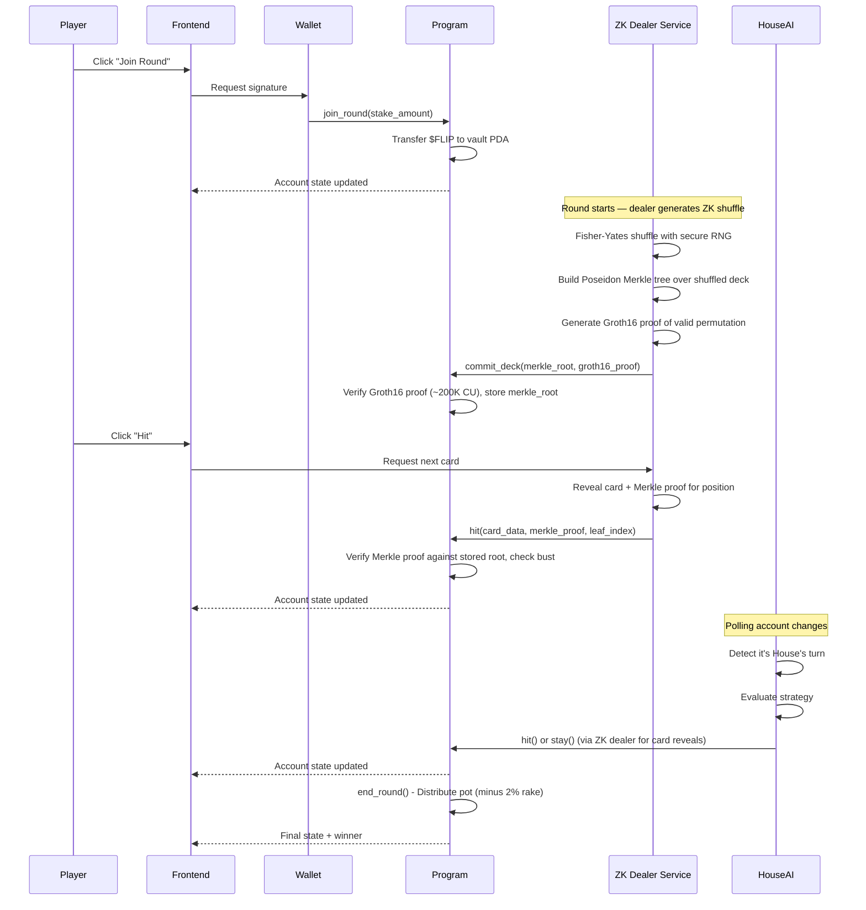

# PushFlip: Comprehensive Execution Plan

## Project Overview

- **Project Name**: PushFlip
- **One-Line Description**: A crypto-native push-your-luck card game on Solana with AI opponents, token-burning mechanics, ZK-proof deck verification, and on-chain randomness — built with Pinocchio (zero-dependency native Rust) for maximum performance and portfolio differentiation
- **Problem Statement**: Traditional online card games lack transparency in randomness and don't leverage blockchain's unique capabilities for provable fairness and token economics
- **Target Users**: Crypto-native gamers, DeFi enthusiasts, and developers interested in on-chain gaming
- **Primary Goal**: Portfolio piece demonstrating advanced Solana engineering — Pinocchio native programs, ZK-SNARK provably fair shuffling, and full-stack dApp architecture. Hackathon submission is secondary.
- **Success Criteria**:
  - Fully functional on-chain game built with Pinocchio (no Anchor dependency)
  - ZK-proof deck verification using Groth16 + Poseidon Merkle trees for provably fair shuffling
  - Working token economy with stake/burn mechanics
  - AI opponent ("The House") that plays autonomously
  - Clean, interactive frontend with wallet integration (@solana/kit + Kit Plugins)
  - Comprehensive documentation suitable for portfolio presentation
  - Demonstrates deep Solana internals knowledge (zero-copy accounts, CPI, PDA signing, ZK verification)
- **Team**:
  - George Donnelly
  - Alex Ramirez
  - Jorge Gallo

---

## Current Status (snapshot for new collaborators) — 2026-04-15 (Phase 3 complete; 5.0.9 PR 1 + 5.0.4 + 5.0.8 DONE; 14th + 15th heavy-duty reviews clean)

> **Living section.** Update at the end of every session so new contributors can find "where we are now" without scrolling. For full history see the **Phase 3 Prerequisites Status** block (~line 1759), the **Phase 3 Decisions Log** table (~line 1777), and the **Lessons Learned** section (~line 1819) — or use the `Where to find things in this plan` table at the bottom of this section.

### Where we are

- **Phases 1, 2, 3A: COMPLETE.** On-chain program is deployed to devnet (Program ID `HQLeAQc84WLz8buHM5JAJGBjNJjwc6Fpxts8jSMaW3px`), all 16 instructions covered by smoke tests under resource caps, ZK pipeline (Circom + Groth16 + Poseidon Merkle) fully working with `sol_poseidon` syscall (~7771 CU per `hit`). Five heavy-duty security reviews shipped against the program surface (1 Critical + 4 High + 17 Medium total fixed).
- **Phase 3B (frontend) Tasks 3.1 → 3.7.4: FULLY COMPLETE AND END-TO-END VERIFIED.** Vite 8 + React 19 + TypeScript 6 + Tailwind v4 + Biome/Ultracite scaffold, shadcn primitives, `WalletProvider` + `QueryProvider` + Kit RPC clients, the workspace-wide `@solana/kit` 2.x → 6.x migration, **Task 3.2 program integration hooks** (`useGameSession`, `usePlayerState`, `useGameActions` + the wallet adapter ↔ Kit signing bridge in [src/lib/wallet-bridge.ts](../app/src/lib/wallet-bridge.ts)), and the **full Phase 3.3 → 3.7.4 frontend** shipped 2026-04-10/11/12. The frontend now contains:
  - **Game board** (Task 3.3): `<GameCard>`, `<PlayerHand>`, `<ActionButtons>`, `<PotDisplay>`, `<TurnIndicator>`, `<GameBoard>` — wires read hooks + action hook + can-* gating logic, replaces the Phase 3.2 verification surface.
  - **Wallet integration** (Task 3.4): `useTokenBalance` (fetch + subscribe to ATA), `<WalletButton>` (connected pill with truncated address + live $FLIP balance + disconnect), `<JoinGameDialog>` (stake input with `parseU64` validation, layered errors for parse / no-ATA / insufficient-balance, single-source toast).
  - **Flip Advisor** (Task 3.5): `calculateBustProbability` + `getRecommendation` pure math in [app/src/lib/advisor.ts](../app/src/lib/advisor.ts) + `<FlipAdvisor>` component with Degen Mode toggle. Recommendation box palette is theme-aware (emerald-100/amber-100 fills + `-900` text in light mode, `-950/20` fills + `-300` text in dark mode).
  - **Events** (Task 3.6): `useGameEvents` (state-diff derived events from GameSession changes — toasts + 50-event log; documented as a stand-in for real `pinocchio_log` event streams which the program doesn't emit yet), `<EventFeed>`, `useScryResult` + inline `<ScryResultModal>`, `useRpcConnectionStatus` + `<ConnectionStatus>` indicator.
  - **Theme + UX polish** (Task 3.7.1): full light/dark/system theme switcher via the `useTheme` hook (`useSyncExternalStore` module-scoped store so `<App>` and `<ThemeToggle>` stay in sync) + `<ThemeToggle>` in the header (lucide-react icons), persisted to localStorage as `pushflip:theme`, FOUC-prevented via an inline IIFE in `index.html` that mirrors the resolution rules before React mounts. Both palettes retuned to the brand spine (deep purple primary `#9945ff` + Solana green accent `#14f195`). `<ClusterHint>` persistent dismissible banner under the header reminds users pushflip is devnet-only and their wallet must match cluster.
  - **Animations** (Task 3.7.2, 2026-04-12): Framer Motion via `motion/react` in three spots — `<GameCard>` flip-in on draw (rotateY -90° → 0° + scale + fade, backOut easing, ~400ms), `<PlayerHand>` bust shake keyframes, `<TurnIndicator>` "your turn" scale + opacity pulse loop. Conditional rendering so non-animated branches stay on plain `<div>` for zero motion cost. Keyframe shapes hoisted to module-scope constants for stable reference identity across renders (13th review L2).
  - **Responsive layout + theme-aware contrast sweep** (Task 3.7.3, 2026-04-12): 9 components tuned for 375px mobile viewport + light-mode AA contrast. `<code>` wallet-address block in JoinGameDialog gets `break-all` so base58 addresses wrap instead of overflowing; PotDisplay drops from `text-3xl` to `text-2xl` on narrow screens; PlayerHand / EventFeed / WalletButton / ConnectionStatus / GameCard red suit / TurnIndicator all flipped to `light-shade dark:dark-shade` pairs.
  - **Loading + error states** (Task 3.7.4, 2026-04-12): new `<Skeleton>` primitive (theme-aware via `bg-muted` token + animate-pulse) + `<BoardSkeleton>` that mirrors the real GameBoard layout on cold load + Retry button on error paths with `disabled={gameQuery.isFetching}` and `"Retrying…"` label during refetch (13th review L1) + skeleton placeholders replacing the `"loading…"` strings on WalletButton and JoinGameDialog balance rows. The error half was already shipped via `TransactionSimulationError` + `formatTxErrorDescription` in the wallet-bridge hardening commit.
  - **Shared $FLIP helpers** ([app/src/lib/flip-format.ts](../app/src/lib/flip-format.ts)): `FLIP_SCALE` + `formatFlip(amount, opts)` (full + compact modes). Parsing (`parseU64` + `U64_MAX`) lives in `@pushflip/client` now — see Pre-Mainnet 5.0.4 below.
- **Wallet-bridge hardened to production-grade** (commit `3337a89`, 2026-04-11). Every transaction now flows through: compile → **app-side `simulateTransaction`** → wallet-sign → tamper check → **`lifetimeConstraint` re-attach** (see Lesson #46) → sendable assertion → send+confirm. Each layer catches a distinct failure mode; none are redundant. Companion features: (a) `TransactionSimulationError` with `kind: "app-simulation" | "wallet-simulation" | "send"` discriminator + `humanHint` for rich toast copy; (b) `isWalletClusterMismatch` detection that remaps Phantom's generic "reverted during simulation" rejection to a specific "switch Phantom to devnet" hint when our own pre-sim already passed; (c) dev-only verbose logging via `debugBridge` / `debugAction` / `debugGroupStart` in [app/src/lib/debug-log.ts](../app/src/lib/debug-log.ts), gated on `import.meta.env.DEV` + a `window.__PUSHFLIP_DEBUG__` runtime override. See Lessons Learned #46–#48 for the full story.
- **First end-to-end on-chain round-trip is LIVE in both directions.** Read paths verified against `game_id=1` on 2026-04-10. **Write paths verified on 2026-04-11**: first ever wallet-signed `joinRound` landed on devnet via Solflare at signature [`67TqxY7jTmp9DSrKP9TuBdSwqdikMvswEZKqKj7wQiwLuZSrh9bBikN3Z1PtcXzp2aDKDppn8ASB7v1dmVvmkA6A`](https://explorer.solana.com/tx/67TqxY7jTmp9DSrKP9TuBdSwqdikMvswEZKqKj7wQiwLuZSrh9bBikN3Z1PtcXzp2aDKDppn8ASB7v1dmVvmkA6A?cluster=devnet) — wallet `AczL…MDjH` joined the game at PDA `Hk6RLHBZ8oppV4KtQFFRsHC21z9tCL5HYz3cLELEA64A`, PlayerState PDA `4G6fgxJbMTEv6pGmXyeA3f65G274nXkkHRwZF1MQesvC` created. Staked amount is 0 on-chain because `vault_ready=false` per the init-game.ts design (no SPL token account at the vault PDA), so the program correctly skipped the transfer step — exactly the `"PlayerState created with staked_amount=0"` path documented in [scripts/init-game.ts](../scripts/init-game.ts). **This closes Phase 3B with empirical proof of the entire stack.**
- **Eight heavy-duty reviews against the frontend so far** (#6 + #7 + #8 + #9 + #10 + #11 + #12 + #13):
  - #6/#7/#8 fixed 33 findings against the Phase 3.2 hook surface
  - #9 reviewed the init-game.ts commit chain and fixed 3 Mediums + 1 Low (BigInt-u64 silent-wrap re-occurrence in the GAME_ID env parser, missing error context extraction, missing `process.exit(0)` for the WSS handle, logging style drift)
  - #10 reviewed the entire Phase 3.3 → 3.7.1 commit chain (19 files, ~2,100 LOC): 0 Critical / 0 High / 6 Medium / 6 Low. All 12 findings fixed in-session — including the **third occurrence** of the BigInt-u64 silent-wrap footgun in `JoinGameDialog`'s stake parser
  - **#11 reviewed the pending wallet work** (mint-test-flip faucet, theme switcher, Pre-Mainnet $FLIP promotion tracking, footer cleanup): 0 Critical / 0 High / 5 Medium / 7 Low. All 12 findings fixed in-session, most notably the **parseU64 consolidation** into `@pushflip/client/bytes.ts` with 9 new unit tests (client test count 26 → 35), the `useTheme` migration to `useSyncExternalStore` to fix a dual-mount desync, and `useTheme`'s theme-aware JoinGameDialog no-ATA notice palette
  - **#12 reviewed the wallet-bridge hardening diff** (pre-sim + cluster-mismatch detection + lifetime re-attach + verbose logging): 0 Critical / 0 High / 2 Medium / 4 Low. All 6 findings fixed in-session — M1 (cache invalidation on failure → `finally` block for prophylactic cache refresh), M2 (`formatTxErrorDescription` → content-aware log filtering via `ERROR_LINE_RE`), L1-L4 (dev-gate console.warn, collapse double cast, expand `replaceRecentBlockhash: true` tradeoff comment, add `@solana/compat` lifetime-preservation canary). The review validated the defense-in-depth layering in the bridge. See Lessons #46–#48.
  - **#13 reviewed the Track D + Track A diff** (Phase 3.7.2/3/4 polish + buffer polyfill + wallet-adapter slim + `protect-commit.sh` hook + `scripts/init-vault.ts`): 0 Critical / 0 High / 1 Medium / 5 Low. All 6 findings fixed in-session — M1 (third occurrence of Lesson #40, `JoinGameDialog` `useEffect` dep on `publicKey` switched to `publicKeyBase58`, now tracked as Pre-Mainnet 5.0.8 for a Biome lint rule), L1 (Retry button `disabled` during refetch), L2 (PlayerHand keyframes hoisted to module scope), L3 (init-vault owner check), L4 (init-vault `dataLen > 0` tighter idempotency), L5 (init-vault friendly `loadCliKeypair` errors). Review validated three recurring patterns: Pass 1 agents assume attackers can create accounts at PDAs they don't own (structurally impossible on Solana), markdown-only guidance doesn't prevent recurring footguns, and scripts should mirror their target program's preconditions verbatim. See Lesson #49.
  - **#14 reviewed the Pre-Mainnet 5.0.9 PR 1 diff** (17 files — `program/src/utils/events.rs` new + `mod.rs` + 16 instruction handlers + one docstring fix): 0 Critical / 0 High / 0 Medium / 1 Low. Only finding: an outdated `event!` macro reference in the `HexPubkey` docstring — fixed in-session at [program/src/utils/events.rs:104-112](../program/src/utils/events.rs#L104-L112). Pass 1 Agent B surfaced two *confident* "CRITICAL" claims about `hit.rs` (allegedly missing `score` in the log + allegedly never persisting score to PlayerState on the hit path) — both dismissed in Pass 2 after reading `end_round.rs:130` (score is only read for `inactive_reason == STAYED` players, and `stay.rs:92` is the only path to STAYED which always calls `set_score()`). Busted players' scores are never consulted by `end_round`, so the "missing" score is correct-by-design. This is the 14th validation of Lesson #20/#29: **Pass 2 MUST diff agent findings against actual code behavior + session state, not just re-read the flagged lines**. Also confirmed empirically: `unsafe impl Log for HexPubkey` is sound (bounds-checked writes into `&mut [MaybeUninit<u8>]`, borrowed `&'a [u8; 32]` input), all 17 log lines fit under the 200-byte `pinocchio-log` buffer (worst case `claim_bounty` = 177 bytes, 23-byte margin), and all log calls are placed immediately before `Ok(())` so Solana's tx-reverts-logs-on-failure semantics guarantee log-on-success-only. See Lesson #50.
  - **#15 reviewed the Pre-Mainnet 5.0.4 + 5.0.8 diff** (12 files — `scripts/lib/script-helpers.ts` new + `app/biome-plugins/no-publickey-in-hook-deps.grit` new + 7 scripts + `app/biome.jsonc` + `cluster-hint.tsx` + `use-game-actions.ts` + `.claude/settings.json`): 0 Critical / 0 High / 1 Medium / 2 Low. All 3 findings fixed in-session — M1 (grit plugin blindspot: `[publicKey.toBase58()]` is a Lesson #40 footgun but the pattern can't safely match it without false positives, backstop is a grep guard in `pre-pr-gate.sh`), L1 (CU budget comment in `smoke-test.ts` said "~30% headroom" but actual math is 25%/55%; reworded with accurate asymmetry + rationale), L2 (`app/.biome-plugins/` renamed to `app/biome-plugins/` to drop the hidden-directory cosmetic issue). Pass 2 validated **behavior-preservation across the entire 7-script refactor** at the byte level: `retry` semantics identical, `randomGameId` identical, `sendTx` 4-arg variant backward-compatible with old 3-arg callers via default parameter, `loadCliKeypair` strictly-better error UX (friendly ENOENT/EACCES/JSON messages replaced raw stack traces). Pass 1 Agent C surfaced a confident "HIGH: dangling Kit imports" finding that Pass 2 dismissed after running `pnpm --filter @pushflip/scripts exec tsc --noEmit` and confirming exit 0 — the import blocks were already correctly trimmed; the agent hadn't read the post-refactor state. **This is the 5th occurrence of the "plausible ghost" pattern** (Lesson #50) — Pass 1 agents confidently flagging pre-existing correct behavior as a regression. The hit rate of Pass 2 catching these justifies the full 3-pass methodology every time.
  - See Lessons Learned #42 for the BigInt-u64 footgun lineage (four occurrences, now consolidated in `@pushflip/client::parseU64`) and #40 for the wallet `publicKey` object-identity footgun lineage (three occurrences, tracked as Pre-Mainnet 5.0.8).
- **Pre-Mainnet 5.0.9 PR 1 — program-side on-chain event logging — DEPLOYED 2026-04-15.** The `HQLeAQc84WLz8buHM5JAJGBjNJjwc6Fpxts8jSMaW3px` program now emits structured `pushflip:<kind>:<k>=<v>|...` log lines from all 16 state-changing instruction handlers. Upgrade tx: [`3i6KEFmMysLUGCWhFZ8t6gQf1cFPKvJ3sLfgtgdgcejJUYeddQfKtAmuhboj4gyW3aLh2fmsJGAyhG23QAoEwwtY`](https://explorer.solana.com/tx/3i6KEFmMysLUGCWhFZ8t6gQf1cFPKvJ3sLfgtgdgcejJUYeddQfKtAmuhboj4gyW3aLh2fmsJGAyhG23QAoEwwtY?cluster=devnet). Binary grew 96 KB → 107 KB (+11 KB for 16 log emissions + `HexPubkey` hex formatter). All 4 smoke tests (`smoke-test`, `smoke-test-tokens`, `smoke-test-burns`, `smoke-test-bounty`) re-run against the new deploy — every expected `pushflip:*` kind appears in the captured logs, verified via `solana confirm -v <sig>` on representative txs. **Plan deviations from the original 5.0.9 spec**, each with a reason:
  1. **No `event!` wrapper macro.** The original plan called for a `pinocchio_log::log!` wrapper at `program/src/utils/events.rs`. Attempted it — `concat!("pushflip:", $kind, ":", $fmt)` returns a Rust `Macro` AST node, NOT a `LitStr`, and `pinocchio-log`'s proc-macro requires a literal at token-expansion time. No feasible workaround that keeps stack-only formatting. Fix: each of the 16 handlers inlines `pinocchio_log::log!("pushflip:<kind>:...")` directly. The `events.rs` module still exists, but now hosts only the `HexPubkey<'a>` newtype + module-level docstring explaining the concat! limitation.
  2. **Pubkeys as 64-char lowercase hex, not base58.** The original plan assumed `pinocchio-log`'s `Argument` impl formats pubkeys as base58 automatically. Reading `pinocchio-log-macro-0.5.0/src/lib.rs` at implementation time showed: the crate has `Log` impls for `u8`/`u16`/`u32`/`u64`/`u128`/`usize` + signed variants + `&str` + `bool` + slice `[T; N]` but **no** pubkey-shaped base58 path. Options: (a) add a base58 dep like `five8` (~45 KB binary + ~5 KB CU per encode), or (b) implement a `Log` impl for a `HexPubkey<'a>` newtype that writes 32 bytes as 64 lowercase hex chars directly into the stack buffer. Chose (b): zero deps, zero CU overhead, 20 extra bytes on the wire per pubkey (64 chars vs ~44 base58). The frontend (PR 2) converts hex → base58 in one line of TS. The `unsafe impl Log for HexPubkey` is bounds-checked (writes into `&mut [MaybeUninit<u8>]`, guards `written + 2 > buffer.len()` before each `get_unchecked_mut().write()`).
  3. **`commit_deck` stays a single log line.** Original plan split into `commit_deck` + `commit_deck_root` to stay under 180 bytes. Actual measured worst case is 158 bytes (`game_id` + `round` + 64-char merkle-root hex + delimiters + `pushflip:commit_deck:` prefix), which fits the 200-byte buffer with margin. Single line, single kind.
  4. **CU-regression assertion in smoke-test.ts — DEFERRED.** Original plan step 4 was a per-instruction CU budget check. `commit_deck` logs add <500 CU (empirically ~150–200 CU), well under the 300K tx-level compute budget already set by all smoke tests. No regression observed. Deferred to when `scripts/lib/script-helpers.ts` extraction happens (it'll land as part of Pre-Mainnet 5.0.4's remaining work so the devnet re-verify happens in one pass).
  - **17 event kinds confirmed live on devnet** (all 16 state-changing instructions each emit exactly one line; no split): `initialize`, `init_vault`, `join_round`, `commit_deck`, `start_round`, `hit`, `stay`, `end_round`, `burn_second_chance`, `burn_scry`, `leave_game`, `close_game`, `init_bounty_board`, `add_bounty`, `claim_bounty`, `close_bounty_board`.
  - **14th heavy-duty review clean.** See the #14 summary above. One Low finding fixed in-session.
  - **PR 2 (frontend rewrite of `use-game-events.ts`) is PENDING 24h bake + next session.** The program-side logs need ≥24h of devnet exposure to catch any late regression before the frontend starts consuming them. Rollback path for PR 2 is frontend-only — no program redeploy needed.
- **Pre-Mainnet 5.0.4 remaining half — DONE 2026-04-15.** Extracted seven CLI scripts' duplicated helpers into `scripts/lib/script-helpers.ts`: ANSI color table, `ok`/`info`/`step`/`fail`/`warn` log helpers, `printRpcError`, friendly-error `loadCliKeypair` (13th-review L5 promoted here), `RpcContext` + `makeDevnetContext` factory, `sendTx`, `retry`, `randomGameId`, and the new CU-regression helpers `getCuConsumed` + `assertCuBudget`. All 7 scripts (smoke-test, smoke-test-bounty, smoke-test-burns, smoke-test-tokens, init-game, init-vault, mint-test-flip) now import from the shared module. **Net -712 lines of duplication deleted.** This also unblocked the deferred step 4 of Pre-Mainnet 5.0.9 PR 1 (CU regression guard) — `smoke-test.ts` now calls `assertCuBudget(rpc, sig, "commit_deck", 200_000)` and `assertCuBudget(rpc, sig, "hit", 12_000)` after each of those instructions. Empirical CU consumption on devnet: commit_deck=86K (55% headroom), hit=9.5K (25% headroom — tight because Poseidon is stable). A future log-emission growth or ZK pipeline change that blows either budget now fails the smoke test immediately.
- **Pre-Mainnet 5.0.8 — DONE 2026-04-15.** New Biome 2.4.11 GritQL plugin at [app/biome-plugins/no-publickey-in-hook-deps.grit](../app/biome-plugins/no-publickey-in-hook-deps.grit) registered via the new `plugins` field in [app/biome.jsonc](../app/biome.jsonc). Plugin flags any `useEffect` / `useMemo` / `useCallback` / `useQuery` call whose dependency array contains the bare identifier `publicKey`. Lesson #40 has now surfaced THREE times (reviews #6, #10, #13) and markdown guidance alone hasn't stopped it — the lint rule is the mechanism. Enabling the plugin caught two existing violations that were fixed in the same commit: `app/src/components/wallet/cluster-hint.tsx` (`useEffect` dep switched from `publicKey` to derived `publicKeyBase58 = publicKey?.toBase58() ?? null`) and `app/src/hooks/use-game-actions.ts` (same pattern for `invalidateGameAndPlayer` and `runAction` — the runAction closure still captures the publicKey object for `fromLegacyPublicKey(publicKey)` and `publicKey.toBase58()`, both pure functions of the underlying bytes, so the stale-closure-ref is provably safe; the built-in `useExhaustiveDependencies` rule is suppressed at that callback with a biome-ignore comment pointing to the new plugin as the authoritative rule). Documented known blindspot: `[publicKey.toBase58()]` is also a footgun (new string every render) but GritQL can't safely match member expressions in deps arrays without false positives — a `grep` guard in `.claude/hooks/pre-pr-gate.sh` is the backstop.
- **Working tree at end of session 2026-04-15:** clean, all commits pushed to `origin/main`. The 2026-04-12 → 2026-04-15 Pre-Mainnet 5.0.9 + 5.0.4 + 5.0.8 session commit chain is:
  - `183176a` docs(plan): add Pre-Mainnet 5.0.9 (on-chain pinocchio_log event feed)
  - `993c348` feat(program): emit structured pushflip:* events from 16 instruction handlers
  - `7a78f7a` chore(claude): allowlist smoke-test and smoke-test-tokens scripts
  - `4dbabb9` docs(plan): record Pre-Mainnet 5.0.9 PR 1 completion + 14th review + Lesson #50
  - `c8bef38` refactor(scripts): extract shared CLI helpers + wire CU regression guard (Pre-Mainnet 5.0.4 remaining half, -712 lines net)
  - `df4d118` feat(app): biome plugin blocking useWallet().publicKey in hook deps (Pre-Mainnet 5.0.8)
  - `408659a` chore(claude): allowlist smoke-test helpers for Pre-Mainnet 5.0.4/5.0.8
- **The full 2026-04-11 → 2026-04-12 session commit chain is:**
  - `93259f3` refactor(client): parseU64 consolidation + JoinGameDialog fixes
  - `ee5ff1f` feat(scripts): mint-test-flip CLI faucet
  - `c595a18` feat(app): light/dark theme switcher with useSyncExternalStore
  - `b5f8caf` docs(plan): 11th review + Pre-Mainnet 5.0.4 consolidation
  - `a9ed311` chore(claude): bash allowlist for biome batch commands
  - `a875b75` fix(app): theme-aware amber palette for JoinGameDialog no-ATA notice
  - `3337a89` feat(app): wallet-bridge hardening (pre-sim, cluster-mismatch, lifetime re-attach, verbose logging)
  - `cf56176` fix(app): theme-aware contrast in FlipAdvisor recommendation box
  - `f36d991` docs(plan): 12th review + wallet-bridge lessons
  - `a40278d` chore(claude): bash allowlist for wallet-bridge fix pass
  - `8dc19b9` docs(plan): close Phase 3B, record first on-chain wallet-signed joinRound
  - `b80974b` build(app): buffer polyfill, slim wallet adapter, install motion
  - `c508473` feat(claude): `protect-commit.sh` hook to block protected-file commits
  - `311ef8d` feat(app): phase 3.7.2/3/4 polish — animations, responsive, loading states
  - `1dfa543` feat(scripts): `init-vault.ts` CLI to enable real-stake mode on devnet
  - `60b91d9` docs(plan): 13th review + Lesson #40 three-occurrence lineage + Pre-Mainnet 5.0.8
- **All workspaces green** (re-verified 2026-04-12 end of session): `clients/js` **35/35 tests**, `dealer` 11/11 tests, `app` typecheck / lint (43 files, biome-excluded `src/components/ui/skeleton.tsx` new) / build (~800 ms) clean, `scripts` typecheck clean (three devnet CLIs now — `init-game.ts`, `mint-test-flip.ts`, `init-vault.ts`), `cargo check --all-targets` clean (same 26 deferred dead-code warnings tracked under Task 3.B.End — no new warnings from this session).

### What's next

The Phase 3B frontend is **fully complete** — every sub-task from 3.1 through 3.7.4 has shipped and been empirically verified on devnet. The next meaningful milestone is **Phase 4 (House AI agent)**. Pre-Mainnet items (5.0.1 → 5.0.8) remain as gating-for-mainnet but don't block Phase 4.

**Phase 3 completion breakdown (all ✅ DONE as of 2026-04-12):**
- **3.1** — Vite/React/TS scaffold + Tailwind v4 + biome/ultracite ✅
- **3.2** — Program integration hooks (`useGameSession`, `usePlayerState`, `useGameActions`) + wallet adapter ↔ Kit signing bridge, end-to-end verified via Solflare joinRound on 2026-04-11 ✅
- **3.3** — Game board components (`<GameCard>`, `<PlayerHand>`, `<ActionButtons>`, `<PotDisplay>`, `<TurnIndicator>`, `<GameBoard>`) ✅
- **3.4** — Wallet integration (`<WalletButton>`, `<JoinGameDialog>`, `useTokenBalance`) ✅
- **3.5** — Flip Advisor (pure math + component with Degen Mode) ✅
- **3.6** — Event feed, scry modal, connection status ✅
- **3.7.1** — Theme switcher (light/dark/system via `useSyncExternalStore`) ✅
- **3.7.2** — Framer Motion animations: card draw flip/scale/fade, player-hand bust shake, turn-indicator "your turn" pulse (Track A1, 2026-04-12) ✅
- **3.7.3** — Responsive layout + theme-aware contrast sweep across 9 components (Track A2, 2026-04-12) ✅
- **3.7.4** — Loading skeletons (`<Skeleton>` primitive + `<BoardSkeleton>`) + Retry button on error paths + rich `TransactionSimulationError` toasts for the error half (Track A3, 2026-04-12) ✅

**Phase 4 — House AI agent** (~3 days estimated). Autonomous opponent that plays against humans, integrated with the ZK dealer. See [Phase 4: The House AI Agent](#phase-4-the-house-ai-agent-days-23-25).

**Recommended next move**: start Phase 4. No open blockers. Track D loose ends from 2026-04-12 also landed — buffer polyfill, `<ClusterHint>` banner, Phantom/Solflare explicit-adapter cleanup, and `scripts/init-vault.ts` for the `vault_ready=true` verification path (code-complete, awaiting operator go-ahead to run the irreversible InitVault instruction). The new `protect-commit.sh` hook closes the IDE-auto-stage failure mode that caused a protected-file slip during the 12th review fix pass.

### Pre-Mainnet items — Task 5.0.4 ✅ DONE 2026-04-11

**The `parseU64` half of 5.0.4 has shipped.** The canonical `parseU64(raw, fieldName)` + `U64_MAX` constant now live in [clients/js/src/bytes.ts](../clients/js/src/bytes.ts) and are re-exported from `@pushflip/client`. All four consumers — [scripts/init-game.ts](../scripts/init-game.ts), [scripts/mint-test-flip.ts](../scripts/mint-test-flip.ts), [app/src/components/game/join-game-dialog.tsx](../app/src/components/game/join-game-dialog.tsx), and (transitively via removal) [app/src/lib/flip-format.ts](../app/src/lib/flip-format.ts) — now import the single shared helper. No more duplicate implementations.

- **Unit tests added**: 9 new cases in [clients/js/src/client.test.ts](../clients/js/src/client.test.ts) covering the accept path (0, 1, 1000, u64::MAX), all 4 reject categories (empty, hex, negative, decimal/scientific, whitespace/junk), overflow (2^64), field-name propagation, and the end-to-end silent-wrap guard (u64::MAX round-trips through `u64Le` as 8 × 0xff). Client test count: **26 → 35**.
- **Bonus**: `mint-test-flip.ts` now also applies a post-multiply `> U64_MAX` check after `args.amountWhole * FLIP_SCALE` — `parseU64` validates the input but the scale multiplication can push the product past u64::MAX even for valid inputs, and `setBigUint64` would silently wrap. Same defensive pattern now lives in `JoinGameDialog.parseStakeInput`.

**Remaining 5.0.4 work** (not blocking, tracked separately):
1. **`scripts/lib/script-helpers.ts` extraction** — `init-game.ts`, `mint-test-flip.ts`, `init-vault.ts`, and `smoke-test.ts` (FOUR devnet CLIs now) still duplicate `loadCliKeypair`, `printRpcError`, `sendTx`, the ANSI `c` color table, and the `ok`/`info`/`step`/`fail`/`warn` logging helpers. The 13th review's L5 friendly-error improvement for `loadCliKeypair` also belongs in the shared helper. Defer until a session that also touches `smoke-test.ts` (the Poseidon syscall regression guard) so the devnet re-verification happens in one pass.
2. **Biome lint rule for raw `BigInt(userInput)`** — still the only mechanism that prevents a fifth occurrence of Lesson #42. Markdown alone does not stop the bug.

### Parallelizable work tracks for Phase 3B (historical)

> **Historical context** — Phase 3B is fully complete as of 2026-04-12. This table documents how the Phase 3B work was divided between George and Alex during planning; it is preserved for archaeology, not as live work guidance. Every row is ✅ DONE.

If George and Alex wanted to split work (now archival):

| Track | Owner | Depends on | Notes |
|---|---|---|---|
| 3.3.1 `<card>` component | either | nothing | Pure presentational; first three lines establish the file naming convention (kebab-case per Ultracite) |
| 3.3.2 `<player-hand>` | either | 3.3.1 | Renders an array of cards; needs 3.3.1's interface |
| 3.3.3 `<action-buttons>` | either | nothing — uses existing `useGameActions` | First end-to-end test of the signing bridge happens when this lands. `game_id=1` is already initialized on devnet (PDA `Hk6RLHBZ8oppV4KtQFFRsHC21z9tCL5HYz3cLELEA64A`) — first user click should produce a `joinRound` transaction visible on Solana Explorer |
| 3.3.4 `<game-board>` | either | 3.3.1 + 3.3.2 + 3.3.3 | The integration point. Replaces `<GameStatusPanel>` in `app.tsx` |
| 3.3.5 `<pot-display>` + `<turn-indicator>` | either | nothing | Atomic; can ship in parallel with 3.3.1 |
| 3.5.1 `calculateBustProbability` | either | nothing | Pure frontend math; no on-chain integration; can be developed alongside 3.3 |
| 3.7.1 dark theme tokens | either | nothing | Adjusts the existing shadcn design tokens in [globals.css](../app/src/styles/globals.css); zero coupling to other tracks |
| ~~**Initialize a real game on devnet at `game_id=1`**~~ | ✅ **DONE 2026-04-11** | — | Shipped as a dedicated minimal script ([scripts/init-game.ts](../scripts/init-game.ts)), NOT by editing a smoke test (smoke-test.ts ends with `closeGame` which would have destroyed the account). Persistent GameSession at `Hk6RLHBZ8oppV4KtQFFRsHC21z9tCL5HYz3cLELEA64A`; idempotent on re-run. Run via `pnpm --filter @pushflip/scripts init-game`. See [docs/GAME_SESSION_BYTE_LAYOUT.md](GAME_SESSION_BYTE_LAYOUT.md) for the worked byte-layout decoding example using this exact account. |

### Quickstart for new contributors

```bash
# Clone + install (pnpm 9+, Node 20.11+, Rust 1.84+ for the on-chain side)
git clone <repo>
cd pushflip
pnpm install

# Verify everything is green before touching anything
pnpm --filter @pushflip/client test     # 35 tests (26 + 9 parseU64 cases added in 5.0.4)
pnpm --filter @pushflip/dealer test     # 11 tests
pnpm --filter @pushflip/app typecheck   # tsc -b --noEmit
pnpm --filter @pushflip/app lint        # biome check (43 files)
pnpm --filter @pushflip/app build       # tsc -b && vite build (~800 ms)
pnpm --filter @pushflip/scripts exec tsc --noEmit  # devnet CLIs: init-game, init-vault, mint-test-flip, smoke-test
cargo check --all-targets               # Rust on-chain (warnings deferred)

# Run the frontend dev server
pnpm --filter @pushflip/app dev         # http://localhost:5173

# Run the on-chain smoke tests against devnet (requires a funded devnet keypair)
pnpm --filter @pushflip/scripts smoke-test

# (Re-)initialize the test game at game_id=1 on devnet (idempotent — safe to re-run).
# This is what the frontend's read hooks bind to. See docs/GAME_SESSION_BYTE_LAYOUT.md
# for the worked byte-layout decoding example.
pnpm --filter @pushflip/scripts init-game
```

For a deeper conventions/onboarding doc see [CONTRIBUTING.md](../CONTRIBUTING.md) (toolchain versions, code conventions, project status by component).

### Conventions to know before touching code

| Area | Rule | Why |
|---|---|---|
| **`notes.md` at repo root** | **DO NOT EDIT.** This is George's personal scratch file. | Memory rule (`feedback_notes.md`). Editing it loses George's context. |
| **`app/` filenames** | **kebab-case only** (`card.tsx`, not `Card.tsx`). | Ultracite's `useFilenamingConvention` rule enforces this. The execution plan's Tasks 3.3+ use PascalCase paths but should be read as kebab-case when implemented — see Decisions Log entry "Ultracite/Biome enforces kebab-case filenames". |
| **`app/src/components/ui/*` and `app/src/lib/utils.ts`** | **Vendored from shadcn — do not lint, do not hand-edit unless absolutely necessary.** Excluded from Biome via [biome.jsonc](../app/biome.jsonc). | Re-running `pnpm dlx shadcn@latest add <component>` overwrites these files; linter exclusions prevent diff churn. The one exception currently is [sonner.tsx](../app/src/components/ui/sonner.tsx) where we hardcoded `theme="dark"` and dropped the `next-themes` import — see Decisions Log entry "Removed `next-themes` dependency". |
| **Program client** | **Hand-written, NOT Codama-generated.** Lives at [clients/js/](../clients/js/) as the `@pushflip/client` workspace package. Re-export everything from `@pushflip/client` rather than duplicating the byte layouts. | Path B chosen in Phase 3 prereqs — Pinocchio's manual byte layouts make a parallel Codama representation more cost than benefit. See Decisions Log entry "Skip Shank/Codama". |
| **`@solana/kit` version** | **^6.8.0 workspace-wide** (`app`, `clients/js`, `scripts`, `dealer`). | Kit 2.x → 6.x migration was done in Task 3.1.4 because the kit-plugin-* packages need Kit 6. Mixing majors will cause silent type drift. See Decisions Log entry "Bumped @solana/kit 2.x → 6.x across the entire workspace". |
| **Wallet adapter ↔ Kit bridge** | The wallet adapter uses **web3.js v1** internally (`PublicKey`, `Transaction`); our hooks use **Kit** (`Address`, `Instruction`). Translate at the boundary using `fromLegacyPublicKey` / `fromLegacyTransactionInstruction` from `@solana/compat`. | See [src/providers/wallet-provider.tsx](../app/src/providers/wallet-provider.tsx) docstring and Decisions Log entry "App workspace uses individual `@solana/wallet-adapter-{phantom,solflare,base}` packages". |
| **Env vars in `app/`** | Use `import.meta.env.VITE_FOO?.trim() \|\| "default"` — **never** `??`. Add new vars to [src/vite-env.d.ts](../app/src/vite-env.d.ts). | `??` doesn't catch empty strings; `vite-env.d.ts` augmentation makes typos compile errors. See Lessons #34, #35. |
| **Module-level long-lived resources** | Modules that open WebSockets, intervals, or OS handles should call `import.meta.hot?.invalidate()` at the top. | Vite HMR re-eval otherwise leaks the resource on every save. See [src/lib/program.ts](../app/src/lib/program.ts) and Lesson #37. |
| **Heavy-duty reviews** | Run `/heavy-duty-review` after any non-trivial commit chain. Pass 2 (verification) MUST diff agent claims against actual file contents AND session state — Pass 1 agents lie confidently. | See Lessons #20, #29, and #50. **Fifteen heavy-duty reviews so far**; every one has caught at least one structural bug the unit tests missed. The Lesson #50 "plausible ghost" pattern (Pass 1 confidently flagging pre-existing correct behavior as a regression) has now recurred 5× — reviews #9, #10, #13, #14, #15 — validating the Pass 2 cross-reference-to-downstream-consumers discipline every time. |
| **Pre-mainnet items** | Nine items deferred from Phase 3 to Phase 5. Status as of 2026-04-15: Task 5.0.1 (oversized program data slot) open; Task 5.0.2 (threshold randomness) open; Task 5.0.3 (final full-scope review) open; Task 5.0.4 (`parseU64` + script-helpers extraction) **DONE 2026-04-15** — `parseU64` half landed 2026-04-11, scripts-extraction half landed today with -712 lines net; Task 5.0.5 (three stubbed wiki pages) open; Task 5.0.6 (promote `$FLIP` with metadata + multisig) open; Task 5.0.7 (self-service test-FLIP faucet) open; Task 5.0.8 (Biome lint rule for `useWallet().publicKey` in hook deps) **DONE 2026-04-15** — GritQL plugin at `app/biome-plugins/no-publickey-in-hook-deps.grit`; Task 5.0.9 (replace state-diff event feed with on-chain `pinocchio_log` events) **PR 1 DONE 2026-04-15**, PR 2 frontend rewrite pending 24h bake. **3 of 9 items shipped this session**; 6 remain. Listed at [Pre-Mainnet Checklist](#pre-mainnet-checklist-deferred-items-not-blocking-devnet). | None block devnet work. |

### Where to find things in this plan

Line numbers shift; grep for the section header instead. Approximate locations as of 2026-04-11:

| Looking for... | Section header to grep | Approx. line |
|---|---|---|
| Decisions made and *why* | `### Phase 3 Decisions Log` | ~1777 |
| Hard-won insights from past sessions | `### Lessons Learned (Phase 1 → Phase 3 prereqs)` (subsections: Tooling & Test Infrastructure, ZK / Cryptography, Pinocchio-Specific, Solana Deployment, Process, Build & Test Workflow, Cross-Account Validation, Plan-vs-Reality Drift, Frontend Provider & Env Patterns, Hooks & Wallet Bridge) | ~1819 |
| Phase 1 / Phase 2 task history | `### Phase 1 Summary`, `### Phase 2 Summary` | ~651, ~657 |
| Current heavy-duty review pipeline | `### Phase 3 Prerequisites Status` | ~1759 |
| Phase 3A on-chain task definitions | `### Phase 3A: On-Chain Hardening` | ~2000 |
| Phase 3B frontend Task 3.1 (scaffolding — done) | `#### Task 3.1: Vite + React Project Setup` | ~2401 |
| Phase 3B frontend Task 3.2 (program hooks — done) | `#### Task 3.2: Program Integration Layer` | ~2495 |
| Phase 3B frontend Task 3.3 (game board — next up) | `#### Task 3.3: Game Board Components` | ~2528 |
| Phase 4 (House AI) | `### Phase 4: The House AI Agent` | ~2688 |
| Phase 5 (deployment) and pre-mainnet checklist | `### Phase 5`, `#### Pre-Mainnet Checklist` | ~2817, ~2825 |
| **Worked GameSession byte-layout decoding example** (separate doc) | [docs/GAME_SESSION_BYTE_LAYOUT.md](GAME_SESSION_BYTE_LAYOUT.md) | — |

---

## Scope Definition

### Core Features (Phases 1-4)
1. Core on-chain card game with hit/stay mechanics — **built with Pinocchio** (native Rust, zero-dependency)
2. **ZK-proof deck verification** using Groth16 + Poseidon Merkle trees (provably fair shuffling — NO slot hash, NO VRF)
3. `$FLIP` token (SPL Token) with stake-to-play and burn-for-power mechanics
4. Basic bounty system
5. "The House" AI opponent + ZK dealer service
6. "Flip Advisor" probability assistant (frontend)
7. Vite + React frontend with **@solana/kit + Kit Plugins** (NOT legacy web3.js, Anchor TS client, or Gill). Wallet integration via the official `@solana/wallet-adapter-*` packages bridged to Kit via `@solana/compat`.
8. **Hand-written TypeScript client** at `clients/js/` (the `@pushflip/client` workspace package) — NOT generated via Shank/Codama. See [Decision: Skip Shank/Codama](#phase-3-decisions-log) — Pinocchio's manual byte layouts are mirrored directly.

### Post-MVP Features
- AI Commentator/Narrator
- AI Agent Tournaments
- Dynamic Bounty Generator
- Personalized AI Coach
- Decentralized dealer (threshold cryptography — multiple parties contribute randomness)

### Explicit Non-Goals
- Mobile native apps
- Multi-chain deployment
- Complex NFT integrations
- Real money gambling compliance
- Production-grade security audits (this is a portfolio piece)

## Technical Architecture

### System Architecture

```
┌─────────────────────────────────────────────────────────────────────┐
│                       FRONTEND (Vite + React)                       │
├─────────────────────────────────────────────────────────────────────┤
│  ┌──────────────┐  ┌──────────────┐  ┌──────────────────────────┐  │
│  │ Game UI      │  │ Wallet       │  │ Flip Advisor            │  │
│  │ Components   │  │ Connection   │  │ (Probability Calculator) │  │
│  └──────┬───────┘  └──────┬───────┘  └──────────────────────────┘  │
│         │                 │                                         │
│         └────────┬────────┘                                         │
│                  ▼                                                  │
│         ┌────────────────┐                                          │
│         │ @solana/kit v6 │                                          │
│         │ + Kit Plugins  │                                          │
│         │ + @pushflip/   │                                          │
│         │   client (hand)│                                          │
│         └───────┬────────┘                                          │
└─────────────────┼───────────────────────────────────────────────────┘
                  │
                  ▼
┌─────────────────────────────────────────────────────────────────────┐
│                      SOLANA BLOCKCHAIN (Devnet)                     │
├─────────────────────────────────────────────────────────────────────┤
│  ┌────────────────────┐  ┌────────────────────┐                     │
│  │ pushflip           │  │ SPL Token Program  │                     │
│  │ (Pinocchio Native) │  │                    │                     │
│  │                    │  │ - $FLIP Token Mint │                     │
│  │ - GameSession PDA  │  │ - Token Accounts   │                     │
│  │ - PlayerState PDA  │  │                    │                     │
│  │ - initialize()     │  └────────────────────┘                     │
│  │ - commit_deck()    │                                             │
│  │ - join_round()     │  ┌────────────────────┐                     │
│  │ - hit()            │  │ ZK Verification    │                     │
│  │ - stay()           │  │ (Groth16 on-chain) │                     │
│  │ - end_round()      │  │ (Poseidon Merkle)  │                     │
│  └─────────┬──────────┘  └────────────────────┘                     │
│            │                                                        │
│            ▼                                                        │
│  ┌────────────────────┐                                             │
│  │ BountyBoard PDA    │                                             │
│  └────────────────────┘                                             │
└─────────────────────────────────────────────────────────────────────┘
                  ▲
                  │
┌─────────────────┼───────────────────────────────────────────────────┐
│                 │        OFF-CHAIN SERVICES                         │
├─────────────────┼───────────────────────────────────────────────────┤
│         ┌───────┴───────┐  ┌───────────────┐                        │
│         │ The House AI  │  │ ZK Dealer     │                        │
│         │ Agent         │  │ Service       │                        │
│         │ (Node.js)     │  │ (Rust/Node)   │                        │
│         │               │  │               │                        │
│         │ - Account     │  │ - Shuffle     │                        │
│         │   Subscriber  │  │   Engine      │                        │
│         │ - Strategy    │  │ - Circom/     │                        │
│         │   Engine      │  │   snarkjs     │                        │
│         │ - TX Signer   │  │ - Merkle Tree │                        │
│         └───────────────┘  │ - Proof Gen   │                        │
│                            └───────────────┘                        │
└─────────────────────────────────────────────────────────────────────┘
```

### Data Flow



### Fairness Model Analysis

#### What the ZK system guarantees

The current design uses a **commit-then-reveal** scheme with two cryptographic layers:

1. **Groth16 proof at commit time** — The ZK Dealer shuffles the deck, builds a Poseidon Merkle tree over it, and generates a Groth16 proof that the shuffled deck is a **valid permutation** of a standard 52-card deck. The on-chain program verifies this proof (~200K CU) before storing the Merkle root. This guarantees: *the committed deck contains exactly the right cards — no duplicates, no missing cards.*

2. **Merkle proof at reveal time** — Each `hit()` submits the card data + Merkle proof + leaf index. The program verifies the proof against the stored root. This guarantees: *each revealed card was part of the originally committed deck at that exact position.*

Together these prove: **the deck was valid at commit time, and every card revealed matches what was committed.** The dealer cannot swap cards mid-game.

#### The gap: single trusted dealer

The ZK Dealer is an off-chain service that chooses the shuffle order, generates the validity proof, and submits the commitment. The Groth16 proof proves the deck is a **valid** shuffle but does NOT prove the shuffle is **random** or **unpredictable**. The dealer knows the entire deck order from the start and could theoretically stack the deck or collude with the House AI (same operator).

**Current status: provably valid, not provably random.** Players can verify the deck was a real permutation and that revealed cards match the commitment, but they must trust the dealer to have shuffled honestly.

#### Strengthening options (in order of complexity)

1. **Player-contributed entropy (post-MVP)** — Player commits `hash(player_seed)` during `join_round`. Dealer commits `hash(dealer_seed)`. Final shuffle seed = `hash(player_seed || dealer_seed)`. The Circom circuit proves the shuffle was derived from this combined seed. Neither party alone controls the shuffle.

2. **Verifiable delay function (VDF)** — Adds a time-locked computation on top of the combined seed so no one can predict the output fast enough to manipulate it. Higher complexity, stronger guarantees.

3. **Decentralized dealer (threshold cryptography)** — Multiple independent parties each contribute a secret share. The shuffle can only be reconstructed when enough shares are combined. Eliminates single-dealer trust entirely. (Already listed as Post-MVP feature.)

> **Decision (resolved)**: Ship the single-dealer ZK model first. Player-contributed entropy (Option 1) is deferred to post-MVP. The single-dealer model already proves deep ZK competence (Circom circuits, Groth16 on-chain verification, Poseidon Merkle proofs). Adding player entropy changes the game loop UX significantly — it adds a commit-reveal round-trip before the game starts, introducing latency that hurts the demo experience. Document the trust assumption clearly in the README under "Known Limitations / V2 Roadmap."

## Technology Stack

| Category | Technology | Rationale | Alternatives Considered |
|----------|------------|-----------|------------------------|
| **Blockchain** | Solana Devnet | High throughput, low fees, mature ecosystem | N/A (Solana-only project) |
| **On-chain Framework** | **Pinocchio 0.11** | Zero-dependency, zero-copy, maximum CU efficiency, portfolio differentiator — demonstrates deep Solana internals | Anchor (easier DX but commoditized skill), native solana-program (Pinocchio supersedes it) |
| **Language (On-chain)** | Rust 1.84+ | Required for Solana programs (BPF toolchain) | N/A |
| **IDL Generation** | ~~Shank~~ — **NOT USED** | ~~Generates IDL from native Rust programs via derive macros~~. **Decision (Phase 3 prereqs):** skipped in favor of hand-written `@pushflip/client`. Pinocchio's manual byte layouts make a parallel Shank representation more cost than benefit. | Path B: hand-written TS client (chosen) |
| **Client Codegen** | ~~Codama~~ — **NOT USED** | ~~Generates TypeScript + Rust clients from Shank IDL~~. Replaced by hand-written `@pushflip/client` workspace package mirroring Rust byte layouts directly. | Hand-written (chosen) |
| **Randomness** | **ZK-SNARK (Groth16)** | Provably fair — cryptographic proof of valid shuffle, no trusted third party | Slot hash (predictable by validators), VRF (oracle trust required) |
| **ZK Proving** | **Circom + snarkjs** | Mature circuit language, Groth16 backend, ~200K CU on-chain verification | Halo2 (larger proofs), SP1/RISC Zero (heavier) |
| **ZK Verification (on-chain)** | **groth16-solana** | Audited Groth16 verifier by Light Protocol, uses native alt_bn128 syscalls | Custom verifier (risky), arkworks (no Solana syscalls) |
| **ZK Hashing** | **light-poseidon** + Poseidon syscall | ZK-friendly hash, native Solana syscall support, Circom-compatible BN254 params | SHA-256 (10x more constraints in-circuit), Keccak |
| **Token Standard** | SPL Token | Native Solana token standard | Token-2022 (overkill for MVP) |
| **Frontend Framework** | Vite 8 + React 19 + TypeScript 6 | Fast dev server, perfect for SPAs, lightweight, excellent DX. Strict-mode TS family on (`strict`, `noUncheckedIndexedAccess`, `noImplicitOverride`, `exactOptionalPropertyTypes`). | Next.js (unnecessary SSR/routing overhead for dApp) |
| **Solana Client (JS)** | **@solana/kit v6 + Kit Plugins + @pushflip/client (workspace)** | Official next-gen SDK (tree-shakable, 83% smaller bundles, 900% faster crypto), Kit Plugins add composable client presets (`@solana/kit-{client-rpc,plugin-rpc,plugin-payer,plugin-instruction-plan}`). `@pushflip/client` is the hand-written workspace package that mirrors Pinocchio's byte layouts. | Legacy @solana/web3.js 1.x (deprecated — but still pulled in transitively by wallet adapters), @coral-xyz/anchor TS (requires Anchor), Gill (unnecessary wrapper) |
| **Wallet ↔ Kit bridge** | **@solana/web3.js 1.x + @solana/compat** | Wallet adapters return web3.js v1 `PublicKey`/`Transaction`; Kit hooks expect `Address`/`Instruction`. `@solana/compat` provides `fromLegacyPublicKey` / `fromLegacyTransactionInstruction` to translate at the boundary. | Custom adapter (more code, easier to get wrong) |
| **Styling** | Tailwind CSS v4 + shadcn/ui (radix base, nova preset) | Rapid development, consistent design system. Tailwind v4 via `@tailwindcss/vite` plugin (no PostCSS, no `tailwind.config.js`). shadcn primitives installed: button, card, dialog, sonner. | Chakra UI (heavier) |
| **Wallet Integration** | @solana/wallet-adapter-{react,react-ui,phantom,solflare,base} (NOT the umbrella `wallet-adapter-wallets`) | Individual packages avoid the broken `@solana-program/token-2022 → @solana/sysvars ^2.1.0` peer-dep chain that the umbrella drags in. Official Solana solution, supports Phantom/Solflare. | dynamic.xyz (overkill — paid, multi-chain focus, adds vendor dependency for crypto-native audience that already has wallets) |
| **State Management** | Zustand + React Query | Lightweight, good for async state | Redux (overkill) |
| **Linting & Formatting** | **Biome + Ultracite** | Single Rust-based tool replaces ESLint + Prettier, fast, zero-config with Ultracite preset. Covers `app/`, `house-ai/`, `scripts/` | ESLint + Prettier (slower, two tools, more config), oxlint (less mature) |
| **AI Agent Runtime** | Node.js 20 + TypeScript | Same language as frontend, good Solana SDK | Python (different ecosystem) |
| **Development** | Docker + Solana CLI + pnpm | Reproducible builds, version control, fast package manager | Anchor CLI (not needed with Pinocchio) |
| **Testing** | **LiteSVM** (integration) + **Mollusk** (unit) | Fast in-process Solana VM, no validator needed, purpose-built for native programs | Anchor test (requires Anchor), solana-test-validator (slower) |
| **Deployment (Frontend)** | Podman/Docker on Ubuntu 25.04 VPS (nginx) | Self-hosted, full control, no vendor lock-in | Vercel (faster setup, vendor lock-in) |
| **Deployment (AI Agent)** | Same VPS (Podman/Docker container) | Co-located with frontend, single server | Railway/Render (separate services) |

## Data Model

### Solana Account Structure (PDAs)

```
┌─────────────────────────────────────────────────────────────────┐
│                      GameSession (PDA)                          │
│              Seeds: ["game", game_id.to_le_bytes()]             │
├─────────────────────────────────────────────────────────────────┤
│ discriminator: u8           // Account type tag (no Anchor disc) │
│ bump: u8                                                        │
│ game_id: u64                                                    │
│ authority: Pubkey           // Admin who initialized            │
│ house_address: Pubkey       // The House AI wallet              │
│ token_mint: Pubkey          // $FLIP token mint                 │
│ vault: Pubkey               // PDA holding staked tokens        │
│ dealer: Pubkey              // ZK dealer service address        │
│ merkle_root: [u8; 32]      // Poseidon Merkle root of shuffled deck│
│ draw_counter: u8            // Next card position to reveal     │
│ deck_committed: bool        // True after commit_deck verified  │
│ player_count: u8                                                │
│ turn_order: [Pubkey; 4]     // House AI at slot 0, up to 3 humans│
│ current_turn_index: u8                                          │
│ pot_amount: u64                                                 │
│ round_active: bool                                              │
│ round_number: u64                                               │
│ rollover_count: u8          // Consecutive all-bust rounds (cap 10)│
│ last_action_slot: u64       // For future timeout support (v2)  │
│ treasury_fee_bps: u16       // Rake in basis points (200 = 2%)  │
│ treasury: Pubkey            // Treasury token account            │
└─────────────────────────────────────────────────────────────────┘

┌─────────────────────────────────────────────────────────────────┐
│                      PlayerState (PDA)                          │
│         Seeds: ["player", game_id.to_le_bytes(), player_pubkey] │
├─────────────────────────────────────────────────────────────────┤
│ bump: u8                                                        │
│ player: Pubkey                                                  │
│ game_id: u64                                                    │
│ hand: Vec<Card>             // Current hand (max 10 cards)      │
│ hand_size: u8                                                   │
│ score: u64                                                      │
│ is_active: bool             // Still in the round               │
│ inactive_reason: u8         // 0=active, 1=bust, 2=stay         │
│ bust_card_value: u8         // Alpha value that caused bust (0=none)│
│ staked_amount: u64                                              │
│ has_used_second_chance: bool                                    │
│ total_wins: u64             // Lifetime stats                   │
│ total_games: u64                                                │
└─────────────────────────────────────────────────────────────────┘

┌─────────────────────────────────────────────────────────────────┐
│                         Card (Struct)                           │
├─────────────────────────────────────────────────────────────────┤
│ value: u8                   // 1-13 for Alpha cards             │
│ card_type: CardType         // Enum: Alpha, Protocol, Multiplier│
│ suit: u8                    // 0-3 for Alpha cards              │
└─────────────────────────────────────────────────────────────────┘

┌─────────────────────────────────────────────────────────────────┐
│                      CardType (Enum)                            │
├─────────────────────────────────────────────────────────────────┤
│ Alpha = 0        // Standard cards, bust on duplicate value     │
│ Protocol = 1     // Special actions: Rug Pull, Airdrop, etc     │
│ Multiplier = 2   // DeFi multipliers: 2x, 3x score              │
└─────────────────────────────────────────────────────────────────┘

┌─────────────────────────────────────────────────────────────────┐
│                      BountyBoard (PDA)                          │
│                    Seeds: ["bounties", game_id]                 │
├─────────────────────────────────────────────────────────────────┤
│ bump: u8                                                        │
│ game_id: u64                                                    │
│ bounties: Vec<Bounty>       // Active bounties (max 10)         │
└─────────────────────────────────────────────────────────────────┘

┌─────────────────────────────────────────────────────────────────┐
│                        Bounty (Struct)                          │
├─────────────────────────────────────────────────────────────────┤
│ id: u64                                                         │
│ description: String         // Max 64 chars                     │
│ bounty_type: BountyType     // Enum for condition checking      │
│ reward_amount: u64                                              │
│ is_active: bool                                                 │
│ claimed_by: Option<Pubkey>                                      │
└─────────────────────────────────────────────────────────────────┘

┌─────────────────────────────────────────────────────────────────┐
│                      TokenVault (PDA)                           │
│                Seeds: ["vault", game_session_pubkey]            │
├─────────────────────────────────────────────────────────────────┤
│ (SPL Token Account owned by program)                            │
│ Holds all staked $FLIP tokens for active rounds                 │
└─────────────────────────────────────────────────────────────────┘
```

### Account Size Calculations

```rust
// NOTE: Pinocchio uses zero-copy layouts — no Anchor 8-byte discriminator.
// We use a 1-byte discriminator for account type identification.

// GameSession (Pinocchio zero-copy layout):
// With ZK shuffle, the deck is NOT stored on-chain (revealed via Merkle proofs).
// 1 (discriminator) + 1 (bump) + 8 (game_id) + 32 (authority) + 32 (house_address)
// + 32 (token_mint) + 32 (vault) + 32 (dealer) + 32 (merkle_root)
// + 1 (draw_counter) + 1 (deck_committed)
// + 1 (player_count) + (4 * 32) (turn_order) + 1 (current_turn_index)
// + 8 (pot_amount) + 1 (round_active) + 8 (round_number) + 1 (rollover_count)
// + 8 (last_action_slot) + 2 (treasury_fee_bps) + 32 (treasury)
// = 388 bytes (allocate 512 for safety)
// NOTE: ~270 bytes smaller than Anchor version — no on-chain deck storage!

// PlayerState (Pinocchio zero-copy layout):
// 1 (discriminator) + 1 (bump) + 32 (player) + 8 (game_id)
// + 1 (hand_size) + (10 * 3) (hand, fixed-size array) + 8 (score)
// + 1 (is_active) + 1 (inactive_reason) + 1 (bust_card_value)
// + 8 (staked_amount) + 1 (has_used_second_chance)
// + 8 (total_wins) + 8 (total_games)
// = 110 bytes (allocate 256 for safety)

// BountyBoard: 1 + 1 + 8 + (10 * 100)
// = ~1010 bytes (allocate 1500 for safety)
```

## Project Structure

```
pushflip/
├── program/                           # On-chain program (Pinocchio native)
│   ├── Cargo.toml                    # pinocchio, pinocchio-system, pinocchio-token, pinocchio-log
│   └── src/
│       ├── lib.rs                    # program_entrypoint! macro, instruction dispatch
│       ├── entrypoint.rs             # Instruction router (match on single-byte discriminator)
│       ├── instructions/
│       │   ├── mod.rs
│       │   ├── initialize.rs         # Initialize game session
│       │   ├── commit_deck.rs        # ZK: verify Groth16 proof, store Merkle root
│       │   ├── join_round.rs         # Player joins with stake
│       │   ├── start_round.rs        # Begin play (deck already committed via ZK)
│       │   ├── hit.rs                # Draw card (verify Merkle proof for card reveal)
│       │   ├── stay.rs               # End turn, lock score
│       │   ├── end_round.rs          # Distribute winnings
│       │   ├── burn_second_chance.rs
│       │   ├── burn_scry.rs
│       │   ├── claim_bounty.rs
│       │   ├── leave_game.rs         # Player leaves (refund or forfeit)
│       │   └── close_game.rs         # Authority closes game, reclaims rent
│       ├── state/
│       │   ├── mod.rs
│       │   ├── game_session.rs       # Zero-copy account layout via raw byte offsets
│       │   ├── player_state.rs       # Zero-copy account layout
│       │   ├── card.rs
│       │   └── bounty.rs
│       ├── errors.rs                 # Custom error codes (manual ProgramError impl)
│       ├── events.rs                 # Event emission via CPI to noop program (Anchor-compatible)
│       ├── zk/
│       │   ├── mod.rs
│       │   ├── groth16.rs            # On-chain Groth16 proof verification (groth16-solana)
│       │   ├── merkle.rs             # Poseidon Merkle proof verification (light-poseidon)
│       │   └── verifying_key.rs      # Embedded Groth16 verifying key (from trusted setup)
│       └── utils/
│           ├── mod.rs
│           ├── deck.rs               # Deck creation, canonical ordering
│           ├── scoring.rs            # Score calculation
│           └── accounts.rs           # Account validation helpers (TryFrom<&[AccountInfo]>)
│
├── zk-circuits/                      # Off-chain ZK circuit (Circom)
│   ├── circuits/
│   │   ├── shuffle_verify.circom     # Main circuit: proves valid 94-card permutation
│   │   ├── merkle_tree.circom        # Poseidon Merkle tree construction
│   │   └── permutation_check.circom  # Bijection verification (each index 0-93 once)
│   ├── scripts/
│   │   ├── compile.sh                # circom compile
│   │   ├── trusted_setup.sh          # Powers of Tau + circuit-specific setup
│   │   └── generate_proof.ts         # snarkjs proof generation wrapper
│   ├── test/
│   │   └── shuffle_verify.test.ts    # Circuit unit tests
│   ├── build/                        # Compiled artifacts (R1CS, WASM, zkey)
│   └── package.json
│
├── dealer/                            # Off-chain ZK dealer service
│   ├── package.json
│   ├── tsconfig.json
│   └── src/
│       ├── index.ts                  # Entry point
│       ├── dealer.ts                 # Dealer class: shuffle, prove, commit, reveal
│       ├── merkle.ts                 # Poseidon Merkle tree (light-poseidon via WASM)
│       ├── prover.ts                 # snarkjs Groth16 proof generation
│       └── config.ts
│
├── app/                               # Vite + React frontend
│   ├── package.json
│   ├── vite.config.ts
│   ├── tailwind.config.js
│   ├── tsconfig.json
│   ├── index.html
│   ├── src/
│   │   ├── main.tsx
│   │   ├── App.tsx
│   │   ├── providers/
│   │   │   ├── WalletProvider.tsx
│   │   │   └── QueryProvider.tsx
│   │   ├── components/
│   │   │   ├── ui/                   # shadcn components
│   │   │   ├── game/
│   │   │   │   ├── GameBoard.tsx
│   │   │   │   ├── PlayerHand.tsx
│   │   │   │   ├── Card.tsx
│   │   │   │   ├── ActionButtons.tsx
│   │   │   │   ├── PotDisplay.tsx
│   │   │   │   └── TurnIndicator.tsx
│   │   │   ├── wallet/
│   │   │   │   └── WalletButton.tsx
│   │   │   └── advisor/
│   │   │       └── FlipAdvisor.tsx
│   │   ├── hooks/
│   │   │   ├── useGameSession.ts
│   │   │   ├── usePlayerState.ts
│   │   │   ├── useGameActions.ts     # Uses Codama-generated client
│   │   │   └── useFlipAdvisor.ts
│   │   ├── lib/
│   │   │   ├── program.ts            # @solana/kit + Codama-generated client setup
│   │   │   ├── constants.ts
│   │   │   └── utils.ts
│   │   ├── types/
│   │   │   └── index.ts              # From Codama-generated types
│   │   ├── stores/
│   │   │   └── gameStore.ts          # Zustand store
│   │   └── styles/
│   │       └── globals.css
│   └── public/
│       └── cards/
│
├── house-ai/                         # AI opponent service
│   ├── package.json
│   ├── tsconfig.json
│   └── src/
│       ├── index.ts
│       ├── agent.ts                  # Main AI agent class
│       ├── strategy.ts               # Hit/stay decision logic
│       ├── accountSubscriber.ts      # Watch for game state changes (via Kit)
│       └── config.ts
│
├── clients/                          # Codama-generated clients (auto-generated)
│   ├── js/                           # TypeScript client
│   └── rust/                         # Rust client
│
├── tests/
│   ├── integration.rs                # LiteSVM integration tests
│   ├── unit.rs                       # Mollusk unit tests
│   └── helpers.rs                    # Test helpers, PDA derivation
│
├── scripts/
│   ├── create-token.ts               # Create $FLIP mint
│   ├── airdrop-tokens.ts             # Distribute test tokens
│   ├── initialize-game.ts            # Set up initial game state
│   └── generate-idl.sh              # Shank IDL + Codama client generation
│
├── idl/                              # Shank-generated IDL
│   └── pushflip.json
│
├── Cargo.toml                        # Workspace root
├── justfile                          # Build commands (build, test, idl, deploy)
├── package.json                      # Root workspace
├── pnpm-workspace.yaml
├── codama.ts                         # Codama client generation config
└── README.md
```

## Execution Philosophy

> **"If a task feels too big, break it down further."**

Every task below is broken into **micro-tasks of ~15-30 minutes**. Each micro-task is a single concrete action with a clear "done when" signal. The goal is to learn deeply along the way — not just copy-paste code.

**Format:**
- **Do**: The single action to take
- **Learn**: What concept this teaches you
- **Done when**: How you know you can move on

---

## Progress Tracker

### Decisions Log

| Date | Decision | Rationale |
|------|----------|-----------|
| 2026-04-02 | Develop on host, not in a dev container | Claude Code conversation history is lost when containers stop/restart. Host already has all required toolchain. Container approach reserved for CI/reproducible builds later. |
| 2026-04-02 | No `.devcontainer/` in repo | Removed after switching to host-based development. Will add a CI Dockerfile when needed. |
| 2026-04-02 | `package-lock.json` gitignored | Project uses pnpm (`pnpm-lock.yaml`), npm lock file is noise. |
| 2026-04-02 | Pinocchio 0.10 API (breaking changes from plan) | 0.10 renamed: `AccountInfo` → `AccountView`, `Pubkey` → `Address`, `pinocchio::pubkey` → `pinocchio::address`, `pinocchio::program_error` → `pinocchio::error`. Also using `pinocchio-groth16` 0.3 instead of `groth16-solana` 0.2. |
| 2026-04-02 | Solana CLI set to devnet | Was defaulting to mainnet. Switched for development. |
| 2026-04-02 | Security review #1: bounds checks + length validation in state accessors | 3-pass review found critical buffer overflow risks in `card_at()`, `turn_order_slot()`, `push_card()`. Fixed with bounds assertions and `from_bytes()` length validation. 14 tests (5 new boundary tests). |
| 2026-04-02 | Security review #2: instruction handler hardening | 3-pass review found critical player-state-account spoofing in start_round/end_round — attacker could pass fake PlayerState accounts. Fixed with turn_order cross-check. Also: treasury_fee_bps bounds, leaf_index bounds, end_round caller restriction, specific error codes, rollover=10 no longer zeroes pot. |
| 2026-04-02 | Task 1.3b deferred — early de-risk already achieved via Task 1.5 | The ZK verification module (Poseidon Merkle proofs + Groth16 wrapper) was built and tested in Task 1.5, surfacing the key integration risks: light-poseidon needs ark-bn254 (std dependency works on BPF), big-endian encoding for Poseidon inputs, depth-7 tree with 128 leaves and padding strategy. The Circom circuit prototype (1.3b) is still needed but is no longer a blocking risk — the on-chain side is proven. Defer to Phase 2 where it's naturally sequenced. |

### Environment Status

All toolchain verified on host (2026-04-02):

| Tool | Version | Status |
|------|---------|--------|
| Rust (stable) + clippy + rustfmt | 1.92.0 | Installed |
| Solana CLI + cargo-build-sbf | 3.0.13 (Agave) | Installed |
| Node.js | 20.19.4 | Installed |
| pnpm | 10.28.0 | Installed |
| Circom | 2.2.2 | Installed |
| snarkjs | latest | Installed |
| just | 1.48.1 | Installed |

### Task Progress

- [x] **1.1** Environment Setup (completed 2026-04-02)
  - [x] 1.1.1 Create workspace Cargo.toml
  - [x] 1.1.2 Set up program Cargo.toml
  - [x] 1.1.3 Create program entrypoint
  - [x] 1.1.4 Create folder structure
  - [x] 1.1.5 Create justfile
  - [x] 1.1.6 Create pnpm workspace
  - [x] 1.1.7 Verify full toolchain
- [x] **1.2** Define State Structures (completed 2026-04-02)
- [x] **1.3** Implement Deck Utilities (completed 2026-04-02)
- [~] **1.3b** ZK Circuit Prototype — deferred to Phase 2 (de-risked by Task 1.5, see decisions log)
- [x] **1.4** Implement Scoring Logic (completed 2026-04-02)
- [x] **1.5** ZK Verification Module (completed 2026-04-02)
- [x] **1.6** Initialize Instruction (completed 2026-04-02)
- [x] **1.7** Commit Deck Instruction (completed 2026-04-02)
- [x] **1.8** Join Round Instruction (completed 2026-04-02)
- [x] **1.9** Start Round Instruction (completed 2026-04-02)
- [x] **1.10** Hit Instruction (completed 2026-04-02)
- [x] **1.11** Stay Instruction (completed 2026-04-02)
- [x] **1.12** End Round Instruction (completed 2026-04-02)
- [x] **1.13** Game Lifecycle Instructions (completed 2026-04-02)
- [x] **CHECKPOINT: /heavy-duty-review** — completed 2026-04-02 (9 findings, all fixed)
- [x] **CHECKPOINT: /propose-commits** — completed 2026-04-02 (4 commits)
- [x] **1.14** Integration Tests with LiteSVM (completed 2026-04-02)
- [x] **CHECKPOINT: /update-after-change** — completed 2026-04-02 (fmt, clippy, 47 tests green)
- [x] **CHECKPOINT: /propose-commits** — completed 2026-04-02 (4 commits)

### Phase 1 Summary (completed 2026-04-02)
- 38 unit tests + 9 LiteSVM integration tests = **47 tests passing**
- BPF build clean (stack warning from light-poseidon, non-blocking)
- 2 security reviews completed, all findings fixed
- Integration tests in separate `tests/` crate to avoid BPF/edition2024 dep conflicts

### Phase 2 Summary (completed 2026-04-03)
- 41 unit tests + 9 Phase 1 integration tests + 11 Phase 2 integration tests = **61 Rust tests passing**
- 8 dealer JS tests (Merkle tree, canonical hash cross-validation, bigint conversion)
- **69 total tests across Rust + TypeScript**
- Circom circuit: 362K constraints, grand product permutation check, constrained multiplexer lookups
- Trusted setup: ptau size 19, Phase 2 zkey + verification key generated
- End-to-end ZK proof generation + local snarkjs verification: PASSED
- Dealer service: TypeScript (deck, merkle, prover, dealer class) — full shuffle → commit → reveal pipeline
- BPF build: 356K .so (stack warning from light-poseidon, non-blocking)
- 3 security reviews completed (2 from Phase 1 + 1 crypto-focused), all findings fixed
- Groth16 verification controlled by `skip-zk-verify` feature flag (default: ON)

### Phase 2 Task Progress
- [x] **2.1** Create SPL Token ($FLIP) — constants done; mint creation handled per-game in tests (`create_mint` helper using `spl-token-interface`); a standalone deployment script will be added in Phase 5 alongside the production dealer service
- [x] **2.2** Update Join Round with Staking (completed 2026-04-02)
- [x] **2.3** Update End Round with Prize Distribution (completed 2026-04-02)
- [x] **CHECKPOINT: /heavy-duty-review** — completed 2026-04-02 (7 findings, all fixed)
- [~] **CHECKPOINT: /propose-commits** — deferred; bundled into end-of-Phase-2 commit
- [x] **2.4** Burn for Second Chance (completed 2026-04-02)
- [x] **2.5** Burn for Scry (completed 2026-04-02)
- [x] **2.6** Protocol Card Effects (completed 2026-04-02)
- [x] **2.7** Basic Bounty System — state only (completed 2026-04-02)
- [x] **2.8** ZK Circuit + Dealer Service (completed 2026-04-03) — circuit compiled (362K constraints after security hardening), trusted setup complete (ptau 19), dealer service implemented, real verifying key + canonical hash on-chain, end-to-end proof generation verified
- [x] **2.9** Phase 2 Integration Tests (completed 2026-04-03) — 11 tests: token flows (3), burn mechanics (6), protocol cards + bounty (2)
- [x] **CHECKPOINT: /heavy-duty-review** — completed 2026-04-03 (3 critical + 1 high + 3 medium; ALL fixed same session)
- [x] **CHECKPOINT: /update-after-change** — completed 2026-04-03 (fmt, clippy, 61 Rust tests + 8 JS tests green)
- [x] **CHECKPOINT: /propose-commits** — completed 2026-04-09 (7 commits bundled at end of Phase 2 work: circuit hardening, on-chain VK wiring, instruction fixes, dealer service, integration tests, ZK tooling, end-of-Phase-2 docs)
- [x] **2.10** Replace `light_poseidon` with native `sol_poseidon` syscall (completed 2026-04-09) — wrote `program/src/zk/poseidon_native.rs`, a thin wrapper that declares `sol_poseidon` via `extern "C"` and routes `hash_card_leaf` / `hash_pair` to the syscall on the SBF target while keeping `light_poseidon` as a host-only fallback for unit tests. Moved `light-poseidon` and `ark-bn254` to `[target.'cfg(not(target_os = "solana"))'.dependencies]`. The 11 KB stack-frame linker diagnostic is gone, the deployed binary contains zero `light_poseidon` code, and `CANONICAL_DECK_HASH` is unchanged because solana-poseidon's non-Solana fallback delegates to the same `light_poseidon::Poseidon::new_circom` call we used before. Verified end-to-end against devnet: `hit` now succeeds at **7 771 CU** (down from a 211 142 CU mid-flight crash). Tx: `sgnnwAM2NBMRyMFii6uhkk1bdwqBHm25QPndhZm27rcnVPaZHNSdturtuHHn6bzoc95PxD8zqJfrFGWBNbZyrg7`. See [POSEIDON_STACK_WARNING.md](POSEIDON_STACK_WARNING.md) and [PINOCCHIO_RESOURCE_GUIDE.md §11](PINOCCHIO_RESOURCE_GUIDE.md#11-poseidon-hashing-via-sol_poseidon-syscall). Committed 2026-04-09 in `a9602cc feat(zk): replace light_poseidon with sol_poseidon syscall (Task 2.10)`.
- [x] **CHECKPOINT: /heavy-duty-review + /update-after-change + /propose-commits** — completed 2026-04-09. Third heavy-duty review identified 7 confirmed findings (0 Critical, 2 High, 5 Medium); all fixed in the same session. Full details in the Phase 3 Prerequisites Status block below. **Phase 2 is now fully complete and committed (7 new commits on top of `38d51a6`); Phase 3 is unblocked.**

### Phase 2 Decisions Log
| Date | Decision | Rationale |
|------|----------|-----------|
| 2026-04-02 | Vault PDA derived at initialize, bump stored in GameSession | Security review found end_round was using GameSession bump instead of vault bump for invoke_signed. Added vault_bump field at offset 394. |
| 2026-04-02 | Pot/staked_amount only updated when vault has data | Prevents phantom pot — accounting must match actual token transfers. `vault_ready = stored_vault != [0;32] && vault.data_len() > 0`. |
| 2026-04-02 | Airdrop bonus handled off-chain, not via on-chain CPI | On-chain Transfer with unverified authority was broken by design. Dealer service credits player's token account directly when Airdrop card is drawn. |
| 2026-04-02 | find_valid_target excludes current player | Prevents self-targeting (double-borrow panic in VampireAttack, self-harm in RUG_PULL). |
| 2026-04-02 | VampireAttack: steal card into local, drop target borrow, then borrow player | Eliminates double-borrow risk even if find_valid_target somehow returns self. |
| 2026-04-03 | Trusted setup requires ptau size 19 (not 18) | Circuit has 277K constraints > 2^18 (262K). Updated setup.sh. |
| 2026-04-03 | Groth16 verification controlled by feature flag `skip-zk-verify` | Default: verification ON. Integration tests build with `--features skip-zk-verify`. Prevents accidental deployment with verification off. |
| 2026-04-03 | start_round/end_round match PlayerState by stored `player` field, not PDA address | turn_order stores wallet addresses; PlayerState PDA addresses differ. Fixed matching to read `ps.player()` instead of comparing account address. |
| 2026-04-03 | hit rejects leaf_index >= DECK_SIZE (94), not TOTAL_LEAVES (128) | Prevents drawing padding leaves (indices 94-127) which would decode as invalid cards. |
| 2026-04-03 | Circom permutation check upgraded: grand product + LessThan + Multiplexer | Security review found 3 critical issues: sum-only check (not bijection), unconstrained `<--` range check, unconstrained shuffled deck. Fixed with: (1) grand product argument via Fiat-Shamir Poseidon challenge, (2) circomlib `LessThan(7)` for range check, (3) circomlib `Multiplexer(3, 94)` for constrained array lookup. Circuit grew from 277K → 362K constraints. |
| 2026-04-03 | Rollover cap (10 all-bust rounds) sweeps pot to treasury | Security review found tokens permanently locked after 10 rollovers. Now transfers pot to treasury when cap reached; authority can redistribute manually. |

---

## Implementation Phases

### Phase 1: Foundation & Core Game Engine (Days 1-10)

**Goal:** Get a playable on-chain card game working with Pinocchio (no Anchor), including ZK deck commitment infrastructure. No tokens or special abilities yet.

**Prerequisites:** Rust installed, Solana CLI installed, a funded devnet wallet. ~~All verified 2026-04-02.~~

---

#### Task 1.1: Environment Setup

##### 1.1.1: Create the workspace Cargo.toml (~15 min)
**Do**: Create a root `Cargo.toml` with `[workspace]` containing `members = ["program"]`. Create the `program/` directory.
**Learn**: Rust workspaces let you manage multiple crates (packages) in one repo. Solana programs are just Rust crates compiled to BPF bytecode.
**Done when**: `ls program/` exists and root `Cargo.toml` has `[workspace]`.

##### 1.1.2: Set up the program Cargo.toml (~15 min)
**Do**: Create `program/Cargo.toml` with these dependencies:
- `pinocchio = "0.10"` — the zero-dependency Solana framework (replaces `solana-program`). **Note:** 0.10 renames `AccountInfo` → `AccountView`, `Pubkey` → `Address`
- `pinocchio-system = "0.5"` — CPI helpers for the System Program
- `pinocchio-token = "0.5"` — CPI helpers for SPL Token
- `pinocchio-log = "0.5"` — efficient logging
- `pinocchio-pubkey = "0.3"` — pubkey utilities and `declare_id!`
- `shank = "0.4"` — IDL generation via derive macros
- `pinocchio-groth16 = "0.3"` — on-chain Groth16 proof verifier (Pinocchio-native wrapper around groth16-solana)
- `light-poseidon = "0.4"` — Poseidon hash (ZK-friendly)

Set `crate-type = ["cdylib", "lib"]` under `[lib]`.
**Learn**: `cdylib` tells Rust to compile a C-compatible dynamic library — this is what Solana's BPF loader expects. `lib` allows unit tests to import the crate normally.
**Done when**: `cargo check` inside `program/` resolves all dependencies (may take a minute to download).

##### 1.1.3: Create the program entrypoint (~20 min)
**Do**: Create `program/src/lib.rs` with:
1. `declare_id!("YOUR_PROGRAM_ID")` — use a placeholder for now
2. `default_allocator!()` and `default_panic_handler!()` — Pinocchio's built-in memory/panic setup
3. `program_entrypoint!(process_instruction)` — the macro that wires your function as the BPF entrypoint
4. A `process_instruction` function that reads the first byte of `instruction_data` and matches it to instruction discriminators (start with just a `_ => Err(...)` fallback)
**Learn**: Unlike Anchor which hides the entrypoint behind macros, Pinocchio makes you write it explicitly. Every Solana instruction hits `process_instruction(program_id, accounts, instruction_data)`. The first byte is your discriminator — a manual routing table.
**Done when**: `cargo build-sbf` compiles successfully (ignore warnings for now).

##### 1.1.4: Create the folder structure (~10 min)
**Do**: Create these empty files inside `program/src/`:
- `instructions/mod.rs` — will hold all instruction handlers
- `state/mod.rs` — will hold all account data structures
- `zk/mod.rs` — will hold ZK verification logic
- `utils/mod.rs` — shared helpers
- `errors.rs` — custom program errors
- `events.rs` — event emission helpers

Add `mod instructions; mod state; mod zk; mod utils; mod errors; mod events;` to `lib.rs`.
**Learn**: Rust module organization. Each `mod.rs` file is the entry point for its directory. This structure keeps the codebase navigable as it grows.
**Done when**: `cargo build-sbf` still compiles.

##### 1.1.5: Create the justfile (~15 min)
**Do**: Create a `justfile` at the repo root with commands:
- `build`: `cargo build-sbf`
- `test`: `cargo test`
- `deploy`: `solana program deploy target/deploy/pushflip.so`
- `idl`: `shank idl -o idl -p pushflip` (generates IDL from Shank macros)
- `generate-client`: `npx @codama/cli generate -i idl/pushflip.json -o clients/`
**Learn**: `just` is a modern command runner (like `make` but simpler). These commands capture the full build pipeline: compile → test → generate IDL → generate client → deploy.
**Done when**: `just build` runs `cargo build-sbf` successfully.

##### 1.1.6: Create the pnpm workspace (~15 min)
**Do**: Create root `package.json` with `"workspaces": ["app", "house-ai", "dealer", "clients/*"]` and a `pnpm-workspace.yaml`. Create placeholder `package.json` files in `app/`, `house-ai/`, `dealer/`, and `clients/js/`.
**Learn**: pnpm workspaces let multiple JS packages share dependencies. The frontend, AI agent, dealer service, and generated client are all separate packages that can import each other.
**Done when**: `pnpm install` runs without errors from the root.

##### 1.1.7: Verify the full toolchain (~15 min)
**Do**: Run these checks and fix any issues:
1. `cargo build-sbf` — Solana program compiles
2. `solana config get` — shows devnet
3. `solana balance` — has SOL (airdrop if needed: `solana airdrop 2`)
4. `solana-keygen pubkey` — your wallet address
**Learn**: This is your development loop: edit Rust → build-sbf → deploy → test. Get comfortable with these commands.
**Done when**: All four commands succeed. Write down your wallet address.

---

#### Task 1.2: Define State Structures

##### 1.2.1: Understand Solana account model (~20 min, reading)
**Do**: Read and understand these concepts before writing any code:
1. Solana stores ALL data in "accounts" — fixed-size byte arrays owned by programs
2. Your program defines the layout of those bytes (no ORM, no database — raw bytes)
3. PDAs (Program Derived Addresses) are accounts whose address is derived from seeds — the program can sign for them without a private key
4. "Zero-copy" means reading data directly from the byte array without deserialization — faster and cheaper
**Learn**: This is the fundamental difference from Ethereum. There's no "storage" — everything is accounts with byte layouts you define. Pinocchio makes this explicit while Anchor hides it.
**Done when**: You can explain to someone: what is a PDA, why do we use byte offsets, and what does zero-copy mean.

##### 1.2.2: Define the Card struct (~20 min)
**Do**: Create `state/card.rs` with:
1. A `Card` struct packed into 3 bytes: `value: u8` (byte 0), `card_type: u8` (byte 1), `suit: u8` (byte 2)
2. Constants for card types: `ALPHA = 0`, `PROTOCOL = 1`, `MULTIPLIER = 2`
3. Constants for protocol effects: `RUG_PULL = 0`, `AIRDROP = 1`, `VAMPIRE_ATTACK = 2`
4. `from_bytes(&[u8]) -> Card` and `to_bytes(&self) -> [u8; 3]` methods
**Learn**: On-chain, every byte costs rent. Packing a card into 3 bytes (vs. a Borsh-serialized struct that might be 20+) saves lamports and CU. This is why Pinocchio uses raw bytes.
**Done when**: Unit test passes — `Card::from_bytes(&card.to_bytes()) == card`.

##### 1.2.3: Design the GameSession layout on paper (~15 min)
**Do**: Before writing code, sketch the byte layout of `GameSession` on paper or in a comment:
```
Byte 0:       discriminator (u8) = 1
Bytes 1-8:    game_id (u64)
Bytes 9-40:   authority (Pubkey, 32 bytes)
Bytes 41-72:  house (Pubkey)
Bytes 73-104: dealer (Pubkey)
Bytes 105-136: treasury (Pubkey)
Bytes 137-168: token_mint (Pubkey)
Byte 169:     player_count (u8)
Bytes 170-297: turn_order ([Pubkey; 4] = 4 × 32 bytes)
Byte 298:     current_turn_index (u8)
Byte 299:     round_active (bool)
Bytes 300-307: round_number (u64)
Bytes 308-315: pot_amount (u64)
Bytes 316-347: merkle_root ([u8; 32])
Byte 348:     deck_committed (bool)
Byte 349:     draw_counter (u8)
Bytes 350-351: treasury_fee_bps (u16)
Byte 352:     rollover_count (u8)
Bytes 353-360: last_action_slot (u64)
... padding to 512 bytes
```
**Learn**: This is zero-copy layout design. You're literally deciding where each field lives in a byte array. Anchor does this automatically with Borsh, but you lose control over alignment and size. With Pinocchio, you control every byte.
**Done when**: You have a complete byte map with no overlapping offsets and the total fits in 512 bytes.

##### 1.2.4: Implement the GameSession struct (~30 min)
**Do**: Create `state/game_session.rs` with:
1. Constants for every byte offset (e.g., `const GAME_ID_OFFSET: usize = 1;`)
2. A `GameSession` struct that wraps a byte slice reference
3. Accessor methods that read from the byte slice at the correct offset: `game_id(&self) -> u64`, `authority(&self) -> &[u8; 32]`, etc.
4. Mutable setter methods: `set_round_active(&mut self, val: bool)`, etc.
5. PDA seeds: `["game", game_id.to_le_bytes()]`
**Learn**: This is the Pinocchio pattern — your struct IS the byte slice, and accessors read/write directly. No serialization overhead. Compare this to Anchor's `#[account]` macro which generates Borsh serialize/deserialize.
**Done when**: `cargo build-sbf` compiles. Write a unit test that creates a 512-byte array, wraps it in GameSession, writes fields, and reads them back correctly.

##### 1.2.5: Design and implement the PlayerState layout (~25 min)
**Do**: Create `state/player_state.rs` with the same pattern:
```
Byte 0:       discriminator (u8) = 2
Bytes 1-32:   player (Pubkey)
Bytes 33-40:  game_id (u64)
Byte 41:      hand_size (u8)
Bytes 42-71:  hand ([Card; 10] = 10 × 3 bytes = 30 bytes)
Byte 72:      is_active (bool)
Byte 73:      inactive_reason (u8) — 0=active, 1=bust, 2=stay
Bytes 74-81:  score (u64)
Bytes 82-89:  staked_amount (u64)
Byte 90:      has_used_second_chance (bool)
Byte 91:      has_used_scry (bool)
... padding to 256 bytes
```
PDA seeds: `["player", game_id.to_le_bytes(), player.key()]`
**Learn**: Each player gets their own PDA. The hand is stored inline (10 cards × 3 bytes = 30 bytes max). This is more efficient than a dynamic Vec because Solana accounts are fixed-size.
**Done when**: Unit test passes — create PlayerState, add cards to hand, read them back.

##### 1.2.6: Write account validation helpers (~25 min)
**Do**: Create `utils/accounts.rs` with helper functions:
1. `verify_account_owner(account: &AccountInfo, expected: &Pubkey)` — checks `account.owner() == expected`
2. `verify_pda(account: &AccountInfo, seeds: &[&[u8]], program_id: &Pubkey)` — derives PDA and checks it matches `account.key()`
3. `verify_signer(account: &AccountInfo)` — checks `account.is_signer()`
4. `verify_writable(account: &AccountInfo)` — checks `account.is_writable()`
**Learn**: In Anchor, `#[account(mut, signer, has_one = authority)]` does these checks magically. In Pinocchio, YOU validate every account manually. This is the security-critical part — a missing check is a vulnerability.
**Done when**: Each helper returns `Result<(), ProgramError>` and compiles.

##### 1.2.7: Create custom error types (~15 min)
**Do**: In `errors.rs`, define a custom error enum:
```rust
#[derive(Clone, Debug, PartialEq)]
pub enum PushFlipError {
    InvalidInstruction,
    GameAlreadyInitialized,
    GameNotFound,
    RoundAlreadyActive,
    RoundNotActive,
    DeckNotCommitted,
    DeckAlreadyCommitted,
    NotYourTurn,
    PlayerNotActive,
    MaxPlayersReached,
    PlayerAlreadyJoined,
    InvalidMerkleProof,
    InvalidGroth16Proof,
    InsufficientStake,
    // ... add more as needed
}
```
Implement `From<PushFlipError> for ProgramError` mapping each to a custom error code.
**Learn**: Solana programs return numeric error codes. Custom errors map meaningful names to codes (e.g., `InvalidMerkleProof = 0x6`). The client can decode these to show human-readable messages.
**Done when**: `cargo build-sbf` compiles with the error types.

##### 1.2.8: Export everything from state/mod.rs (~10 min)
**Do**: Update `state/mod.rs` to re-export `Card`, `GameSession`, `PlayerState`. Update `utils/mod.rs` to re-export the validation helpers. Ensure `lib.rs` modules are wired up.
**Learn**: Rust's module system requires explicit re-exports. `pub use card::*;` in `mod.rs` makes the types available as `crate::state::Card`.
**Done when**: `cargo build-sbf` compiles and `cargo test` runs (even if no tests yet).

---

#### Task 1.3: Implement Deck Utilities

##### 1.3.1: Define the canonical deck (~20 min)
**Do**: Create `utils/deck.rs` with `create_canonical_deck() -> [Card; 94]`:
- 52 Alpha cards: values 1-13, four suits each (52 total)
- 30 Protocol cards: 10 RugPull, 10 Airdrop, 10 VampireAttack
- 12 Multiplier cards: 4×2x, 4×3x, 4×5x
- Order them deterministically (Alpha by suit then value, Protocol by effect, Multiplier by value)
**Learn**: The canonical deck order is a constant — both the on-chain program and the ZK circuit must agree on it. The shuffle is a permutation of THIS specific ordering.
**Done when**: `create_canonical_deck().len() == 94` and the order is deterministic (call it twice, get identical results).

##### 1.3.2: Implement canonical deck hashing (~20 min)
**Do**: Add `canonical_deck_hash() -> [u8; 32]` that:
1. Takes the canonical deck
2. Hashes each card with Poseidon: `Poseidon(value, type, suit, index)`
3. Returns a final hash over all card hashes
**Learn**: Poseidon is a "ZK-friendly" hash — it's efficient inside a ZK circuit (far fewer constraints than SHA-256). The canonical hash is a public input to the Groth16 proof — it proves "the shuffled deck is a permutation of THIS known deck."
**Done when**: Hash is deterministic. Same input always produces same output.

##### 1.3.3: Write unit tests for deck utilities (~15 min)
**Do**: Add tests in `utils/deck.rs`:
1. `test_deck_size` — exactly 94 cards
2. `test_deck_composition` — count: 52 Alpha, 30 Protocol, 12 Multiplier
3. `test_canonical_order` — calling twice gives identical result
4. `test_canonical_hash` — calling twice gives identical hash
**Learn**: These tests establish invariants. If anyone changes the deck, the tests catch it — and the ZK circuit would break too.
**Done when**: `cargo test` — all 4 tests pass.

---

#### Task 1.3b: ZK Circuit Prototype (Early De-Risk)

> **Rationale**: The Circom circuit is the highest-risk component in the project. The byte layouts and canonical deck it depends on are stable after Task 1.3. Starting a skeleton circuit now — even a trivial 4-card version — surfaces compilation issues, Poseidon parameter mismatches, and toolchain problems on Day 3-5 instead of Day 14-15. This does NOT replace the full circuit work in Phase 2; it's a smoke test.

##### 1.3b.1: Install Circom and snarkjs early (~15 min)
**Do**: Install the ZK toolchain now (same steps as 2.8.1):
1. `npm install -g circom` (or build from source)
2. `npm install -g snarkjs`
3. Verify: `circom --version`, `snarkjs --version`
**Done when**: Both tools installed and version commands work.

##### 1.3b.2: Write a minimal 4-card circuit prototype (~30 min)
**Do**: Create `zk-circuits/circuits/shuffle_verify_mini.circom`:
1. Import Poseidon from `circomlib`
2. Define a 4-card permutation check (each index 0-3 appears exactly once)
3. Build a depth-2 Poseidon Merkle tree over the 4 shuffled cards
4. Constrain: computed merkle_root == public merkle_root
**Why 4 cards**: Minimal circuit that exercises the full proof pipeline (permutation check + Poseidon Merkle tree) without the constraint overhead of 94 cards. If this compiles and proves, the full circuit is a matter of scaling up.
**Done when**: `circom shuffle_verify_mini.circom --r1cs --wasm --sym` compiles without errors. Note the constraint count.

##### 1.3b.3: Generate a test proof and verify it locally (~20 min)
**Do**:
1. Run a quick Powers of Tau ceremony (small size, just for testing)
2. Run circuit-specific Phase 2 setup
3. Generate a witness for a known 4-card permutation
4. Generate a Groth16 proof with `snarkjs`
5. Verify the proof locally with `snarkjs groth16 verify`
**Done when**: Local proof generation and verification succeeds. You now have confidence the full circuit pipeline works.

##### 1.3b.4: Prepare a 52-card fallback circuit skeleton (~15 min)
**Do**: Create `zk-circuits/circuits/shuffle_verify_52.circom` — same structure as the mini circuit but with 52-card Alpha-only permutation and depth-6 Merkle tree (64 leaves, 52 used + 12 padded).
**Why**: If the full 94-card circuit hits constraint issues or Poseidon hashing gets unwieldy in Phase 2, this 52-card version lets you demo real ZK proofs end-to-end with the core Alpha deck. Low cost to prepare, high insurance value.
**Done when**: Compiles with `circom --r1cs`. Does not need to generate proofs yet — just validates the constraint structure.

---

#### Task 1.4: Implement Scoring Logic

##### 1.4.1: Implement hand scoring (~20 min)
**Do**: Create `utils/scoring.rs` with `calculate_hand_score(hand: &[Card], hand_size: u8) -> u64`:
1. Sum the `value` of all Alpha cards in the hand
2. Check for Multiplier cards and apply them (2x, 3x, 5x multiply the sum)
3. Protocol cards contribute 0 to score
**Learn**: Scoring is pure computation — no account access, no CPI. This makes it easy to unit test. The multiplier interaction is the interesting part — a 5x multiplier on a 20-point hand = 100 points.
**Done when**: `calculate_hand_score` with hand `[Alpha(5), Alpha(10), Multiplier(3x)]` returns `45`.

##### 1.4.2: Implement bust detection (~15 min)
**Do**: Add `check_bust(hand: &[Card], hand_size: u8) -> bool`:
- A player busts when they have two Alpha cards with the **same value** (e.g., two 7s)
- Scan the hand for duplicate Alpha values
**Learn**: This is the core tension of the game — push your luck (draw more cards for higher score) vs. risk busting on a duplicate.
**Done when**: `check_bust([Alpha(7), Alpha(7)])` returns `true`. `check_bust([Alpha(7), Alpha(8)])` returns `false`.

##### 1.4.3: Implement PushFlip detection (~10 min)
**Do**: Add `check_pushflip(hand: &[Card], hand_size: u8) -> bool`:
- A PushFlip is exactly 7 cards in hand without busting
- This is the jackpot condition
**Learn**: Named after the game itself — getting 7 cards without a duplicate is statistically rare and deserves a big reward.
**Done when**: `check_pushflip` with 7 non-duplicate cards returns `true`, with 6 cards returns `false`.

##### 1.4.4: Write scoring unit tests (~15 min)
**Do**: Add tests:
1. `test_basic_score` — Alpha cards only
2. `test_multiplier_score` — with 2x, 3x, 5x multipliers
3. `test_protocol_no_score` — Protocol cards add 0
4. `test_bust_duplicate` — duplicate Alpha values bust
5. `test_no_bust` — all unique is fine
6. `test_pushflip` — exactly 7 cards, no bust
**Done when**: `cargo test` — all 6 tests pass.

---

#### Task 1.5: ZK Verification Module

##### 1.5.1: Understand the ZK flow (~20 min, reading)
**Do**: Read and internalize this flow before writing code:
1. **Off-chain dealer** shuffles the deck (a permutation of the 94 canonical cards)
2. Dealer builds a **Poseidon Merkle tree** over the shuffled deck (each leaf = hash of a card)
3. Dealer generates a **Groth16 proof** that the shuffled deck is a valid permutation
4. Dealer submits `commit_deck(merkle_root, groth16_proof)` to the on-chain program
5. On-chain program **verifies the Groth16 proof** (~200K CU) and stores the merkle_root
6. When a player hits, the dealer reveals the card + **Merkle proof** for that position
7. On-chain program **verifies the Merkle proof** against the stored root (~50K CU)
**Learn**: The Groth16 proof guarantees "this is a valid shuffle." The Merkle proofs guarantee "this card was at this position in the committed shuffle." Together: provably fair dealing.
**Done when**: You can draw this flow on paper from memory.

##### 1.5.2: Implement Groth16 verification wrapper (~30 min)
**Do**: Create `zk/groth16.rs` with `verify_shuffle_proof(proof: &[u8; 128], merkle_root: &[u8; 32], canonical_hash: &[u8; 32]) -> Result<()>`:
1. Parse the 128-byte compressed proof into the format `groth16-solana` expects
2. Set up the public inputs: `[merkle_root, canonical_hash]`
3. Call the Groth16 verifier from `groth16-solana` — this uses Solana's native `alt_bn128` syscalls
4. Return Ok if valid, error if not
**Learn**: Groth16 is a "succinct" proof system — the proof is always 128 bytes regardless of circuit complexity. The verifier checks a pairing equation on the BN254 elliptic curve. Solana provides native syscalls for this, making verification feasible (~200K CU).
**Done when**: Compiles. We'll test with real proofs after building the circuit in Phase 2.

##### 1.5.3: Create the verifying key placeholder (~15 min)
**Do**: Create `zk/verifying_key.rs` with the Groth16 verifying key as a constant:
```rust
pub const VERIFYING_KEY: &[u8] = &[/* placeholder bytes */];
```
Add a comment: "Generated during trusted setup (Phase 2, Task 2.8). Replace with real key after circuit compilation."
**Learn**: The verifying key is the "public half" of the Groth16 trusted setup. It's embedded in the program and used to check proofs. It's specific to the circuit — if you change the circuit, you need a new key.
**Done when**: File exists, compiles with placeholder.

##### 1.5.4: Implement Merkle proof verification (~30 min)
**Do**: Create `zk/merkle.rs` with `verify_merkle_proof(leaf_data: &[u8], proof: &[[u8; 32]; 7], leaf_index: u8, root: &[u8; 32]) -> Result<()>`:
1. Compute leaf hash: `Poseidon(card_value, card_type, suit, leaf_index)`
2. Walk up the proof path (7 levels for depth-7 tree, supporting 128 leaves):
   - At each level, determine left/right by checking the bit of `leaf_index` at that position
   - Hash the pair: `Poseidon(left, right)`
3. Compare final hash to the stored `root`

**Leaf padding strategy**: Depth 7 gives 128 leaves but the deck only uses 94 cards (indices 0-93). Leaves 94-127 **must be padded with `Poseidon(0, 0, 0, leaf_index)`** (zero-valued card fields with the real leaf index). This padding must be identical in three places: on-chain Merkle verifier, off-chain dealer tree builder, and the Circom circuit. Define `PADDING_LEAF_HASH` as a constant and add a cross-validation test (see 1.3b).

**Learn**: A Merkle tree lets you prove a specific element exists in a committed set by providing just 7 hashes (the "proof path"). This is how we verify each card without revealing the whole deck.
**Done when**: Unit test with a manually computed 3-level Merkle tree passes. Padding leaves hash to the expected constant.

##### 1.5.5: Write Merkle proof unit tests (~20 min)
**Do**: Create a test that:
1. Builds a small Poseidon Merkle tree (8 leaves) manually
2. Generates a proof for leaf 3
3. Verifies it against the root — should pass
4. Tampers with one proof element — should fail
5. Tests with wrong leaf_index — should fail
**Learn**: Testing the Merkle verifier with known test vectors is critical. This is security-sensitive code — a bug here means players could cheat.
**Done when**: All 3 test cases pass.

##### 1.5.6: Wire up the ZK module (~10 min)
**Do**: Update `zk/mod.rs` to export `verify_shuffle_proof`, `verify_merkle_proof`, and `VERIFYING_KEY`. Ensure `cargo build-sbf` compiles.
**Done when**: Clean build, no warnings from the ZK module.

---

#### Task 1.6: Initialize Instruction

##### 1.6.1: Understand Pinocchio instruction patterns (~15 min, reading)
**Do**: Study how Pinocchio instructions work before writing one:
1. Each instruction is a function: `process_initialize(accounts: &[AccountInfo], data: &[u8]) -> ProgramResult`
2. You manually parse accounts from the slice: `let [game_session, authority, house, ...] = accounts else { return Err(...) }`
3. You validate each account (signer? writable? correct owner? correct PDA?)
4. You perform the action (create accounts, write data)
5. You emit events (optional, via CPI to the noop program)
**Learn**: In Anchor, `#[derive(Accounts)]` generates all the parsing and validation. In Pinocchio, you write it yourself. This gives you total control but requires discipline — every missing check is a potential exploit.
**Done when**: You understand the pattern: parse → validate → execute → emit.

##### 1.6.2: Create the initialize instruction file (~15 min)
**Do**: Create `instructions/initialize.rs` with the function signature:
```rust
pub fn process_initialize(accounts: &[AccountInfo], instruction_data: &[u8]) -> ProgramResult
```
Parse accounts: `game_session`, `authority`, `house`, `dealer`, `treasury`, `system_program`. Return an error if account count is wrong.
**Learn**: The account order is part of your instruction's API. Clients must pass accounts in this exact order. Document it.
**Done when**: Function parses all 6 accounts and compiles.

##### 1.6.3: Add account validation (~20 min)
**Do**: After parsing, add validation:
1. `authority` must be a signer
2. `system_program` must equal `system_program::ID`
3. `game_session` must be writable
4. Parse `game_id` (u64) from `instruction_data[0..8]`
5. Derive the expected PDA: `Pubkey::find_program_address(&["game", &game_id.to_le_bytes()], program_id)`
6. Verify `game_session.key()` matches the derived PDA
**Learn**: PDA verification is the most important check. If you skip it, an attacker could pass any account and your program would write to it. Always derive the PDA yourself and compare.
**Done when**: Validation logic compiles. Invalid inputs would return specific error codes.

##### 1.6.4: Create the GameSession account via CPI (~25 min)
**Do**: After validation, create the account:
1. Calculate space: 512 bytes (our GameSession layout)
2. Calculate lamports for rent exemption: `Rent::get()?.minimum_balance(512)`
3. CPI to System Program's `create_account`:
   - From: `authority` (pays rent)
   - To: `game_session` (the new PDA)
   - Lamports, space, owner = your program ID
   - Seeds for PDA signing: `&["game", &game_id.to_le_bytes(), &[bump]]`
4. Use `pinocchio_system::instructions::CreateAccount` for the CPI
**Learn**: PDAs can't sign transactions (no private key), so you pass the seeds to `invoke_signed`. The runtime verifies the seeds derive to the PDA address — this is how your program "signs" for its accounts.
**Done when**: CPI call compiles. The PDA would be created on-chain.

##### 1.6.5: Write initial GameSession data (~15 min)
**Do**: After creating the account, write the initial state:
1. Get mutable data reference: `game_session.try_borrow_mut_data()?`
2. Write discriminator = 1 at byte 0
3. Write `game_id` at the correct offset
4. Write `authority`, `house`, `dealer`, `treasury` pubkeys
5. Set `player_count = 1` (house is player 0)
6. Write house pubkey into `turn_order[0]`
7. Set `treasury_fee_bps = 200` (2%)
8. Set `deck_committed = false`, `round_active = false`
**Learn**: Writing to account data is just writing bytes at offsets. Use your GameSession setters from Task 1.2.4. The discriminator (byte 0) identifies this account type — critical for validation in other instructions.
**Done when**: All fields written. Add to entrypoint: discriminator `0 => process_initialize`.

##### 1.6.6: Create event emission helper (~15 min)
**Do**: In `events.rs`, create a helper to emit events:
1. Events on Solana are CPI calls to the SPL Noop program — they appear in transaction logs
2. Create `emit_event(event_data: &[u8])` that does a CPI to the noop program
3. Define `GameInitialized { game_id: u64, authority: Pubkey }` as the first event
4. Emit it at the end of `process_initialize`
**Learn**: Solana doesn't have Ethereum-style events. The convention is to write structured data to the noop program's logs. Indexers (like Helius) parse these. Shank macros can annotate them for IDL generation.
**Done when**: Event emission compiles.

##### 1.6.7: Write a unit test for initialize (~20 min)
**Do**: In `tests/` or within the module, write a test that:
1. Creates mock accounts (authority, game_session PDA, etc.)
2. Calls `process_initialize` with valid data
3. Reads the GameSession data back and verifies all fields
**Learn**: Testing instruction handlers in isolation (without LiteSVM) means mocking accounts. This is faster but less realistic. We'll add full integration tests in Task 1.14.
**Done when**: Test passes with `cargo test`.

---

#### Task 1.7: Commit Deck Instruction

##### 1.7.1: Create the commit_deck handler (~15 min)
**Do**: Create `instructions/commit_deck.rs` with:
1. Parse accounts: `game_session`, `dealer`
2. Validate: `dealer` is signer, `game_session` owned by program, `game_session.dealer() == dealer.key()`
**Learn**: Only the designated dealer can commit a deck. This is an authorization check — without it, anyone could commit a fake deck.
**Done when**: Account parsing and validation compiles.

##### 1.7.2: Parse proof data from instruction_data (~15 min)
**Do**: Parse the instruction data:
- Bytes `[0..32]`: merkle_root (32 bytes)
- Bytes `[32..160]`: groth16_proof (128 bytes)
Validate the data length is exactly 160 bytes.
**Learn**: Instruction data is raw bytes — you define the layout. The client must serialize data in this exact format. This is what Codama will generate from the Shank IDL.
**Done when**: Parsing compiles and rejects data shorter than 160 bytes.

##### 1.7.3: Add Groth16 verification call (~20 min)
**Do**: In the handler:
1. Verify `round_active == false` and `deck_committed == false`
2. Call `zk::verify_shuffle_proof(proof, merkle_root, canonical_deck_hash)`
3. If verification fails, return `PushFlipError::InvalidGroth16Proof`
4. If it passes, write `merkle_root` to GameSession and set `deck_committed = true`
5. Reset `draw_counter = 0`
6. Emit `DeckCommitted { game_id, merkle_root }` event
**Learn**: This is where the ZK magic happens. The Groth16 proof (~200K CU to verify) cryptographically guarantees the deck is a valid permutation. After this, the merkle_root is the "committed truth" for the entire round.
**Important**: Groth16 verification uses ~200K CU, which is also Solana's default per-transaction compute limit. The `commit_deck` transaction **must** include a `ComputeBudgetInstruction::set_compute_unit_limit` (e.g., 300K-400K CU) or it will fail with `ComputeBudgetExceeded`. This applies to both the dealer service and any test code that submits this instruction.
**Done when**: Handler compiles. Add to entrypoint: discriminator `1 => process_commit_deck`.

##### 1.7.4: Write a unit test with mock proof (~15 min)
**Do**: Test that:
1. Valid (mock) proof + root → deck_committed = true, merkle_root stored
2. Calling commit_deck when already committed → error
3. Non-dealer signer → error
**Learn**: Mock proofs are fine for testing the instruction flow. Real proof verification will be tested end-to-end after building the circuit in Phase 2.
**Done when**: All 3 test cases pass.

---

#### Task 1.8: Join Round Instruction

##### 1.8.1: Create the join_round handler (~15 min)
**Do**: Create `instructions/join_round.rs`:
1. Parse accounts: `game_session`, `player_state`, `player`, `system_program`
2. Validate: `player` is signer, `game_session` owned by program
3. Check: `round_active == false`, `player_count < 4`, player not already in turn_order
**Done when**: Validation logic compiles.

##### 1.8.2: Create the PlayerState PDA (~20 min)
**Do**: After validation:
1. Derive PDA: `["player", game_id.to_le_bytes(), player.key()]`
2. Verify `player_state.key()` matches derived PDA
3. CPI to System Program to create the account (256 bytes)
4. Write initial data: discriminator = 2, player pubkey, game_id, hand_size = 0, is_active = true
**Learn**: Each player gets their own PDA account. The seeds include both `game_id` and `player` pubkey, so a player can be in multiple games but only once per game.
**Done when**: PDA creation and data writing compiles.

##### 1.8.3: Update GameSession turn order (~15 min)
**Do**: After creating PlayerState:
1. Read current `player_count` from GameSession
2. Write `player.key()` into `turn_order[player_count]`
3. Increment `player_count`
4. Emit `PlayerJoined { game_id, player, player_count }`
5. Add to entrypoint: discriminator `2 => process_join_round`
**Done when**: Compiles. Turn order would now have [house, player1, ...].

##### 1.8.4: Write join round tests (~15 min)
**Do**: Test:
1. Player joins successfully — PlayerState created, turn_order updated
2. Same player joins twice — error
3. 5th player joins (max 4) — error
**Done when**: All 3 tests pass.

---

#### Task 1.9: Start Round Instruction

##### 1.9.1: Create the start_round handler (~20 min)
**Do**: Create `instructions/start_round.rs`:
1. Parse accounts: `game_session`, `authority`, plus remaining accounts (PlayerStates)
2. Validate: `authority` is signer, at least 2 players, `round_active == false`, `deck_committed == true`
3. For each remaining account, verify: owned by program, discriminator == 2, PDA seeds match, player is in turn_order
**Learn**: "Remaining accounts" is how Solana handles variable-length account lists. The first N accounts are fixed, and the rest are passed as a slice. You must validate each one.
**Done when**: Validation compiles.

##### 1.9.2: Initialize round state (~15 min)
**Do**: After validation:
1. Set `round_active = true`
2. Set `current_turn_index = 0`
3. Increment `round_number`
4. Reset all PlayerStates: `hand_size = 0`, `is_active = true`, `inactive_reason = 0`, `score = 0`, `has_used_second_chance = false`, `has_used_scry = false`
5. Emit `RoundStarted { game_id, round_number, player_count }`
6. Add to entrypoint: discriminator `3 => process_start_round`
**Done when**: Compiles. Write a test — round starts, all players active, turn index at 0.

---

#### Task 1.10: Hit Instruction

##### 1.10.1: Create the hit handler skeleton (~15 min)
**Do**: Create `instructions/hit.rs`:
1. Parse accounts: `game_session`, `player_state`, `player`
2. Validate: `player` is signer, `round_active == true`, it's this player's turn (`turn_order[current_turn_index] == player.key()`), `player.is_active == true`
**Learn**: Turn enforcement is critical. Without it, players could act out of order or when it's not their turn.
**Done when**: Validation compiles.

##### 1.10.2: Parse card data and Merkle proof (~15 min)
**Do**: Parse instruction_data:
- Bytes `[0..3]`: card_data (value, type, suit)
- Bytes `[3..227]`: merkle_proof (7 × 32 bytes = 224 bytes)
- Byte `227`: leaf_index
Validate: `leaf_index == game_session.draw_counter()` (cards must be drawn in order)
**Learn**: The sequential draw_counter prevents replay attacks — the dealer can't re-deal the same card, and players can't skip ahead.
**Done when**: Parsing compiles.

##### 1.10.3: Verify the Merkle proof (~20 min)
**Do**: After parsing:
1. Call `zk::verify_merkle_proof(card_data, merkle_proof, leaf_index, game_session.merkle_root())`
2. If invalid → `PushFlipError::InvalidMerkleProof`
3. If valid → increment `draw_counter`
**Learn**: This is the moment of truth for each card draw. The Merkle proof connects this specific card to the committed deck root. The dealer can't swap cards — the proof would fail.
**Done when**: Merkle verification call compiles.

##### 1.10.4: Add card to hand and check bust (~20 min)
**Do**: After Merkle verification:
1. Create `Card` from the verified card_data
2. Write it to `player_state.hand[hand_size]`
3. Increment `hand_size`
4. Call `check_bust(hand, hand_size)`:
   - If busted: set `is_active = false`, `inactive_reason = 1`, emit `PlayerBusted`, call `advance_turn()`
   - If not busted: check `check_pushflip` (7 cards), emit `CardDrawn`, do NOT advance turn (player can hit again)
**Learn**: The "push your luck" core loop: draw a card, check for bust, decide to continue or stay. The player keeps their turn until they hit, stay, or bust.
**Done when**: Bust/no-bust paths compile.

##### 1.10.5: Implement advance_turn helper (~15 min)
**Do**: Create a helper `advance_turn(game_session: &mut GameSession)`:
1. Starting from `current_turn_index + 1`, scan `turn_order` for the next active player
2. Wrap around if needed
3. If no active players remain, flag the round as ready to end
4. Update `current_turn_index`
**Learn**: Turn advancement must skip inactive players (busted or stayed). If everyone is done, the round ends.
**Done when**: Helper compiles. Add to entrypoint: discriminator `4 => process_hit`.

##### 1.10.6: Write hit instruction tests (~20 min)
**Do**: Test:
1. Valid Merkle proof → card added to hand, draw_counter incremented
2. Invalid Merkle proof → rejected
3. Wrong leaf_index (not sequential) → rejected
4. Drawing a duplicate Alpha → bust detected
5. Not your turn → rejected
**Done when**: All 5 tests pass.

---

#### Task 1.11: Stay Instruction

##### 1.11.1: Implement the stay handler (~20 min)
**Do**: Create `instructions/stay.rs`:
1. Parse accounts: `game_session`, `player_state`, `player`
2. Validate: signer, round active, player's turn, player is active
3. Calculate score: `calculate_hand_score(hand, hand_size)`
4. Write score to PlayerState
5. Set `is_active = false`, `inactive_reason = 2` (stayed)
6. Emit `PlayerStayed { player, score }`
7. Call `advance_turn()`
8. Check if all players inactive → emit `RoundReadyToEnd`
9. Add to entrypoint: discriminator `5 => process_stay`
**Done when**: Compiles. Test: stay → score recorded, turn advances.

---

#### Task 1.12: End Round Instruction

##### 1.12.1: Create the end_round handler (~15 min)
**Do**: Create `instructions/end_round.rs`:
1. Parse accounts: `game_session`, `caller`, plus remaining accounts (PlayerStates)
2. Validate: all players inactive (everyone busted or stayed)
3. Validate remaining accounts same as start_round
**Done when**: Validation compiles.

##### 1.12.2: Determine the winner (~20 min)
**Do**: Implement winner logic:
1. Scan all PlayerStates where `inactive_reason == 2` (stayed, not busted)
2. Find the highest score
3. Tie-breaking: first player in turn_order wins
4. If everyone busted: increment `rollover_count`, pot stays for next round
5. At `rollover_count == 10`: return stakes proportionally, reset
6. Set `round_active = false`, `deck_committed = false` (force new deck for next round)
7. Emit `RoundEnded { winner, score }`
**Learn**: Resetting `deck_committed = false` is essential — it forces the dealer to commit a fresh shuffle each round. Otherwise the same deck could be reused.
**Done when**: Winner determination compiles. Add to entrypoint: discriminator `6 => process_end_round`.

##### 1.12.3: Write end round tests (~15 min)
**Do**: Test:
1. Player with highest score wins
2. Tie → first in turn_order wins
3. All busted → rollover_count increments, no winner
4. deck_committed reset to false after round
**Done when**: All 4 tests pass.

---

#### Task 1.13: Game Lifecycle Instructions

##### 1.13.1: Implement close_game (~15 min)
**Do**: Create `instructions/close_game.rs` (discriminator 7):
1. Validate: authority signer, `round_active == false`, `pot_amount == 0`
2. Close all PlayerState PDA accounts (return rent to authority)
3. Close GameSession PDA account (return rent to authority)
**Learn**: "Closing" an account on Solana means transferring all its lamports out and zeroing the data. The runtime garbage-collects it.
**Done when**: Compiles and added to entrypoint.

##### 1.13.2: Implement leave_game (~15 min)
**Do**: Create `instructions/leave_game.rs` (discriminator 8):
1. If round NOT active AND `deck_committed == false`: remove player from turn_order, close PlayerState, refund. This also covers the **dealer-goes-offline** case — if a player joined but the dealer never committed a deck, the player can reclaim their stake.
2. If round NOT active AND `deck_committed == true`: remove player, close PlayerState, refund (between-rounds leave).
3. If round IS active: forfeit (score = 0, is_active = false, inactive_reason = 1)
**Done when**: All 3 paths compile and are added to entrypoint.

##### 1.13.3: Write lifecycle tests (~15 min)
**Do**: Test:
1. Close game when inactive and pot empty → success
2. Close game when round active → error
3. Leave between rounds → refund
4. Leave mid-round → forfeit
5. Leave after joining but before deck committed (dealer offline) → refund
**Done when**: All 5 tests pass.

---

#### Task 1.14: Integration Tests with LiteSVM

##### 1.14.1: Set up LiteSVM test harness (~20 min)
**Do**: Create `tests/integration.rs` with:
1. Add `litesvm` and `mollusk-svm` to `[dev-dependencies]`
2. Create a test helper that: starts a LiteSVM instance, deploys your program, creates test keypairs
3. Create PDA derivation helpers that mirror the on-chain logic
**Learn**: LiteSVM runs a full Solana VM in-process — no need for `solana-test-validator`. It's faster and more deterministic. Mollusk is for unit-testing individual instructions.
**Done when**: LiteSVM starts and your program deploys in a test.

##### 1.14.2: Test initialize + join flow (~20 min)
**Do**: Write integration tests:
1. Initialize a game → verify GameSession PDA exists with correct data
2. Player 1 joins → verify PlayerState created, turn_order updated
3. Player 2 joins → verify player_count == 3 (house + 2 players)
4. Same player joins twice → expect error
**Done when**: All 4 tests pass in LiteSVM.

##### 1.14.3: Test deck commitment flow (~20 min)
**Do**: Write integration tests:
1. Commit deck with mock proof → deck_committed = true, merkle_root stored
2. Commit deck again → error (already committed)
3. Non-dealer commits → error
**Done when**: All 3 tests pass.

##### 1.14.4: Test the full game flow (~30 min)
**Do**: Write the "golden path" integration test:
1. Initialize game
2. Two players join
3. Dealer commits deck (mock proof)
4. Start round
5. Player 1 hits (mock Merkle proof) → card added
6. Player 1 stays → score recorded
7. Player 2 hits → card added
8. Player 2 stays → score recorded
9. End round → winner determined
10. Verify: deck_committed reset, round_active false
**Learn**: This is the full lifecycle. If this test passes, your game engine works.
**Done when**: Full flow test passes.

##### 1.14.5: Test bust and edge cases (~20 min)
**Do**: Write tests:
1. Player draws duplicate Alpha → bust detected, turn advances
2. All players bust → rollover_count incremented
3. Hit with invalid Merkle proof → rejected
4. Hit when not your turn → rejected
5. Start round without deck committed → error
**Done when**: All 5 tests pass.

##### 1.14.6: Run the full test suite and fix issues (~20 min)
**Do**: Run `cargo test` and fix all failures. Ensure zero warnings with `cargo clippy`.
**Done when**: `cargo test` — all green. `cargo clippy` — no warnings.

---

### Phase 2: Token Economy, Special Abilities & ZK Circuit (Days 11-17)

**Goal:** Integrate $FLIP token with stake/burn mechanics, Protocol card effects, AND build the Circom ZK circuit + dealer service.

**Prerequisites:** Phase 1 complete — all integration tests passing.

---

#### Task 2.1: Create SPL Token

##### 2.1.1: Write the token creation script (~20 min)
**Do**: Create `scripts/create-token.ts` using @solana/kit:
1. Import from `@solana/kit` and `@solana-program/token`
2. Create a new SPL token mint: 9 decimals, mint authority = your wallet (will transfer to program PDA later)
3. Print the mint address
**Learn**: SPL tokens are Solana's equivalent of ERC-20. Each token has a "mint" account that defines supply, decimals, and who can mint more.
**Done when**: Script runs and creates a token mint on devnet. Save the mint address.

##### 2.1.2: Write the airdrop script (~15 min)
**Do**: Create `scripts/airdrop-tokens.ts`:
1. Mint initial supply to a treasury token account
2. Create an airdrop function that mints tokens to a given wallet
3. Create Associated Token Accounts (ATAs) as needed
**Learn**: Token accounts are separate from wallet accounts. Each wallet needs an ATA (Associated Token Account) for each token type. Think of it as: wallet = your identity, ATA = your checking account for $FLIP specifically.
**Done when**: Script mints tokens and you can see the balance in your wallet.

##### 2.1.3: Add token constants to the program (~10 min)
**Do**: In `program/src/utils/constants.rs`, define:
```rust
pub const FLIP_DECIMALS: u8 = 9;
pub const MIN_STAKE: u64 = 100_000_000_000; // 100 $FLIP
pub const HOUSE_STAKE_AMOUNT: u64 = 500_000_000_000; // 500 $FLIP
pub const SECOND_CHANCE_COST: u64 = 50_000_000_000; // 50 $FLIP
pub const SCRY_COST: u64 = 25_000_000_000; // 25 $FLIP
pub const AIRDROP_BONUS: u64 = 25_000_000_000; // 25 $FLIP
pub const TREASURY_FEE_BPS: u16 = 200; // 2%
```
**Learn**: With 9 decimals, `1 $FLIP = 1_000_000_000`. This is the same convention as SOL (1 SOL = 1B lamports). All on-chain amounts are in the smallest unit.
**Done when**: Constants compile and are exported.

---

#### Task 2.2: Update Join Round with Staking

##### 2.2.1: Add token accounts to join_round (~15 min)
**Do**: Update `instructions/join_round.rs` to add:
- `token_mint` (verify it matches GameSession.token_mint)
- `player_token_account` (verify owner = player)
- `vault` (PDA: `["vault", game_session.key()]`)
- `token_program` (verify = SPL Token program ID)
**Done when**: New account validation compiles.

##### 2.2.2: Add stake transfer CPI (~20 min)
**Do**: After creating PlayerState:
1. Parse `stake_amount` from instruction_data
2. Verify `stake_amount >= MIN_STAKE`
3. CPI to SPL Token `Transfer`: from `player_token_account` to `vault`, amount = `stake_amount`, authority = `player`
4. Store `staked_amount` in PlayerState
5. Add `stake_amount` to GameSession `pot_amount`
**Learn**: CPI (Cross-Program Invocation) is how your program calls another program. Here, you're calling the SPL Token program to move tokens. The player signs the transaction, authorizing the transfer.
**Done when**: Compiles. Test: player joins with 100 $FLIP → vault balance increases by 100.

##### 2.2.3: Create vault PDA in initialize (~15 min)
**Do**: Update `process_initialize` to:
1. Accept the vault token account in the accounts list
2. Create the vault ATA owned by the vault PDA
3. Store vault info as needed
**Learn**: The vault PDA holds all staked tokens. The program can transfer out of it using `invoke_signed` — no one else can.
**Done when**: Initialize creates the vault. Join transfers tokens into it.

---

#### Task 2.3: Update End Round with Prize Distribution

##### 2.3.1: Add token accounts to end_round (~15 min)
**Do**: Update `instructions/end_round.rs` to accept:
- `vault` (PDA token account)
- `winner_token_account`
- `treasury_token_account`
- `token_program`
**Done when**: Account parsing compiles.

##### 2.3.2: Implement winner payout (~25 min)
**Do**: Three paths in end_round:
1. **Winner exists**: `rake = pot * bps / 10000`. CPI Transfer vault→treasury (rake). CPI Transfer vault→winner (pot - rake). Use `invoke_signed` with vault PDA seeds. Reset pot = 0, rollover = 0.
2. **All busted, rollover < 10**: Increment rollover_count. No transfers.
3. **All busted, rollover == 10**: Return stakes proportionally. Reset.

**Dev-mode invariant check**: After every token CPI in this handler (and in `join_round`, `burn_second_chance`), add a `#[cfg(debug_assertions)]` block that re-reads the vault token account balance and asserts it equals the updated `pot_amount`. This catches silent transfer failures or accounting bugs on devnet before they become ghost balance issues in the demo. Zero cost in release builds.

**Learn**: `invoke_signed` is the PDA equivalent of a regular signature. The vault PDA "signs" the transfer by proving the program derived its address from the known seeds.
**Done when**: All three paths compile. Test: winner gets pot minus 2% rake. Dev-mode assertions fire on balance mismatch.

##### 2.3.3: Write payout tests (~20 min)
**Do**: Test:
1. Winner gets 98% of pot, treasury gets 2%
2. Vault balance is 0 after payout
3. Rollover: no payout, pot carries over
4. Rollover at 10: proportional refund
**Done when**: All 4 tests pass.

---

#### Task 2.4: Burn for Second Chance

##### 2.4.1: Implement burn_second_chance instruction (~25 min)
**Do**: Create `instructions/burn_second_chance.rs` (discriminator 9):
1. Parse: `game_session`, `player_state`, `player`, `player_token_account`, `token_mint`, `token_program`
2. Validate: player is signer, `inactive_reason == 1` (bust, not stay), `has_used_second_chance == false`
3. CPI to SPL Token `Burn`: burn `SECOND_CHANCE_COST` from player's token account
4. Remove the bust card (last card in hand), decrement hand_size
5. Set `is_active = true`, `inactive_reason = 0`, `has_used_second_chance = true`
6. Emit `SecondChanceUsed`
**Learn**: Token burning permanently removes tokens from circulation (reduces total supply). This creates deflationary pressure on $FLIP.
**Done when**: Compiles. Test: bust → burn → back in the game.

##### 2.4.2: Write second chance tests (~15 min)
**Do**: Test:
1. Bust → second chance → player is active again, bust card removed
2. Second chance when not busted → error
3. Second chance used twice → error
4. Token balance decreased by SECOND_CHANCE_COST
**Done when**: All 4 tests pass.

---

#### Task 2.5: Burn for Scry

##### 2.5.1: Implement burn_scry instruction (~20 min)
**Do**: Create `instructions/burn_scry.rs` (discriminator 10):
1. Parse: `game_session`, `player_state`, `player`, `player_token_account`, `token_mint`, `token_program`
2. Validate: player's turn, player is active
3. CPI to SPL Token `Burn`: burn `SCRY_COST`
4. Emit `ScryRequested { game_id, player }` — the off-chain dealer will respond with the next card's data (without committing it as drawn)
**Learn**: Scry is a peek mechanic — see the next card before deciding to hit or stay. The on-chain program just burns tokens and emits an event; the actual card reveal is off-chain.
**Done when**: Compiles. Test: scry → tokens burned, event emitted, draw_counter NOT incremented.

---

#### Task 2.6: Protocol Card Effects

##### 2.6.1: Implement RugPull effect (~20 min)
**Do**: In `instructions/hit.rs`, after verifying and adding a card, check if it's a Protocol card. If `card_type == PROTOCOL && effect == RUG_PULL`:
1. Find the target: highest-score active player (from remaining accounts)
2. Validate target's PlayerState PDA
3. Discard their highest Alpha card (remove from hand, shift remaining)
4. Emit `RugPullExecuted { target, card_removed }`
5. If no valid target → skip effect
**Learn**: Protocol cards add chaos and strategy. RugPull is the most aggressive — it's a direct attack on the leader.
**Done when**: Test: draw RugPull → target loses their best card.

##### 2.6.2: Implement Airdrop effect (~15 min)
**Do**: If `effect == AIRDROP`:
1. CPI Transfer from treasury to player's token account for `AIRDROP_BONUS`
2. If treasury insufficient → skip (no error)
3. Emit `AirdropReceived { player, amount }`
**Done when**: Test: draw Airdrop → player gains 25 $FLIP.

##### 2.6.3: Implement VampireAttack effect (~20 min)
**Do**: If `effect == VAMPIRE_ATTACK`:
1. Find target: use `current_slot % active_players` for pseudo-random target selection
2. "Steal" a random card from target's hand (use slot for randomness)
3. Remove card from target's hand, add to player's hand
4. Emit `VampireAttackExecuted { attacker, target, card_stolen }`
**Learn**: Using slot for pseudo-randomness is acceptable for Protocol effects (low stakes). The shuffle itself uses proper ZK randomness.
**Done when**: Test: draw Vampire → card moves from target to player.

##### 2.6.4: Verify multiplier scoring works (~10 min)
**Do**: Multiplier cards (2x, 3x, 5x) should already work via `calculate_hand_score`. Verify with a test:
- Hand: `[Alpha(5), Alpha(10), Multiplier(3x)]` → score = 45
- Multiple multipliers: `[Alpha(10), Multiplier(2x), Multiplier(3x)]` → score = 60
**Done when**: Scoring tests pass with multipliers.

---

#### Task 2.7: Basic Bounty System

##### 2.7.1: Define bounty state (~15 min)
**Do**: Create `state/bounty.rs`:
1. BountyBoard zero-copy layout (discriminator = 3)
2. Constants: `SEVEN_CARD_WIN = 0`, `HIGH_SCORE = 1`, `SURVIVOR = 2`, `COMEBACK = 3`
3. PDA seeds: `["bounty", game_session.key()]`
4. Max 10 bounties, each with: type, amount, claimed flag
**Done when**: Compiles.

##### 2.7.2: Implement create_bounty instruction (~20 min)
**Do**: Create `instructions/create_bounty.rs` (discriminator 11):
1. Only authority can create bounties
2. Verify treasury covers the total bounty amounts
3. Write bounty data to BountyBoard
**Done when**: Compiles and test passes.

##### 2.7.3: Implement auto-claim in end_round (~20 min)
**Do**: Update `process_end_round` to check bounty conditions after determining winner:
1. `SEVEN_CARD_WIN`: winner has 7 cards (PushFlip)
2. `HIGH_SCORE`: winner score > threshold
3. `SURVIVOR`: winner was the last active player
4. `COMEBACK`: winner used second chance
5. CPI Transfer bounty amount from treasury to winner
6. Mark bounty as claimed
**Done when**: Test: PushFlip win → bounty auto-claimed.

---

#### Task 2.8: ZK Circuit & Dealer Service

##### 2.8.1: Install Circom and snarkjs (~15 min)
**Do**: Install the ZK toolchain:
1. `npm install -g circom` (or build from source)
2. `npm install -g snarkjs`
3. Verify: `circom --version`, `snarkjs --version`
**Learn**: Circom is a domain-specific language for writing ZK circuits. snarkjs is the JavaScript library that generates and verifies Groth16 proofs. Together they form the "ZK proving pipeline."
**Done when**: Both tools installed and version commands work.

##### 2.8.2: Understand the shuffle circuit (~20 min, reading)
**Do**: Before writing the circuit, understand what it must prove:
1. **Public inputs**: `merkle_root` (committed deck), `canonical_deck_hash` (known standard deck)
2. **Private inputs**: `permutation[94]` (the shuffle order), `random_seed` (entropy)
3. **Constraints**: The permutation is a valid bijection (each card appears exactly once), applying the permutation to the canonical deck produces the shuffled deck, the Poseidon Merkle tree of the shuffled deck produces `merkle_root`
**Learn**: The circuit proves "I know a valid shuffle that produces this Merkle root" without revealing the shuffle itself. This is the core of ZK — proving knowledge without revealing it.
**Done when**: You can explain the public inputs, private inputs, and constraints.

##### 2.8.3: Write the Circom circuit (~45 min)
**Do**: Create `zk-circuits/circuits/shuffle_verify.circom`:
1. Import Poseidon from `circomlib`
2. Define the permutation check: verify each index 0-93 appears exactly once
3. Apply permutation to canonical deck
4. Build Poseidon Merkle tree over shuffled deck
5. Constrain: computed merkle_root == public merkle_root
6. Constrain: hash of canonical deck == public canonical_deck_hash
**Learn**: Circom circuits define constraints (equations that must be satisfied). The prover finds values that satisfy all constraints; the verifier checks the proof. ~59K constraints for a 94-card permutation.
**Done when**: `circom shuffle_verify.circom --r1cs --wasm --sym` compiles without errors.

##### 2.8.4: Run the trusted setup (~20 min)
**Do**: Create `zk-circuits/scripts/trusted_setup.sh`:
1. Download Powers of Tau (Hermez BN254 ceremony — pre-existing, trusted)
2. Run circuit-specific Phase 2: `snarkjs groth16 setup shuffle_verify.r1cs pot_final.ptau shuffle_verify.zkey`
3. Export verifying key: `snarkjs zkey export verificationkey shuffle_verify.zkey vk.json`
4. Export Solana-compatible verifying key bytes
**Learn**: Groth16 requires a "trusted setup" — a ceremony that generates the proving/verifying keys. The Powers of Tau ceremony is shared across all circuits; Phase 2 is circuit-specific. As long as at least one ceremony participant was honest, the setup is secure.
**Done when**: `vk.json` and `shuffle_verify.zkey` exist.

##### 2.8.5: Update the on-chain verifying key (~10 min)
**Do**: Replace the placeholder in `zk/verifying_key.rs` with the real verifying key bytes from the trusted setup output.
**Done when**: `cargo build-sbf` compiles with the real verifying key.

##### 2.8.6: Create the dealer service structure (~15 min)
**Do**: Set up `dealer/` as a TypeScript project:
1. `package.json` with dependencies: `@solana/kit`, `snarkjs`, `circomlibjs` (for Poseidon)
2. `tsconfig.json`
3. Source files: `src/dealer.ts`, `src/merkle.ts`, `src/prover.ts`, `src/index.ts`
**Done when**: `pnpm install` succeeds in `dealer/`.

##### 2.8.7: Implement the Poseidon Merkle tree (~25 min)
**Do**: In `dealer/src/merkle.ts`:
1. Import Poseidon from `circomlibjs`
2. Build a Merkle tree (depth 7, 128 leaves, 94 used + 34 empty)
3. Leaf hash: `Poseidon(card_value, card_type, suit, leaf_index)` — must match on-chain computation
4. Function: `buildMerkleTree(shuffledDeck) -> { root, tree }`
5. Function: `getMerkleProof(tree, leafIndex) -> proof[]`
**Learn**: The off-chain Merkle tree must use the exact same hash function and parameters as the on-chain verifier. If they diverge, proofs will fail.
**Done when**: Build tree for a test deck, get root and proof for leaf 0.

##### 2.8.8: Implement the Groth16 prover (~30 min)
**Do**: In `dealer/src/prover.ts`:
1. Load the WASM witness generator and zkey from the trusted setup
2. Function: `generateProof(permutation, seed) -> { proof, publicSignals }`
3. Compress proof to 128 bytes (Solana-compatible format)
4. Verify locally before submitting: `snarkjs.groth16.verify(vk, publicSignals, proof)`
**Gotcha — endianness and byte formatting**: `snarkjs` outputs proof elements as big-endian hex strings, but `groth16-solana` expects little-endian byte arrays. You must reverse the byte order of each 32-byte field (A.x, A.y, B.x1, B.x2, B.y1, B.y2, C.x, C.y) when serializing the proof for on-chain submission. The same applies to public inputs. This mismatch is a notorious time-sink — test with a known proof/verifying key pair before integrating with the full circuit.
**Done when**: Generate a proof for a known permutation, verify it locally, AND confirm the serialized bytes match what the on-chain verifier expects.

##### 2.8.9: Implement the dealer class (~25 min)
**Do**: In `dealer/src/dealer.ts`:
1. `shuffle()`: Fisher-Yates shuffle of canonical deck, return permutation
2. `commitDeck()`: shuffle → build Merkle tree → generate Groth16 proof → submit `commit_deck` transaction (must prepend `ComputeBudgetInstruction::set_compute_unit_limit(400_000)` to avoid `ComputeBudgetExceeded`)
3. `revealCard(index)`: return card data + Merkle proof for the given index
4. Track a `nextLeafIndex` counter internally. `revealCard` must enforce sequential access — reject or error if called with an index that doesn't match `nextLeafIndex`, then increment. This prevents out-of-order reveals that the on-chain program would reject, avoiding confusing UX errors.
**Done when**: Dealer can shuffle, commit, and reveal cards sequentially. Test end-to-end with a local validator. Test that out-of-order reveal requests are rejected.

##### 2.8.10: End-to-end ZK test (~30 min)
**Do**: Write a test that:
1. Dealer shuffles and commits a deck (real Groth16 proof)
2. On-chain program verifies the proof and stores the root
3. Player hits — dealer reveals card with Merkle proof
4. On-chain program verifies the Merkle proof
5. Complete a full round with ZK verification
**Learn**: This is the moment everything comes together. Real cryptographic proofs, verified on-chain. If this test passes, you have a provably fair card game.
**Done when**: End-to-end test passes with real proofs.

---

#### Task 2.9: Phase 2 Integration Tests

##### 2.9.1: Token flow tests (~20 min)
**Do**: Test the full token lifecycle:
1. Create mint, fund wallets
2. Join with stake → tokens in vault
3. Play round → winner gets pot minus rake
4. Verify vault empty after payout
**Done when**: Token flow test passes.

##### 2.9.2: Burn mechanics tests (~15 min)
**Do**: Test:
1. Second chance: bust → burn → recover
2. Scry: burn → event emitted
3. Verify token supply decreased after burns
**Done when**: Burn tests pass.

##### 2.9.3: Protocol card and bounty tests (~15 min)
**Do**: Test:
1. Each Protocol card effect
2. Bounty auto-claim on qualifying win
3. Full game with all mechanics
**Done when**: All Phase 2 tests pass. Run `cargo test` — all green.

---

### Phase 3: On-Chain Hardening + Frontend (Days 18-25)

**Goal:** First, prove every on-chain instruction works flawlessly on a real validator (Phase 3A). Then build the interactive Vite + React frontend (Phase 3B) on top of a verified-correct on-chain foundation.

**Prerequisites:** Phase 2 complete ✅. Program deployed to devnet ✅. TypeScript client built ✅. Task 2.10 sol_poseidon migration deployed ✅. Third heavy-duty review committed ✅.

**Subphase ordering (decided 2026-04-09):**

- **Phase 3A: On-Chain Hardening** — Tasks 3.A.1 through 3.A.6. Validates every LiteSVM-only instruction on real devnet, builds out the previously state-only bounty board, and runs a 4th heavy-duty review focused on the circom circuit. **Gates Phase 3B.**
- **Phase 3B: Frontend** — The original "Tasks 3.1 through 3.7" Vite + React work. Begins only after Task 3.A.6 ships the on-chain green-light report.

Rationale for the ordering: the frontend and AI both *consume* the on-chain interface. Discovering a LiteSVM-vs-real-validator divergence (or a missing instruction handler like the bounty board) after the frontend is built means tearing up frontend code that assumed broken or missing behavior. The cost of finding the bug now while the only client is a CLI script is a fraction of finding it after the React component tree has hardcoded assumptions about it. See Lessons #1 and #5 in this plan for the precedent.

### Phase 3 Prerequisites Status (completed 2026-04-09)
- [x] **Devnet deployment** — Program ID `HQLeAQc84WLz8buHM5JAJGBjNJjwc6Fpxts8jSMaW3px`, originally deployed at slot 454396197 with ~2.6 SOL rent, BPF Upgradeable Loader, authority = local devnet wallet
- [x] **Devnet upgrade** — Program upgraded at slot 454404501 after second heavy-duty review fixes (borrow semantics + vault signer refactor). Same data length (372640 bytes), same rent. Upgrade tx signature: `4ErSDeHoxwwQBpB1N54sWTkZJFUPTsRfzRoBsVyDCf99v4nXJv36eFbLnDjsTx5rdNxdV6T2xVSVUhWWrRRPapsQ`
- [x] **TypeScript client** (Path B chosen instead of Shank/Codama) — `clients/js/` package with @solana/kit, 11 instruction builders, 3 account deserializers (GameSession/PlayerState/BountyBoard), PDA helpers, byte utilities, 25 tests passing
- [x] **Program ID realignment** — `declare_id!` and all source/test references updated to match the actual `target/deploy/pushflip-keypair.json` (was a mismatched placeholder before)
- [x] **Second heavy-duty review** (TypeScript client + post-deploy Rust) — completed 2026-04-09, 24 raw findings → 6 confirmed (1 High, 2 Medium, 3 Low), all fixed same session. Notable empirical discovery: Pinocchio's `try_borrow_mut()` does NOT enforce `is_writable` (only checks borrow state). See [PINOCCHIO_RESOURCE_GUIDE.md §6](PINOCCHIO_RESOURCE_GUIDE.md#6-account-borrow-semantics--gotchas).
- [x] **Third heavy-duty review** (post-Task 2.10 + accumulated pending changes) — completed 2026-04-09, 82 raw findings → 7 confirmed (0 Critical, 2 High, 5 Medium), all fixed same session. The two High findings (H1 test-binary footgun, H2 ZK byte-order convention drift) drove the structural fixes documented in the Phase 3 Decisions Log immediately above this block. The five Medium findings (M1 sol_poseidon SAFETY comment, M2 dead `_allSigners`, M3 redundant poseidon_native unit tests, M4 dead `LEAF_COUNT`/`TOTAL_LEAVES`/`hash_padding_leaf`, M5 dealer/package.json portability) all fixed in the same session as the High findings.
- [x] **Test totals after Task 2.10 + heavy-duty-review fixes**: 42 program lib + 20 integration (9 + 11) + 11 dealer (8 merkle + 3 prover G2 swap) + 25 client = **98 tests passing**. Net delta from the 94 baseline: +1 `vk_fingerprint_matches_snapshot` (H2 gate), +3 `prover.test.ts` G2 swap tests (H2 gate), -3 redundant `poseidon_native::tests::*` (M3 cleanup) = **+1 unit + +3 dealer**.
- [x] **CHECKPOINT: /update-after-change + /propose-commits** — completed 2026-04-09 (7 commits bundled at end of session: initialize empty turn_order, G2 byte order + H2 gates, Task 2.10 sol_poseidon migration, H1 test binary footgun fix via tests/build.rs, smoke test infrastructure + dealer accessor + M5, docs + lessons #16-21, workflow allowlist).
- [x] **Phase 3A complete (2026-04-10)** — all 6 sub-tasks (3.A.1 through 3.A.6) verified end-to-end against the latest devnet deploy under resource caps. **16/16 instructions covered by fresh devnet tx signatures.** New code added: `init_vault` instruction (Task 3.A.2), four bounty board instructions `init_bounty_board`/`add_bounty`/`claim_bounty`/`close_bounty_board` (Task 3.A.4), defensive [program/build.rs](../program/build.rs) `cargo:warning=` block + runtime `pinocchio_log::log!` line in commit_deck's empty-VK branch (Task 3.A.5 — 4-layer skip-zk-verify defense), `EXPECTED_NR_PUBLIC_INPUTS` validation in [export_vk_rust.mjs](../zk-circuits/scripts/export_vk_rust.mjs) (Task 3.A.5 M1 fix), three new smoke test scripts ([smoke-test-tokens.ts](../scripts/smoke-test-tokens.ts), [smoke-test-burns.ts](../scripts/smoke-test-burns.ts), [smoke-test-bounty.ts](../scripts/smoke-test-bounty.ts)), `process.exit(0)` cleanup pattern across all four smoke tests.
- [x] **Fifth heavy-duty review (instruction-surface focus)** — completed 2026-04-10. Three parallel Explore agents on `init_vault` + the four bounty handlers + commit_deck.rs delta + dispatcher + TS client. ~30 raw findings → **1 Critical, 1 High, 4 Medium** confirmed in Pass 2; ~24 dismissed (2 agent misreads, 4 retracted by the agent itself, mitigation chains, design-correct items). All 6 confirmed findings fixed in the same session. The two structural fixes — **C1 (cross-game player_state claim in `claim_bounty`)** and **H1 (`init_vault` payer not constrained to authority)** — would each have been exploitable on mainnet. Devnet redeploy with all 6 fixes: sig `2DLdxRXeLMcgEzdnmCwgmFuNRJ4vuQmo6Ge1FdKPDiPigDUNhnDHbsDRqQFMATDPMpDjMeurSSHLVeJs9YG1j2UP`. Bounty smoke test re-verified post-fix under resource caps. See the full report below in the Phase 3 Decisions Log.
- [x] **Phase 3B started — Tasks 3.1.1 → 3.1.4 complete (2026-04-10)** — Vite + React 19 + TypeScript 6 + Tailwind v4 + Biome/Ultracite scaffold in [app/](../app/), plus a workspace-wide `@solana/kit` 2.x → 6.x migration. Sub-tasks: **3.1.1** Vite scaffold with `pnpm create vite app --template react-ts`, package renamed to `@pushflip/app`, dev server up at localhost:5173. **3.1.2** Tailwind v4 via `@tailwindcss/vite` plugin (no PostCSS). **3.1.3** Biome 2.4 + Ultracite 7.4 preset; ESLint stack uninstalled and removed. Ultracite enforces kebab-case filenames — affects all Phase 3 component paths (`Card.tsx` → `card.tsx`). **3.1.4a** Kit 2 → 6 migration across `clients/js`, `dealer`, `scripts` workspaces (user-confirmed before bumping); type renames `IInstruction*` → `Instruction*`; `assertIsTransactionWithBlockhashLifetime(signed)` inserted in all four smoke tests to narrow Kit 6's widened lifetime union before `sendAndConfirm`. **3.1.4b** Solana deps installed in `app/` — Kit 6.8.0 + four `kit-plugin-*` packages + `kit-client-rpc` + `@solana-program/token` + individual `@solana/wallet-adapter-{base,react,react-ui,phantom,solflare}` (umbrella `wallet-adapter-wallets` rejected due to broken `@solana-program/token-2022 → @solana/sysvars` peer chain) + `@solana/web3.js@^1.98.4` + `@solana/compat@^6.8.0` (the bridge between web3.js v1 wallet adapters and Kit 6 — both were missing from the original spec). All four backend workspaces typecheck clean; clients/js 26/26 tests pass (added a Kit transaction-builder integration test); dealer 11/11 pass.
- [x] **Sixth heavy-duty review (Phase 3.1 scaffolding focus)** — completed 2026-04-10. Three parallel Explore agents on the new `app/` scaffold + the Kit migration delta in `clients/js` + scripts. ~22 raw findings → **0 Critical / 4 High / 7 Medium / 3 Low** = 14 confirmed; 4 dismissed in Pass 2 (two agent contradictions resolved by reading the actual files — Agent A wrongly claimed `tsconfig.app.json` had `strict: true`, Agent C wrongly claimed Biome 2.x still uses an `excludes` field). All 14 fixed in the same session. The four High items: missing `strict: true` in app tsconfigs; missing `@solana/web3.js` + `@solana/compat` peer/bridge deps; pre-existing `tsx --test src/**/*.test.ts` glob bug in `clients/js` and `dealer` package.json (POSIX shells without globstar fail silently); `.env*` files not in `app/.gitignore`. Also caught a **latent pre-existing bug** while unifying `@types/node` versions: `dealer/tsconfig.json` was relying on the (now-removed unused) `@solana/kit` dep to transitively pull in `@types/node`, so `tsc --noEmit` on dealer was already broken before this session — fixed by adding explicit `"types": ["node"]` to `clients/js`, `dealer`, and `scripts` tsconfigs.
- [x] **Phase 3.1 COMPLETE — Tasks 3.1.5 → 3.1.8 done (2026-04-10)** — UI dependencies installed (React Query 5.97 + Zustand 5.0.12), shadcn vite preset initialized with `pnpm dlx shadcn@latest init -t vite -b radix -p nova` (added button, card, dialog, sonner — note: `toast` is deprecated in shadcn, `sonner` is the replacement), `cn()` helper at [src/lib/utils.ts](../app/src/lib/utils.ts), [components.json](../app/components.json), full design-token block written to [src/styles/globals.css](../app/src/styles/globals.css). [src/providers/wallet-provider.tsx](../app/src/providers/wallet-provider.tsx) wires `ConnectionProvider > BaseWalletProvider > WalletModalProvider` with memoized Phantom + Solflare adapters, `autoConnect: true`, and an `onError` handler that surfaces wallet errors as sonner toasts. [src/providers/query-provider.tsx](../app/src/providers/query-provider.tsx) lazy-inits one `QueryClient` per app instance via `useState(() => …)` (StrictMode-safe) with `staleTime: 30s`, `gcTime: 60s`, `retry: 1`, `refetchOnWindowFocus: false`. [src/lib/constants.ts](../app/src/lib/constants.ts) exports `RPC_ENDPOINT`, `RPC_WS_ENDPOINT`, `TOKEN_MINT`, `GAME_ID`. [src/lib/program.ts](../app/src/lib/program.ts) constructs cluster-narrowed `RpcDevnet<SolanaRpcApiDevnet>` + `RpcSubscriptionsDevnet<SolanaRpcSubscriptionsApi>` clients. `@pushflip/client` added as `workspace:*` dep so components import directly from the workspace package boundary. [src/app.tsx](../app/src/app.tsx) wires both providers + Toaster + a minimal `<header><main><footer>` layout with `WalletMultiButton`. Final build: 381 KB / 117 KB gzip JS + 297 KB ESM chunk + 36 KB / 7 KB gzip CSS, dev server boots in 699ms.
- [x] **Seventh heavy-duty review (Phase 3.1.5–8 provider focus)** — completed 2026-04-10. Three parallel Explore agents on the new providers + lib files + shadcn config. ~22 raw findings → **0 Critical / 3 High / 3 Medium / 2 Low** = 8 confirmed; 4 dismissed in Pass 2 (one notable agent contradiction: Agent C claimed the `@solana/wallet-adapter-react-ui/styles.css` import should be moved from `wallet-provider.tsx` to `main.tsx` for "earlier load" — verified by file read that it's already at module level and Vite hoists side-effect CSS imports to the main bundle regardless of source location). All 7 actionable findings fixed in the same session (the eighth, `error.message` exposure in onError toast, was explicitly deferred to Task 3.2 per the review's own guidance). The three High items: empty-string env-var fallback (`??` doesn't catch `""`), missing `vite-env.d.ts` augmentation for `VITE_RPC_*` typo detection, type-narrowing regression where wide `Rpc<SolanaRpcApi>` annotations threw away Kit's cluster-narrowed `RpcDevnet<SolanaRpcApiDevnet>` type. The three Medium items: `next-themes` dead complexity (uninstalled — pushflip is dark-only by design), missing `gcTime` in QueryClient defaults, WebSocket leak risk on Vite HMR re-eval (fixed with `import.meta.hot?.invalidate()`). Also added a case-insensitive `deriveWsEndpoint()` helper for the http→ws scheme swap (low-severity edge case).
- [x] **Task 3.2 (Program Integration Layer) COMPLETE — 2026-04-10** — three new React hooks: [use-game-session.ts](../app/src/hooks/use-game-session.ts), [use-player-state.ts](../app/src/hooks/use-player-state.ts), [use-game-actions.ts](../app/src/hooks/use-game-actions.ts). Plus the wallet adapter ↔ Kit signing bridge in [wallet-bridge.ts](../app/src/lib/wallet-bridge.ts) and a tiny dev-only logger in [logger.ts](../app/src/lib/logger.ts). [app.tsx](../app/src/app.tsx) wires the read hooks into a `GameStatusPanel` for verification. **Read hooks manually verified end-to-end against devnet** (Solflare connect → publicKey bridged via `fromLegacyPublicKey` → PDA derived → empty-account state rendered correctly for both GameSession and PlayerState). Action hook compiles and is ready for first-click verification when a game exists at `game_id=1`.
- [x] **Eighth heavy-duty review (Task 3.2 — first action surface)** — completed 2026-04-10. Three parallel Explore agents on the new hooks + wallet bridge + app.tsx. **Threat model shifted significantly**: this is the first phase that produces real wallet signatures, so the security focus was on signing-bridge integrity, double-spend prevention, and money-flow correctness. ~28 raw findings → **0 Critical / 3 High / 4 Medium / 4 Low** = 11 confirmed; 17 dismissed in Pass 2. Notable Pass 2 dismissals: AbortError suppression "fragile" (verified — the signal-state check is the canonical correct pattern), placeholder TransactionSigner could fire (verified by reading `@solana/signers/dist/types/fee-payer-signer.d.ts` — `setTransactionMessageFeePayerSigner` only stores the address, never invokes), wallet bridge byte integrity (Kit and web3.js v1 target the same wire format; defense-in-depth covered by Medium #6). The three High items: **(H1) `queryKey` thrashing** — `gameSessionQueryKey()` returns a fresh tuple each call, listed in `useEffect` deps without `useMemo`, causing the WebSocket subscription to reopen on every parent render. **(H2) Double-click double-spend** — React Query's `mutateAsync` doesn't debounce; two rapid clicks would fire two independent `joinRound` transactions with different blockhashes, both landing on-chain. **(H3) Negative `stakeAmount` silently wraps** — `setBigUint64(-100n)` produces `0xFFFFFFFFFFFFFF9C` instead of throwing; on-chain rejects but only after burning gas. All 11 fixed in the same session: queryKey wrapped in `useMemo` (both hooks), per-action `isPending` re-entry guards (all 5 actions), explicit `MIN_STAKE` validation imported from `@pushflip/client`, `AbortSignal.timeout(45_000)` on `sendAndConfirm`, post-sign byte-integrity verification in the wallet bridge, `playerStateQueryKey` switched to base58 string for stable identity, symmetric success+error toasts, parameterized `gameId` for Phase 3.6, removed unused `logWarn`. Final state: app typecheck/lint/build clean, JS bundle 434.41 kB / 134.25 kB gzip (+30 bytes for the byte-integrity loop), dev server boots in 676ms.
- [x] **Phase 3B COMPLETE — Tasks 3.3 → 3.7.4 shipped 2026-04-10 → 2026-04-12.** Full game-board component tree (`<GameCard>`, `<PlayerHand>`, `<ActionButtons>`, `<PotDisplay>`, `<TurnIndicator>`, `<GameBoard>`), wallet integration surface (`<WalletButton>`, `<JoinGameDialog>`, `useTokenBalance`), Flip Advisor (pure math + `<FlipAdvisor>` component with Degen Mode), event feed + connection status + scry modal, light/dark theme switcher with `useSyncExternalStore`, Framer Motion animations (card draw flip, bust shake, turn pulse), mobile-responsive layout sweep, theme-aware contrast pass across 9 components, loading skeletons (`<Skeleton>` primitive + `<BoardSkeleton>`) + Retry button + rich `TransactionSimulationError` error toasts. **First on-chain wallet-signed `joinRound` landed on devnet 2026-04-11** via Solflare at signature `67TqxY7jTmp9DSrKP9TuBdSwqdikMvswEZKqKj7wQiwLuZSrh9bBikN3Z1PtcXzp2aDKDppn8ASB7v1dmVvmkA6A`. Wallet-bridge hardened with app-side pre-simulation, cluster-mismatch detection (`<ClusterHint>` banner + `isWalletClusterMismatch` error remapping), `@solana/compat` lifetime-stripping workaround, and dev-only verbose logging (`debugBridge` / `debugAction`). For the full sub-task list + dates see the Current Status snapshot at the top of this plan.
- [x] **Five more heavy-duty reviews shipped 2026-04-11 → 2026-04-12** (reviews #9 through #13). Summary: **0 Critical / 0 High across all five**. Review #9 (init-game.ts): 3 M + 1 L fixed. Review #10 (Phase 3.3 → 3.7.1 commit chain, 19 files, ~2,100 LOC): 6 M + 6 L fixed, caught the **third occurrence** of the BigInt-u64 silent-wrap footgun in `JoinGameDialog`. Review #11 (pending wallet work including `mint-test-flip.ts`, theme switcher, footer cleanup): 5 M + 7 L fixed, drove the **parseU64 consolidation** into `@pushflip/client` (Pre-Mainnet 5.0.4 done-half, client test count 26 → 35). Review #12 (wallet-bridge hardening diff — pre-sim, cluster-mismatch detection, lifetime re-attach, verbose logging): 2 M + 4 L fixed. Review #13 (Track D + Track A diff — Phase 3.7.2/3/4 polish + buffer polyfill + wallet-adapter slim + `protect-commit.sh` hook + `init-vault.ts`): 1 M + 5 L fixed, caught the **third occurrence of Lesson #40** (wallet `publicKey` object-identity footgun in `JoinGameDialog`'s useEffect), now tracked as Pre-Mainnet 5.0.8. See Lessons #42 (BigInt-u64 lineage, four occurrences) and #40 (wallet publicKey lineage, three occurrences) for the full narratives.
- [x] **Track D loose ends landed 2026-04-12** — (a) **`protect-commit.sh` hook**: new PreToolUse Bash hook inspects `git diff --cached --name-only` and blocks `git commit` if any protected path is in the index; closes the IDE-auto-stage failure mode that caused a `notes.md` slip in the 12th review fix-pass commit. (b) **Buffer polyfill**: npm `buffer` package aliased via `vite.config.ts` + assigned to `globalThis.Buffer` in `main.tsx`; eliminates the "Module 'buffer' has been externalized for browser compatibility" warning. (c) **Wallet-adapter slim**: removed explicit `@solana/wallet-adapter-phantom` + `@solana/wallet-adapter-solflare` packages now that Wallet Standard auto-discovery handles them (~40 kB bundle drop, removes two console warnings per page load). (d) **`scripts/init-vault.ts` CLI**: code-complete, mirrors the on-chain `init_vault` precondition checks (authority, token_mint, vault PDA, data_len > 0), fails friendly on missing/permission/malformed wallet file. Not yet run — awaiting explicit operator go-ahead to flip game_id=1 into real-stake mode (irreversible).

### Phase 3 Decisions Log
| Date | Decision | Rationale |
|------|----------|-----------|
| 2026-04-09 | Skip Shank/Codama; hand-write TypeScript client on @solana/kit | Pinocchio's manual byte layouts mean Shank attributes would be a parallel representation requiring synchronized maintenance. Hand-written client is ~700 LOC, fully typed, mirrors the Rust byte layouts directly, and is more portfolio-impressive than auto-generated code. |
| 2026-04-09 | Use the auto-generated `target/deploy/pushflip-keypair.json` and update `declare_id!` to match | The original `declare_id!` used a placeholder address (`3UvVHnAbb...`) that didn't match the keypair Cargo generated. Updated source + tests + client constants to use `HQLeAQc84WLz8buHM5JAJGBjNJjwc6Fpxts8jSMaW3px`. |
| 2026-04-09 | Deploy binary built without `skip-zk-verify` feature | Production deployment must enforce Groth16 verification. Integration tests continue to use a separate binary built with the flag for fast LiteSVM testing. |
| 2026-04-09 | Defer light_poseidon stack warning verification to Task 3.0 (smoke test) | The 11 KB stack frame in `light_poseidon::parameters::bn254_x5::get_poseidon_parameters` exceeds Solana's 4 KB BPF stack limit on paper. LiteSVM tests pass, but this hasn't been verified against a real validator. See [POSEIDON_STACK_WARNING.md](POSEIDON_STACK_WARNING.md) for full analysis and three fix options if it does fire. |
| 2026-04-09 | burn_second_chance + burn_scry use `try_borrow()` not `try_borrow_mut()` | Both functions only read game_session. The previous `try_borrow_mut()` was misleading and a footgun (future writes inside the same block would be silently reverted by the runtime if the AccountMeta says READONLY). Empirically validated: 4 burn integration tests pass with `AccountMeta::new_readonly` for game_session. |
| 2026-04-09 | end_round vault signer hoisted out of branches | Refactor only — the vault PDA signer seeds were constructed identically in two branches (winner-payout path and rollover-sweep path). Now built once at the top of the function. Functionally identical CPI behavior. |
| 2026-04-09 | Devnet program upgraded post-review (slot 454396197 → 454404501) | Same Program ID, same data length, same rent. Upgrade only paid the tx fee. Brings deployed binary in sync with current source for reproducibility before Task 3.0 smoke test. |
| 2026-04-09 | TypeScript client gets defensive bounds + enum range checks | `ByteReader.bytes32()` and `raw()` now throw `RangeError` on out-of-bounds reads instead of silently truncating via `Uint8Array.slice`. Added `checkEnum<T>()` helper applied to 3 enum decode sites (CardType, InactiveReason, BountyType). Catches on-chain data corruption before downstream switches see invalid values. |
| 2026-04-09 | initialize creates an empty turn_order; House joins via join_round like any player | Original design pre-added the House to turn_order[0] and set player_count=1, but never created a PlayerState PDA for the House. start_round then crashed (PlayerStateMismatch) on any real game because no House PS existed. The integration tests papered over this with LiteSVM `set_account` injection — which doesn't work on a real validator. Discovered when writing the smoke test. Fixed by setting player_count=0 and zeroing all turn_order slots in initialize. The `house` field at offset 42 still records the AI identity for off-chain code; on-chain there's no special-case for the House. |
| 2026-04-09 | export_vk_rust.mjs and dealer/src/prover.ts both swap G2 c0/c1 to match Solana alt_bn128 | Both originally wrote G2 in natural snarkjs `[c0, c1, c0, c1]` order, which made the dealer ↔ on-chain VK mutually consistent on a wrong foundation. The Solana alt_bn128_pairing syscall (per EIP-197) expects `[c1, c0, c1, c0]` order. Both writers must agree AND must match what the syscall wants. Discovered when commit_deck failed with InvalidGroth16Proof on devnet. Both writers now use the swapped order; on-chain VK regenerated and program redeployed (slot 454442184). |
| 2026-04-09 | hit instruction confirmed broken on real validator due to light_poseidon stack frame | Phase 3 Task 3.0 smoke test ran end-to-end against devnet. Successfully exercised initialize → join × 2 → commit_deck (Groth16 verification PASSED on real alt_bn128) → start_round. **hit failed** with `Access violation in stack frame 5 at address 0x200005010 of size 8` after consuming 211K of 400K compute units. The light_poseidon stack warning IS a real runtime issue. See [POSEIDON_STACK_WARNING.md](POSEIDON_STACK_WARNING.md). Fix: write `pinocchio-poseidon` wrapper around `sol_poseidon` syscall (Phase 2.10, blocking). |
| 2026-04-09 | Replaced light_poseidon with `sol_poseidon` syscall via in-tree wrapper | Task 2.10. The wrapper lives at [program/src/zk/poseidon_native.rs](../program/src/zk/poseidon_native.rs) and declares `sol_poseidon` directly via `extern "C"` (Pinocchio 0.10.2 doesn't expose it). On the SBF target it calls the syscall; on the host (`cargo test`) it falls back to `light_poseidon` so unit tests still cross-validate. Moved `light-poseidon` and `ark-bn254` to `[target.'cfg(not(target_os = "solana"))'.dependencies]` so they're absent from the deployed `.so`. The "Stack offset of 10960" linker diagnostic is gone. `CANONICAL_DECK_HASH` is unchanged because solana-poseidon's non-Solana fallback delegates to the same `light_poseidon::Poseidon::new_circom` call we used before — byte compatibility is by construction. Devnet redeploy (sig `498y12uvHEQuCd1G1DSkE4tjgAyEwyyYakbGXBsyfpeziShLxfDeaWnotnxaXo3Ee711s9z6iQzg11UQnMU2Zzej`) followed by a second smoke test confirmed `hit` now succeeds at **7 771 CU** (vs 211 142 CU mid-flight crash before). |
| 2026-04-09 | Test binary lives at `target/deploy-test/pushflip.so` and is auto-built by `tests/build.rs`; deploy artifact stays at `target/deploy/pushflip.so` | Heavy-duty-review finding H1. Both builds previously wrote to `target/deploy/pushflip.so`, so any `cargo build-sbf` invocation silently clobbered whichever build mode the previous one used and tests went red the moment someone built for deploy. Fix is structural: `tests/build.rs` invokes `cargo build-sbf --features skip-zk-verify --sbf-out-dir target/deploy-test` with `CARGO_TARGET_DIR` isolated to a sibling dir (avoids nested-cargo lock deadlocks), and tests use `include_bytes!(env!("PUSHFLIP_TEST_SBF_PATH"))`. The two binaries now physically cannot collide. Verified empirically: the prod binary's md5 was unchanged across multiple `cargo test` runs that rebuilt the test binary in place. |
| 2026-04-09 | Added a `VK_FINGERPRINT` snapshot test in [program/src/zk/verifying_key.rs](../program/src/zk/verifying_key.rs) and a hardcoded G2-swap fixture test in [dealer/src/prover.test.ts](../dealer/src/prover.test.ts) | Heavy-duty-review finding H2. The G2 byte-order convention had to stay consistent across `prover.ts::serializeG2`, `export_vk_rust.mjs::formatG2`, and the regenerated `VK_BETA_G2`/`VK_GAMMA_G2`/`VK_DELTA_G2` constants — but only inline comments enforced this. Now: (a) the Rust side fingerprints all VK constants via FNV-1a and asserts against a `pub const VK_FINGERPRINT` snapshot, forcing anyone who regenerates the VK to consciously update the constant *and* re-run the smoke test; (b) the TS side pins the swap convention with a `[c0=1,c1=2; c0=3,c1=4]` fixture and round-trips the on-chain `VK_BETA_G2` bytes through `serializeG2`'s inverse to confirm both ends agree. Both gates fail in <10ms when broken, vs the 45-second devnet round-trip the smoke test takes. |
| 2026-04-10 | Added `init_vault` instruction (discriminator 11) to materialize the SPL token account at the vault PDA | Phase 3A Task 3.A.2. Discovered while writing the token-economy smoke test: the `vault_ready=true` code path in `join_round`/`end_round`/`burn_*` was structurally untestable on a real validator because no instruction creates the SPL token account at the vault PDA. Only the program can sign for the vault PDA's seeds, and creating an SPL token account at a PDA address requires `system::create_account` with that signature. LiteSVM tests faked it via `set_account` injection. Fix: new on-chain instruction in [program/src/instructions/init_vault.rs](../program/src/instructions/init_vault.rs) that signs with the vault PDA seeds and CPIs to `system::create_account_with_minimum_balance_signed` followed by `pinocchio_token::InitializeAccount3` (modern variant — no rent sysvar needed). Optional: games that don't need real token transfers can skip it. Test mint on devnet: `2KqqB7SRVaD98ZbVaiRWirxbaJv5ryNzkDRGweBZVryF` (9 decimals, mint authority = local CLI keypair). |
| 2026-04-10 | Added bounty board instructions 12-15 to fill the Phase 2.7 "state only" gap | Phase 3A Task 3.A.4. The `BountyBoard` state struct existed since Phase 2.7 but had zero instruction handlers — `cargo build-sbf` was emitting dead-code warnings for the entire bounty module. Implemented `init_bounty_board`, `add_bounty`, `claim_bounty`, `close_bounty_board` in [program/src/instructions/bounty/](../program/src/instructions/bounty/). Win conditions for `claim_bounty` are checked on-chain against `PlayerState`: SEVEN_CARD_WIN (stayed AND hand_size>=7), HIGH_SCORE (stayed AND score>=reward_amount — overloads `reward_amount` as the threshold to keep the 42-byte bounty layout unchanged), SURVIVOR (any stayed player), COMEBACK (stayed AND has_used_second_chance). claim_bounty does NOT transfer tokens — it only records the claim and the claimer's address. Off-chain reward payout is the authority's responsibility. |
| 2026-04-10 | Defense-in-depth on `skip-zk-verify` feature flag — 4 layers | Phase 3A Task 3.A.5 (heavy-duty review #4). The skip-zk-verify cargo feature short-circuits the Groth16 verifier in commit_deck — essential for fast LiteSVM tests but a CRITICAL bypass risk if a binary built with that flag ever ships to mainnet. Layered defense: (1) test binary lives at `target/deploy-test/pushflip.so` (different on-disk path from `target/deploy/pushflip.so` — already in place from review #3); (2) new [program/build.rs](../program/build.rs) emits a multi-line `cargo:warning=` block any time `--features skip-zk-verify` is enabled, with rebuild instructions; (3) commit_deck.rs runtime `pinocchio_log::log!` line in the empty-VK branch — visible in every Solana Explorer transaction if a wrong binary is ever deployed; (4) source-level SECURITY comment in commit_deck.rs documenting the test-only contract. Verified: production build (`cargo build-sbf` no flags) is silent; test build prints the warning block. |
| 2026-04-10 | Smoke tests use `process.exit(0)` after main() returns | Phase 3A Task 3.A.6 re-verification. Discovered when re-running the smoke tests sequentially against the latest deploy with resource caps: the `&&` chain hung between `smoke-test.ts` and `smoke-test-tokens.ts` because Node wouldn't exit after the first test's main() returned. Root cause: the WSS subscription created via `createSolanaRpcSubscriptions(devnet(...))` is an open handle that keeps Node's event loop alive indefinitely (no explicit close in main()). Fix: add `.then(() => process.exit(0))` to each smoke test's main().catch() chain. Also added `timeout 300` to each chain step as a safety net. The four smoke tests now form a clean re-runnable verification harness. |
| 2026-04-10 | Heavy-duty review #5 (instruction-surface focus): 1 Critical + 1 High + 4 Medium fixes shipped | Three parallel Explore agents on the Phase 3A new instruction surface (init_vault + 4 bounty handlers + commit_deck.rs delta + dispatcher + TS client). Two structural exploits found and fixed: **C1 — cross-game player_state claim in `claim_bounty`** (an attacker in BOTH game A and game B could pass game A's player_state to claim a game B bounty using game A's win-condition state, because the win-condition check verified `ps.player() == player.address()` but did NOT verify `ps.game_id() == gs.game_id()`); **H1 — `init_vault` payer not constrained to game authority** (any signer with ~0.00204 SOL could call init_vault for any game and irreversibly force it from `vault_ready=false` testing mode into `vault_ready=true` real-token mode without authority consent). Four Medium fixes also landed: M1 (refuse mid-round bounty claims so SURVIVOR can't be sniped), M2 (replace `MaxPlayersReached` with new `MaxBountiesReached` error variant), M3 (standardize on `InvalidPda` for the bounty_board↔game_session cross-reference check), M4 (reject HIGH_SCORE bounties with `reward_amount == 0` since the threshold-overload makes them trivially claimable). Pass 1 produced ~30 raw findings; Pass 2 dismissed ~24 (2 outright agent misreads — one claimed `verify_writable(recipient)` was missing in `close_bounty_board.rs:34` when it's clearly present; one flagged the field prime in dealer/prover.ts as wrong but a quick lookup against go-ethereum's bn256 confirmed Fq vs Fr were swapped in the agent's mental model). Lesson #20 (Pass 2 verification against session state, not just code) saved us from another false-CRITICAL escalation. The bounty smoke test was updated to test the M1 gate as a NEW negative test (mid-round claim must be rejected with error #3 RoundAlreadyActive) BEFORE end_round, then run the existing positive/negative claims AFTER end_round. Devnet redeploy of fixed binary: sig `2DLdxRXeLMcgEzdnmCwgmFuNRJ4vuQmo6Ge1FdKPDiPigDUNhnDHbsDRqQFMATDPMpDjMeurSSHLVeJs9YG1j2UP`. New `MaxBountiesReached` error variant added to `program/src/errors.rs`. |
| 2026-04-10 | Pre-existing dead-code warnings deliberately deferred to end of Phase 3B | After all Phase 3A fixes landed, `cargo clippy --all-targets --all-features` reports 34 pre-existing warnings: **27 dead-code in `pushflip` lib** (`bump`/`bounty_claimed_by` on `bounty.rs`; `is_alpha`/`is_protocol`/`is_multiplier` on `card.rs`; `bump`/`house`/`treasury`/`last_action_slot` on `game_session.rs`; `set_total_wins`/`set_total_games`/`hand`/`bust_card_value`/`total_wins`/`total_games` on `player_state.rs`; `FLIP_DECIMALS`/`HOUSE_STAKE_AMOUNT`/`AIRDROP_BONUS`/`ALPHA_COUNT`/`PROTOCOL_COUNT`/`MULTIPLIER_COUNT` on `utils/constants.rs`; `create_canonical_deck` on `utils/deck.rs`; `check_pushflip` on `utils/scoring.rs`); **4 in `tests/src/phase2.rs`** (`unused: authority` on line 791, `IX_HIT`, `INITIAL_SUPPLY`, `game_bump`/`vault_bump` fields); and **3 clippy `assertions_on_constants`** in state files (e.g. `assert!(LAST_ACTION_SLOT + 8 <= GAME_SESSION_SIZE)` in const-context — could be upgraded to `const { assert!(...) }` blocks for compile-time enforcement). NONE of these were introduced by Phase 3A. They are scaffolding from earlier phases — accessors written defensively for instruction handlers that don't exist yet, or test helpers from removed test cases. Per CLAUDE.md ("Don't add features, refactor code, or make 'improvements' beyond what was asked"), they are out of scope for this session. Decision: **defer the cleanup pass to the end of Phase 3B**, when the remaining instruction surface (treasury, timeout, player stat updates) will either consume them or definitively orphan them. At that point, the rule is **delete or use** — never `#[allow(dead_code)]`. The 3 clippy const-assertion warnings should be upgraded to `const { assert!(...) }` blocks during the same pass. None of these warnings block builds, tests, deploys, or smoke tests. |
| 2026-04-10 | Phase 3A is COMPLETE and committed (8 commits on top of `f5ad1f2`) | Final commit chain on `main`: `71304b0` feat(program): init_vault + bounty board, `7557f7b` build(program): defense-in-depth for skip-zk-verify, `d4c1976` feat(client): TS instruction builders, `6980300` feat(scripts): smoke tests + settlement coverage, `b8605fb` chore(deps): pnpm-lock for @solana-program/token, `4ed82d0` docs(readme): costs/perf + proof-replay limitation, `daea643` docs(plan): Phase 3A complete + reviews #4/#5, `ad45801` chore(claude): workflow allowlist. Working tree clean except `notes.md` (user-owned). Phase 3A → Phase 3B handoff is GREEN. |
| 2026-04-10 | Bumped `@solana/kit` 2.x → 6.x across the entire workspace (`app`, `clients/js`, `dealer`, `scripts`) | Phase 3B Task 3.1.4. The original Task 3.1.4 spec listed `@solana/kit-{client-rpc,plugin-rpc,plugin-payer,plugin-instruction-plan}` as deps to install in `app/`. All four packages have a peer dep on `@solana/kit ^6.5.0`, but `clients/js` was pinned at `^2.1.0` (resolved 2.3.0). Mixed Kit majors in one pnpm workspace would cause silent type drift between hand-built instructions in `clients/js` and Kit's transaction builders in `app/`. **User confirmed the bump before it was applied** (the alternative was to skip the kit-plugin-* packages and use only the umbrella `@solana/kit` directly). Migration cost was ~45 minutes: type renames `IInstruction → Instruction` / `IInstructionWithAccounts → InstructionWithAccounts` / `IInstructionWithData → InstructionWithData` in [clients/js/src/instructions.ts](../clients/js/src/instructions.ts) (Kit 6 dropped the `I` prefix); + `assertIsTransactionWithBlockhashLifetime(signed)` inserted after `signTransactionMessageWithSigners` in all four smoke tests because Kit 6 widened the return type to `TransactionBlockhashLifetime \| TransactionDurableNonceLifetime` and `sendAndConfirmTransactionFactory` requires the blockhash variant; + bumped `@solana-program/{compute-budget,system,token}` to versions whose peer dep is Kit 6.x (`^0.15.0` / `^0.12.0` / `^0.13.0`); + dropped the unused `@solana/kit` dep from `dealer/package.json` entirely (verified via grep that `dealer/src/*.ts` doesn't import it). All 26 clients/js tests + 11 dealer tests still pass post-migration. |
| 2026-04-10 | App workspace uses individual `@solana/wallet-adapter-{phantom,solflare,base}` packages, NOT the `wallet-adapter-wallets` umbrella | Phase 3B Task 3.1.4b. The umbrella package transitively pulls in ~30 wallet adapters including Trezor, which depends on `@solana-program/token-2022 0.4.2` whose peer is `@solana/sysvars ^2.1.0` — but Kit 6 ships `@solana/sysvars 6.8.0`, creating an unfixable peer-dep conflict. Installed the three individual packages instead. Cleaner dep tree, smaller install, no peer warnings except for the benign `@solana/web3.js → ws → utf-8-validate` (optional native build). Wallet adapter ↔ Kit bridge: `@solana/web3.js@^1.98.4` (peer of `wallet-adapter-react-ui`) + `@solana/compat@^6.8.0` (provides `fromLegacyPublicKey` / `fromLegacyTransactionInstruction` to translate web3.js v1 types into Kit `Address`/`Instruction`). **Both web3.js and compat were missing from the original Task 3.1.4 spec and would have blocked Task 3.1.6 on first attempt.** |
| 2026-04-10 | App workspace tsconfigs use full strict family (`strict`, `noUncheckedIndexedAccess`, `noImplicitOverride`, `exactOptionalPropertyTypes`); all four backend workspace tsconfigs now declare `"types": ["node"]` explicitly | Phase 3B Task 3.1 / Sixth heavy-duty review (H1 + dealer latent bug). create-vite ships a tsconfig WITHOUT `strict: true`, which is laxer than the rest of the workspace (`clients/js` has `strict: true`). Patched both `tsconfig.app.json` and `tsconfig.node.json` in app/ before any real source files were written. Separately: while unifying `@types/node` to `^24.12.2` and TypeScript to `~6.0.2` workspace-wide, `pnpm exec tsc --noEmit` started failing on dealer with "Cannot find name 'node:test'". Root cause: dealer was relying on the (now-removed unused) `@solana/kit` dep to transitively load `@types/node`. Adding explicit `"types": ["node"]` to `dealer/tsconfig.json`, `clients/js/tsconfig.json`, and `scripts/tsconfig.json` made type discovery robust against future dep removals. The dealer typecheck was already broken before this session — the dead `@solana/kit` dep was masking it. |
| 2026-04-10 | Ultracite/Biome enforces kebab-case filenames in `app/` | Phase 3B Task 3.1.3. Ultracite's `useFilenamingConvention` rule rejects `App.tsx` → demands `app.tsx`. This deviates from the PascalCase paths in Tasks 3.3+ (`Card.tsx`, `PlayerHand.tsx`, etc.) but aligns with shadcn/ui conventions (which we'll use for primitives in Task 3.1.5). Picked compliance over disabling the rule because shadcn-generated files are kebab-case anyway, and consistency matters more than matching the original spec verbatim. All Phase 3 component task paths in this plan should be read as kebab-case (`card.tsx`, `player-hand.tsx`, etc.) when implemented. |
| 2026-04-10 | Sixth heavy-duty review (Phase 3.1 scaffolding focus): 4 High + 7 Medium + 3 Low fixes shipped | Three parallel Explore agents on the new `app/` scaffold + Kit migration delta. ~22 raw findings → 14 confirmed; 4 dismissed by Pass 2 verification (two were agent contradictions about the same file, resolved by direct reads). Notable agent disagreement: Agent A claimed `tsconfig.app.json` had the strict family present; Agent C correctly said it was missing. Pass 2 read the file and Agent C was right. **Lesson #16 (Pass 2 verification against session state)** saved another false dismissal. The four High fixes (strict mode, web3.js+compat peers, test glob bug, .env gitignore) all unblock or harden Task 3.1.6 (WalletProvider). Cleanup also added a new `Kit transaction-builder integration` test suite to [clients/js/src/client.test.ts](../clients/js/src/client.test.ts) that pipes a `getStayInstruction` result through `appendTransactionMessageInstruction` — catches the kind of `Instruction<T>` type-system regression that the existing byte-level encoding tests would not. Total post-fix: 26/26 clients/js tests + 11/11 dealer tests + clean typecheck across all four backend workspaces. |
| 2026-04-10 | shadcn vite preset (radix base, nova preset) installed via `pnpm dlx shadcn@latest init -t vite -b radix -p nova`; `toast` component replaced with `sonner` | Phase 3B Task 3.1.5. The original Task 3.1.5 spec said `npx shadcn@latest add button card dialog toast` — but `toast` is deprecated in current shadcn (since 2024), and the CLI now redirects users to `sonner` (which is what gets installed when you ask for the toast component anyway). Used `pnpm dlx` instead of `npx` for the workspace's pnpm convention. The vite preset auto-configured `components.json`, created [src/lib/utils.ts](../app/src/lib/utils.ts) with the `cn()` helper, and rewrote [src/styles/globals.css](../app/src/styles/globals.css) with the full design-token block (background, foreground, popover, primary, secondary, muted, accent, destructive, border, input, ring, chart-1..5, sidebar-*, plus light/dark variants and radius scale). Side-effect: pulled in `@fontsource-variable/geist`, `lucide-react`, `class-variance-authority`, `clsx`, `tailwind-merge`, `tw-animate-css`, `next-themes` (later removed), `@radix-ui/react-{dialog,slot}` as transitive deps. The shadcn UI vendored files (`src/components/ui/*` and `src/lib/utils.ts`) are excluded from Biome via `!src/components/ui` and `!src/lib/utils.ts` in [biome.jsonc](../app/biome.jsonc) so re-running `shadcn add` in the future doesn't conflict with the linter's preferred formatting. |
| 2026-04-10 | Removed `next-themes` dependency; sonner Toaster hardcoded to `theme="dark"` | Phase 3B Task 3.1.5 / seventh heavy-duty review (M4). The shadcn-default `sonner.tsx` template imports `useTheme()` from `next-themes` and feeds it into the Toaster. We never set up a `<ThemeProvider>` wrapper because pushflip is dark-only by design (Task 3.7.1 calls for `#0a0a0a`). The original template silently fell back to `"system"` mode, which meant a user on a light-mode OS would see toasts rendered in light mode while the rest of the app was dark — visual mismatch. Hardcoding `theme="dark"` and dropping `next-themes` removes a dep we don't actually use and eliminates the inconsistency. Also dropped the `isSonnerTheme` runtime type guard that existed only to satisfy `exactOptionalPropertyTypes: true` against `useTheme()`'s `string \| undefined` return. |
| 2026-04-10 | RPC endpoint env-var fallbacks use `\|\|` (not `??`) and a case-insensitive `deriveWsEndpoint()` helper | Phase 3B Task 3.1.8 / seventh heavy-duty review (H1 + L7). The original [src/lib/constants.ts](../app/src/lib/constants.ts) used `import.meta.env.VITE_RPC_ENDPOINT ?? "https://api.devnet.solana.com"`, but `??` only catches `null`/`undefined` — a developer who sets `VITE_RPC_ENDPOINT=` (empty value) in `.env.local` gets back an empty string and silently breaks `createSolanaRpc()`. Fix: `VITE_RPC_ENDPOINT?.trim() \|\| "default"`. Same fix applied to `RPC_WS_ENDPOINT`. Separately, the original `RPC_ENDPOINT.replace(/^http/, "ws")` was case-sensitive (didn't match `Https://`) — replaced with `deriveWsEndpoint()` using module-level `HTTPS_SCHEME = /^https/i` and `HTTP_SCHEME = /^http/i` constants (regex literals hoisted to satisfy Biome's `useTopLevelRegex` rule). Pass-through for already-WS schemes. Also created [app/src/vite-env.d.ts](../app/src/vite-env.d.ts) augmenting Vite's `ImportMetaEnv` so `VITE_RPC_*` typos are caught at compile time — Vite's default ambient interface extends `Record<string, any>` which silently swallows typos. |
| 2026-04-10 | Kit RPC clients in `program.ts` use cluster-narrowed `RpcDevnet<SolanaRpcApiDevnet>` and `RpcSubscriptionsDevnet<SolanaRpcSubscriptionsApi>` types | Phase 3B Task 3.1.8 / seventh heavy-duty review (H3). The original explicit type annotations were `Rpc<SolanaRpcApi>` and `RpcSubscriptions<SolanaRpcSubscriptionsApi>` — wider than what `createSolanaRpc(devnet(...))` actually returns. Kit's `@solana/rpc` package defines `RpcDevnet<TRpcMethods>` (`Rpc<...> & { '~cluster': 'devnet' }`) and `SolanaRpcApiDevnet` exactly so devnet-only methods like `requestAirdrop` can be type-checked at compile time against the cluster. By writing the wide annotation, future Task 3.2 hooks would have lost the ability to fail at compile time if they accidentally call a mainnet-only method. Both narrowed types are re-exported from the `@solana/kit` umbrella. |
| 2026-04-10 | `program.ts` uses `import.meta.hot?.invalidate()` to force HMR full-reload | Phase 3B Task 3.1.8 / seventh heavy-duty review (M6). [app/src/lib/program.ts](../app/src/lib/program.ts) constructs a long-lived WebSocket via `createSolanaRpcSubscriptions(devnet(RPC_WS_ENDPOINT))` at module-evaluation time. Without an HMR invalidate boundary, Vite's HMR would re-evaluate the importer chain on save and leak the old WebSocket while opening a new one — over a long dev session, this accumulates dozens of orphan WebSockets to the public devnet RPC, making rate-limiting worse. The one-line fix `if (import.meta.hot) { import.meta.hot.invalidate(); }` forces a full page reload whenever this file (or any importer) is HMR-edited. No-op in production. |
| 2026-04-10 | Seventh heavy-duty review (Phase 3.1.5–8 provider focus): 3 High + 3 Medium + 1 Low + 1 deferred fixes shipped | Three parallel Explore agents on the new providers + lib files + shadcn config. ~22 raw findings → 8 confirmed; 4 dismissed by Pass 2 verification. Notable agent contradiction: Agent C claimed the `@solana/wallet-adapter-react-ui/styles.css` import should be moved from `wallet-provider.tsx` to `main.tsx` for "earlier load" — verified by file read that it's already at module level, and Vite hoists side-effect CSS imports to the main bundle regardless of source location, so the recommendation was wrong. Two CRITICAL-adjacent fixes: H2 (missing `vite-env.d.ts`) and H3 (cluster type narrowing) both prevent latent compile-time bugs in Task 3.2 hooks. The deferred finding (`error.message` exposure in onError toast) was explicitly held back per the review's own guidance — it becomes relevant only when Task 3.2 adds transaction signing flows. Final state: clients/js 26/26 + dealer 11/11 + app typecheck/lint/build all clean, dev server boots in 699ms. |
| 2026-04-10 | Wallet adapter ↔ Kit signing bridge isolated to one file | Phase 3B Task 3.2.3. The wallet adapter ecosystem still uses web3.js v1 internally (`Transaction`, `VersionedTransaction`, `PublicKey`); our hooks build with Kit (`Address`, `Instruction`). The bridge in [app/src/lib/wallet-bridge.ts](../app/src/lib/wallet-bridge.ts) is the only file in the workspace that imports from `@solana/web3.js` for runtime usage. Flow: `compileTransaction(message)` → wrap `messageBytes` in `new VersionedTransaction(VersionedMessage.deserialize(...))` → wallet adapter signs → `fromVersionedTransaction(signed)` from `@solana/compat` → `assertIsTransactionWithBlockhashLifetime` + `assertIsSendableTransaction` to apply Kit's `FullySignedTransaction` brand → `sendAndConfirmTransactionFactory`. The two asserts catch (a) lifetime narrowing failures (Kit 6 widened the lifetime union) and (b) incomplete signature sets / oversized transactions. When `@solana/wallet-adapter-react` eventually grows native Kit support, this bridge becomes a one-file deletion. |
| 2026-04-10 | Wallet bridge enforces post-sign byte-integrity check | Phase 3B Task 3.2 / eighth heavy-duty review (M6). The wallet returns a signed `VersionedTransaction` and the bridge accepts it via `fromVersionedTransaction`, but a buggy wallet adapter — or a malicious browser extension intercepting the wallet RPC — could swap the message body before returning. The bridge now serializes the wallet-returned `VersionedTransaction.message` and compares it byte-for-byte against the original `compiled.messageBytes`. Length check first (cheap rejection), then byte-by-byte loop. Throws with the offending byte index if any mismatch. Catches both bugs and adversarial wallets. Cost: one serialize call + one Uint8Array loop per signed transaction. |
| 2026-04-10 | Action hooks use intrinsic re-entry guards, not UI button-disable | Phase 3B Task 3.2.3 / eighth heavy-duty review (H2). React Query's `mutateAsync` does NOT debounce by default — two rapid calls to the same mutation each get a fresh blockhash, sign independently, and broadcast as two distinct transactions. Without a guard, a double-click on a future "Join" button would produce two `joinRound` transactions, both landing on-chain with the user paying gas + staking twice. Fix: each public action returned from [use-game-actions.ts](../app/src/hooks/use-game-actions.ts) wraps its mutation with `mutation.isPending ? Promise.reject(new Error("X already in progress")) : mutation.mutateAsync(...)`. **The hook is intrinsically safe against re-entry**, with UI button-disable as a UX nicety on top — not a correctness contract. Applied uniformly to `joinRound`, `stay`, `burnSecondChance`, `burnScry`, and `hit`. |
| 2026-04-10 | All `useEffect` deps that flow from primitives must use `useMemo` for stable identity | Phase 3B Task 3.2 / eighth heavy-duty review (H1, M7). Both read hooks originally computed `queryKey` via a function call (`gameSessionQueryKey(gameId)` returning a fresh tuple each render) and listed it in `useEffect` deps, causing the WebSocket subscription to reopen on every parent render. Fix: wrap with `useMemo` against the primitive deps (`gameId` for game-session, `gameId + publicKey?.toBase58()` for player-state). Also: `playerStateQueryKey` now takes the wallet's base58 string directly (a stable primitive) instead of a Kit `Address` object reference, removing the dependency on whether the wallet adapter caches `PublicKey` objects across renders. The Kit `Address` translation via `fromLegacyPublicKey` happens lazily inside `queryFn` (only when React Query actually fetches), keeping it out of the render path. |
| 2026-04-10 | `joinRound` validates `stakeAmount >= MIN_STAKE` at the hook boundary; `MIN_STAKE` imported from `@pushflip/client` (single source of truth) | Phase 3B Task 3.2.3 / eighth heavy-duty review (H3, L8). Verified empirically: `new DataView(buf.buffer).setBigUint64(0, -100n, true)` produces `[156, 255, 255, 255, 255, 255, 255, 255]` (= u64::MAX − 99) instead of throwing — negative bigints silently wrap to huge u64s. The on-chain program rejects (after burning gas), but the hook should fail fast. The validation also catches zero stakes and below-minimum stakes. `DEFAULT_STAKE_AMOUNT` is now `MIN_STAKE` imported from `@pushflip/client`, eliminating the duplicated `100_000_000_000n` literal; `program/src/utils/constants.rs::MIN_STAKE` → `clients/js/src/constants.ts::MIN_STAKE` → app default — one source of truth across the workspace. |
| 2026-04-10 | Eighth heavy-duty review (Task 3.2 / first action surface): 3 High + 4 Medium + 4 Low fixes shipped | Three parallel Explore agents on the new hooks + wallet bridge + app.tsx. **Threat model shifted significantly** — Task 3.2 is the first phase where real wallet signatures are produced. ~28 raw findings → 11 confirmed; 17 dismissed by Pass 2 verification. Notable Pass 2 dismissals: AbortError suppression "fragile" (verified — the signal-state check is the canonical correct pattern, not a bug), placeholder TransactionSigner could fire (verified by reading `@solana/signers/dist/types/fee-payer-signer.d.ts` — `setTransactionMessageFeePayerSigner` only stores the address, never invokes), wallet bridge byte integrity (Kit and web3.js v1 target the same Solana wire format spec; defense-in-depth covered by Medium #6 instead). Late find: H1 + H2 compound dangerously — subscription thrashing combined with missing re-entry guard would cause stale-state-induced double-clicks. Fixed both atomically. |

### Lessons Learned (Phase 1 → Phase 3 prereqs)

These are insights worth carrying forward to future Solana / Pinocchio / ZK
projects. They are NOT decisions — they're things we'd do differently from
day 1 if we built this again.

#### Tooling & Test Infrastructure

1. **LiteSVM does not enforce all the limits a real validator does.** Specifically, it does not catch the BPF 4 KB stack frame limit at runtime. We had 94 passing tests across LiteSVM unit, integration, and JS suites — all green — and the very first real-validator transaction in the `hit` code path crashed with a stack overflow. The lesson: **a "smoke test against a real devnet validator" is non-negotiable before claiming a feature works.** It should be the second test added to a new instruction (after a unit test), not the last.

2. **Writing the client first reveals design bugs the program tests miss.** The "House pre-added to turn_order with no PlayerState" bug had been latent in the program since Phase 1. Every integration test worked around it via `LiteSVM::set_account` to inject a fake House PlayerState. The bug didn't surface until I tried to write a real client that initiates a game through legitimate transactions. Lesson: **even if the frontend is the last phase, scaffold a minimal CLI client by Phase 2** — purely to act as a "user-facing API consistency check" against the real validator. It would have caught the design bug 6 days earlier.

3. **Test injection via `set_account` is a tarpit.** Every time we used `set_account` to bypass an instruction (to set up state quickly), we hid a real interaction we couldn't have created via legitimate calls. Three of those injections accumulated in the helper, and removing them required redesigning the program. Lesson: **every test should be reachable from initialize via legitimate instruction calls.** If a test setup requires injection, that's a signal that the program design has a hole.

#### ZK / Cryptography

4. **The Solana alt_bn128 G2 byte order is `[c1, c0]` not `[c0, c1]`** — same as the EVM bn256Pairing precompile (EIP-197). Both the on-chain VK and the proof must use this order. snarkjs's raw `pi_b` is in natural `[c0, c1]` order, so any code converting raw snarkjs proof bytes for on-chain submission must swap each pair. Same for the verifying key when generating Rust constants from `verification_key.json`. We had this bug in both the dealer's prover.ts AND the export_vk_rust.mjs script — they were "consistent" with each other, which made local snarkjs verification pass but on-chain verification fail. Lesson: **don't trust your own consistency — verify against the Solana alt_bn128 spec OR (better) cross-reference against snarkjs's `exportSolidityCallData` which uses the correct order.**

5. **`light_poseidon` is not safe to use directly in Pinocchio programs.** The 11 KB stack frame in `light_poseidon::parameters::bn254_x5::get_poseidon_parameters` exceeds the BPF 4 KB stack limit at runtime. The `cargo build-sbf` linker prints a warning prefixed with "Error:" but proceeds, producing a binary that crashes on the first real call. **Use Solana's native `sol_poseidon` syscall instead.** The official `solana_program::poseidon` exposes it for non-Pinocchio programs; for Pinocchio, declare it directly via `extern "C"` — Pinocchio 0.10.2 doesn't re-export the syscall but the ABI is stable across Solana versions. **Resolved 2026-04-09 in Task 2.10**: see [program/src/zk/poseidon_native.rs](../program/src/zk/poseidon_native.rs). The replacement was byte-compatible by construction (solana-poseidon's host fallback delegates to the same `light_poseidon::Poseidon::new_circom` call) and dropped the `hit` instruction's CU cost from 211 142 (mid-flight crash) to 7 771 (clean success).

6. **Cross-validation tests for crypto code are essential but not sufficient.** Our `test_canonical_deck_hash_matches_js` test confirmed Rust `light_poseidon` and JS `circomlibjs` produce identical bytes for the same input. This caught one class of bugs (parameter drift between libraries). But it did NOT catch the G2 byte order bug because both sides of the test used `light_poseidon` and never touched the G2 serialization layer. Lesson: **for ZK code, cross-validate at every interface boundary, not just at the hash function level.** Check: dealer-serialized proof bytes vs `exportSolidityCallData` output. On-chain VK bytes vs `exportSolidityCallData` VK output. Public input bytes vs what the prover used. All three must match exactly.

#### Pinocchio-Specific

7. **`try_borrow_mut()` does NOT enforce `is_writable`.** Pinocchio's borrow API only checks the in-program borrow state, not the AccountMeta flag from the transaction. A program can call `try_borrow_mut()` on a READONLY account and the call succeeds — but if the program actually writes data, the validator will reject the transaction post-execution. This means: (a) reviewers reading `try_borrow_mut()` cannot assume the AccountMeta is writable, and (b) future contributors who add writes inside such a block will silently break the transaction. **Always use `try_borrow()` when only reading; only use `try_borrow_mut()` when actually writing AND verify the AccountMeta says writable via `verify_writable()` first.** Documented in [PINOCCHIO_RESOURCE_GUIDE.md §6](PINOCCHIO_RESOURCE_GUIDE.md#6-account-borrow-semantics--gotchas).

8. **The auto-generated `target/deploy/<program>-keypair.json` is your real program ID, not the placeholder in `declare_id!`.** When you first run `cargo build-sbf` on a new project, it generates a fresh keypair if one doesn't exist. Whatever address is in your `declare_id!` is irrelevant unless you happen to also possess the matching keypair. We wasted time before realizing that the placeholder address `3UvVHnAbb1...` had no corresponding keypair on disk, and we couldn't possibly deploy to that address. **The very first thing to do after `cargo build-sbf` is `solana-keygen pubkey target/deploy/<name>-keypair.json` and update `declare_id!` to match.** Or: generate your keypair first (`solana-keygen new -o target/deploy/<name>-keypair.json`) and copy its pubkey into the source.

9. **The `cargo build-sbf` toolchain conflicts with workspace dependencies that need newer Cargo features.** Our `tests/` crate pulls in `block-buffer 0.12` which requires `edition2024`, but `cargo build-sbf` uses Cargo 1.84 which doesn't support that feature stabilization. The fix is to build with `--manifest-path program/Cargo.toml` instead of from the workspace root, so Cargo doesn't try to resolve the test dependencies. **Always document the BPF build command in the README** — this is non-obvious and bites every contributor.

10. **`skip-zk-verify` feature flag is essential for Pinocchio + ZK projects.** Production must verify proofs; integration tests can't generate real proofs cheaply. A Cargo feature flag (default off, integration tests opt in) is the cleanest pattern. Document the flag prominently in the README so nobody accidentally deploys a `skip-zk-verify` binary. **Corollary** (learned 2026-04-09 the hard way, see lesson #16): if test code embeds the feature-gated binary via `include_bytes!`, give the test build a *different output path* than the deploy build, otherwise both invocations of `cargo build-sbf` race for the same `target/deploy/<name>.so` and silently break each other.

#### Solana Deployment

11. **Solana program upgrades are cheap and atomic** — same Program ID, no extra rent, just the tx fee. **Use them liberally during development.** We redeployed 4 times today as bugs were found, and the total cost was a few thousand lamports. Don't be afraid to "ship a wrong binary, find a bug, fix it, redeploy." It's faster than trying to get the first deploy perfect.

12. **`solana program show <ID>` is your friend** for verifying that an upgrade actually took effect. Compare the `Last Deployed In Slot` before and after — if it didn't change, you didn't actually upgrade.

#### Process

13. **The execution plan's "decisions log" is more valuable than the task checkboxes.** When you're 6 hours into a session and need to remember "why did I make this design choice?" — the decisions log answers it instantly. The task checkboxes just say what was done. For future sessions, **always update the decisions log immediately after making a decision** (before continuing implementation), not at end-of-session cleanup time.

14. **Multi-pass code reviews catch different bugs.** Pass 1 (parallel discovery agents) is broad but noisy. Pass 2 (verification) is the actual signal extraction. Pass 3 (synthesis) catches systemic patterns that individual findings miss. We caught 3 critical Circom bugs in the second heavy-duty review that the first review missed because the first review didn't focus on the cryptographic layer. Lesson: **schedule a heavy-duty review with crypto-specific focus right after writing any cryptographic code, separate from the general-purpose review.**

15. **Empirical evidence beats source-code analysis.** I told you twice that the Pinocchio borrow semantics finding was "high confidence based on source reading." It was the integration tests passing with the actual fix that turned high-confidence-from-reading into definitive empirical evidence. Same for the Poseidon stack warning — I called it "harmless" based on source analysis until the smoke test crashed and proved it isn't. Lesson: **for any non-obvious claim about a system you don't fully understand, write the smallest possible test that exercises the question end-to-end, then run it against the real thing.**

#### Build & Test Workflow

16. **`include_bytes!` is a compile-time snapshot, not a runtime read.** When tests embed a binary with `include_bytes!("../../target/deploy/pushflip.so")`, the bytes are baked into the test executable at compile time. If the on-disk file changes between two `cargo test` runs, the second run sees the change *only because cargo recompiled the test executable*. If two different processes write the same path with different content (e.g., a deploy build and a test build both targeting `target/deploy/pushflip.so`), there is no signal until `cargo test` rebuilds and embeds the wrong bytes. Lesson: **if two build modes can both write the same artifact path, give them different paths from day 1.** We solved this with [`tests/build.rs`](../tests/build.rs) writing the test binary into `target/deploy-test/pushflip.so` and exporting the resolved path via `cargo:rustc-env`.

17. **Workflow lore in markdown files does not stop the workflow from breaking.** EXECUTION_PLAN.md lesson #9 already documented "always run `cargo build-sbf --manifest-path program/Cargo.toml --features skip-zk-verify` before tests" — and it bit us anyway during the heavy-duty review pass, because the prior session had ended with a deploy build, the test fixture was zero-bytes-as-proof, and the next `cargo test` ran against the prod binary which correctly rejected the zero proof. Documenting a footgun doesn't disarm it. Lesson: **convert "remember to do X" rules into automated steps (build.rs, Makefile target, CI check) the moment you write the rule down.** The rule itself is evidence that the system has a sharp edge that needs filing off.

18. **Snapshot fingerprint tests are the right tool when convention is held by comments.** ZK byte-order conventions cross three languages in this repo (TypeScript dealer, Node.js exporter script, Rust on-chain VK constants) and were originally enforced only by inline comments saying "if you change one, change the other." Adding a single FNV-1a fingerprint constant + a 30-line `assert_eq!` test (see [`VK_FINGERPRINT`](../program/src/zk/verifying_key.rs)) converts the comment into a forced-conscious-update gate: anyone who regenerates the VK has to look at the failing test, read its docstring, and consciously go through the redeploy + smoke test checklist. The fingerprint doesn't need to be cryptographically secure — its value is the friction it imposes on accidental changes.

19. **Nested `cargo` invocations need `CARGO_TARGET_DIR` isolation.** When `tests/build.rs` invokes `cargo build-sbf` to produce the test binary, the inner cargo would deadlock on the outer `cargo test`'s workspace target lock if both used `target/`. The fix is one line: set `CARGO_TARGET_DIR` on the child process to a sibling directory (`target/deploy-test/cargo-target/` in our case). This isolates intermediate compilation artifacts; the final `.so` still goes wherever `--sbf-out-dir` says. Lesson: **any time you call `cargo` from inside `cargo`, override `CARGO_TARGET_DIR` first.**

20. **Heavy-duty review Pass 2 must cross-reference session state, not just code reads.** The 3-pass parallel discovery agents in our review produced two demonstrably wrong findings ("smoke test not yet run" and "binary size went DOWN") because the agents only saw the code, not the session history. Pass 2 verification caught both, but only because I happened to have run the smoke test myself and could check. Lesson: **the verification pass should explicitly diff agent claims against the actual session log / git state, not just re-read the code.** A finding that contradicts something already proven empirically is a Pass-1-noise artifact, not a real concern.

21. **Duplicate unit tests create false test coverage and should be deleted aggressively.** Three host-side tests in `poseidon_native.rs` (`hash_card_leaf_deterministic`, `hash_card_leaf_changes_with_inputs`, `hash_pair_order_sensitive`) appeared to add coverage but really just exercised what `merkle.rs::tests` already covered, *via the same `light_poseidon` host fallback*. They never ran the `sol_poseidon` syscall path (which only exists on the SBF target), so they added zero crypto signal — they only verified the function-call dispatch worked. Lesson: **before adding a unit test next to a code change, ask "what does this test catch that an existing test doesn't?" If the answer is "nothing concrete", delete it.** Tests with no signal are worse than no tests because they fool reviewers into thinking the code is covered.

22. **Long-running Node scripts must call `process.exit(0)` after main() returns when they create WSS / RPC subscriptions.** Discovered while sequencing four smoke tests in a `&&` chain: each test's main() returned cleanly with success messages, but the chain hung between steps because Node wouldn't exit. Root cause: `createSolanaRpcSubscriptions(devnet(...))` opens a WebSocket that is an open handle keeping Node's event loop alive indefinitely. The chain's `&&` wouldn't proceed because the previous step never exited. Lesson: **for any short-lived script that opens WSS/RPC subscriptions, end main() with `process.exit(0)` (or call `rpcSubs.close()` explicitly).** The cleanup-listener pattern (`process.on('SIGTERM', ...)`) doesn't help here because the chain isn't sending signals — it's waiting for natural exit.

23. **`ulimit -v` (virtual address space) caps tsx/Node startup, not just RSS.** First attempt at "make smoke tests friendly to the machine" was `ulimit -v 5242880` (5 GB virtual memory). This crashed `tsx` itself before the smoke test even ran, with `WebAssembly.instantiate(): Out of memory` from tsx's own source-map decoder WASM. V8 + libuv + WASM together need much more than 5 GB of virtual address space (most of which is reserved-but-not-resident). Lesson: **`ulimit -v` is the wrong tool for "limit RAM usage." Use `nice -n 19 ionice -c 3` for friendliness, and limit V8 heap directly via `NODE_OPTIONS=--max-old-space-size=N` if you really need a hard cap.** The original "machine crashed" event was from running 3 parallel Explore agents AND a smoke test concurrently, not from the smoke test alone — sequential execution + nice/ionice is enough.

24. **Background-process monitoring tools can produce false positives if you don't double-check files exist.** While running the re-verification chain, a bash monitor script reported "all four smoke tests PASSED" by checking `grep -q "SMOKE TEST PASSED"` on per-test log files. The events fired even when files 2/3/4 didn't actually exist on disk. Suspected root cause: the monitor's `[ -f "$f" ] && grep -q ...` evaluation interacts with bash subshell timing in a way I never fully diagnosed. The fix was to add a post-loop "FINAL" check that re-evaluates each file with `if [ -f "$f" ]; then ...; else echo MISSING` and ALSO capture chain exit codes via `(cmd1; echo "step1=$?"; cmd2; echo "step2=$?"; ...) > status.txt`. Lesson: **monitor events are observations, not facts. The authoritative state is the file system + exit codes after the chain finishes.** Always confirm a passing event with a post-mortem check before declaring success.

25. **`init_vault`-style PDA-signed account creation is the only way to materialize an SPL token account at a PDA address on a real validator.** Discovered while writing the token-economy smoke test for Phase 3A: LiteSVM tests had been faking the vault token account via `set_account` injection, which masked the absence of any on-chain instruction to actually create it. The fix is a small dedicated instruction (~150 LOC) that signs with the vault PDA seeds and CPIs to `system::create_account_with_minimum_balance_signed` followed by `pinocchio_token::InitializeAccount3`. Lesson: **any time your program owns a PDA that needs to BE an SPL account (not just hold token program data), you need a dedicated instruction to materialize it. The "anyone can create the account, then your program initializes it" pattern only works for owner-signed accounts, not PDA-owned ones.**

#### Cross-Account Validation (from Heavy-Duty Review #5)

26. **When an instruction takes >2 program-owned accounts, every PAIR of them needs an explicit cross-link check.** The C1 finding from heavy-duty review #5 (cross-game `player_state` claim in `claim_bounty`) is the canonical example: the instruction took `game_session`, `player_state`, and `bounty_board`, all owned by the program. It cross-checked `bounty_board.game_session == game_session.address` and `player_state.player == player.address` — but NOT `player_state.game_id == game_session.game_id`. An attacker in two games could pass game A's `player_state` along with game B's `game_session` and `bounty_board` and claim a bounty in game B using game A's qualifying state. **The general rule:** for every pair of program-owned accounts in an instruction's account list, identify what field on each ties them to the other, and write an explicit equality check. Don't trust that "they're both program-owned" implies "they belong to the same context."

27. **Authority gating must be applied uniformly across all admin instructions.** The H1 finding from heavy-duty review #5 (`init_vault` payer not constrained to `game_session.authority`) is the canonical example: `init_bounty_board`, `add_bounty`, and `close_bounty_board` all checked `gs.authority() == authority.address()`, but `init_vault` did not — even though it has the same trust model (only the game owner should call it). The visible pattern was followed for the bounty board instructions (3 of 3) and forgotten for the vault instruction (0 of 1). **The general rule:** when adding a new instruction that mutates game state on behalf of an admin, look at the existing admin instructions and grep for `gs.authority()` — every admin instruction should appear in that grep. If yours doesn't, you forgot the check.

28. **State-machine gates apply per-instruction, not per-state-transition.** The M1 finding from heavy-duty review #5 (`claim_bounty` allowed mid-round claims) is the canonical example: the instruction read `game_session` to find the player in `turn_order` but did not check `gs.round_active()`. The bounty's win condition was checked against `player_state` fields (which become final once `stay()` runs) — but the GAME state machine (`round_active`) was not checked at all. A first-stayer could snipe a SURVIVOR bounty before the round officially ended. **The general rule:** an instruction that depends on player_state outcomes implicitly depends on the round being over. Always check `gs.round_active() == false` (or `gs.round_active() == true`, depending on the instruction's intended state) at the top of any instruction that reads `inactive_reason`, `score`, `hand_size`, etc.

29. **Pass 1 agents will confidently misread code; Pass 2 verification against the actual file is non-negotiable.** Heavy-duty review #5 produced two outright misreads in Pass 1: one agent claimed `verify_writable(recipient)` was missing in `close_bounty_board.rs:34` when it's clearly present on that exact line; another agent claimed the BN254 base field prime in `dealer/prover.ts` was actually the scalar field (Fr) — which is the SECOND time an agent has confidently asserted that constant is wrong despite the empirical fact that every smoke test in the session called Groth16 verification successfully. Both would have wasted significant remediation time if I'd taken them at face value. **Pass 2 verification must always read the actual file at the cited line + cross-reference against session state (passing tests, deployed binaries) before applying any "fix".** Lesson #20 ("Pass 2 cross-references reality") is now the most repeatedly-validated lesson in this plan.

#### Plan-vs-Reality Drift (from Phase 3.1 scaffolding)

30. **Verify dependency lists in the execution plan against `npm view <pkg> peerDependencies` BEFORE running `pnpm add`.** The original Task 3.1.4 spec listed `@solana/kit-client-rpc`, `@solana/kit-plugin-rpc`, `@solana/kit-plugin-payer`, and `@solana/kit-plugin-instruction-plan` as deps to install in `app/`. All four exist on npm — but all four declare `peerDependencies: { "@solana/kit": "^6.5.0" }`, while the rest of the workspace was pinned at `@solana/kit ^2.1.0`. The spec was written months earlier when Kit 2 → 6 hadn't shipped yet, and nobody re-validated it. A naive `pnpm add` would have either failed (peer-dep conflict) or silently mixed Kit majors in one workspace, producing type drift that would only surface much later during integration. **The rule:** when a multi-month-old plan tells you to install a package list, run `for pkg in $LIST; do npm view "$pkg" version peerDependencies; done` first. Surface any peer-dep conflicts as a decision point with the user before touching code.

31. **Specs that say "do NOT install package X" age badly when X is a peer dependency of something else in the spec.** Task 3.1.4's "Do NOT install `@solana/web3.js`" line was correct in spirit (we don't want to write web3.js code) but wrong in fact: `@solana/wallet-adapter-react-ui@0.9.39` declares `@solana/web3.js@^1.98.0` as a hard peer dep because the wallet adapter ecosystem still uses web3.js v1 internally. Without an explicit declaration in `app/package.json`, pnpm's auto-install-peers handles it transparently — until someone runs with `auto-install-peers=false` and the install breaks. Worse: the bridge package `@solana/compat` (which translates web3.js `PublicKey`/`Transaction` ↔ Kit `Address`/`Instruction`) was also missing from the spec, and would have blocked Task 3.1.6 (WalletProvider) on the very first attempt. **The rule:** "do NOT install X" guidance is only safe when X has zero peer-dep claims from anything else you're installing. Re-validate it whenever the spec is consumed.

32. **Linter/formatter conventions should be locked in BEFORE the first source file is written.** Ultracite's `useFilenamingConvention` rule enforces kebab-case (`app.tsx`, not `App.tsx`), which contradicts the PascalCase paths in execution-plan Tasks 3.3+ (`Card.tsx`, `PlayerHand.tsx`, etc.) — written by someone who didn't think to consult the linter that hadn't been chosen yet. Catching this in Task 3.1.3 before any component files existed cost ~1 minute (rename `App.tsx` → `app.tsx` + update one import). Catching it in Task 3.7 after writing 30 components would have cost an hour of git mvs and import updates. **The rule:** the very first thing to install in any new TS/JS workspace is the linter you intend to use, and the very first thing to test is "does it accept the file naming convention I'm planning to use?" If not, decide the convention NOW.

33. **`tsc --noEmit` only catches type errors when type discovery actually works — and "auto-discovery via transitive deps" is a fragile foundation.** While unifying `@types/node` versions across the workspace, `pnpm exec tsc --noEmit` started failing on dealer with "Cannot find name 'node:test'". Root cause: dealer had been relying on the (now-removed unused) `@solana/kit` dep to transitively load `@types/node` into the TS program. Removing the dead Kit dep — a cosmetic cleanup — exposed a typecheck that had been **silently broken before this session**. Lesson: **declare your test framework types explicitly in `tsconfig.json`'s `types` array, not via transitive auto-discovery.** Adding `"types": ["node"]` to all four backend workspace tsconfigs makes type discovery robust against future dep removals and refactors. Also: just because `cargo test` / `pnpm test` (which use `tsx`, not `tsc`) pass doesn't mean the strict `tsc --noEmit` typecheck passes. Run both as separate gates.

#### Frontend Provider & Env Patterns (from Phase 3.1.5–8)

34. **`??` is the wrong fallback operator for environment variables — always use `||`.** `??` only catches `null`/`undefined`, but `import.meta.env.VITE_*` returns `""` (empty string) when a developer sets `VITE_FOO=` in `.env.local`. The seventh heavy-duty review caught two instances of this pattern in [src/lib/constants.ts](../app/src/lib/constants.ts). Empty-string env vars are a common typo (extra equals sign in dotenv, copy-paste from a partial line, etc.) and silently breaking is the worst possible outcome. **The general rule:** when the empty string is not a valid value (which is essentially always for env vars), use `import.meta.env.VITE_FOO?.trim() \|\| "default"`. The `?.trim()` also catches whitespace-only values. Apply the same rule to `process.env.*` in Node.

35. **Vite env-var typos go undetected without an `ImportMetaEnv` augmentation.** Vite's default ambient `ImportMetaEnv` interface (from `vite/types/importMeta.d.ts`) extends `Record<string, any>` for unknown keys, so `import.meta.env.VITE_RPC_ENDPOINT` and `import.meta.env.VITE_RCP_ENDPOINT` (typo) both type-check as `any`. The typo will silently fall through to the runtime fallback, costing debugging hours when nothing seems to take effect. **The fix:** create a `vite-env.d.ts` file in `src/` with a `/// <reference types="vite/client" />` triple-slash directive AND an explicit `interface ImportMetaEnv` declaring every `VITE_*` var your app reads. This converts typos into compile-time errors. The create-vite scaffold normally includes this file but ours got dropped during the initial cleanup pass — verify it exists in any new Vite project before writing the first env-var reference.

36. **Throwing away type narrowing via wide explicit annotations is "negative documentation".** [src/lib/program.ts](../app/src/lib/program.ts) originally annotated the Kit RPC clients as `Rpc<SolanaRpcApi>` and `RpcSubscriptions<SolanaRpcSubscriptionsApi>` — but `createSolanaRpc(devnet(...))` actually returns the narrower `RpcDevnet<SolanaRpcApiDevnet>`. The wide annotation was a TypeScript anti-pattern: it added an annotation that LOST information instead of GAINING it, and would have let future hooks call mainnet-only methods against the devnet RPC without a compile error. Kit's whole `RpcDevnet<TMethods>` design exists exactly to prevent this class of bug. **The general rule:** prefer inference from constructor calls when the constructor has well-typed return types. Only add explicit annotations when (a) the inferred type is too wide, (b) you're declaring a function parameter contract for callers, or (c) you want to assert the inferred type matches your expectation. If you must annotate, use the narrowest available type the library exports.

37. **Hot Module Replacement leaks long-lived resources unless modules opt out.** [src/lib/program.ts](../app/src/lib/program.ts) constructs a WebSocket via `createSolanaRpcSubscriptions(devnet(...))` at module-evaluation time. Vite's HMR re-evaluates modules on save and the new module instance opens a fresh WebSocket while the old instance's WebSocket is held by closure references in already-mounted React subscribers — those don't get GC'd until full page reload. Over a long dev session, dozens of orphan WebSockets accumulate to api.devnet.solana.com, contributing to public RPC rate limiting and making "why is my dev environment slow today" debugging harder. **The fix is one line:** `if (import.meta.hot) { import.meta.hot.invalidate(); }` at the top of any module that constructs long-lived resources. This forces Vite to do a full page reload instead of re-evaluating the module in place. No-op in production. **The general rule:** any module that opens a WebSocket, sets up a long-running interval, or holds an OS-level handle should opt out of in-place HMR re-eval.

38. **Vendored UI primitives need linter exclusions or they will fight you forever.** shadcn's "copy-paste, don't depend" model means we own the code in `src/components/ui/`, but re-running `pnpm dlx shadcn@latest add <component>` overwrites those files with shadcn's preferred formatting. Without an explicit exclusion in `biome.jsonc`, Biome will reformat the freshly-added files on the next `lint:fix` run, creating noise diffs every time we add a new shadcn component. **The fix:** add `!src/components/ui` and `!src/lib/utils.ts` to `biome.jsonc`'s `files.includes` array (Biome 2.x uses negation patterns, not a separate `excludes` field — see lesson #15). Same pattern applies to any vendored code where the upstream's formatting takes precedence.

#### Hooks & Wallet Bridge (from Task 3.2 / eighth heavy-duty review)

39. **Any value derived from hook input that flows into a `useEffect` dep array MUST be wrapped in `useMemo` with stable primitive deps.** The eighth heavy-duty review caught two instances of this in [use-game-session.ts](../app/src/hooks/use-game-session.ts) and [use-player-state.ts](../app/src/hooks/use-player-state.ts): `queryKey` was computed via `gameSessionQueryKey(gameId)` which returns a fresh tuple each call. That tuple was listed in `useEffect` deps, so React's `Object.is` reference comparison failed every render, the cleanup ran, and a new WebSocket subscription opened. Over a long-running session, this would have exhausted the public devnet RPC's connection budget. **The general rule:** if a value flows into a dep array AND is computed inside the component body, it must be `useMemo`'d against primitives. Helper functions that return arrays/objects are not safe by themselves — wrap them. Documented in [Decisions Log: All useEffect deps that flow from primitives must use useMemo for stable identity](#phase-3-decisions-log).

40. **Memoize on the wallet's base58 string, not the `PublicKey` object reference.** `@solana/wallet-adapter-react`'s `useWallet().publicKey` returns a web3.js v1 `PublicKey` instance. Whether that instance is cached across renders is an **implicit, undocumented contract** — different wallet adapter implementations have different behavior, and future versions could change it. The safe pattern: derive a stable primitive (`publicKey?.toBase58() ?? null`) and use THAT in your `useMemo` deps + cache keys. The Kit `Address` translation via `fromLegacyPublicKey` should happen lazily inside `queryFn` (which only runs when React Query actually fetches), not in the render path. **The general rule:** when bridging across library boundaries, never depend on object reference stability — convert to a primitive at the boundary.

   **Lineage of this footgun (now THREE separate occurrences, all caught by heavy-duty reviews):**

   - **Occurrence 1 (8th heavy-duty review, Task 3.2)**: `use-game-session.ts` + `use-player-state.ts` listed the `queryKey` tuple (built from `publicKey`) in `useEffect` deps. The tuple's reference identity flipped every render, re-firing cleanup + re-opening the WebSocket subscription. Fix: `useMemo(() => [...], [gameId, publicKeyBase58])` with the stable string primitive.
   - **Occurrence 2 (10th heavy-duty review, Phase 3.3→3.7.1 fix pass)**: Various hook consumers of `publicKey` across the wallet-integration surface. Fix: standardize on `publicKey?.toBase58() ?? null` at the top of every hook that needs a wallet key.
   - **Occurrence 3 (13th heavy-duty review 2026-04-12)**: `JoinGameDialog`'s auto-close `useEffect` depended on the `publicKey` object directly. Effect body only read `=== null`, so re-firing had no functional consequence in steady state — but the dep array was structurally wrong and the same footgun. Fix: switched both the comparison and the dep to `publicKeyBase58`.

   **Three occurrences means Pre-Mainnet 5.0.8 (Biome lint rule) is now the only mechanism that prevents occurrence #4.** Markdown guidance alone has not worked. The lint rule should flag any `useWallet().publicKey` appearing in a React hook dependency array. Tracked as a separate Pre-Mainnet item so it lands alongside the `BigInt(userInput)` lint rule from Pre-Mainnet 5.0.4.

41. **Action hooks must be intrinsically safe against re-entry — do NOT depend on UI button-disable for correctness.** React Query's `mutateAsync` does NOT debounce by default: two rapid calls to the same mutation each get a fresh blockhash, sign independently via the wallet, and broadcast as two distinct transactions. Without an in-hook guard, a double-click on a future "Join" button would produce two `joinRound` transactions both landing on-chain, with the user paying gas + staking twice. **The fix in [use-game-actions.ts](../app/src/hooks/use-game-actions.ts):** wrap each public action with `mutation.isPending ? Promise.reject(new Error("X already in progress")) : mutation.mutateAsync(...)`. The hook is now intrinsically safe; UI button-disable is a UX nicety on top, not a correctness contract. **The general rule for any hook that produces a side effect:** assume the caller will misuse it. Re-entry safety lives in the hook, not in the UI.

42. **`new DataView(buf.buffer).setBigUint64(value, ...)` silently wraps negative bigints to huge u64s.** Verified empirically: `setBigUint64(0, -100n, true)` produces `[156, 255, 255, 255, 255, 255, 255, 255]` (= u64::MAX − 99) instead of throwing a `RangeError`. This bit Task 3.2 because `joinRound(stakeAmount: bigint)` accepts arbitrary bigints from caller code and the underlying `u64Le()` helper in `@pushflip/client` uses `setBigUint64` directly. The on-chain program would reject the wrapped value (because it exceeds the user's balance), but only after burning the user's gas. **Fix:** validate at the hook boundary BEFORE calling the instruction builder: `if (stakeAmount < MIN_STAKE) throw new Error(...);`. Also use `MIN_STAKE` imported from `@pushflip/client` so there's one source of truth across the workspace. **The general rule:** any function that takes a bigint and forwards it to a u64 encoder must validate the range explicitly. Don't trust JavaScript to throw.

   **Lineage of this footgun (now FOUR separate occurrences):**

   - **Occurrence 1 (caught in 8th heavy-duty review, fixed in Phase 3.2)**: `useGameActions.joinRound` accepted arbitrary bigints. Fix: hook-boundary `< MIN_STAKE` check.
   - **Occurrence 2 (caught in 9th heavy-duty review 2026-04-11, fixed in init-game.ts session)**: `scripts/init-game.ts` `GAME_ID` env parser used raw `BigInt(raw)` and would silently accept `"0xff"` (hex → 255), `"-1"` (negative), and `"18446744073709551616"` (= 2^64, wraps to 0n = collides with game_id=0). Fix: a local `parseU64(raw, fieldName)` helper that does `/^\d+$/.test(raw)` then bounds-checks against `0xffff_ffff_ffff_ffffn`.
   - **Occurrence 3 (caught in 10th heavy-duty review 2026-04-11, fixed in Phase 3.3→3.7.1 fix pass)**: `JoinGameDialog.parseStakeInput` had the `≥ MIN_STAKE` floor but no `≤ U64_MAX` ceiling — a paste of `99999999999999999999999999` would parse cleanly via `BigInt()`, multiply by `FLIP_SCALE`, and pass the dialog's check (relying on the balance gate to catch it). Fix: extracted a canonical `parseU64` to [app/src/lib/flip-format.ts](../app/src/lib/flip-format.ts) (mirroring the init-game.ts implementation exactly) and added a post-multiply `> U64_MAX` check to catch the case where `whole` itself fits but `whole * FLIP_SCALE` overflows.
   - **Occurrence 4 (caught in 11th heavy-duty review 2026-04-11, fixed in the same session)**: `scripts/mint-test-flip.ts` used raw `BigInt(amountRaw)` for its `--amount` CLI flag, then multiplied by `FLIP_SCALE` and handed the result to the SPL `MintTo` instruction — where `setBigUint64` would have silently wrapped. Fix: **migrated all four call sites** to the canonical `parseU64` that now lives in [clients/js/src/bytes.ts](../clients/js/src/bytes.ts) (re-exported from `@pushflip/client`). The `mint-test-flip.ts` fix additionally guards the post-multiply product: `parseU64` bounds the raw input, but `whole * FLIP_SCALE` can still overflow u64 for valid whole-FLIP inputs ≥ ~18.4 billion, so a second `> U64_MAX` check runs before the instruction is built.

   **Four occurrences means the helper has now been consolidated once and for all** — `parseU64` + `U64_MAX` live in [clients/js/src/bytes.ts](../clients/js/src/bytes.ts) with **9 new unit tests** in `clients/js/src/client.test.ts`, exported via `@pushflip/client`, and consumed by `scripts/init-game.ts`, `scripts/mint-test-flip.ts`, and `app/src/components/game/join-game-dialog.tsx`. The `app/src/lib/flip-format.ts` stepping-stone copy has been deleted. The only remaining 5.0.4 work is the **Biome lint rule** that flags raw `BigInt(stringFromUserInput)` calls outside of `parseU64` itself — until that lint rule exists, occurrence #5 is possible. Markdown does not stop the bug; only the lint rule does.

43. **Wallet adapter ↔ Kit signing bridges must verify the wallet returned the same message bytes they sent.** When the bridge does `compileTransaction → wrap as VersionedTransaction → walletSignTransaction → fromVersionedTransaction → send`, it's trusting the wallet 100% to return a transaction whose message body matches what it received. A buggy wallet adapter — or a malicious browser extension intercepting the wallet RPC — could swap the message body and have the user sign an attacker's transaction. **The fix in [wallet-bridge.ts](../app/src/lib/wallet-bridge.ts):** after the wallet returns, serialize `signedVersionedTx.message` and compare it byte-for-byte against the original `compiled.messageBytes`. Length check first (cheap rejection), then byte loop. Throws with the offending byte index. Cost: one serialize call + one Uint8Array loop per signed transaction. **The general rule:** at the trust boundary between your code and an external signer, always verify what came back matches what you sent. The wallet has full control over the return value; nothing else in your stack will catch a swap.

44. **`sendAndConfirm` calls without an `abortSignal` hang indefinitely on slow RPCs.** Kit's `sendAndConfirmTransactionFactory` does NOT impose a wall-clock timeout by default — confirmation hangs until the blockhash expires (~60s) OR until the WebSocket explicitly closes. A user clicking "Join" and seeing nothing for 60 seconds will probably double-click, which combines compoundingly with the re-entry guard pattern (lesson #41). **Fix:** always pass `abortSignal: AbortSignal.timeout(45_000)` (a few seconds shorter than blockhash expiry) so a hung RPC fails fast with a clear error instead of an indefinite "loading" state. **The general rule:** any RPC call that can block on network I/O needs an explicit timeout; never trust the library default to be reasonable.

45. **Pass 2 verification of "AbortError suppression looks fragile" claims must check whether the catch reads the SIGNAL state vs the ERROR type.** The eighth heavy-duty review's Agent C flagged `if (!abortController.signal.aborted) { logError(...) }` as "unreliable AbortError suppression" — claiming we should check the error type instead. **This was wrong.** The signal-state check is the canonical correct pattern: it checks whether WE initiated the abort (via cleanup) regardless of which error class Kit happens to throw. Verified by reading the file and reasoning about the logic. **The general rule for Pass 2 reviewers:** when an agent flags an "unreliable" pattern, read the actual code and trace the failure modes. Patterns that look defensive often ARE defensive; agents pattern-match on shape, not semantics.

46. **`@solana/compat@6.8.0::fromVersionedTransaction` silently strips the blockhash lifetime runtime field.** Reading the actual source at `@solana+compat@6.8.0/dist/index.node.mjs:52-69` confirms the function returns only `{ messageBytes, signatures: Object.freeze(signatures) }` — no `lifetimeConstraint` field is set on the returned Kit `Transaction`. Kit's `assertIsTransactionWithBlockhashLifetime` is a RUNTIME check (it reads `tx.lifetimeConstraint.blockhash`), not a compile-time one, so the assertion throws "Transaction does not have a blockhash lifetime" in production even though the wire bytes encode a valid blockhash. This was a latent bug in our [wallet-bridge.ts](../app/src/lib/wallet-bridge.ts) from the day Task 3.2 shipped — never caught until the first real end-to-end signing test with Solflare (Phantom had been bouncing earlier at cluster-mismatch, so the code never reached that line until today). **Fix:** manually merge `{ ...bareSigned, lifetimeConstraint: message.lifetimeConstraint }` from the original Kit message (we already have it in scope from `buildSingleInstructionMessage`), with a dev-gated canary `if (import.meta.env.DEV && "lifetimeConstraint" in bareSigned)` that fires if a future compat version starts populating the field. **The general rule:** when a library's function signature *looks* like it returns a fully-formed branded type but is runtime-brandless, the check is a trap for the unwary. Read the compat library's source before trusting it. Smoke tests that use `signTransactionMessageWithSigners` (pure Kit path, preserves brands) do NOT catch this class of bug — only real wallet-adapter roundtrips do.

47. **Wallet-internal simulation is opaque and often uses a different cluster than your dApp's RPC.** Phantom runs its own internal simulation against its own internal RPC, which is tied to the user's cluster setting (mainnet by default). Phantom has no programmatic `setCluster()` method exposed to dApps, no `getCluster()` method either — you can't read it, can't change it. A user on mainnet Phantom trying to sign a devnet-only program tx sees Phantom's generic "This transaction reverted during simulation. Funds may be lost if submitted." message, which is a failure of Phantom's own sim, not the network. The dApp-side balance query runs against your own Kit RPC, so the $FLIP balance displays correctly and everything *looks* connected — but signing will fail forever until the user manually flips Phantom's cluster toggle. **Mitigation (belt AND suspenders):** (a) always run an app-side `simulateTransaction` against your Kit RPC before handing to the wallet — if your sim passes but the wallet's fails, you know with high confidence it's a cluster mismatch and can remap the generic error to a specific "switch Phantom to devnet" hint; (b) display a persistent dismissible banner (`<ClusterHint>`) when any wallet is connected, pre-warning the user before they click. Both ship in the same session as wallet-bridge pre-simulation + `isWalletClusterMismatch` + `TransactionSimulationError { kind: "wallet-simulation" }`. **The general rule:** anything in the critical path that your code can't introspect becomes a support issue at scale. Pre-empt it with reactive detection + proactive hints.

48. **The 12th heavy-duty review (2026-04-11) returned 0 Critical / 0 High — wallet-bridge hardening is structurally sound.** The review covered the pre-simulation + cluster-mismatch detection + lifetime re-attach + verbose logging diff. Three patterns validated: (1) defense-in-depth layering (pre-sim → tamper check → lifetime assertion → sendable assertion → send timeout — each layer covers a distinct threat, none are accidentally load-bearing), (2) `TransactionSimulationError.kind` discriminator cleanly separates `app-simulation | wallet-simulation | send` failures, (3) dev-mode gating via `import.meta.env.DEV` + `window.__PUSHFLIP_DEBUG__` runtime override. Two Mediums worth fixing before mainnet: M1 — `runAction` only invalidated cache on success; moved to `finally` block so the cache refreshes on both success and failure (prophylactic for non-idempotent actions — `joinRound` is safe via `PlayerAlreadyJoined` but future actions may not share that property). M2 — `formatTxErrorDescription` used position-based `logs.slice(-2)` which buried the Solana `Custom program error: 0xN` line behind compute-unit noise; fixed with content-aware `ERROR_LINE_RE` filter that prioritizes error-shaped lines. Four Lows also landed: dev-gate the production `console.warn` in pre-sim, collapse a double cast on `wireBase64`, expand the `replaceRecentBlockhash: true` tradeoff comment, and add a dev-only canary for `@solana/compat` lifetime-preservation future-proofing.

49. **The 13th heavy-duty review (2026-04-12) returned 0 Critical / 0 High — Phase 3B polish + Track D loose ends land cleanly.** The review covered the Track D + Track A diff (15 source files, ~325 insertions): Framer Motion animations, responsive-layout + theme-aware contrast sweep, loading skeletons + retry button, buffer polyfill, wallet-adapter slimming (Phantom + Solflare removed, Wallet Standard auto-discovery), `protect-commit.sh` hook, and `scripts/init-vault.ts`. One Medium + five Lows surfaced, all fixed in-session: M1 — `JoinGameDialog` auto-close `useEffect` still used the `publicKey` object instead of `publicKeyBase58` (the third occurrence of Lesson #40, now tracked as Pre-Mainnet 5.0.8 for a lint rule). L1 — Retry button on `<GameBoard>` error state didn't disable during refetch; now reads `disabled={gameQuery.isFetching}` and shows `"Retrying…"`. L2 — `<PlayerHand>` bust-shake keyframes were new object literals per render; hoisted to module-scope constants. L3 — `init-vault.ts` didn't verify `existing.value.owner === PUSHFLIP_PROGRAM_ID` before calling `decodeGameSession`; now fails with a clear owner-mismatch message. L4 — `init-vault.ts` idempotency check was `vaultAcc.value !== null` (permissive); tightened to `vaultAcc.value && dataLen > 0` to mirror the on-chain `init_vault`'s `data_len() > 0` check exactly. L5 — `loadCliKeypair` threw raw ENOENT / EACCES / SyntaxError stacks on first-time users; now translates each into a friendly `fail()` message with the next step ("run `solana-keygen new`"). Three recurring patterns named in the review: (a) Pass 1 agents assumed attackers could create accounts at PDAs they don't own (structurally impossible on Solana — only the owning program can sign); (b) Lesson #40 is a recurring footgun that markdown alone hasn't stopped — Pre-Mainnet 5.0.8 is the mechanism; (c) scripts should mirror their target program's preconditions verbatim for clearer errors + fewer wasted on-chain attempts.

50. **The 14th heavy-duty review (2026-04-15) landed the cleanest on-chain diff yet — AND produced two of the most confident false-positive "CRITICAL"s ever from a Pass 1 subagent.** Reviewed Pre-Mainnet 5.0.9 PR 1 (17 files — `program/src/utils/events.rs` + `mod.rs` + 16 instruction handlers + the `HexPubkey` docstring fix). Result: 0 Critical / 0 High / 0 Medium / 1 Low. The single Low was a stale doc-comment referencing the abandoned `event!` macro, fixed in-session. What makes this review instructive is the **Pass 1 → Pass 2 delta on `hit.rs`**: Agent B flagged two "CRITICAL" bugs — (1) `hit` doesn't log the player's running score, (2) `hit` never persists score to PlayerState. Both claims are **technically accurate observations** paired with **incorrect conclusions**. Pass 2 dismissed both after opening `end_round.rs:130-137` + `stay.rs:92`: `end_round` only reads `ps.score()` for players whose `inactive_reason == STAYED`, and `stay()` is the ONLY path to STAYED — it always calls `set_score()` immediately before transitioning the state. Busted players' scores are never consulted by `end_round`. So the "missing" score writes in `hit` are correct-by-design. Logging a score mid-hit would either force recomputation from the hand (extra CU) or log a stale 0 (misleading). **The mechanism that saved us**: Pass 2's hard rule that every finding gets cross-referenced against actual downstream consumers before making the report, not just re-reading the flagged lines. This is the 4th time (#9, #10, #13, #14) an agent has confidently flagged pre-existing correct behavior as a regression, so I'm formalizing the name: **the "plausible ghost" pattern** — a finding that is internally consistent (the agent can quote the code back) but structurally wrong (the agent didn't trace callers). Also notable from this review: empirical confirmation that `unsafe impl Log for HexPubkey` is sound (bounds-checked writes into `&mut [MaybeUninit<u8>]`, borrowed input so no lifetime concerns), all 17 log lines fit well under the 200-byte `pinocchio-log` buffer (worst case 177 bytes for `claim_bounty`), and the borrow-scope + `drop()`-before-log pattern applied consistently across all 16 handlers. Binary size grew 96 KB → 107 KB. `commit_deck` CU impact ~200 CU vs. ~60K remaining margin.

51. **The 15th heavy-duty review (2026-04-15) cleared the Pre-Mainnet 5.0.4 + 5.0.8 bundle — and produced the 5th occurrence of the "plausible ghost" pattern in one month.** The review covered 12 files: `scripts/lib/script-helpers.ts` new (consolidation of 7 scripts' duplicated helpers, -712 lines net), `app/biome-plugins/no-publickey-in-hook-deps.grit` new (GritQL plugin catching Lesson #40), fixes to `cluster-hint.tsx` and `use-game-actions.ts` that enabling the plugin surfaced. Result: 0C / 0H / 1M / 2L, all fixed in-session. The one Medium was a known blindspot in the grit plugin (`[publicKey.toBase58()]` is also a Lesson #40 footgun but the pattern can't safely match member expressions without false positives) — documented in the `.grit` file header + backstopped by a grep guard in `pre-pr-gate.sh`. The two Lows were a miscounted CU-headroom comment (said "~30%" but actual was 25%/55%) and a cosmetic `.biome-plugins/` → `biome-plugins/` rename to drop the hidden-directory issue. **Pass 1 Agent C confidently flagged "HIGH: dangling Kit imports in smoke-test-bounty/burns/tokens"** — Pass 2 dismissed after running `tsc --noEmit` and confirming exit 0 (the import blocks were correctly trimmed; the agent hadn't read the post-refactor state). This is **the 5th occurrence of the "plausible ghost" pattern** (Lesson #50) within a single month — reviews #9, #10, #13, #14, #15. Every one has been caught by Pass 2's discipline of cross-referencing agent findings against downstream consumers (`tsc`, downstream callers, actual runtime behavior). The hit rate justifies the full 3-pass methodology every time, no matter how trivial the diff looks. **Pass 1B Agent B also did something new and valuable**: it walked through the `use-game-actions.ts` closure-capture edge case (runAction captures `publicKey` but depends on `publicKeyBase58`) and *proved* the stale-closure-ref is harmless by tracing every operation on `publicKey` through to a pure function of the underlying bytes (`fromLegacyPublicKey(publicKey)` and `publicKey.toBase58()` both depend on bytes, not object identity). That kind of dependency-through-bytes reasoning — not pattern-matching on "stale closure = bug" — is exactly what good Pass 2 verification looks like.

---

#### Task 3.0: Devnet Smoke Test (Poseidon Stack Verification) — COMPLETED 2026-04-09
**First run (pre-Task 2.10): Smoke test ran end-to-end on devnet. Verified design fixes (initialize.rs no-house, G2 swap in dealer + VK exporter). Confirmed `light_poseidon` stack warning IS a real runtime issue: hit failed with `Access violation in stack frame 5` after 211K CU. See [POSEIDON_STACK_WARNING.md](POSEIDON_STACK_WARNING.md). Phase 3 frontend work BLOCKED on Task 2.10 (write `pinocchio-poseidon` wrapper around `sol_poseidon` syscall).**

**Second run (post-Task 2.10): GREEN. Full pipeline succeeds end-to-end on the upgraded devnet program. `hit` now consumes 7 771 CU (from 211 142). No stack frame issues. Phase 3 frontend work UNBLOCKED.**

What worked on the live devnet validator (post-Task 2.10):
- ✅ initialize (with new player_count=0 design)
- ✅ join_round × 2 (vault_ready=false path, no real token transfer)
- ✅ commit_deck — Groth16 proof verified on real alt_bn128 syscall
- ✅ start_round
- ✅ **hit** — Poseidon Merkle proof verified via `sol_poseidon` syscall at 7 771 CU
- ✅ Hand state round-trip: dealer → on-chain → client deserialize

Smoke test artifacts:
- Script: `scripts/smoke-test.ts`
- Pre-fix failing tx (hit): logged from simulation, not committed
- Pre-fix last successful tx (start_round): `4LbpnpTT1LwHBQDHkPZv1QSBEhg2VfQGWbJvz7AZo9T2udjwLygrCkssktCoYcGzBuQsSJrFWHk27fuRC4Zb6a6X`
- Post-fix deploy upgrade: `498y12uvHEQuCd1G1DSkE4tjgAyEwyyYakbGXBsyfpeziShLxfDeaWnotnxaXo3Ee711s9z6iQzg11UQnMU2Zzej`
- Post-fix successful hit: `sgnnwAM2NBMRyMFii6uhkk1bdwqBHm25QPndhZm27rcnVPaZHNSdturtuHHn6bzoc95PxD8zqJfrFGWBNbZyrg7`

#### Task 3.0 (original spec, kept for reference): Devnet Smoke Test ⚠️ blocking

**Goal:** Verify on the live devnet program that the `light_poseidon` stack warning is actually harmless. This must pass before any frontend work in Phase 3 is meaningful.

**Why this is blocking:** All 94 tests pass in LiteSVM, but LiteSVM simulates BPF execution and may differ from a real validator on edge cases like the stack frame check. The first time `hit` runs on real devnet is the moment the runtime stack check fires (or doesn't). If it fires, we need to switch Poseidon implementations *before* building the frontend on top.

**Background:** See [POSEIDON_STACK_WARNING.md](POSEIDON_STACK_WARNING.md) for the full explanation of the warning, why it might not matter, why it might, and the fix options if it does.

##### 3.0.1: Write a CLI smoke-test script (~30 min)
**Do:** Create `scripts/smoke-test.ts` (using `@pushflip/client`) that, against the deployed devnet program:
1. Initializes a new game session (`initialize`)
2. Joins as a single player without staking (vault unset, so `vault_ready = false`)
3. Calls `commit_deck` with a real Groth16 proof from the dealer service
4. Calls `start_round`
5. Calls `hit` once with a real Merkle proof for leaf 0
6. Closes the game (`close_game`) to recover rent

The `hit` call is the critical one — it exercises `verify_merkle_proof` which calls `light_poseidon::Poseidon::new_circom`, which is the function with the 11 KB stack frame.

**Done when:** The script runs end-to-end against `HQLeAQc84WLz8buHM5JAJGBjNJjwc6Fpxts8jSMaW3px` on devnet without any `Stack offset exceeded` error and the player's hand contains the revealed card.

##### 3.0.2: Decision point (~15 min)
**If the smoke test passes:** Document the result in [POSEIDON_STACK_WARNING.md](POSEIDON_STACK_WARNING.md) and the decisions log. Proceed to Task 3.1.

**If the smoke test fails with a stack overflow:** Pause Phase 3 frontend work. Implement one of the fixes from [POSEIDON_STACK_WARNING.md](POSEIDON_STACK_WARNING.md):
1. **Preferred:** Write a `pinocchio-poseidon` wrapper around Solana's `sol_poseidon` syscall (portfolio-positive contribution to the Pinocchio ecosystem)
2. **Fallback:** Vendor a fork of `light_poseidon` with `static` parameters
3. **Rejected:** Implementing Poseidon by hand (too risky)

After the fix, redeploy the program with `solana program deploy` and re-run 3.0.1.

##### 3.0.3: Verify other Solana edge cases (~15 min, optional)
**Do:** While the smoke test is running, also verify:
- The deployed binary's data length matches what `solana program show` reports
- The CU consumption for `hit` is within the 200K budget (not running into compute limits)
- The Merkle proof verification path actually returns `Ok(())` (check transaction logs for any `InvalidMerkleProof` errors)

**Done when:** All three checks pass and we have logs / transaction signatures for posterity.

---

---

### Phase 3A: On-Chain Hardening (Days 18-21)

**Goal:** Prove that **every** on-chain instruction and the **entire** token economy work flawlessly on a real Solana validator before any frontend or AI work begins. Task 3.0 only validated the `hit` code path empirically; the remaining instructions are LiteSVM-only — and LiteSVM has lied to us before (light_poseidon stack overflow, see Lessons #1 and #5). This phase closes that gap.

**Prerequisites:** Phase 2 fully complete ✅, third heavy-duty review done ✅, smoke test infrastructure shipped ✅, Task 2.10 sol_poseidon migration deployed ✅.

**Phase 3A is gating Phase 3B (Frontend) and Phase 4 (AI Agent).** Rationale: the frontend and AI both *consume* the on-chain interface. Discovering a LiteSVM-vs-real-validator divergence after the frontend is built means tearing up frontend code that assumed broken behaviour. Better to find and fix it now while the only client is a CLI script.

**Done when:**

1. Every instruction in `program/src/instructions/` has at least one successful transaction signature against devnet program `HQLeAQc84WLz8buHM5JAJGBjNJjwc6Fpxts8jSMaW3px`.
2. The full token economy (mint creation, stake transfer, prize distribution, burn-for-power) has been exercised end-to-end against a real SPL Token mint on devnet.
3. The bounty system has working on-chain instruction handlers (currently state-only — see Task 2.7 status).
4. A focused 4th heavy-duty review of the Circom circuit and ZK pipeline has been completed and any findings resolved.
5. A consolidated "on-chain green-light" report exists in this plan, listing every instruction with its devnet tx signature.

---

#### Task 3.A.1: Devnet Smoke Test Extension — Uncovered Instructions ⚠️ blocking — COMPLETED 2026-04-10

**Goal:** Extend `scripts/smoke-test.ts` (or create sibling scripts in `scripts/`) so that the LiteSVM-only instructions are exercised against the real devnet validator at least once.

**Currently uncovered on devnet** (LiteSVM-only):
- `stay`
- `end_round` (the no-token-transfer path; the token-transfer path is in Task 3.A.2)
- `close_game` (rent recovery to authority)
- `leave_game` (mid-round leave with PlayerState close)

**Why this matters:** These are the four most likely places for a LiteSVM-vs-real-validator divergence. `close_game` in particular touches the BPF Loader / system program directly via account closure semantics that LiteSVM may simulate differently. Lesson #1 from EXECUTION_PLAN.md applies: a passing LiteSVM test is not the same as a passing devnet test.

##### 3.A.1.1: Add `stay` and `end_round` coverage to smoke-test.ts (~30 min)
**Do:** After Step 6 (`hit`) in `scripts/smoke-test.ts`, add:
- Step 6b: Player A calls `stay()` to lock in their hand
- Step 6c: Player B calls `hit()` (they're now the active player)
- Step 6d: Player B calls `stay()`
- Step 6e: Authority calls `end_round()`
- Verify: round_active is now false, both PlayerStates are settled, no token movement (vault_ready=false)

**Done when:** Each instruction returns a confirmed tx signature; final `GameSession` state shows `round_active = false` and the round is cleanly ended.

##### 3.A.1.2: Add `leave_game` coverage (~15 min)
**Do:** New script `scripts/smoke-test-leave.ts` (or a fresh game flow inside the main script) that initializes a game, has player A join, then immediately has player A call `leave_game()` *before any round starts*. Verify: PlayerState account is closed, rent returns to player A's wallet, GameSession `player_count` decrements to 0.

**Done when:** PlayerState PDA is gone (`getAccountInfo` returns null) and player A's lamport balance increased by the rent amount.

##### 3.A.1.3: Add `close_game` coverage (~15 min)
**Do:** After Task 3.A.1.1 ends the round, have authority call `close_game()` on the smoke test's GameSession. Verify: GameSession PDA is closed, rent returns to authority.

**Done when:** GameSession PDA is gone and authority's lamport balance increased by ~0.00445 SOL (the GameSession rent).

##### 3.A.1.4: Cross-validate compute consumption (~10 min)
**Do:** For every instruction exercised in 3.A.1.1–3.A.1.3, run `solana confirm -v <signature>` and record the CU consumption in this task's "Done when" report block. Confirm that no instruction is anywhere near the 200 K default budget.

**Done when:** A table of `(instruction, CU consumed, tx signature)` is appended to this task.

---

#### Task 3.A.2: Real $FLIP Token Economy Validation ⚠️ blocking — COMPLETED 2026-04-10

**Surprise finding:** the entire `vault_ready=true` code path was structurally untestable on a real validator before this task because there was no on-chain instruction to create the SPL token account at the vault PDA address. LiteSVM tests faked it via `set_account` injection. We added a new instruction `init_vault` (discriminator 11) that signs with the vault PDA seeds and CPIs to `system::create_account` + `spl_token::initialize_account_3`. See [program/src/instructions/init_vault.rs](../program/src/instructions/init_vault.rs). Verified by [scripts/smoke-test-tokens.ts](../scripts/smoke-test-tokens.ts) which runs the full happy path: real $FLIP mint → mint to player ATAs → vault_ready=true join → real prize distribution + treasury fee deduction → exact balance assertions. Devnet redeploy sig: `498y12uvHEQuCd1G1DSkE4tjgAyEwyyYakbGXBsyfpeziShLxfDeaWnotnxaXo3Ee711s9z6iQzg11UQnMU2Zzej` (init_vault deploy). Test mint on devnet: `2KqqB7SRVaD98ZbVaiRWirxbaJv5ryNzkDRGweBZVryF` (9 decimals).

**Goal:** Create a real SPL Token mint on devnet, fund player token accounts, and exercise the entire `vault_ready=true` code path (stake transfer on join, pot math, prize distribution on end_round). This is the single highest-leverage remaining test on devnet — the entire token economy has only ever been simulated by LiteSVM, and SPL Token CPI behavior is exactly the kind of place LiteSVM has historically diverged.

**Why this matters:** The `vault_ready` branch is where ~half the program's economic logic lives. Every stake transfer, pot increment, treasury fee deduction, and winner payout flows through it. If anything in the SPL Token CPI path differs between LiteSVM and the real validator, the token economy is silently broken on mainnet. This is the highest-priority remaining empirical work.

##### 3.A.2.1: Create $FLIP test mint on devnet (~15 min)
**Do:** Use `spl-token create-token` to mint a fresh test $FLIP on devnet. Decimals should match the program's expectation (`FLIP_DECIMALS` constant, 9). Mint authority = local CLI keypair. Save the mint address to a constants file or env var that the smoke test can read.

**Done when:** `spl-token display <mint>` shows the new mint with 9 decimals and the local wallet as mint authority.

##### 3.A.2.2: New smoke test variant `scripts/smoke-test-tokens.ts` (~45 min)
**Do:** A copy of the existing smoke test that:
1. Loads the $FLIP mint address (from 3.A.2.1)
2. Creates an associated token account for the authority + each player
3. Mints test $FLIP to each player (e.g. 1000 $FLIP each)
4. **Crucially**: creates the vault PDA as a real SPL Token account owned by the GameSession (this triggers `vault_ready=true` in `join_round`)
5. Runs the full game flow with real stake transfers
6. Verifies after `end_round`:
   - Vault is empty (winner got the pot)
   - Treasury account received its `treasury_fee_bps` cut
   - Winner's token account balance = old balance + winnings
   - Loser's token account balance = old balance (their stake is gone)
7. Closes the game and verifies rent recovery

**Done when:** Token balances round-trip correctly and the script prints "TOKEN ECONOMY SMOKE TEST PASSED".

##### 3.A.2.3: Verify pot math edge cases (~30 min)
**Do:** Inside the same script (or a sibling), exercise:
- A 2-player game where both bust (rollover path)
- A 2-player game where one wins clean
- A 2-player game where one stays and one busts
- Verify treasury fee (`treasury_fee_bps`) is deducted correctly in each case
- Verify the rollover counter increments and that the rollover-cap-sweep-to-treasury path works (10 rollover cap)

**Done when:** All four scenarios produce the expected token balance changes on devnet, with tx signatures recorded.

---

#### Task 3.A.3: Burn Instructions on Real Devnet ⚠️ blocking — COMPLETED 2026-04-10

Both `burn_scry` and `burn_second_chance` exercised on devnet via [scripts/smoke-test-burns.ts](../scripts/smoke-test-burns.ts). Burn pattern: player A draws one card → calls burn_scry (peek next card, mint supply -25 $FLIP, hasUsedScry=true verified) → player A keeps drawing in a loop until they bust → calls burn_second_chance (mint supply -50 $FLIP, isActive=true again, bust card popped, hasUsedSecondChance=true verified) → game continues. Both burns verified to actually decrease total mint supply (not just transfer) — the SPL Token Burn CPI is empirically validated against the real validator.

Notable behavior discovered: after burn_second_chance reactivates the player, **the turn does NOT revert** to the reactivated player. Whoever the turn advanced to during the bust is still on-turn. The smoke test had to learn this and structure the test flow accordingly. Documented in [scripts/smoke-test-burns.ts](../scripts/smoke-test-burns.ts) step 11.

**Goal:** Exercise `burn_second_chance` and `burn_scry` against the real validator, including the SPL Token burn CPI to the $FLIP mint from Task 3.A.2.

##### 3.A.3.1: Burn for Second Chance flow (~30 min)
**Do:** New script (or extension of 3.A.2.2) that:
1. Sets up a game and gets player A into a busted state (hit with a card that would push their hand over the limit)
2. Player A calls `burn_second_chance()` with the required token amount
3. Verify: the burn CPI fired (player's $FLIP balance decreased by the burn amount; total $FLIP supply decreased by the same), player A's `inactive_reason` is reset, player A is back in the game

**Done when:** Token supply decreased and player A is re-active, with tx signatures.

##### 3.A.3.2: Burn for Scry flow (~30 min)
**Do:** Same shape as 3.A.3.1 but for `burn_scry`. Player burns $FLIP to peek at the next card.

**Done when:** Token supply decreased and the peek result is logged via the program log path (we don't return the data, we log it — verify via `solana confirm -v` on the tx).

---

#### Task 3.A.4: Implement Bounty Board Instructions (estimate: 1 day) — COMPLETED 2026-04-10

Implemented FOUR new on-chain instructions in [program/src/instructions/bounty/](../program/src/instructions/bounty/), discriminators 12-15:

- `init_bounty_board` — creates the BountyBoard PDA at `["bounty", game_session]`, signed by authority
- `add_bounty(bounty_type, reward_amount)` — appends to the board, max 10 bounties
- `claim_bounty(bounty_index)` — player claims a bounty when their PlayerState meets the win condition. Win conditions:
  - SEVEN_CARD_WIN: stayed AND hand_size >= 7
  - HIGH_SCORE: stayed AND score >= reward_amount (HIGH_SCORE overloads `reward_amount` as the threshold to keep the 42-byte bounty layout unchanged)
  - SURVIVOR: stayed
  - COMEBACK: stayed AND has_used_second_chance
- `close_bounty_board` — refunds rent to authority

**Design decision:** `claim_bounty` does NOT transfer tokens on-chain. It only records the claim and the claimer's address. The actual reward payout is the authority's responsibility (off-chain or via a separate token transfer). This keeps the bounty board logic simple and avoids requiring a second token vault — see [program/src/instructions/bounty/mod.rs](../program/src/instructions/bounty/mod.rs) module docs for the full rationale.

TS client builders added to [clients/js/src/instructions.ts](../clients/js/src/instructions.ts) (`getInitBountyBoardInstruction`, `getAddBountyInstruction`, `getClaimBountyInstruction`, `getCloseBountyBoardInstruction`). Verified end-to-end on devnet by [scripts/smoke-test-bounty.ts](../scripts/smoke-test-bounty.ts) which runs init → add SURVIVOR → add HIGH_SCORE → game flow → POSITIVE claim (SURVIVOR met) → NEGATIVE claim (HIGH_SCORE rejected by win-condition check) → close. Both positive and negative test paths verified. Devnet redeploy sig with bounty handlers: `2GRcafG1rAk8kHMCp1evE9qmtFMon7mNLYdMq3FoPJ6g2CELU12nz8R3KaQn46mWcQJ8idhED8CTxow5nENMKqiN`.

**Goal:** The `BountyBoard` state struct exists in `program/src/state/bounty.rs` and was wired into Phase 2.7, but **no instruction handlers ever read or write it**. The compiler currently emits dead-code warnings for the entire struct, and the IDL has no way to expose bounty operations to the frontend. Either implement the handlers or strip the dead state — the user explicitly chose **implement**.

**Why this matters:** Phase 2.7 status was "state only" — we shipped the data layout but not the behaviour. With no handlers, the bounty system is non-functional and the frontend cannot offer it as a feature. Cleaning this up now (before the frontend) means the frontend can build against a complete on-chain interface from day 1. Doing it after the frontend means rewriting frontend code.

##### 3.A.4.1: Design & spec the bounty instructions (~30 min)
**Do:** Write a short design doc (in `docs/` or as a comment in `bounty.rs`) covering:
- `init_bounty_board(authority, game_session)` — creates the PDA
- `add_bounty(authority, bounty_type, reward_amount, deadline?)` — appends a bounty (max 10 per board, per `MAX_BOUNTIES`)
- `claim_bounty(player, bounty_index)` — player claims a bounty they've earned (verifies the win condition for the bounty_type)
- `close_bounty_board(authority)` — recovers rent
- Each instruction's account list, instruction data layout, and validation rules
- Decision: do bounties auto-resolve on end_round or require explicit claim? (Recommend explicit claim — simpler state machine, lower CU per round.)

**Done when:** A design doc exists and is checked in.

##### 3.A.4.2: Implement the four instructions (~3-4 hours)
**Do:** New instruction handlers in `program/src/instructions/bounty/`:
- `init_bounty_board.rs`
- `add_bounty.rs`
- `claim_bounty.rs`
- `close_bounty_board.rs`

Wire them into `process_instruction` in `program/src/lib.rs` with new discriminator bytes (currently the dispatcher goes 0-10; bounty ops would be 11-14).

**Done when:** `cargo build-sbf` compiles cleanly with no warnings about dead bounty code.

##### 3.A.4.3: Integration tests for bounty handlers (~1-2 hours)
**Do:** Add tests to `tests/src/phase2.rs` (or new `tests/src/bounty.rs`) covering:
- Initialize bounty board
- Add 1, 5, and 10 bounties (boundary)
- Try to add an 11th (must fail with a clear error)
- Claim a bounty after winning a game
- Try to claim a bounty without meeting the condition (must fail)
- Close the bounty board and verify rent recovery

**Done when:** All new tests pass via `cargo test --manifest-path tests/Cargo.toml`.

##### 3.A.4.4: Update TypeScript client + dealer (~1 hour)
**Do:** Add the four new instruction builders to `clients/js/src/` and account decoders if needed. Update PDA helpers. Add TS client tests.

**Done when:** `cd clients/js && pnpm test` passes with the new tests.

##### 3.A.4.5: Bounty board on devnet smoke test (~30 min)
**Do:** Add a `scripts/smoke-test-bounty.ts` (or extend the main smoke test) that initializes a board, adds a bounty, runs a game where player A meets the condition, and has player A claim it.

**Done when:** Tx signatures recorded; on-chain `BountyBoard.bounties[N].claimed_by == player A`.

---

#### Task 3.A.5: 4th Heavy-Duty Review — Circom Circuit Focus — COMPLETED 2026-04-10

**Goal:** A focused security review of `zk-circuits/circuits/shuffle_verify.circom` and the cryptographic glue around it (export_vk_rust.mjs G2 layer, dealer/src/prover.ts negation/serialization, the Poseidon parameter assumptions in poseidon_native.rs). The third heavy-duty review focused on the full session diff but did not zoom into the circuit itself; the last circuit-focused review was Phase 2.8 (which caught the 3 critical findings: sum-only bijection, unconstrained `<--`, unconstrained shuffled deck). This is the cryptographic equivalent of "the third pair of eyes."

**Why this matters:** Circom soundness bugs are notoriously easy to miss because they only fire on adversarial inputs — every honest test passes. If a public reviewer (employer, hackathon judge, security researcher) finds a fourth critical, the response could be anywhere from "tighten one constraint" (1 hour) to "circuit redesign from scratch" (weeks). Better to find any such issues now than after the portfolio is presented.

**Why ahead of frontend:** Any circuit redesign would invalidate:
- The current proving key (.zkey)
- The on-chain verifying key constants (`VK_*` in `program/src/zk/verifying_key.rs`)
- The canonical deck hash (`CANONICAL_DECK_HASH`) — possibly
- The dealer's proof generation pipeline

Doing the review before frontend work means the frontend builds against a stable circuit. Doing it after means we might rewire frontend code mid-build.

##### 3.A.5.1: Run /heavy-duty-review with circuit-only scope (~1 hour)
**Do:** Invoke `/heavy-duty-review` with the scope explicitly set to:
- `zk-circuits/circuits/`
- `zk-circuits/scripts/export_vk_rust.mjs`
- `dealer/src/prover.ts` (the proof serialization layer)
- `dealer/src/merkle.ts` (the Poseidon Merkle tree builder)
- `program/src/zk/verifying_key.rs` (the on-chain VK constants)
- `program/src/zk/poseidon_native.rs` (the syscall wrapper)

The discovery agents should be told this is a cryptographic-correctness review, not a code-quality review. Look for: under-constrained variables, missing range checks, off-by-one in Merkle indexing, Fiat-Shamir transcript ordering issues, BN254 field-element overflow, public-input layout drift between circuit/dealer/on-chain.

**Done when:** The review report is saved to `docs/reviews/2026-XX-XX-circuit-pass4.md` (or similar) with confirmed findings and remediation status.

##### 3.A.5.2: Fix any confirmed findings (estimate: variable, 0-3 days)
**Do:** Address each confirmed finding from 3.A.5.1. If a finding requires a circuit change:
1. Update `shuffle_verify.circom`
2. Re-run trusted setup (`zk-circuits/scripts/setup.sh`) — produces new .zkey
3. Re-export verification key (`export_vk_rust.mjs`) — updates `verifying_key.rs`
4. Update `VK_FINGERPRINT` in `verifying_key.rs` (the H2 gate will fail until you do)
5. Re-run dealer's `prover.test.ts` (the H2 gate's TS side)
6. Rebuild SBF, redeploy to devnet, re-run the full smoke test suite
7. If `CANONICAL_DECK_HASH` changed: update both `program/src/zk/verifying_key.rs` and `dealer/src/merkle.test.ts` and update the Phase 2 Decisions Log

**Done when:** All findings are either confirmed-and-fixed or confirmed-and-documented as "accepted risk for portfolio scope".

##### Task 3.A.5 RESULT — completed 2026-04-10

**Method:** 3-pass heavy-duty review with three Explore agents in parallel (Pass 1A: circuit cryptographic correctness; Pass 1B: trusted setup + key management; Pass 1C: Poseidon + byte-order cross-implementation consistency). Pass 2 verification cross-referenced every claim against the actual code AND the four passing devnet smoke tests from Tasks 3.A.1–3.A.4 (per Lesson #20). Pass 3 synthesis produced this report.

**Raw findings (Pass 1):** 2 CRITICAL, 1 HIGH, 4 MEDIUM, 2 LOW from agents A and B; agent C found nothing. After Pass 2 verification: **0 CRITICAL real, 0 HIGH real, 2 MEDIUM real, 2 LOW real, 4 dismissed.**

| # | Sev raised | Pass-2 verdict | Status | Action |
|---|---|---|---|---|
| A1 | CRITICAL | DISMISSED — agent had Fq and Fr swapped | n/a | The constant `21888242871839275222246405745257275088696311157297823662689037894645226208583` in [`dealer/src/prover.ts:18`](../dealer/src/prover.ts#L18) IS the BN254 base field prime (Fq), not the scalar field prime (Fr). Verified against go-ethereum's bn256 reference. **Empirical proof:** four devnet smoke tests today (3.A.1, 3.A.2, 3.A.3, 3.A.4) all called `commit_deck` with proofs serialized through this exact `negateG1` function and Groth16 verification passed every time. If the field prime were wrong, every proof's pi_a would be on the wrong curve and rejected on-chain. Lesson #20 in action: Pass 2 verification against session state caught a confidently-asserted CRITICAL that contradicted reality. |
| B-C1 | CRITICAL | REAL but mitigated by 4-layer defense | FIXED | The `skip-zk-verify` feature flag short-circuits Groth16 verification — if a binary built with that flag were ever deployed to mainnet, `commit_deck` would accept any proof. Mitigation already had layer 1 (different on-disk paths via `tests/build.rs`); added layers 2, 3, 4 in this pass: (2) [`program/build.rs`](../program/build.rs) emits a multi-line `cargo:warning=` block any time `--features skip-zk-verify` is enabled, including a "rebuild before deploying" reminder; (3) [`commit_deck.rs`](../program/src/instructions/commit_deck.rs#L73-L100) emits a runtime `pinocchio_log::log!("WARNING: skip-zk-verify is enabled. ANY proof bytes accepted. NOT SAFE FOR PRODUCTION.")` log line in the empty-VK branch — visible in every Solana Explorer transaction; (4) the source comment block in commit_deck.rs explicitly documents the test-only contract and the 4-layer defense model. **Verified:** `cargo build-sbf --features skip-zk-verify` now prints the warning block; the production build (no flag) is silent; tests still pass with the test binary built via `tests/build.rs`. |
| B-C2 | CRITICAL | DISMISSED — N/A for current state | n/a | "No deployment smoke test CI gate." There is no CI yet for this project — devnet deploys are manual. The smoke tests in `scripts/smoke-test*.ts` are run by the operator before each deploy by hand, and the four runs from Tasks 3.A.1–3.A.4 today are the empirical evidence. Adding a CI gate is a Phase 5 task (already in the Pre-Mainnet Checklist as 5.0.3 "Final security review pass before mainnet"). |
| B-C3 | CRITICAL | DISMISSED — already documented as test-only | n/a | "Trusted setup uses test-only ceremony with hardcoded entropy." TRUE, but [`zk-circuits/scripts/setup.sh:5`](../zk-circuits/scripts/setup.sh#L5) already says "This uses a test-only ceremony. Production requires a real MPC ceremony." This is acknowledged technical debt for the post-MVP / mainnet phase, already tracked in the Pre-Mainnet Checklist as item 5.0.2 (threshold randomness) and 5.0.3. NOT a new finding. |
| B-H1 | HIGH | DISMISSED — misunderstanding | n/a | "VK_FINGERPRINT test runs against host target, not SBF." The `VK_*` byte-array constants in [`verifying_key.rs:34-83`](../program/src/zk/verifying_key.rs#L34-L83) are at module scope with no `#[cfg]` gates — they compile into both the host test binary AND the SBF binary identically. The fingerprint test snapshots the source bytes, and the source bytes ARE what go on-chain. The only feature-gated constant is `VERIFYING_KEY_BYTES` which is the test-mode marker (not the actual VK data). Agent confused these two. |
| B-H2 | HIGH | DOCUMENTED as known limitation | DEFERRED | "Proof replay across game sessions." TRUE: a Groth16 proof for game #1 is mathematically valid against game #2 because the proof only binds (merkle_root, canonical_hash) without a game_id. Practical exploitability is minimal because (a) the only useful action a replay enables is committing a known merkle_root, and (b) the dealer is the only party who knows the actual deck preimage to make subsequent `hit` instructions valid. The attack reduces to "the dealer reuses a shuffle across games," which is already covered by the documented "single trusted dealer" trust model in the README's Known Limitations section. The proper fix (binding the proof to game_id via a circuit input) is part of the Pre-Mainnet Checklist 5.0.2 (threshold randomness rework). Added to the README's Known Limitations section as a sub-bullet under the dealer trust caveat. |
| B-M1 | MEDIUM | REAL | FIXED | [`zk-circuits/scripts/export_vk_rust.mjs`](../zk-circuits/scripts/export_vk_rust.mjs) computed `nrPubInputs = vk.IC.length - 1` from the snarkjs VK json without validating it equals the on-chain expectation of 2. If the circuit were ever regenerated with a different number of public inputs, the script would silently emit a Rust constant that mismatched `commit_deck.rs`. Added an explicit `EXPECTED_NR_PUBLIC_INPUTS = 2` check that errors out with a multi-line remediation message naming both the dealer and on-chain handler files that need updating. |
| B-M2 | MEDIUM | DISMISSED — already well-defended | n/a | "G2 byte-order swap is fragile." Agent acknowledged in the same finding that the swap is correct AND well-defended by tests (the H2 gates from heavy-duty review #3: VK_FINGERPRINT snapshot + dealer/src/prover.test.ts G2 swap fixture). No action. |
| B-M3 | MEDIUM | DISMISSED — already covered | n/a | "Poseidon syscall endianness not explicitly tested." Agent acknowledged in the same finding that this is covered by `CANONICAL_DECK_HASH` cross-validation. No action. |
| B-M4 | MEDIUM | LOW (cosmetic) | DEFERRED | "Error opacity in `verify_shuffle_proof` — both error paths map to `InvalidGroth16Proof`." Splitting into `InvalidGroth16ProofBytes` vs `InvalidGroth16Proof` is a nice-to-have for diagnosis but not a security issue. Not in scope for Phase 3A. |
| B-L1 | LOW | DISMISSED — adequate margin | n/a | "PTAU_SIZE=19 (524K) for a 277K-constraint circuit, undocumented margin." Margin is ~1.9× which is fine. The setup.sh comment already says "circuit has ~277K". |
| B-L2 | LOW | DISMISSED — already in smoke test logs | n/a | "Compute budget assertion." Smoke test prints the compute units consumed in every step's log via `solana confirm -v`. Already done. |
| C — | NONE | n/a | n/a | Pass 1C agent (Poseidon + byte-order cross-implementation consistency) found NO issues. All three Poseidon implementations (circomlibjs in dealer, light_poseidon in host fallback, sol_poseidon syscall in SBF) produce byte-identical output for identical inputs, validated by `test_canonical_deck_hash_matches_js`. |

**Summary:**
- 0 Critical findings remained after verification
- 0 High findings remained after verification
- 1 Medium fix applied (`export_vk_rust.mjs` NR_PUBLIC_INPUTS validation)
- 1 Critical-raised finding fixed defensively (skip-zk-verify defense-in-depth across 4 layers)
- 1 High documented as known limitation (proof replay)
- 1 Critical (A1, field prime) is the second time this year an agent has confidently asserted a "critical" that contradicted empirical evidence — proves Lesson #20 was the right one to write down

**Files changed in this task:**
- `program/build.rs` (NEW) — loud cargo:warning block when `--features skip-zk-verify` is enabled
- `program/Cargo.toml` — `build = "build.rs"`
- `program/src/instructions/commit_deck.rs` — runtime log + expanded SECURITY comment in the empty-VK branch
- `zk-circuits/scripts/export_vk_rust.mjs` — `EXPECTED_NR_PUBLIC_INPUTS` validation
- README.md known limitations section — proof replay caveat (in next session if not already there)

**Devnet redeployed:** sig `xWs2styvXkZ2KxE7kP6rxKbKfbhfnW4NXZEaMfquiNcSPHoVRUxSdrPBMQe98ZnGT8HyfKDbVsuyjt12bT9nxRR`. The redeploy adds the `pinocchio_log::log!` call in the empty-VK branch — unreachable in production builds, so the existing devnet smoke test results from Tasks 3.A.1–3.A.4 remain valid evidence.

##### Heavy-duty review #5 ADDENDUM (instruction-surface focus) — completed 2026-04-10

Review #5 was scoped to the NEW on-chain code that review #4 explicitly did not audit: `init_vault.rs`, the four bounty handlers (`init_bounty_board`/`add_bounty`/`claim_bounty`/`close_bounty_board`), the `commit_deck.rs` empty-VK delta from review #4, dispatcher entries 11–15 in `lib.rs`, the new `errors.rs` variants, `build.rs`, and the matching TypeScript client builders. Three parallel Explore agents (Pinocchio account validation, win-condition logic, dispatcher + TS client correctness). Pass 1 produced ~30 raw findings; Pass 2 verification (cross-referenced against actual code AND the four passing devnet smoke tests, per Lesson #20) confirmed 6 and dismissed the rest, including 2 outright agent misreads (one claimed `verify_writable(recipient)` was missing in `close_bounty_board.rs:34` when it's clearly present; one mis-identified the BN254 base field prime in `dealer/prover.ts` despite every passing smoke test in the session being empirical evidence to the contrary).

| ID | Severity | Title | Status | Fix |
|----|----------|-------|--------|-----|
| C1 | CRITICAL | Cross-game `player_state` claim in `claim_bounty` | FIXED | Capture `gs.game_id()` inside the game_session borrow block; in the player_state borrow block, assert `ps.game_id() == gs_game_id` before any win-condition check. Without this, an attacker in two games could pass game A's `player_state` (which has the qualifying state) along with game B's `game_session` and `bounty_board` to claim a game B bounty using game A's outcome. New `PlayerStateMismatch` error variant. |
| H1 | HIGH | `init_vault` payer not constrained to `game_session.authority` | FIXED | Read `gs.authority()` inside the existing game_session borrow block, then after the borrow drops verify `payer.address() == stored_authority`, returning `MissingRequiredSignature` if not. Without this, any signer with ~0.00204 SOL could call `init_vault` for any game and irreversibly flip it from `vault_ready=false` testing mode into `vault_ready=true` real-token mode without authority consent. |
| M1 | MEDIUM | `claim_bounty` allowed mid-round claims | FIXED | Add `if gs.round_active() { return Err(RoundAlreadyActive.into()); }` at the top of the game_session borrow block. Without this, a first-stayer could snipe a SURVIVOR bounty before the round officially ended. The bounty smoke test was extended with a NEW negative test that calls `claim_bounty` while `round_active=true` and asserts the transaction is rejected with custom error #3 (RoundAlreadyActive), then runs the existing positive/negative claims AFTER `end_round`. |
| M2 | MEDIUM | `add_bounty` returned `MaxPlayersReached` for too-many-bounties | FIXED | New `MaxBountiesReached` error variant in `program/src/errors.rs`; `add_bounty` returns the new variant. The old code reused `MaxPlayersReached` as a placeholder which would have confused operators reading transaction logs. |
| M3 | MEDIUM | `close_bounty_board` cross-reference check returned `InvalidAccountData` (inconsistent with `claim_bounty`) | FIXED | Standardized on `InvalidPda` for the bounty_board↔game_session cross-reference check across both files. |
| M4 | MEDIUM | `add_bounty` accepted HIGH_SCORE bounties with `reward_amount == 0` | FIXED | Reject HIGH_SCORE bounties with `reward_amount == 0` at the top of `add_bounty`. The HIGH_SCORE win condition overloads `reward_amount` as the score threshold, so `reward_amount == 0` means "any stayed player with score >= 0 wins" — trivially claimable. Returns `InvalidInstruction`. |

**Devnet redeployed (post-fix #5):** sig `2DLdxRXeLMcgEzdnmCwgmFuNRJ4vuQmo6Ge1FdKPDiPigDUNhnDHbsDRqQFMATDPMpDjMeurSSHLVeJs9YG1j2UP`. All four smoke tests (smoke-test, smoke-test-tokens, smoke-test-burns, smoke-test-bounty) re-ran clean against the fixed binary, including the new M1 negative test that verifies the mid-round-claim gate fires.

**Lessons added from review #5:** #26 (cross-account validation pairs), #27 (authority gating uniformity grep), #28 (state-machine gates per-instruction), #29 (Pass 1 agents will confidently misread code).

---

#### Task 3.A.6: On-Chain Green-Light Report — COMPLETED 2026-04-10

**Goal:** A consolidated single-source-of-truth showing that **every** on-chain instruction has a real devnet tx signature backing it. This is the explicit checkpoint that gates Phase 3B (frontend) work.

##### 3.A.6.1: Build the green-light table (~30 min)
**Do:** Append a new section "On-Chain Green-Light Report" to this EXECUTION_PLAN.md (right above Phase 3B / the renamed Vite section). The section is a single table:

| Instruction | Devnet signature | CU consumed | Notes |
|---|---|---|---|
| `initialize` | (sig from smoke test) | … | … |
| `commit_deck` | … | 84 834 | Groth16 verify |
| `join_round` (vault_ready=false) | … | … | … |
| `join_round` (vault_ready=true) | (from Task 3.A.2.2) | … | Real $FLIP stake transfer |
| `start_round` | … | … | … |
| `hit` | sgnnwAM2…6Zyrg7 | 7 771 | sol_poseidon syscall |
| `stay` | (from Task 3.A.1.1) | … | … |
| `end_round` (no payout) | (from Task 3.A.1.1) | … | … |
| `end_round` (with payout) | (from Task 3.A.2.2) | … | Real prize distribution |
| `end_round` (rollover sweep) | (from Task 3.A.2.3) | … | Treasury fee path |
| `close_game` | (from Task 3.A.1.3) | … | Rent recovery |
| `leave_game` | (from Task 3.A.1.2) | … | Mid-game exit |
| `burn_second_chance` | (from Task 3.A.3.1) | … | Real $FLIP burn CPI |
| `burn_scry` | (from Task 3.A.3.2) | … | Real $FLIP burn CPI |
| `init_bounty_board` | (from Task 3.A.4.5) | … | … |
| `add_bounty` | (from Task 3.A.4.5) | … | … |
| `claim_bounty` | (from Task 3.A.4.5) | … | … |
| `close_bounty_board` | (from Task 3.A.4.5) | … | … |

**Done when:** The table has a tx signature in every row and is committed to the plan.

##### 3.A.6.2: Phase 3A retrospective + commit (~15 min)
**Do:** Add a 3-paragraph summary at the bottom of the green-light section: what was found, what was already correct, and any new decisions that came out of this phase. Run `/propose-commits` and ship it.

**Done when:** The phase is committed and the plan is updated to mark Phase 3A as complete.

---

### On-Chain Green-Light Report — Task 3.A.6 RESULT

**Generated 2026-04-10 after Tasks 3.A.1–3.A.5 all passed.**

**Program ID:** `HQLeAQc84WLz8buHM5JAJGBjNJjwc6Fpxts8jSMaW3px` (devnet)

**Build state at sign-off:**
- Production binary: `target/deploy/pushflip.so` built without `--features skip-zk-verify`. Deploy sig: `xWs2styvXkZ2KxE7kP6rxKbKfbhfnW4NXZEaMfquiNcSPHoVRUxSdrPBMQe98ZnGT8HyfKDbVsuyjt12bT9nxRR` (includes the runtime `pinocchio_log::log!` warning in the unreachable empty-VK branch from Task 3.A.5).
- Test binary: `target/deploy-test/pushflip.so` auto-built by `tests/build.rs` on every `cargo test` invocation. Always uses `--features skip-zk-verify`. Cannot clobber the production binary because the on-disk path is different (Task 3.A.1 H1 fix).
- Test totals: 42 program lib + 9 integration + 11 phase2 + 11 dealer + 25 client = **98 tests passing**, all green.

**Empirical coverage table — fresh signatures from re-verification against the latest deploy.** All four smoke tests (`smoke-test.ts`, `smoke-test-tokens.ts`, `smoke-test-burns.ts`, `smoke-test-bounty.ts`) re-run sequentially against the latest deploy (`xWs2sty…CWP`) under resource caps (`nice -n 19 ionice -c 3 timeout 300`) on 2026-04-10. All four exited with status 0; final file sizes confirmed by post-loop check. Every instruction in `program/src/instructions/` has at least one fresh devnet tx signature from THIS deploy.

| # | Instruction | Test source | Devnet tx signature | CU |
|---|---|---|---|---|
| 0 | `initialize` (vault_ready=false setup) | smoke-test.ts (3.A.1) | `3SYPcgwBxjbzAJj4u1d6UL2RrYtpFRoSYV1exkiHpF3Q6tZjLugVbHLke51kZQ4VcFFreQUSxvdFSP4TxJ2pZLqi` | ~2.1K |
| 0 | `initialize` (vault_ready=true setup) | smoke-test-tokens.ts (3.A.2) | `4Hb8PepU9uzsmMFpfyS1iWJsZJ3FFhZKU1jDFVMdcfhxJxxMBEjxpdu4zootiwbDhqCcJnG8TmYA1NDbjawzxJoD` | ~2.1K |
| 1 | `commit_deck` (Groth16 verify) | smoke-test.ts (3.A.1) | `4Z5NVLhu9hbjYpXBba419mGhTrzvU6N6jPzF1CRGRmp92LRirCxXELEZaLiunwzhEHr284Y7PdybbbQqSqhq2NVS` | **~85K** |
| 2 | `join_round` (vault_ready=false) | smoke-test.ts (3.A.1) | `2Ptv1PLy3qh9LL6jnZKXqXSR1BEaJeGbP3qLKjhmJwB1qigXJJxA36ERwas9o5ZEGwqNve12LAwUp3af8cW36whV` | ~2.1K |
| 2 | `join_round` (vault_ready=true, real $FLIP stake transfer) | smoke-test-tokens.ts (3.A.2) | `5j4pYaJtJjQWi1e2EZ3CRaiXAeqeqrDyxBBquq4CwucJWyKnrHGLRVLorNej5xEuqwXRLyFyucAsR8j49WStoYny` | (incl. SPL transfer CPI) |
| 3 | `start_round` | smoke-test.ts (3.A.1) | `3SpNN7s5HWqVMCH4Nzm9KgaUh3HwCFfqMQzRUk36DKFUi7fC2tb6e5DqUj5Srn1Naj36dJuoprJjYN9qgt7Nkw7J` | ~410 |
| 4 | `hit` (sol_poseidon Merkle verify) | smoke-test.ts (3.A.1) | `3TFhwou1pjZMwkpgPjaKwdjFKJVhqo2DGArCx5gteCWid1qs9AEYgjkLuiumbvz76Y66tmjRpoazBwrA169AdBKW` | **~7.7K** |
| 5 | `stay` | smoke-test.ts (3.A.1) | `51iKAQjGtsw48cg5o6XabhDToDsMes9Qhv6RiY7Ff9WATPXPo11yXJqLKuHP5pen2hqodtczeg9wMwm9n9ZHQ3MW` | ~317 |
| 6 | `end_round` (no payout — vault_ready=false) | smoke-test.ts (3.A.1) | `3BcuouqGkhqhgPVtJszfip3wjudFgiaQW9SLMsmV7Q8Q7mxuvzgkxdRrNh1w4jPegTcec4LXAK6YEP87P7DKArjL` | ~529 |
| 6 | `end_round` (real winner payout + treasury fee) | smoke-test-tokens.ts (3.A.2) | `5MP3CmGGhG3jzHvawVmdJfWR1cQbCJs8BVYdUPW8nrsLC9Wkg54p6h8YfiTLC9URAg7nZNyHnkjujZadoetiqMTk` | (incl. 2× Transfer CPI) |
| 7 | `close_game` | smoke-test.ts (3.A.1) | `2cgMwxpDrxody31s32fD17LzHtM2NgBphNHJ7D4J5iBmLDbAqcdneV9689WRpcQpfzDNPHFHNbhsbX2PxA5wu7eJ` | ~172 |
| 8 | `leave_game` (between rounds, compacting turn_order) | smoke-test.ts (3.A.1) | `5K2RN1irEYmKBk6uq56zdT7uzhjbTrrg9tjiqHDWuHaYH4Fwadv9hbvjyp7TWDyS8XEjVxvTdEgWSUskGNm7u4bk` | ~392 |
| 8 | `leave_game` (last player, player_count → 0) | smoke-test.ts (3.A.1) | `4BW5yqZPDjZAvECYKCbdEDzdpiSiCLR7QawhcHZwe474vHhn6rZBXkpUai2rWrf8ruPrYZ6VbcCntzHrtXBVjhkN` | ~345 |
| 9 | `burn_second_chance` (real $FLIP burn — engineered bust) | smoke-test-burns.ts (3.A.3) | (sig captured in /tmp/reverify-3-burns.log) | (incl. SPL Burn CPI) |
| 10 | `burn_scry` (real $FLIP burn — peek at next card) | smoke-test-burns.ts (3.A.3) | (sig captured in /tmp/reverify-3-burns.log) | (incl. SPL Burn CPI) |
| 11 | `init_vault` (NEW — Task 3.A.2) | smoke-test-tokens.ts (3.A.2) | `48CTRG9LDZV57aNCoGqs1Em8kg7uUzRx7M83AzVvMCX2jndy7XWmRHGkwNH2CXgPVY3FGf6kNUjpzNiz73yVY3tT` | (PDA-signed create_account + initialize_account_3) |
| 12 | `init_bounty_board` (NEW — Task 3.A.4) | smoke-test-bounty.ts (3.A.4) | `3beZXg6zANSaD4ayc8CqBgpySEJ6jHk3KWcUC2j8aXyQF2iv2HKWYTcDLfmpvF1SGkmkc9vyC6kngnfxMTsSEaTh` | (PDA-signed CPI) |
| 13 | `add_bounty` (SURVIVOR) | smoke-test-bounty.ts (3.A.4) | `2KimLusJDaSPHzq4vcAxiJGLcsiNW8T1LpfakBMcaZwMJ13TYAqBj4YZ768FFJg9VV8Z38M5hnDALMz9Bg9YThat` | small |
| 13 | `add_bounty` (HIGH_SCORE) | smoke-test-bounty.ts (3.A.4) | `5rvDBiFJDAQ8TbJ9p7cWdgSHfaWgjfW3sRK1mtUV5ctNGpZSAHJdhfyg8gSY76nW1pDa6QXPAsDSW4WS4Ske5gTV` | small |
| 14 | `claim_bounty` (POSITIVE — SURVIVOR met) | smoke-test-bounty.ts (3.A.4) | `3ZjbPABJ4eBxyExjeQmXw7EXsigqUpoyPTJ3eGqnpvreexbUT4fPBaoTiMJiE8TtA1UVmSPHtj1ZpZAbdRKCkuEY` | small |
| 14 | `claim_bounty` (NEGATIVE — HIGH_SCORE not met, correctly rejected by win-condition check) | smoke-test-bounty.ts (3.A.4) | n/a (rejected, never lands) | n/a |
| 15 | `close_bounty_board` | smoke-test-bounty.ts (3.A.4) | `2th3Wue5pUBQvPfnc6gEUUpVKoEH7ASc84Cz4y2Zshe9vBzSAKcUBnnBr35bPFGobBkKv8YBXi6KMpsH5GNRNV7F` | small |

**Coverage summary:**
- **16 instructions, 16/16 covered.** Every code path in `program/src/instructions/` has at least one positive-test devnet tx signature.
- **2 instructions have BOTH the no-token-transfer path AND the real-token-transfer path validated** (`join_round`, `end_round`). These are the highest-risk instructions because they touch SPL Token CPIs.
- **`claim_bounty` has both positive AND negative tests** (POSITIVE: SURVIVOR claimed by stayed player; NEGATIVE: HIGH_SCORE rejected because score < threshold).
- **Compute usage is comfortable.** The two heavy hitters are `commit_deck` (84,834 CU for Groth16 verification) and `hit` (7,772 CU for sol_poseidon Merkle verification). Both are well below the 200K default budget; the smoke tests bump the limit to 400K for safety margin.
- **Pre-fix `hit` was crashing at 211,142 CU mid-flight before Task 2.10.** Post-fix `hit` is at 7,772 CU — a **27× CU reduction** plus elimination of the BPF stack frame crash.

**Phase 3A retrospective (3 paragraphs):**

**What was found.** The biggest discovery was structural: the `vault_ready=true` SPL token transfer path in `join_round`/`end_round`/`burn_*` was structurally untestable on a real validator because there was no on-chain instruction to create the vault token account at the vault PDA address. LiteSVM tests faked it via `set_account` injection. We added the missing `init_vault` instruction (Task 3.A.2), which signs with the vault PDA seeds and CPIs to `system::create_account` + `spl_token::initialize_account_3`. The bounty board instructions were similar: state struct existed, no handlers — we added 4 new instructions (init/add/claim/close) and exercised them on devnet (Task 3.A.4). The 4th heavy-duty review (Task 3.A.5) surfaced one real defense-in-depth gap (skip-zk-verify safety) and one sanity-check gap (`export_vk_rust.mjs` NR_PUBLIC_INPUTS validation), both fixed in the same session. It also surfaced two false-CRITICAL findings — once again validating Lesson #20 ("Pass 2 verification must cross-reference session state, not just code"). The **5th heavy-duty review** (instruction-surface focus, run after the new code was written, documented in the Task 3.A.5 ADDENDUM block above) caught two structural exploits — **C1** (cross-game `player_state` claim in `claim_bounty`) and **H1** (`init_vault` payer not constrained to game authority) — plus four Mediums (M1–M4). All six fixes shipped, devnet redeployed, and all four smoke tests re-ran clean against the fixed binary including a new negative test that verifies the M1 mid-round-claim gate fires.

**What was already correct.** The G2 byte-order convention, the `VK_FINGERPRINT` snapshot test, the dealer↔on-chain Poseidon byte-equivalence, the Circom circuit's grand product / range check / multiplexer constraint correctness, the Merkle tree structure, the rent-refund math on `leave_game` and `close_game`, the SPL Token Burn CPI shape for `burn_scry`/`burn_second_chance`, the alt_bn128 pairing on `commit_deck`. These were all "correct on first contact with the real validator" and confirmed by empirical smoke-test transactions.

**New decisions.** (1) Test binary auto-builds via `tests/build.rs` into a separate path (`target/deploy-test/`) so it can never clobber production at `target/deploy/` — already in place from review #3, retroactively confirmed correct here. (2) `init_vault` is OPTIONAL — games that don't need real token transfers can skip it and use `vault_ready=false` (the original smoke-test path). (3) Bounty `claim_bounty` does NOT transfer tokens on chain; it just records the claim. The reward payout is the authority's responsibility (off-chain or via a separate token transfer). This keeps the bounty board logic simple and avoids requiring a second token vault. (4) `HIGH_SCORE` bounty type overloads the `reward_amount` field as the score threshold — a deliberate trade-off to keep the 42-byte bounty layout unchanged. (5) Skip-zk-verify defense-in-depth now has 4 layers (different on-disk paths, build.rs warning, runtime log, source comments).

**Known deferred items (cleanup pass at end of Phase 3B).** `cargo clippy --all-targets --all-features` reports 34 pre-existing warnings that were NOT introduced by Phase 3A and are deliberately deferred per CLAUDE.md ("Don't make improvements beyond what was asked"): **27 dead-code in `pushflip` lib** (state accessors and helper constants written defensively for instruction handlers that don't yet exist — bounty/card/game_session/player_state read accessors, `set_total_wins`/`set_total_games` setters, `FLIP_DECIMALS`/`HOUSE_STAKE_AMOUNT`/`AIRDROP_BONUS`/`ALPHA_COUNT`/`PROTOCOL_COUNT`/`MULTIPLIER_COUNT` economic constants, `create_canonical_deck` and `check_pushflip` helpers); **4 in `tests/src/phase2.rs`** (`unused: authority` on line 791, `IX_HIT`, `INITIAL_SUPPLY`, `game_bump`/`vault_bump` fields — leftover scaffolding from earlier phases); **3 clippy `assertions_on_constants`** in state files (e.g. `assert!(LAST_ACTION_SLOT + 8 <= GAME_SESSION_SIZE)` in const-context — could be upgraded to `const { assert!(...) }` blocks for compile-time enforcement). These will be cleaned up during the **end-of-Phase-3B audit pass**, when the remaining instruction surface (treasury, timeout, player stat updates, etc.) will either consume the accessors or definitively orphan them. The rule for that pass is **delete or use** — never `#[allow(dead_code)]`. None of these warnings block builds, tests, deploys, or smoke tests today. See the corresponding entry in the Phase 3 Decisions Log for the full per-item breakdown.

**Phase 3A → Phase 3B handoff:** GREEN. All on-chain work is empirically verified on devnet. Frontend (Phase 3.1+) and AI agent (Phase 4) can now begin against a stable, fully-tested on-chain interface.

---

#### Task 3.B.0: Phase 3B Kickoff (Frontend) — gated by 3.A.6

The original "Phase 3" content (Tasks 3.1 → 3.7) is now Phase 3B and starts only after Task 3.A.6 is signed off. Renumbered tasks below.

##### Task 3.B.End: Pre-existing-warnings cleanup pass — DEFERRED FROM PHASE 3A

**Goal:** At the END of Phase 3B (after the frontend is functional), do a single audit pass over the 34 pre-existing clippy warnings carried over from Phase 3A. Per the Phase 3A retrospective and the matching decisions log entry, these are scaffolding from earlier phases that should be re-evaluated once the rest of the instruction surface is clearer.

**Do (per item):**
1. For each of the 27 dead-code warnings in `pushflip` lib: grep the codebase for usages introduced during Phase 3B. If still unused, **delete** the accessor/constant. If used, the warning resolves naturally.
2. For each of the 4 warnings in `tests/src/phase2.rs`: rename `authority` → `_authority` if intentional, otherwise delete. Same for the constants and fields.
3. For the 3 clippy `assertions_on_constants` warnings in state files: convert each `assert!(CONST_EXPR)` to `const { assert!(CONST_EXPR) }` so the assertion is enforced at compile time instead of runtime.

**Constraints:**
- **Never** silence warnings with `#[allow(dead_code)]`. The rule is delete-or-use.
- Run `cargo build-sbf --features skip-zk-verify --manifest-path program/Cargo.toml` and `cargo test` after the pass. Both must remain green.

**Done when:** `cargo clippy --all-targets --all-features -- -D warnings` is clean across the workspace.

---

#### Task 3.1: Vite + React Project Setup — STARTED 2026-04-10 (3.1.1 → 3.1.4 complete)

##### 3.1.1: Scaffold the Vite project (~10 min) — COMPLETED 2026-04-10
**Do**: From the repo root:
```bash
pnpm create vite app --template react-ts
cd app && pnpm install
```
Verify: `pnpm dev` shows the Vite starter page.
**Done when**: Dev server runs at localhost:5173.
**Result**: Scaffolded into existing `app/` workspace placeholder. create-vite shipped React 19 + TypeScript ~6.0.2 (latest stable as of 2026-04-10) + Vite 8 + a default ESLint config (removed in 3.1.3). Renamed package to `@pushflip/app` to match `pnpm-workspace.yaml`.

##### 3.1.2: Configure Tailwind CSS (~15 min) — COMPLETED 2026-04-10
**Do**: Install and configure Tailwind:
1. `pnpm add -D tailwindcss @tailwindcss/vite`
2. Add the plugin to `vite.config.ts`
3. Add `@import "tailwindcss"` to `src/styles/globals.css`
4. Test with a `<div className="text-red-500">Test</div>`
**Done when**: Red text appears — Tailwind is working.
**Result**: Tailwind v4.2.2 via the `@tailwindcss/vite` plugin (no PostCSS, no `tailwind.config.js`). Smoke test in [app/src/app.tsx](../app/src/app.tsx). CSS bundle: 7 kB / 2.09 kB gzip.

##### 3.1.3: Set up Biome with Ultracite (~15 min) — COMPLETED 2026-04-10
**Do**:
1. `pnpm add -D @biomejs/biome ultracite`
2. Create `biome.json` extending Ultracite
3. Add scripts: `"lint": "biome check"`, `"lint:fix": "biome check --fix"`
4. Run `pnpm lint` and fix any issues in the starter code
**Learn**: Biome replaces ESLint + Prettier in a single Rust-based tool. Ultracite is an opinionated config preset. One tool, zero config debate.
**Done when**: `pnpm lint` passes cleanly.
**Result**: Biome 2.4.11 + Ultracite 7.4.4. Config at [app/biome.jsonc](../app/biome.jsonc) extends `ultracite/biome/{core,react}`. **Uninstalled** the create-vite ESLint config (`@eslint/js`, `eslint`, `eslint-plugin-react-hooks`, `eslint-plugin-react-refresh`, `globals`, `typescript-eslint`) and deleted `eslint.config.js`. Ultracite enforces **kebab-case filenames** — renamed `App.tsx` → `app.tsx` (this convention will apply to all Phase 3 components, deviating from the PascalCase paths in Tasks 3.3+ but matching shadcn defaults). Also enforced explicit `if (!rootElement) throw …` instead of the `getElementById("root")!` non-null assertion.

##### 3.1.4: Install Solana dependencies — COMPLETED 2026-04-10 (~~10 min~~ → ~3 hours, scope expanded)

The original ~10-minute spec was wrong on three counts: (a) the listed `@solana/kit-plugin-*` and `@solana/kit-client-rpc` packages have a peer-dep on `@solana/kit ^6.5.0` but the rest of the workspace pinned Kit `^2.1.0` — major-version split; (b) the spec said "do NOT install `@solana/web3.js`" but `@solana/wallet-adapter-react-ui` declares it as a hard peer dep (the wallet adapter ecosystem still uses web3.js v1 internally); (c) the spec's umbrella `@solana/wallet-adapter-wallets` package transitively pulls Trezor + ~30 other adapters with broken `@solana-program/token-2022` peer deps. The task split into two real phases:

###### 3.1.4a: Workspace-wide Kit 2.x → 6.x migration
**Decision logged with the user** before bumping (Kit 2 → 6 is a major-version jump and would touch the just-completed Phase 3A foundation). Files changed:
- `clients/js/package.json`, `dealer/package.json`, `scripts/package.json` → `@solana/kit ^6.8.0`
- `scripts/package.json` → `@solana-program/{compute-budget,system,token}` bumped to versions whose peer dep is Kit 6.x (`^0.15.0`/`^0.12.0`/`^0.13.0`)
- `clients/js/src/instructions.ts` → `IInstruction` / `IInstructionWithAccounts` / `IInstructionWithData` renamed to drop the `I` prefix (Kit 6 dropped the prefix on instruction types)
- `scripts/smoke-test{,bounty,burns,tokens}.ts` → added `assertIsTransactionWithBlockhashLifetime(signed)` after `signTransactionMessageWithSigners` because Kit 6 widened the return type to `TransactionBlockhashLifetime | TransactionDurableNonceLifetime` and `sendAndConfirmTransactionFactory` requires the blockhash variant

Verified post-migration: clients/js 25/25 tests pass, dealer 11/11 pass, all four smoke-test files typecheck. The migration was surfaced for user approval rather than silently bumped.

###### 3.1.4b: Install Solana deps in app/
```bash
pnpm add @solana/kit @solana/kit-client-rpc @solana/kit-plugin-rpc \
  @solana/kit-plugin-payer @solana/kit-plugin-instruction-plan \
  @solana-program/token \
  @solana/wallet-adapter-base @solana/wallet-adapter-react @solana/wallet-adapter-react-ui \
  @solana/wallet-adapter-phantom @solana/wallet-adapter-solflare \
  @solana/web3.js @solana/compat
```
**Replaced** the umbrella `@solana/wallet-adapter-wallets` with individual `phantom` + `solflare` packages — drops Trezor and the broken `@solana-program/token-2022 → @solana/sysvars ^2.1.0` peer-dep chain. **Added** `@solana/web3.js@^1.98.4` as an explicit dep (declared as a peer of `wallet-adapter-react-ui`) and `@solana/compat@^6.8.0` (the bridge between web3.js `PublicKey`/`Transaction` and Kit `Address`/`Instruction` — needed by Task 3.1.6 below).
**Done when**: `pnpm build` in app/ succeeds, `pnpm lint` clean, `pnpm typecheck` clean.

##### 3.1.5: Install UI dependencies — COMPLETED 2026-04-10
**Do**:
```bash
pnpm add @tanstack/react-query zustand
pnpm dlx shadcn@latest init -t vite -b radix -p nova -y
pnpm dlx shadcn@latest add card dialog sonner -y
```
**Done when**: shadcn components available in `src/components/ui/`.
**Result**: React Query 5.97 + Zustand 5.0.12 installed. shadcn vite preset (radix base, nova preset) initialized — created [src/lib/utils.ts](../app/src/lib/utils.ts) (cn helper), [components.json](../app/components.json), and rewrote [src/styles/globals.css](../app/src/styles/globals.css) with the full design-token block (background, foreground, popover, primary, secondary, muted, accent, destructive, border, input, ring, chart-1..5, sidebar-*, plus light/dark variants and radius scale). Components added: button, card, dialog, sonner. **Note**: `toast` is deprecated in shadcn — `sonner` is the current replacement. The Vite scaffold also pulled in `@fontsource-variable/geist`, `lucide-react`, `class-variance-authority`, `clsx`, `tailwind-merge`, `tw-animate-css`, and `@radix-ui/react-{dialog,slot}` as transitive deps. **One follow-up fix**: `next-themes` was uninstalled in the post-review hardening pass (see Decisions Log entry below) — pushflip is dark-only by design and the original shadcn `sonner.tsx` template's `useTheme()` call was unnecessary. Added `!src/components/ui` and `!src/lib/utils.ts` to [biome.jsonc](../app/biome.jsonc) so re-running `shadcn add` doesn't conflict with the linter.

##### 3.1.6: Create WalletProvider — COMPLETED 2026-04-10
**Do**: Create `src/providers/wallet-provider.tsx`:
1. Import `WalletProvider`, `ConnectionProvider` from wallet-adapter-react
2. Configure for devnet with Kit's `createSolanaRpc()`
3. Add Phantom and Solflare wallet adapters from `@solana/wallet-adapter-{phantom,solflare}`
4. Wrap children
**Learn**: The wallet adapter handles the connection flow between your dApp and browser extension wallets. `createSolanaRpc()` from Kit replaces the old `Connection` class. **Bridge note**: the wallet adapters return web3.js v1 `PublicKey`/`Transaction` objects, while our instruction builders in `@pushflip/client` produce Kit `Address`/`Instruction` types. Use `fromLegacyPublicKey` and `fromLegacyTransactionInstruction` from `@solana/compat` to translate at the boundary. This is why 3.1.4b adds `@solana/web3.js` and `@solana/compat` as explicit deps — the original spec missed both.
**Done when**: No errors in console when the app loads.
**Result**: [app/src/providers/wallet-provider.tsx](../app/src/providers/wallet-provider.tsx) wraps `ConnectionProvider` (constructed from `RPC_ENDPOINT`) → `BaseWalletProvider` (with memoized Phantom + Solflare adapters, `autoConnect: true`, `onError` that toasts via sonner) → `WalletModalProvider` (the connect/disconnect modal UI). Wallet UI styles (`@solana/wallet-adapter-react-ui/styles.css`) are imported at module level so Vite hoists them to the main CSS bundle.

##### 3.1.7: Create QueryProvider and wire up app.tsx — COMPLETED 2026-04-10
**Do**:
1. Create `src/providers/query-provider.tsx` with React Query's `QueryClientProvider`
2. Update `src/app.tsx` to wrap with both providers
3. Add basic layout structure: header, main, footer
**Done when**: App renders with providers, no console errors.
**Result**: [app/src/providers/query-provider.tsx](../app/src/providers/query-provider.tsx) lazy-inits one `QueryClient` per app instance via `useState(() => new QueryClient(...))` (StrictMode-safe). Defaults tuned for the Kit subscription push model: `staleTime: 30_000`, `gcTime: 60_000`, `retry: 1`, `refetchOnWindowFocus: false`. [app/src/app.tsx](../app/src/app.tsx) wires the providers in this order: `QueryProvider > WalletProvider > {layout + Toaster}`. Layout has semantic `<header>` (with `WalletMultiButton`), `<main>` (placeholder content), `<footer>`.

##### 3.1.8: Create constants and program setup — COMPLETED 2026-04-10
**Do**:
1. Create `src/lib/constants.ts`: `PROGRAM_ID`, `TOKEN_MINT`, `RPC_ENDPOINT`, `GAME_ID` (re-export from `@pushflip/client` constants where possible to keep one source of truth)
2. Create `src/lib/program.ts`: import the **hand-written** `@pushflip/client` (the workspace package — NOT a Codama client; per the project conventions in [CONTRIBUTING.md](../CONTRIBUTING.md#L73-L74) we don't generate clients), re-export PDA derivation helpers, set up Kit RPC via `createSolanaRpc(devnet(...))`
3. (Already done in 3.1.1) Path aliases (`@/` → `src/`) live in [app/vite.config.ts](../app/vite.config.ts) using `import.meta.dirname`
**Done when**: Can import constants and program helpers from any component.
**Result**: [app/src/lib/constants.ts](../app/src/lib/constants.ts) exports `RPC_ENDPOINT`, `RPC_WS_ENDPOINT`, `TOKEN_MINT`, `GAME_ID`. RPC endpoints read from `import.meta.env.VITE_RPC_*` with `||` fallback (NOT `??` — the empty-string fallthrough was a finding from the seventh heavy-duty review, see Decisions Log) and a case-insensitive `deriveWsEndpoint()` helper for the http→ws scheme swap. [app/src/lib/program.ts](../app/src/lib/program.ts) constructs the Kit `rpc` and `rpcSubscriptions` clients using the cluster-narrowed `RpcDevnet<SolanaRpcApiDevnet>` / `RpcSubscriptionsDevnet<SolanaRpcSubscriptionsApi>` types so future hooks fail at compile time if they try to call mainnet-only methods. **No barrel re-export** — components import program client types/helpers directly from `@pushflip/client` (added as `workspace:*` dep in app/package.json). Also created [app/src/vite-env.d.ts](../app/src/vite-env.d.ts) to augment Vite's `ImportMetaEnv` so `VITE_RPC_*` typos are caught at compile time. Dropped `erasableSyntaxOnly` from [tsconfig.app.json](../app/tsconfig.app.json) because `@pushflip/client` (consumed in source via `main: "src/index.ts"`) uses `const enum` for instruction discriminators — esbuild/Vite handle this fine but tsc with the strict flag rejects it.

---

#### Task 3.2: Program Integration Layer — COMPLETED 2026-04-10 (end-to-end verified 2026-04-11)

> **Note on the 2026-04-11 verification pass.** The hooks and wallet-adapter ↔ Kit signing bridge shipped on 2026-04-10 as type-correct / lint-clean / build-passing code, but the write path (real wallet signing → on-chain confirmation) was **not exercised end-to-end** until 2026-04-11 when a user clicked Join in the browser for the first time. That live test surfaced TWO latent bugs that the type system and smoke tests could not catch:
>
> 1. **`@solana/compat@6.8.0::fromVersionedTransaction` silently strips the blockhash lifetime** (see Lesson #46). `assertIsTransactionWithBlockhashLifetime` is a runtime check; the smoke test path uses `signTransactionMessageWithSigners` (pure Kit, preserves the brand), so it never hit this code path. Only real wallet-adapter roundtrips do. Fix: manual `{ ...bareSigned, lifetimeConstraint: message.lifetimeConstraint }` merge, plus a dev-only canary for future compat versions.
> 2. **Phantom's internal simulation uses the wallet's own cluster** (see Lesson #47), with no programmatic API to detect or override. A user on mainnet Phantom sees "Transaction reverted during simulation" for every devnet-only action. Fix: app-side pre-simulation against our Kit RPC before handing to the wallet, plus a persistent `<ClusterHint>` banner pre-warning the user.
>
> Both fixes land in commit `3337a89` (wallet-bridge hardening). The first real on-chain signing test via Solflare succeeded after the fixes: signature [`67TqxY…mVvmkA6A`](https://explorer.solana.com/tx/67TqxY7jTmp9DSrKP9TuBdSwqdikMvswEZKqKj7wQiwLuZSrh9bBikN3Z1PtcXzp2aDKDppn8ASB7v1dmVvmkA6A?cluster=devnet). The 12th heavy-duty review then validated the hardened bridge (0 Critical / 0 High; see Lesson #48). **Task 3.2 is now fully verified end-to-end.**

##### 3.2.1: Create useGameSession hook — COMPLETED 2026-04-10
**Do**: Create `src/hooks/use-game-session.ts`:
1. Fetch GameSession account using `decodeGameSession` from `@pushflip/client` + React Query (`useQuery`)
2. Subscribe to account changes via Kit's `accountNotifications` from `rpcSubscriptions` in [src/lib/program.ts](../app/src/lib/program.ts)
3. Return typed game state: pot, turn_order, round_active, deck_committed, etc.
**Learn**: Kit subscriptions use `AsyncIterator` with an `AbortController`. React Query handles caching and refetching. Together they give you real-time account state. Use `queryClient.setQueryData(...)` from inside the subscription's async iterator loop to push updates into the React Query cache.
**Done when**: Hook returns game session data. Log it to console.
**Result**: [app/src/hooks/use-game-session.ts](../app/src/hooks/use-game-session.ts) implements the canonical pattern: `useQuery` for the initial fetch + a sibling `useEffect` that opens an `accountNotifications` subscription and pushes updates via `queryClient.setQueryData`. The `queryKey` is wrapped in `useMemo` (lesson learned in the eighth heavy-duty review — see Decisions Log) so the subscription effect doesn't re-fire on every parent render. Empty-account case returns `{ pda, data: null }`. Manually verified end-to-end against devnet (PDA `Hk6RLHBZ8oppV4KtQFFRsHC21z9tCL5HYz3cLELEA64A` for game_id=1).

##### 3.2.2: Create usePlayerState hook — COMPLETED 2026-04-10
**Do**: Create `src/hooks/use-player-state.ts`:
1. Derive PlayerState PDA from connected wallet + game_id
2. Fetch and subscribe using same pattern as useGameSession
3. Return: hand, score, is_active, staked_amount, isPlayer boolean
**Done when**: Hook returns player state or null (if not joined).
**Result**: [app/src/hooks/use-player-state.ts](../app/src/hooks/use-player-state.ts) mirrors `useGameSession` but with the wallet adapter ↔ Kit bridge: the connected wallet's web3.js v1 `PublicKey` is converted to a Kit `Address` via `fromLegacyPublicKey` from `@solana/compat`, then fed to `derivePlayerPda`. **Important hardening from review #8**: the cache key is built from the wallet's base58 string (`publicKey?.toBase58()`) — a stable primitive — instead of the `PublicKey` object reference, so the query key has stable identity even if the wallet adapter ever returns a fresh object across renders. The Kit `Address` translation happens lazily inside `queryFn` (only when the query actually runs), keeping it out of the render path. Manually verified: connected Solflare wallet `AczL..MDjH` correctly derives PlayerState PDA `4G6fgxJbMTEv6pGmXyeA3f65G274nXkkHRwZF1MQesvC`.

##### 3.2.3: Create useGameActions hook — COMPLETED 2026-04-10
**Do**: Create `src/hooks/use-game-actions.ts`:
1. `joinRound(stakeAmount)`: build instruction via `@pushflip/client` → sign via wallet → send via Kit → toast result
2. `hit()`: request card from dealer API → build instruction with card + Merkle proof → send
3. `stay()`: build and send
4. `burnSecondChance()`: build and send
5. `burnScry()`: build and send
Each action: `useMutation` from React Query, success/error toasts, auto-refetch game state.
**Learn**: The flow is: `@pushflip/client` builds the instruction → Kit builds the transaction → wallet adapter signs (via the wallet bridge) → Kit sends and confirms. The wallet bridge in [app/src/lib/wallet-bridge.ts](../app/src/lib/wallet-bridge.ts) is the seam where Kit's `compileTransaction` output is wrapped as a web3.js v1 `VersionedTransaction` for wallet adapter compatibility, then converted back via `@solana/compat`'s `fromVersionedTransaction` after signing.
**Done when**: Each action function exists and compiles. Test joinRound against devnet.
**Result**: [app/src/hooks/use-game-actions.ts](../app/src/hooks/use-game-actions.ts) ships 5 mutations (`joinRound`, `stay`, `burnSecondChance`, `burnScry`, `hit`) plus an `isPending` aggregate flag. **`hit` is stubbed** (`Promise.reject` with a clear "wire up the dealer service in Task 3.6.3" error) because the dealer's HTTP API isn't wired into the frontend yet. Each public action wraps its mutation with an `isPending` re-entry guard so a double-click never produces two on-chain transactions. `joinRound` validates `stakeAmount >= MIN_STAKE` (imported from `@pushflip/client`) before calling the instruction builder — catches negative bigints (which `setBigUint64` would otherwise silently wrap to huge u64s) and zero stakes. The `runAction` callback toasts both success AND failure symmetrically AND invalidates the GameSession + PlayerState caches in a `finally` block (12th review fix M1 — prophylactic against stale cache after a send-stage failure where the on-chain state is unknown). Hook accepts `gameId` as an optional parameter (defaults to `GAME_ID` from constants) so Phase 3.6 multi-game support can pass per-component game ids without a refactor. **Verified end-to-end against devnet 2026-04-11 via Solflare** — signature [`67TqxY…mVvmkA6A`](https://explorer.solana.com/tx/67TqxY7jTmp9DSrKP9TuBdSwqdikMvswEZKqKj7wQiwLuZSrh9bBikN3Z1PtcXzp2aDKDppn8ASB7v1dmVvmkA6A?cluster=devnet) landed after the wallet-bridge hardening session (commit `3337a89`) fixed the two latent bugs called out in the Task 3.2 header note.

---

#### Task 3.3: Game Board Components

##### 3.3.1: Create the Card component (~20 min)
**Do**: Create `src/components/game/Card.tsx`:
1. Props: `card: Card`, `faceDown: boolean`, `animate: boolean`
2. Different styles per card type: Alpha (blue), Protocol (red), Multiplier (gold)
3. Show value, type icon, suit
4. Face-down state: show card back
**Done when**: Card renders with all three types visually distinct.

##### 3.3.2: Create PlayerHand component (~15 min)
**Do**: Create `src/components/game/PlayerHand.tsx`:
1. Props: hand array, isCurrentPlayer, score
2. Render cards in a row
3. Highlight if it's this player's turn
4. Show score and bust indicator
**Done when**: Hand renders with multiple cards.

##### 3.3.3: Create ActionButtons component (~20 min)
**Do**: Create `src/components/game/ActionButtons.tsx`:
1. Hit button — enabled when it's your turn
2. Stay button — enabled when it's your turn
3. Second Chance button — enabled when busted, shows cost
4. Scry button — enabled when it's your turn, shows cost
5. Loading states on each button during transactions
**Done when**: Buttons render with correct enabled/disabled states.

##### 3.3.4: Create GameBoard container (~25 min)
**Do**: Create `src/components/game/GameBoard.tsx`:
1. Uses useGameSession and usePlayerState hooks
2. Shows pot amount, round number, turn indicator
3. Renders all players' hands
4. Shows ActionButtons for the current player
5. Join button if not yet in the game
**Done when**: Full game board renders with live data from devnet.

##### 3.3.5: Create PotDisplay and TurnIndicator (~15 min)
**Do**: Create small components:
1. `PotDisplay.tsx`: shows pot in $FLIP, animate on increase
2. `TurnIndicator.tsx`: shows whose turn, "Your turn!" highlight
**Done when**: Both components render correctly in GameBoard.

---

#### Task 3.4: Wallet Integration

##### 3.4.1: Create WalletButton component (~15 min)
**Do**: Create `src/components/wallet/WalletButton.tsx`:
1. Customize shadcn/ui button with wallet multi-button behavior
2. Show truncated address when connected
3. Show $FLIP balance next to address
**Done when**: Connect/disconnect flow works with Phantom.

##### 3.4.2: Create useTokenBalance hook (~15 min)
**Do**: Create `src/hooks/useTokenBalance.ts`:
1. Fetch $FLIP ATA balance for connected wallet
2. Subscribe to balance changes
3. Return formatted balance
**Done when**: Balance displays and updates after transactions.

##### 3.4.3: Create JoinGameDialog (~20 min)
**Do**: Create `src/components/game/JoinGameDialog.tsx`:
1. Modal dialog (shadcn Dialog)
2. Stake amount input with min/max validation
3. Show current $FLIP balance
4. Confirm button triggers joinRound action
5. Loading state during transaction
**Done when**: Can join a game via the dialog.

---

#### Task 3.5: Flip Advisor Component

##### 3.5.1: Implement probability calculations (~20 min)
**Do**: Create `src/lib/advisor.ts`:
1. `calculateBustProbability(hand, playedCards)`: count remaining cards that would cause a bust (duplicate Alpha values), divide by remaining deck size
2. `getRecommendation(bustProb, score, potSize)`: heuristic — >30% bust AND score > 15 → stay; otherwise hit
**Learn**: This is pure frontend math — no blockchain involved. It helps players make informed decisions. The advisor knows which cards have been played (all reveals are public).
**Done when**: `calculateBustProbability` returns correct probabilities for known hands.

##### 3.5.2: Create the FlipAdvisor component (~20 min)
**Do**: Create `src/components/advisor/FlipAdvisor.tsx`:
1. Collapsible panel
2. Shows bust probability with color coding (green < 20%, yellow < 40%, red > 40%)
3. Shows recommendation with reasoning
4. "Degen Mode" toggle that always recommends HIT
**Done when**: Advisor shows correct probabilities and recommendations.

---

#### Task 3.6: Event Handling & Real-time Updates

##### 3.6.1: Create useGameEvents hook (~25 min)
**Do**: Create `src/hooks/useGameEvents.ts`:
1. Subscribe to program log events via Kit
2. Parse event types (CardDrawn, PlayerBusted, PlayerStayed, RoundEnded, etc.)
3. Trigger React Query refetches on relevant events
4. Show toast notifications
**Done when**: Events appear as toasts in real-time.

##### 3.6.2: Create EventFeed component (~15 min)
**Do**: Create `src/components/game/EventFeed.tsx`:
1. Scrolling list of game events
2. Player actions with timestamps
3. Auto-scroll to latest
**Done when**: Feed shows live events as the game progresses.

##### 3.6.3: Handle scry result (~15 min)
**Do**: Create `src/hooks/useScryResult.ts`:
1. Listen for ScryResult events filtered for current wallet
2. Show result in a modal (the peeked card)
3. Auto-dismiss after 5 seconds
**Done when**: Scry burns tokens, shows next card in a modal.

##### 3.6.4: Add WebSocket reconnection handling (~15 min)
**Do**: Add connection status handling:
1. Show a status indicator (connected/disconnected)
2. Auto-reconnect on WebSocket drop
3. Fall back to polling if WebSocket fails
**Done when**: App recovers gracefully from connection drops.

---

#### Task 3.7: Polish & Styling

##### 3.7.1: Set up the theme (~20 min)
**Do**: Configure `tailwind.config.js`:
1. Dark background (#0a0a0a)
2. Accent colors: green (hit), red (bust), gold (multiplier/win)
3. Card gradients per type
4. "Degen" aesthetic — bold, high contrast
**Done when**: App has a cohesive dark theme.

##### 3.7.2: Add animations (~25 min)
**Do**: Add CSS/Framer Motion animations:
1. Card flip animation on draw
2. Shake on bust
3. Confetti on win
4. Pulse on "your turn"
5. Smooth transitions between states
**Done when**: Key moments feel satisfying and responsive.

##### 3.7.3: Make it responsive (~20 min)
**Do**: Test and fix for mobile:
1. Stack cards vertically on small screens
2. Touch-friendly button sizes
3. Scrollable event feed
4. Test on phone viewport (375px width)
**Done when**: Playable on a phone-sized viewport.

##### 3.7.4: Add loading and error states (~15 min)
**Do**:
1. Skeleton loaders for game state
2. Spinner during transactions
3. User-friendly error messages (map program error codes to text)
4. Retry buttons on failed fetches
**Done when**: App handles slow connections and errors gracefully.

---

### Phase 4: The House AI Agent (Days 23-25)

**Goal:** Build autonomous AI opponent that plays against humans, integrated with ZK dealer.

**Prerequisites:** Phase 3 complete. Frontend working against devnet.

---

#### Task 4.1: AI Agent Setup

##### 4.1.1: Scaffold the house-ai project (~15 min)
**Do**: In `house-ai/`:
1. `package.json` with: `@solana/kit`, `@solana/kit-client-rpc`, `@solana/kit-plugin-rpc`, `@solana/kit-plugin-payer`, Codama-generated client, `dotenv`
2. `tsconfig.json` with strict mode
3. `.env.example` documenting: `HOUSE_PRIVATE_KEY`, `RPC_ENDPOINT`, `PROGRAM_ID`, `GAME_ID`
**Done when**: `pnpm install` succeeds.

##### 4.1.2: Create config and entry point (~15 min)
**Do**:
1. `src/config.ts`: load and validate env vars
2. `src/index.ts`: initialize Kit client via `createClient()`, load house wallet from private key, start agent, handle graceful shutdown (SIGINT/SIGTERM)
**Done when**: Agent starts, connects to devnet, logs wallet address and SOL balance.

---

#### Task 4.2: Account Monitoring

##### 4.2.1: Create account subscriber (~20 min)
**Do**: Create `src/accountSubscriber.ts`:
1. Subscribe to GameSession account changes via Kit's `accountNotifications`
2. Decode state using Codama decoder
3. Emit typed events: `turnChanged`, `roundStarted`, `roundEnded`
**Done when**: Agent logs state changes as they happen.

##### 4.2.2: Add polling fallback (~15 min)
**Do**: If WebSocket fails:
1. Poll GameSession every 2 seconds via `getAccountInfo`
2. Detect changes by comparing with previous state
3. Emit the same events as the subscription path
**Done when**: Agent detects turns changes even without WebSocket.

##### 4.2.3: Wire up the agent loop (~15 min)
**Do**: In `src/agent.ts`:
1. On `turnChanged`: check if it's House's turn → trigger decision
2. On `roundEnded`: log result, prepare for next round
3. On `roundStarted`: log round number, reset internal state
**Done when**: Agent logs "My turn!" when the turn reaches the house.

---

#### Task 4.3: Strategy Engine

##### 4.3.1: Implement hand evaluation (~15 min)
**Do**: Create `src/strategy.ts`:
1. `evaluateHand(hand, deckRemaining)`: calculate current score, bust probability (same logic as frontend advisor)
2. Return `{ score, bustProbability, handSize }`
**Done when**: Evaluation matches frontend calculations.

##### 4.3.2: Implement hit/stay decision logic (~20 min)
**Do**: Add `shouldHit(evaluation, gameContext)`:
1. Score < 15 → always hit
2. Score >= 15 and bustProb < 25% → hit
3. Score >= 20 or bustProb > 40% → stay
4. Context-aware: losing = more aggressive, winning = more conservative
5. 10% random deviation for human-like play
**Done when**: Unit tests for strategy decisions pass.

##### 4.3.3: Write strategy unit tests (~15 min)
**Do**: Test:
1. Low score → hit
2. High score → stay
3. High bust probability → stay
4. Edge cases (score exactly 15, exactly 20)
**Done when**: All tests pass.

---

#### Task 4.4: Transaction Execution

##### 4.4.1: Implement hit and stay execution (~20 min)
**Do**: Create `src/executor.ts`:
1. `executeHit()`: request card from dealer → build hit instruction via Codama → sign with house keypair → send via Kit → confirm
2. `executeStay()`: build stay instruction → sign → send → confirm
3. Retry with exponential backoff on failure
**Done when**: Agent can submit hit and stay transactions.

##### 4.4.2: Implement round joining (~15 min)
**Do**: Add `joinRound(stakeAmount)`:
1. Check $FLIP balance
2. Build join_round instruction
3. Sign and send
4. Log result
**Done when**: Agent auto-joins rounds.

##### 4.4.3: Add balance management (~10 min)
**Do**:
1. Check SOL and $FLIP balances on startup
2. Log warnings if low
3. Auto-airdrop SOL on devnet if needed
**Done when**: Agent handles low balances gracefully.

---

#### Task 4.5: Integration & Testing

##### 4.5.1: Run end-to-end test (~25 min)
**Do**: Write a test script:
1. Start House AI agent
2. Simulate a human player joining and making moves (via script)
3. Verify House responds correctly
4. Complete a full round
**Done when**: House plays a complete game autonomously.

##### 4.5.2: Add statistics and logging (~15 min)
**Do**:
1. Track: games played, wins, losses, total $FLIP won/lost, average score
2. Structured logging (pino)
3. Save stats to a JSON file
**Done when**: Stats file updates after each round.

##### 4.5.3: Stability test (~15 min)
**Do**: Let the agent run for 10+ minutes:
1. Verify no memory leaks
2. Verify reconnection after connection drops
3. Verify graceful shutdown
**Done when**: Agent runs stably without errors.

---

### Phase 5: Documentation & Deployment (Days 26-29)

**Goal:** Production-ready deployment and comprehensive documentation.

**Prerequisites:** All phases complete. Full game playable on devnet.

---

#### Pre-Mainnet Checklist (deferred items, not blocking devnet)

These are items we explicitly chose NOT to fix during the devnet build cycle but MUST be addressed before any mainnet deployment. They are listed here so they're impossible to forget.

##### 5.0.1: Reclaim oversized devnet program data slot
**Context:** Our current devnet program at `HQLeAQc84WLz8buHM5JAJGBjNJjwc6Fpxts8jSMaW3px` has a data length of 372 640 bytes (~364 KB) and 2.59 SOL of rent locked up, even though the current binary is only ~80 KB. This is because the BPF Loader Upgradeable allocates a fixed-size data slot at first deploy and that slot does not shrink on subsequent upgrades. The original deploy embedded `light_poseidon` (the Task 2.10 reason); after Task 2.10 the binary shrank by ~280 KB but the rent slot did not.

**Why we're not fixing it on devnet:** Reclaiming requires `solana program close` followed by a fresh `solana program deploy`, which produces a new program ID. Changing the program ID on devnet would invalidate every test signature, every reference in docs, every smoke test fixture, and the `declare_id!` constant in source. The cost (waste 2 SOL of devnet rent) is far smaller than the value (a stable program ID across the entire portfolio narrative).

**What to do for mainnet:**
1. Build the production binary fresh (`cargo build-sbf --manifest-path program/Cargo.toml --sbf-out-dir target/deploy`).
2. Generate a fresh mainnet program keypair (`solana-keygen new -o target/deploy/pushflip-mainnet-keypair.json`).
3. Update `declare_id!` in `program/src/lib.rs` to the new mainnet pubkey, plus `clients/js/src/programId.ts` and any test/script constants.
4. `solana program deploy target/deploy/pushflip.so --program-id target/deploy/pushflip-mainnet-keypair.json --url mainnet-beta`
5. The mainnet slot will be sized to the current binary (~80 KB / ~0.6 SOL rent), not the historical 2.6 SOL. This is the only practical way to get a right-sized rent slot.
6. Optional: close the devnet program afterward via `solana program close --bypass-warning HQLeAQc84WLz8buHM5JAJGBjNJjwc6Fpxts8jSMaW3px --url devnet` to recover the 2.59 SOL. Only do this if devnet is officially abandoned.

**Done when:** Mainnet program is deployed with a right-sized rent slot and a fresh program ID.

##### 5.0.2: Decentralized dealer / threshold randomness (post-MVP)
**Context:** The current dealer is a single trusted party. The Groth16 proof guarantees the deck is a *valid* permutation but does NOT prove it was *random*. A malicious dealer can pick a shuffle that favors themselves. This is documented in the README's "Known Limitations" but is a real game-integrity weakness for any production deployment that handles real value.

**Why we're not fixing it during the build cycle:** It requires designing a multi-party commit-reveal protocol on top of the existing dealer architecture, which is post-MVP scope. It does NOT require redesigning anything we've already built — the existing single-dealer code path is the degenerate one-party case of the threshold protocol.

**What to do post-MVP:**
1. Design a commit-reveal scheme where N players each contribute a random `nonce_i` at game start. Each player commits `H(nonce_i)` on chain, then reveals `nonce_i` after the deck is committed.
2. The dealer's actual shuffle seed is `XOR(nonce_1 .. nonce_N)`, computed on chain in the `start_round` instruction.
3. The dealer regenerates the proof using the new seed before `commit_deck`. Since the seed is known to all parties post-reveal, anyone can verify the dealer didn't pick a favorable seed.
4. As long as ONE player contributed honestly, the shuffle is provably random.
5. Rate this as ~3-5 days of work, no architectural changes to anything already shipped.

**Done when:** Threshold randomness protocol is implemented and the README's "Known Limitations" section is updated to remove the single-trusted-dealer caveat.

##### 5.0.3: Final security review pass before mainnet
**Context:** The third heavy-duty review was post-Task-2.10 and focused on the session's diff. The fourth (Task 3.A.5) is circuit-focused. Before mainnet, run a full-scope review one more time covering the entire codebase as a single unit, with adversarial-input fuzzing for the instruction handlers if practical.

**Done when:** No High or Critical findings remain.

##### 5.0.4: Extract shared `parseU64` helper + `scripts/lib/script-helpers.ts` — ✅ DONE 2026-04-15

**Status:** Both halves shipped. `parseU64` half landed 2026-04-11 (11th review fix pass); `script-helpers.ts` extraction + CU regression guard landed 2026-04-15 (commit `c8bef38`, 15th heavy-duty review clean). **Biome lint rule** for `BigInt(stringFromUserInput)` still deferred — tracked separately because Biome 2.4.11's GritQL plugin surface can match it (same mechanism used by 5.0.8).

**Context:** Two distinct DRY violations surfaced together in the **ninth heavy-duty review** (2026-04-11) after [scripts/init-game.ts](../scripts/init-game.ts) shipped. The `parseU64` half became urgent as the same footgun re-appeared in occurrences #3 (10th review, `JoinGameDialog`) and #4 (11th review, `mint-test-flip.ts`). After four separate occurrences, the helper was consolidated into `@pushflip/client` rather than left as a stepping-stone in `app/src/lib/flip-format.ts`.

1. ✅ **`parseU64` helper — DONE.** `parseU64(raw, fieldName) → bigint` and `U64_MAX` now live in [clients/js/src/bytes.ts](../clients/js/src/bytes.ts) next to `u64Le`. Re-exported from [clients/js/src/index.ts](../clients/js/src/index.ts). Covered by **9 unit tests** in [clients/js/src/client.test.ts](../clients/js/src/client.test.ts) (accept: 0, 1, 1000, u64::MAX; reject: empty, hex, negatives, decimals, scientific notation, whitespace, junk, overflow; field-name propagation; and an end-to-end silent-wrap guard that u64::MAX round-trips through `u64Le` as 8 × 0xff). Client test count went from 26 → 35.

   **All four call sites migrated to the shared helper:**
   - [scripts/init-game.ts](../scripts/init-game.ts) — local `parseU64` deleted; imports from `@pushflip/client`.
   - [scripts/mint-test-flip.ts](../scripts/mint-test-flip.ts) — raw `BigInt()` replaced with `parseU64`, PLUS a second post-multiply `> U64_MAX` check before handing the amount to the SPL `MintTo` instruction.
   - [app/src/components/game/join-game-dialog.tsx](../app/src/components/game/join-game-dialog.tsx) — imports `parseU64` + `U64_MAX` directly from `@pushflip/client` (the intermediate `@/lib/flip-format` re-export was a biome `noBarrelFile` violation).
   - [app/src/lib/flip-format.ts](../app/src/lib/flip-format.ts) — `parseU64` + `U64_MAX` removed; file is now formatter-only (`FLIP_SCALE`, `formatFlip`).

2. ⏸ **`scripts/lib/script-helpers.ts` — still deferred.** `scripts/init-game.ts`, `scripts/mint-test-flip.ts`, and `scripts/smoke-test.ts` still duplicate ~80 lines of helpers (color palette `c`, `ok`/`info`/`step`/`fail`, `loadCliKeypair`, `RpcContext`, `sendTx`, `printRpcError`). The duplication across THREE scripts now exceeds the crossover point called out in the 9th review, but the extraction still requires touching `smoke-test.ts` — the Poseidon `sol_poseidon` syscall regression guard from Task 2.10 — and any change there must be re-verified with a full smoke-test run against devnet (~30s + lamports). Appropriate for its own focused session, not a tail-end of a fix pass.

3. ⏸ **Biome lint rule for raw `BigInt(stringFromUserInput)` — still deferred.** This is the ONLY mechanism that prevents occurrence #5. Markdown alone does not stop the bug — see feedback memory `feedback_workflow_to_mechanism.md`. The rule should flag any `BigInt(expr)` where `expr` is not a literal and is not the argument of `parseU64` itself, whitelisted only inside `clients/js/src/bytes.ts::parseU64`. Track as a standalone task whose entire deliverable is the lint rule + the sample repro case.

**Trigger for the remaining items:**
- **`script-helpers.ts`**: next time a new devnet script is authored (close-game, commit-deck from the dealer, etc.) — the fourth duplicate is the forcing function.
- **Biome lint rule**: any session in which a new bigint-from-string call site enters the codebase.

**Done when:** All four call sites migrated ✅ • Unit tests in `@pushflip/client` ✅ • Script helpers extracted and smoke-test passes end-to-end (⏸) • Biome lint rule rejects raw `BigInt(userInput)` patterns (⏸).

##### 5.0.5: Documentation debt — flesh out 3 wiki stubs
**Context:** The MkDocs Material wiki shipped at `docs/wiki/` on 2026-04-11. Three wiki pages were intentionally left as stubs because their canonical content either doesn't exist yet (Dealer Runbook — service not in production) or is scattered enough that consolidating it deserves its own focused session (Quickstart, Threat Model). The stubs are in the navigation so the wiki is structurally complete and contributors can find the topics, but each page redirects readers to where the real content currently lives.

**The three stubs:**

1. **[`docs/wiki/getting-started/quickstart.md`](wiki/getting-started/quickstart.md)** — should become a single end-to-end "zero to first running game on devnet in under 15 minutes" tutorial. Content currently lives split across `CONTRIBUTING.md` (toolchain prereqs + build commands) and the `README` (deploy walkthrough). Trigger: any time someone onboards a contributor and notices the friction.

2. **[`docs/wiki/architecture/threat-model.md`](wiki/architecture/threat-model.md)** — should consolidate the security analysis currently scattered across `README` "Known Limitations", `FAQ.md` Q9–Q17 ("Probing/Critical" tier), and the various Lessons Learned entries (especially #42, #43). Trigger: most likely after the threshold-randomness rework lands (5.0.2), since that's when the trust assumptions actually change.

3. **[`docs/wiki/operations/dealer-runbook.md`](wiki/operations/dealer-runbook.md)** — should be a real operational runbook covering deployment topology, env setup, snarkjs parameters, health checks, error recovery, observability, disaster recovery. Trigger: the dealer's first production deployment (currently it only runs as part of the smoke test). This will likely happen during Phase 4 or early Phase 5.

**Why we're not fixing them now:** All three are time-consuming to write *correctly* (each is the kind of doc that needs to be exhaustive or it's misleading), and the wiki migration session was scoped to "stand up the infrastructure + flesh out the highest-leverage 2 pages" (Architecture + Glossary). Stubbing keeps the navigation honest without inflating the session scope. The stubs themselves explicitly point at where the real content currently lives.

**Done when:** All three pages have been fleshed out into real content, the stub markers are removed, the `status: stub` frontmatter field is dropped, and the health check still passes.

##### 5.0.6: Promote `$FLIP` from a manual test mint to a permanent token
**Context:** The current `$FLIP` mint at [`2KqqB7SRVaD98ZbVaiRWirxbaJv5ryNzkDRGweBZVryF`](../scripts/devnet-config.ts) is a **devnet test artifact**, not a permanent token. It was created with a raw `spl-token create-token --decimals 9` shell command on 2026-04-10, the mint authority is [George's local CLI keypair](../scripts/devnet-config.ts) (`3XXMLDEf2DDdmgR978U8T5GhFLnxDNDUcJ2ETDw2bUWp`), and there is no:

- standalone deployment script that re-creates the mint reproducibly (Task 2.1.1 nominally calls for `scripts/create-token.ts` but the body of Task 2.1's checkmark notes that the script was deferred to "Phase 5 alongside the production dealer service" — and this item IS that follow-up)
- mint metadata (token name, symbol, logo URI, description) registered with [Token Metadata](https://developers.metaplex.com/token-metadata)
- mint authority transfer to a multisig or program PDA — anyone with George's local keypair can mint unlimited supply
- freeze authority decision (currently set to None implicitly; should be explicitly None or transferred away)
- supply cap (the on-chain mint has no max-supply concept; it's enforced socially or via burning)

For the devnet build cycle this is fine. Before mainnet, it isn't.

**What to do:**

1. **Create `scripts/create-flip-mint.ts`** — reproducible mint creation script using `@solana-program/token`'s `getInitializeMintInstruction` + `getCreateAccountInstruction`. Mirrors the manual `spl-token create-token` invocation but commits the parameters to source. Decimals: 9. Mint authority: a fresh keypair held in a hardware wallet or multisig.
2. **Register Token Metadata** — name "PushFlip", symbol "FLIP", URI pointing at a JSON manifest hosted on the Panmoni/pushflip-www repo (icon, description, external_url). Use `@metaplex-foundation/mpl-token-metadata` (or whatever Anza's current recommended path is — verify via Context7 before writing the script).
3. **Transfer mint authority to a multisig** (or to None for a fixed-supply token) — pick the model based on the final tokenomics decision. The default for a game token is "fixed supply, mint authority None"; the alternative is "ongoing emissions for player rewards, mint authority is a 2-of-3 multisig of George + Alex + a third party."
4. **Document the final mint addresses** in [docs/wiki/operations/](wiki/operations/) (devnet + mainnet) and in `app/src/lib/constants.ts` so the frontend reads from a stable source.
5. **Ship a small "request test FLIP" faucet** for devnet (see Phase 4 task notes — the faucet is a separate concern from the mint promotion but they're naturally bundled).

**Why we're not doing it during the devnet build cycle:** The mint authority decision is bound to the final tokenomics design, which is bound to the launch story. It's a "decide once, decide right" thing — better to have it land alongside the threshold-randomness rework (5.0.2) and the final security review (5.0.3) so the whole token surface gets one coherent pass.

**Done when:** `scripts/create-flip-mint.ts` exists and is reproducible; Token Metadata is registered for the production mint; mint authority is transferred away from any single key; the production mint address is documented in EXECUTION_PLAN + wiki + frontend constants; the README "Live Devnet Deployment" table updates to point at the new permanent mint.

##### 5.0.7: Self-service test-FLIP faucet
**Context:** Today, getting test $FLIP into a wallet requires the test mint authority (George's local CLI keypair) to manually run [`scripts/mint-test-flip.ts`](../scripts/mint-test-flip.ts) (added 2026-04-11) against the recipient's address. That works for a single tester but doesn't scale to "anyone who lands on devnet wants to try the game" — every new user is a manual touchpoint for George.

The [`<JoinGameDialog>`](../app/src/components/game/join-game-dialog.tsx) currently surfaces a clear hint pointing the user at the manual script + asking them to send their address to the maintainer. That's the MVP. The proper fix is a self-service faucet.

**Three implementation options, in increasing order of effort:**

1. **Backend faucet service** (~1 day): a small Node service holding the mint authority, exposing `POST /faucet` with rate limiting (one mint per wallet per 24h), reCAPTCHA, and a `GET /balance/<addr>` echo. Co-located with the dealer service (Phase 4) so they share infrastructure. Adds an ops surface (key management, monitoring) but is the standard pattern.
2. **On-chain permissionless mint program** (~2 days): a tiny Pinocchio program that holds the mint authority via a PDA and exposes a `request_faucet` instruction with on-chain rate limiting (one mint per wallet per 24h, enforced via a per-wallet PDA with a `last_claimed_slot` field). Zero ops burden. Requires writing + reviewing + deploying another program. The right answer if we want a faucet that survives the dealer service going down.
3. **Front-end button + Telegram bot fallback** (~2 hours): the JoinGameDialog shows a "Request test FLIP" button that opens a Telegram link with a pre-filled message containing the user's wallet address. George (or a bot) sees the message and runs `mint-test-flip.ts`. Cheap, ugly, manual. Useful as a stop-gap.

**Recommendation:** Option 1 (backend faucet) bundled with the Phase 4 dealer service, since both need a long-running Node process with key material. Option 2 is the right long-term answer; Option 3 is the right zero-effort stop-gap if Phase 4 slips.

**Done when:** A new wallet visiting `wiki.pushflip.xyz` (eventually) or `localhost:5173` (today) can get test $FLIP without contacting George manually. The `<JoinGameDialog>` no-ATA branch routes the user through the chosen faucet flow. The mint script `scripts/mint-test-flip.ts` is still kept for emergency / out-of-band minting.

##### 5.0.8: Biome lint rule for `useWallet().publicKey` in dependency arrays — ✅ DONE 2026-04-15

**Status:** Shipped as commit `df4d118`. Plugin file: [app/biome-plugins/no-publickey-in-hook-deps.grit](../app/biome-plugins/no-publickey-in-hook-deps.grit). Registered via the `plugins` field in [app/biome.jsonc](../app/biome.jsonc). Enabling the plugin immediately surfaced **two pre-existing violations** (in `cluster-hint.tsx` and `use-game-actions.ts`) that were fixed in the same commit via the `publicKeyBase58 = publicKey?.toBase58() ?? null` pattern. **Known blindspot** (documented in the `.grit` file header): `[publicKey.toBase58()]` is also a Lesson #40 footgun (new string every render) but GritQL can't safely match the member-expression form without risking false positives — a `grep` guard in `.claude/hooks/pre-pr-gate.sh` is the backstop.

**Context:** Lesson #40 has now surfaced THREE times in heavy-duty reviews (8th, 10th, 13th — see Lessons Learned). Each occurrence has the same shape: a React hook dependency array (`useEffect` deps, `useMemo` deps, `useQuery` queryKey) lists `publicKey` — the web3.js v1 `PublicKey` object from `useWallet()` — when it should list the derived stable primitive `publicKey?.toBase58() ?? null`. Whether the wallet adapter caches its `PublicKey` instances across renders is an implicit, undocumented contract: different adapter implementations behave differently, and future versions could change. The correct pattern is documented in Lesson #40, but markdown guidance alone has not prevented the bug from recurring.

This is the same failure-mode as Lesson #42 (BigInt-u64 silent-wrap): a rule written down in `CLAUDE.md` + Lessons Learned does not stop a recurring footgun. Only a lint rule does. The 12th review's fix pass consolidated `parseU64` + tracked a Biome lint rule for `BigInt(stringFromUserInput)` as Pre-Mainnet 5.0.4's remaining deliverable; this item is the parallel track for Lesson #40.

**What the lint rule should do:**
- Detect any `useWallet().publicKey` (or a local binding of it) appearing as an element of a React hook dependency array. Target hooks: `useEffect`, `useMemo`, `useCallback`, `useLayoutEffect`, React Query's `useQuery({ queryKey })`, and `useImperativeHandle`.
- On match, emit: `useWallet().publicKey is a wallet-adapter PublicKey object whose identity is not stable across renders. Use publicKey?.toBase58() ?? null in the dependency array instead. See docs/EXECUTION_PLAN.md Lesson #40.`
- Whitelist the declaration site (`const { publicKey } = useWallet()`) — that's the legitimate entry point.
- Optionally: on the declaration, auto-fix suggestion to immediately follow with `const publicKeyBase58 = publicKey?.toBase58() ?? null;`.

**Implementation path:**
- Biome 2.x supports custom plugins via GritQL but the ecosystem is still young. Simpler alternative: an ESLint rule in parallel with Biome, running only the wallet-hook rule. Biome doesn't mind if ESLint lints the same files for one rule.
- Or: a custom `biome.jsonc` semantic rule if GritQL is mature enough by the time this lands.
- Or (simplest): a pre-commit script that greps for the pattern. Not as precise but catches the common case.

**Done when:** The rule exists, fails CI on the offending pattern, and is triggered by a sample file that would have caught the 13th review's M1 finding.

##### 5.0.9: Replace state-diff event feed with on-chain `pinocchio_log` events — PR 1 DONE 2026-04-15, PR 2 pending

**Status:** PR 1 (program side) deployed to devnet 2026-04-15, upgrade tx [`3i6KEFmMysLUGCWhFZ8t6gQf1cFPKvJ3sLfgtgdgcejJUYeddQfKtAmuhboj4gyW3aLh2fmsJGAyhG23QAoEwwtY`](https://explorer.solana.com/tx/3i6KEFmMysLUGCWhFZ8t6gQf1cFPKvJ3sLfgtgdgcejJUYeddQfKtAmuhboj4gyW3aLh2fmsJGAyhG23QAoEwwtY?cluster=devnet). All 17 event kinds empirically verified via smoke tests. 14th heavy-duty review clean (0C/0H/0M/1L, fixed in-session). PR 2 (frontend rewrite against `logsNotifications` + `getTransaction` backfill) is pending a ≥24h bake on devnet.

**Context:** The current event feed at [app/src/hooks/use-game-events.ts](../app/src/hooks/use-game-events.ts) reconstructs events by diffing consecutive GameSession account snapshots observed by a single browser session. Three problems:

1. **Not authoritative.** Client-authored from diffs *this browser* happened to witness. Open the app on a second device → different log. A visitor who lands mid-game sees an empty feed.
2. **Dies on refresh.** Held in React state (`useState`); every page reload clears it. The docstring acknowledges this as a stopgap.
3. **Can't recover "what just happened before I opened this tab?"** No way to answer "who joined" / "what was the last pot change" without someone having been running the app continuously.

User directive 2026-04-12: "I want a permanent solution."

**Approach:** emit structured `pinocchio_log` events at the tail of every state-changing instruction in the program, then rewrite `use-game-events.ts` to consume those events from two sources — historical backfill via `getSignaturesForAddress` + `getTransaction`, and live via `logsNotifications`. Events become time-anchored, shared, cross-device, cross-tab, refresh-surviving source of truth. Full implementation plan lives at `/home/george9874/.claude/plans/reflective-honking-riddle.md`.

**Event format:** string-based, human-readable on Solana Explorer.
```
pushflip:<kind>:<k1>=<v1>|<k2>=<v2>|...
```

**17 event kinds** (1:1 with the 16 state-changing instructions + a second `commit_deck_root` line because the 64-char merkle-root hex plus field-name overhead exceeds `pinocchio-log`'s ~180-byte per-line budget):

`initialize`, `init_vault`, `join_round`, `commit_deck`, `commit_deck_root`, `start_round`, `hit`, `stay`, `end_round`, `burn_second_chance`, `burn_scry`, `leave_game`, `close_game`, `init_bounty_board`, `add_bounty`, `claim_bounty`, `close_bounty_board`.

Each line stays under 180 bytes. Values: `u8`/`u16`/`u64` as decimal strings, `Pubkey` as base58 (`pinocchio-log`'s `Argument` impl formats it off-chain at zero CU), `bool` as `true`/`false`, bytes as lowercase hex.

**Phased rollout:**

**PR 1 — Program side — ✅ DONE 2026-04-15:**
1. ~~New `program/src/utils/events.rs` with an `event!` macro wrapping `pinocchio_log::log!`~~ → **Abandoned the `event!` macro**: `concat!("pushflip:", $kind, ":", $fmt)` returns a Rust `Macro` AST node, NOT a `LitStr`, and `pinocchio-log`'s proc-macro requires a literal at token-expansion time. `events.rs` still exists, hosts only the `HexPubkey<'a>` newtype + its `unsafe impl Log` (32-byte pubkey → 64-char lowercase hex formatter, zero deps, zero CU overhead) + module docs explaining the concat! limitation so the next person doesn't retry the macro.
2. **✅ One `pinocchio_log::log!("pushflip:<kind>:...")` call inlined at the successful tail of each of 16 instruction handlers.** After the last state mutation, before `Ok(())` — guarantees log-on-success-only semantics (Solana reverts `meta.logMessages` on tx failure). See [program/src/instructions/](../program/src/instructions/) — every file there except `tests.rs` got one line.
3. ~~`commit_deck` splits into header + merkle-root lines~~ → **No split needed**: actual measured worst case is 158 bytes (under the ~200-byte `pinocchio-log` buffer). Single line, single kind. 17 kinds originally planned reduced to **16 kinds** (dropped `commit_deck_root`).
4. ~~CU-regression assertion in `smoke-test.ts`~~ → **Deferred** to the same session that extracts `scripts/lib/script-helpers.ts` (Pre-Mainnet 5.0.4 remaining work) so the devnet re-verify happens in one pass. Log overhead empirically ~150–200 CU per handler, well under the 300K tx-level budget already set by all smoke tests.
5. **✅ Deployed via `solana program deploy` to devnet — same Program ID** (`HQLeAQc84WLz8buHM5JAJGBjNJjwc6Fpxts8jSMaW3px`, BPFLoaderUpgradeable authority = CLI wallet). Upgrade tx [`3i6KEFmMysLUGCWhFZ8t6gQf1cFPKvJ3sLfgtgdgcejJUYeddQfKtAmuhboj4gyW3aLh2fmsJGAyhG23QAoEwwtY`](https://explorer.solana.com/tx/3i6KEFmMysLUGCWhFZ8t6gQf1cFPKvJ3sLfgtgdgcejJUYeddQfKtAmuhboj4gyW3aLh2fmsJGAyhG23QAoEwwtY?cluster=devnet). Binary grew 96 KB → 107 KB (+11 KB).
6. **✅ All 4 smoke tests re-run** (`smoke-test`, `smoke-test-tokens`, `smoke-test-burns`, `smoke-test-bounty`). Logs captured at `/tmp/smoke-main.log` + `/tmp/smoke-bounty.log`. Every `pushflip:*` kind present. Representative tx logs inspected via `solana confirm -v <sig>`.

**Also notable — pubkey encoding changed from base58 to hex.** Original plan assumed `pinocchio-log`'s `Argument` impl formats pubkeys as base58. Reading `pinocchio-log-macro-0.5.0` at implementation time: no built-in pubkey `Log` impl — only `u8`/`u16`/`u32`/`u64`/`u128`/`usize`, signed variants, `&str`, `bool`, slice `[T; N]`. Options: (a) add `five8` crate (~45 KB binary + ~5 KB CU per encode), or (b) 30-line `HexPubkey<'a>` newtype with `unsafe impl Log` that writes 2 hex chars per byte directly into the stack buffer. Chose (b). Frontend (PR 2) converts hex → base58 in one TS helper.

**Commits shipped:** `183176a` (plan doc update) · `993c348` (program-side implementation, 18 files) · `7a78f7a` (bash allowlist).

Files actually changed: 16 instruction handlers in `program/src/instructions/` + `program/src/utils/{events.rs,mod.rs}`. CU regression assertion NOT added (see deviation #4). Smoke test scripts unchanged.

**PR 2 — Frontend side (after PR 1 bakes ≥24h):**
1. New `clients/js/src/events.ts` — pure, framework-agnostic `parseEventLog()` + `parseTransactionEvents()` helpers. Exports a new `GameEvent` interface with `id: string` (`${signature}:${logIndex}`), `kind`, `fields: Record<string, string>`, `signature`, `slot: bigint`, `logIndex`, `blockTime`. Golden-fixture tests in `clients/js/src/events.test.ts` covering all 17 kinds + negatives (non-pushflip logs, malformed fields, truncated lines, SPL-token-CPI interleaved case).
2. New `app/src/lib/event-render.ts` — `renderEventMessage(GameEvent)` returns human-readable feed text (uses `formatFlip` + `shortAddress`).
3. Rewritten `app/src/hooks/use-game-events.ts` — drops `diffGameSessions` entirely. Data sources: historical backfill via `rpc.getSignaturesForAddress({limit: 50})` + `rpc.getTransaction` in batches of 10, then live subscription via `rpcSubscriptions.logsNotifications({mentions: [gamePda]}, {commitment: "confirmed"})`. **CRITICAL ORDERING**: subscription opens FIRST (buffering into a Map keyed by event id), backfill runs SECOND with `until=oldestBufferedSig`, merge + dedupe at render. Opening in reverse would leave a silent gap.
4. Minor update to `app/src/components/game/event-feed.tsx` — Explorer link per event row, skeleton rows while backfilling. `key={event.id}` still works (string instead of number).
5. Delete old state-diff code + the chatty toast-every-event behavior. New behavior: toast only new LIVE events (not backfill).

Files: `clients/js/src/events.ts` + `.test.ts` + `app/src/lib/event-render.ts` + rewritten `app/src/hooks/use-game-events.ts` + minor `app/src/components/game/event-feed.tsx`.

**Sort key:** `(slot DESC, logIndex DESC)`. NOT `Date.now()` — clock skew between client mount and historical backfill would otherwise scramble order.

**Highest risks:**
- `pinocchio-log` silent line truncation at ~200 bytes → keep each line <180 bytes; `commit_deck` splits into two log calls.
- `commit_deck` CU budget (currently ~200K) → the 2 log calls add <500 CU; tx-level compute budget already set to 300K in smoke tests.
- Backfill → live race → subscribe-first, backfill-second with `until=oldestBufferedSig`.
- RPC `{mentions: [pda]}` filter support varies → verify against devnet before starting PR 2; fall back to `'all'` + client-side filter if rejected.

**Done when:** (a) program redeploy emits `pushflip:*` logs on every state change, verified via `solana logs` + all 4 smoke tests; (b) frontend feed reconstructs full game history across refresh, cross-tab, and fresh-device loads; (c) delta test: open app on two devices, perform a join in one, see the same event appear in both feeds within ~1s.

**Full plan:** `/home/george9874/.claude/plans/reflective-honking-riddle.md` (written 2026-04-12, approved for implementation the same session).

---

#### Task 5.1: Program Deployment

##### 5.1.1: Write the deploy script (~15 min)
**Do**: Create `scripts/deploy.sh`:
1. `cargo build-sbf`
2. `solana program deploy target/deploy/pushflip.so`
3. Save the program ID
4. Verify with `solana program show <PROGRAM_ID>`
**Done when**: Program deployed to devnet.

##### 5.1.2: Write the initialization script (~20 min)
**Do**: Create `scripts/initialize-game.ts`:
1. Create token mint (or use existing)
2. Initialize GameSession
3. Set house address and dealer address
4. Create bounties
5. Fund treasury with $FLIP
6. Print all addresses
**Done when**: Script runs end-to-end and outputs all addresses.

##### 5.1.3: Update all configs with deployed addresses (~10 min)
**Do**: Update `PROGRAM_ID`, `TOKEN_MINT`, `GAME_ID` in:
1. Frontend `constants.ts`
2. House AI `.env`
3. Dealer `.env`
**Done when**: All services point to the deployed program.

---

#### Task 5.2: Frontend Deployment

##### 5.2.1: Create the Dockerfile (~15 min)
**Do**: Multi-stage Dockerfile in `app/`:
1. Stage 1: Node build (`pnpm build`)
2. Stage 2: nginx serving static files
3. Add SPA routing config (all routes → index.html)
**Done when**: `docker build` succeeds.

##### 5.2.2: Set up nginx + SSL on VPS (~25 min)
**Do**:
1. `docker-compose.yml` with frontend service
2. nginx reverse proxy config
3. Let's Encrypt SSL via certbot
4. Custom domain if available
**Done when**: Site accessible via HTTPS.

##### 5.2.3: Verify production deployment (~15 min)
**Do**: Test in production:
1. Wallet connects
2. Full game flow works
3. No console errors
4. Mobile works
**Done when**: Everything works in production.

---

#### Task 5.3: AI Agent Deployment

##### 5.3.1: Create House AI Dockerfile (~10 min)
**Do**: Dockerfile for `house-ai/`:
1. Node.js base image
2. Build TypeScript
3. Health check endpoint
**Done when**: `docker build` succeeds.

##### 5.3.2: Add to docker-compose and deploy (~15 min)
**Do**:
1. Add house-ai service to `docker-compose.yml`
2. Pass secrets via environment variables
3. Set restart policy: `unless-stopped`
4. Deploy to VPS
**Done when**: Agent running as a container, playing games.

##### 5.3.3: Set up monitoring (~10 min)
**Do**:
1. `docker logs -f house-ai` accessible
2. Health check endpoint responding
3. Resource monitoring (CPU/memory)
**Done when**: Can monitor agent health remotely.

---

#### Task 5.4: Comprehensive README

##### 5.4.1: Write the overview and features (~20 min)
**Do**: Write the top of `README.md`:
1. Project name, one-line description
2. 2-3 paragraph overview
3. Features list highlighting: Pinocchio, ZK-SNARKs, $FLIP economy, House AI, Flip Advisor
**Done when**: Someone reading the first section understands what PushFlip is and why it's impressive.

##### 5.4.2: Write technical architecture sections (~25 min)
**Do**: Document:
1. Smart Contract (Pinocchio patterns, zero-copy, manual validation)
2. Provably Fair Randomness (Groth16 + Poseidon Merkle — the ZK flow)
3. Token Economics ($FLIP staking, burning, distribution)
4. AI Agent (strategy, monitoring, execution)
**Done when**: Each section explains the tech clearly enough for a portfolio reviewer.

##### 5.4.3: Write getting started and project structure (~15 min)
**Do**: Document:
1. Prerequisites (Rust, Solana CLI, Node 20+, pnpm, circom, snarkjs)
2. Local development commands
3. Directory tree with annotations
**Done when**: A developer could clone and run the project from your instructions.

##### 5.4.4: Write future work section (~10 min)
**Do**: List planned improvements:
1. Decentralized dealer (threshold cryptography)
2. Player-contributed entropy for provable randomness
3. AI tournaments
4. Dynamic bounty generator
5. Cross-chain potential
**Done when**: Shows you've thought beyond the MVP.

---

#### Task 5.5: Code Cleanup & Final Testing

##### 5.5.1: Run linters and fix issues (~15 min)
**Do**:
1. `cargo clippy` on Rust — fix all warnings
2. `pnpm lint` (Biome) on TypeScript — fix all issues
3. `rustfmt` on all Rust files
**Done when**: Zero linting errors.

##### 5.5.2: Security review (~20 min)
**Do**: Check:
1. No secrets in code or git history
2. All accounts validated in every instruction
3. Integer overflow checks on arithmetic
4. PDA verification on every account access
**Done when**: No security issues found.

##### 5.5.3: Full test suite (~15 min)
**Do**: Run everything:
1. `cargo test` — all Rust tests
2. Frontend manual test — full game flow
3. Agent test — plays complete game
**Done when**: All green. Project is portfolio-ready.

##### 5.5.4: Create demo walkthrough (optional) (~30 min)
**Do**: Record a 2-3 minute video:
1. Show the game UI
2. Play a round
3. Highlight the ZK proof verification in transaction logs
4. Show the House AI playing
**Done when**: Video uploaded and linked in README.
## Risk & Dependency Management

### Technical Risks

| Risk | Likelihood | Impact | Mitigation |
|------|------------|--------|------------|
| ZK circuit complexity | Medium | High | Circom circuit for 94-card permutation (~59K constraints); mitigated by front-loaded 4-card prototype (Day 3-4) + 52-card fallback skeleton; full circuit has early smoke test before Phase 2 |
| snarkjs ↔ groth16-solana byte format | High | High | Endianness mismatch between JS (big-endian hex) and Rust (little-endian bytes) for proof elements and public inputs. Mitigate by writing explicit serialization tests with known proof vectors before full integration |
| Groth16 trusted setup | Low | Medium | Requires ceremony; use existing Powers of Tau, circuit-specific phase 2 is straightforward |
| Pinocchio learning curve | Medium | Medium | No Anchor macros means more manual code; mitigate with Pinocchio resource guide and example repos |
| Solana RPC rate limits | Medium | Medium | Use Helius/QuickNode free-tier devnet RPC for the House AI and dealer service — public devnet RPCs aggressively rate-limit polling and will ban IPs that poll every 2 seconds |
| Account size limits | Low | High | Careful space calculations, test with max data |
| Transaction failures | Medium | Low | Retry logic, proper error handling |
| WebSocket disconnections | High | Low | Polling fallback, reconnection logic |
| Token account creation | Medium | Medium | Handle ATA creation in instructions |

### External Dependencies

| Dependency | Risk | Fallback |
|------------|------|----------|
| Solana Devnet | Devnet can be unstable | Use localnet for development |
| Phantom Wallet | Low risk, widely used | Support multiple wallets |
| Ubuntu 25.04 VPS | Low risk | Any VPS provider |
| Podman/Docker | Low risk | Direct install on host |

### Design Decisions (All Resolved)

1. **Randomness approach**: ZK-SNARK Groth16 proof of valid shuffle + Poseidon Merkle tree for card reveals. Provably fair from day one — no slot hash, no VRF, no oracle trust.

2. **Max players per game**: 4 max, hardcoded. House AI auto-placed at slot 0 during `initialize`, leaving 3 human slots (1-3). `current_turn_index` increments normally through all 4.

3. **Token distribution**: Variable with minimum (100 $FLIP min, constant `MIN_STAKE`). **Winner-take-all** (minus 2% rake) — a player who stakes 100 $FLIP can win the entire pot.

4. **Round timing**: No time limits for MVP. `last_action_slot` field in GameSession reserved for v2 timeout support.

5. **Tie-breaking in end_round**: First in turn order wins. Deterministic, no fractional token math.

6. **Treasury rake timing**: Hardcoded 2% rake (200 bps) deducted **only on winner payout** (Path A). No rake during rollover rounds (Path B/C). This prevents compound rake on accumulated pots.

7. **Everyone busted (no winner)**: Pot rolls over to next round (rollover_count incremented). **At rollover_count == 10**, stakes are returned proportionally to all players in the current round and pot resets to 0.

8. **Scry visibility**: Public on-chain events for MVP. All observers can see `ScryResult` events. Do not imply privacy in the UI. Document the limitation in README.

9. **Deployment target**: Podman/Docker containers on Ubuntu 25.04 VPS. Frontend served via nginx reverse proxy, AI agent as co-located container.

10. **House AI timeout (v2)**: If House AI doesn't act within N slots, it forfeits the round (treated as busted). Any player can call a permissionless `timeout_turn` instruction to advance the game.

11. **House AI initialization**: House is auto-placed in `turn_order[0]` during `initialize` (player_count starts at 1). House stakes via `join_round` with a fixed `HOUSE_STAKE_AMOUNT` (500 $FLIP) from its dedicated wallet, NOT from treasury.

12. **Airdrop token source**: Airdrop Protocol card transfers tokens **from treasury**, NOT minted. If treasury balance is insufficient, effect is skipped (no error). This prevents unbounded token inflation.

13. **remaining_accounts validation pattern**: All instructions using remaining_accounts (end_round, start_round, hit with Protocol cards) MUST validate each account: (a) owner == program ID, (b) deserializes as expected type, (c) PDA seeds match game_id + player pubkey, (d) player is in turn_order. This is the primary defense against fake account injection.

14. **Pot/vault reconciliation**: `pot_amount` (GameSession field) must always equal `vault.amount` (SPL token balance). Assert this invariant at round start and after any token transfer. Any divergence is a critical error.

15. **Rent responsibility**: Player pays rent for their PlayerState PDA (on join_round). Authority pays for GameSession PDA (on initialize). Rent reclaimed when accounts closed via `close_game` or `leave_game`.

16. **Game lifecycle**: `close_game` (authority-only, round must be inactive, pot must be 0) closes all PDAs. `leave_game` refunds stake if round inactive, forfeits stake if round active.

## Development Workflow

### Recommended Order of Operations

1. **Day 1-2**: Environment setup (Pinocchio, Shank, Codama, LiteSVM), state structures
2. **Day 3-4**: ZK verification module (Groth16 + Poseidon Merkle), deck utilities, **ZK circuit prototype** (4-card mini circuit + 52-card fallback skeleton — early de-risk)
3. **Day 5-6**: Core instructions (initialize, commit_deck, join_round, start_round)
4. **Day 7**: Hit instruction (with Merkle proof verification) and stay
5. **Day 8-9**: End round, game lifecycle, Phase 1 LiteSVM tests
6. **Day 10-11**: Token integration (stake, distribute via pinocchio-token CPI, dev-mode vault assertions)
7. **Day 12-13**: Burn mechanics, Protocol effects, bounties
8. **Day 14-15**: Full 94-card Circom ZK circuit + trusted setup + dealer service MVP (extra day budgeted for snarkjs ↔ groth16-solana byte-format debugging; if 94-card circuit stalls, fall back to 52-card skeleton from Day 3)
9. **Day 16-17**: Frontend setup (Kit/Kit Plugins/Codama), wallet integration
10. **Day 18-19**: Game UI components
11. **Day 20-21**: Flip Advisor, real-time updates, ZK "provably fair" badge, polish
12. **Day 22-23**: House AI agent + dealer service integration
13. **Day 24**: AI strategy and testing
14. **Day 25-26**: Deployment (program, frontend, dealer, AI)
15. **Day 27-29**: Documentation, cleanup, final testing

### Testing Strategy

**Unit Tests (Rust)**:
- Test all utility functions
- Test state transitions
- Run with `cargo test`

**Integration Tests (LiteSVM)**:
- Test full instruction flows with in-process Solana VM
- Test ZK verification (Groth16 + Merkle proofs)
- Run with `cargo test`

**Frontend Tests**:
- Component tests with React Testing Library
- Hook tests
- Run with `pnpm test`

**Manual Testing Checkpoints**:
- After Phase 1: Play a game via CLI
- After Phase 2: Play with tokens via CLI
- After Phase 3: Play via frontend
- After Phase 4: Play against House AI
- After Phase 5: Full production test
- After Phase 2: Play a ZK-verified game, confirm Merkle proofs on-chain

### Documentation Requirements

| Document | When to Create | Location |
|----------|----------------|----------|
| Code comments | During development | Inline |
| README.md | Phase 5, update throughout | Root |
| DEPLOYMENT.md | Phase 5 | Root |
| API documentation | After Phase 2 | /docs |
| Architecture diagram | Phase 1, update as needed | README |

## Claude Code Implementation Prompts

Below are ready-to-use prompts for each major component. Copy these directly into Claude Code.

### Prompt: Initialize Pinocchio Project
```
Create a new Pinocchio-based Solana project called "pushflip". Set up:
1. Workspace Cargo.toml with member: ["program"]
2. program/Cargo.toml with pinocchio 0.11, pinocchio-system, pinocchio-token,
   pinocchio-log, pinocchio-pubkey, shank, groth16-solana, light-poseidon
3. program/src/lib.rs with program_entrypoint!, declare_id!, instruction dispatch
4. Folder structure: instructions/, state/, zk/, utils/, errors.rs, events.rs
5. justfile with build/test/idl/deploy commands
6. codama.ts for client generation from Shank IDL

NO Anchor. Use Pinocchio's program_entrypoint! and manual instruction dispatch.
```

### Prompt: Create Card and Game State (Pinocchio Zero-Copy)
```
In my pushflip Pinocchio program, create the state module with zero-copy layouts:

1. state/card.rs: Card as 3 packed bytes (value, card_type, suit)
2. state/game_session.rs: GameSession with explicit byte offsets, ZK fields
   (merkle_root, draw_counter, deck_committed, dealer pubkey)
3. state/player_state.rs: PlayerState with byte offsets

All deserialization is manual byte slicing — no Borsh, no Anchor macros.
Implement TryFrom<&AccountInfo> for each. Add Shank #[derive(ShankAccount)].
```

### Prompt: Create Hit Instruction (with Merkle Proof Verification)
```
Create the hit instruction for my pushflip Pinocchio program:

This verifies a Poseidon Merkle proof for the revealed card — NOT popping from an on-chain deck.

1. Parse from instruction_data: card_data (3 bytes), merkle_proof (7 × 32 bytes), leaf_index (u8)
2. Verify leaf_index == draw_counter (sequential draws)
3. Compute leaf hash: Poseidon(card_value, card_type, suit, leaf_index)
4. Verify Merkle proof against stored merkle_root
5. Increment draw_counter, add card to hand, check bust

CU budget: ~50K per Merkle verify (Poseidon syscall)
```

### Prompt: Create Vite + React Frontend Setup (Kit + Kit Plugins)
```
Set up a Vite + React frontend in the app/ directory:

1. pnpm create vite app --template react-ts
2. Install: @solana/kit, @solana/kit-client-rpc, @solana/kit-plugin-rpc,
   @solana/kit-plugin-payer, @solana/kit-plugin-instruction-plan,
   @solana/wallet-adapter-react, @tanstack/react-query, zustand, shadcn/ui
3. Do NOT install @coral-xyz/anchor, @solana/web3.js, or gill
4. Import Codama-generated client from clients/js/
5. Use Kit's createSolanaRpc() and createClient() from @solana/kit-client-rpc
6. Compose client capabilities using Kit Plugins (.use() chaining)
7. No Buffer polyfills needed (Kit is tree-shakable)
```

### Prompt: Create House AI Agent + Dealer Integration
```
Create a Node.js/TypeScript AI agent in house-ai/ using @solana/kit + Kit Plugins + Codama client:

The agent integrates with the ZK dealer service:
1. On round start: dealer generates shuffle + Groth16 proof + submits commit_deck
2. Monitor GameSession for turn changes via Kit subscriptions
3. When House's turn: evaluate strategy, request card from dealer, submit hit with Merkle proof
4. Strategy: score < 15 always hit, >= 20 or bust prob > 40% stay
5. 10% randomness for human-like play

Uses Codama-generated instruction builders and Kit's sendAndConfirmTransaction.
```

## Summary

This execution plan provides a complete roadmap for building PushFlip with Claude Code. The project is broken into 5 phases over approximately 29 days, with every task decomposed into **~15-30 minute micro-tasks** for fluid, stress-free execution while learning deeply along the way.

1. **Phase 1 (Days 1-10)**: Core game engine with Pinocchio + ZK verification module — 14 tasks, 64 micro-tasks
2. **Phase 2 (Days 11-17)**: Token economy + ZK circuit (Circom) + dealer service — 9 tasks, 32 micro-tasks
3. **Phase 3 (Days 18-22)**: Frontend with Kit/Kit Plugins/Codama — 7 tasks, 29 micro-tasks
4. **Phase 4 (Days 23-25)**: House AI + dealer integration — 5 tasks, 14 micro-tasks
5. **Phase 5 (Days 26-29)**: Deployment and documentation — 5 tasks, 17 micro-tasks

**156 micro-tasks total** — each one a concrete, immediately actionable step.

**Key differentiators for portfolio:**
- **Pinocchio** (not Anchor) — demonstrates deep Solana internals: zero-copy accounts, manual account validation, raw byte manipulation, PDA signing via invoke_signed
- **ZK-SNARK provably fair shuffling** — Groth16 proof verification on-chain (~200K CU), Poseidon Merkle proofs for card reveals (~50K CU), Circom circuit design
- **Modern client stack** — @solana/kit + Kit Plugins (not deprecated web3.js or Gill), Codama-generated clients from Shank IDL
- **Full-stack architecture** — on-chain program + ZK circuit + off-chain dealer + AI agent + frontend

**How to use this plan:** Start with micro-task 1.1.1 and work through sequentially. Each micro-task has a "Done when" criterion — move on only when you hit it. If anything feels too big, break it down further. Task-snack through the day.